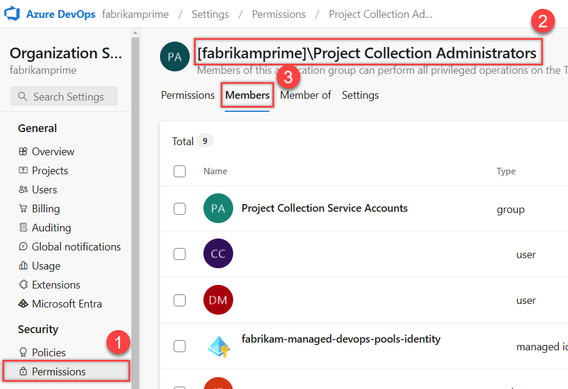

# Look up a project collection administrator 

[!INCLUDE [version-lt-eq-azure-devops](../../includes/version-lt-eq-azure-devops.md)]

The **Project Collection Administrators** group is the main administrative security group defined for an organization or project collection. Members of the **Project Collection Administrators** group have permissions to perform the following common tasks:   

::: moniker range="azure-devops"  
- Add users to a collection
- Create and manage all projects in the organization or collection
- Create and manage all Inherited processes defined for a collection
- Install and uninstall extensions
- Add members and groups to the **Project Collection Administrators** group or any other project-level group
- Manage permissions at all levels. 
::: moniker-end 

::: moniker range=">= azure-devops-2019 < azure-devops"  
- Add users to a collection
- Create and manage all projects in the organization or collection
- Create and manage all Inherited processes defined for a collection
- Import and export On-premises XML process templates to a collection
- Install and uninstall extensions
- Add members and groups to the **Project Collection Administrators** group or any other project-level group
- Manage permissions at all levels. 
::: moniker-end 

::: moniker range="< azure-devops-2019"  
- Add users to a collection
- Create and manage all projects in the organization or collection
- Import and export On-premises XML process templates to a collection
- Install and uninstall extensions
- Add members and groups to the **Project Collection Administrators** group or any other project-level group
- Manage permissions at all levels.  
::: moniker-end 

To add members to the **Project Collection Administrators** group or change a project collection-level permission see [Change project collection-level permissions](change-organization-collection-level-permissions.md). 

For a description of each project collection-level group, see [Security groups, service accounts, and permissions, Collection-level groups](permissions.md#collection-level-groups). To understand how security groups are used to manage permissions, see [Get started with permissions, access, and security groups](about-permissions.md).   

## Prerequisites

* You must be a member of the **Project Collection Valid Users** group to look up members of the **Project Collection Administrators** group. Users added to a project are automatically added to this group. 
 

::: moniker range="azure-devops"  
> [!NOTE]  
> Users added to the **Project-Scoped Users** group won't be able to access **Organization Settings** other than the **Overview** section if the **Limit user visibility and collaboration to specific projects** preview feature is enabled for the organization. To learn more, see [Manage your organization, Limit  user visibility for projects and more](../../user-guide/manage-organization-collection.md#project-scoped-user-group). 

::: moniker-end  
 
## Show members of the Project Collection Administrators group

::: moniker range="azure-devops"

To find out who is a member of the **Project Collection Administrators** group, check the **Permissions** settings at the collection level. 

> [!NOTE]   
> To enable the new user interface for the **Organization Permissions Settings Page v2**, see [Enable preview features](../../project/navigation/preview-features.md). The preview page provides a group settings page that the current page does not. 

1. Choose the :::image type="icon" source="../../media/icons/project-icon.png" border="false"::: Azure DevOps logo to open your projects, and then choose :::image type="icon" source="../../media/icons/gear-icon.png" border="false"::: **Organization settings**.  

	

2. Choose **Permissions** under the Security group, and then **Project Collection Administrators** > **Members** tab. 

	> [!div class="mx-imgBorder"]  
	>   

::: moniker-end   

::: moniker range=">= azure-devops-2019 < azure-devops"

To find out who is a member, check the **Security** settings at the collection level. 

1. Choose the :::image type="icon" source="../../media/icons/project-icon.png" border="false"::: Azure DevOps logo to open **Projects**, and then choose **Organization settings**. 

   

2. Choose **Security**, the **Project Collection Administrators** group, and then **Members**. 

	> [!div class="mx-imgBorder"]  
	>   

::: moniker-end  

::: moniker range="tfs-2018"

1. Choose the :::image type="icon" source="../../media/icons/project-icon.png" border="false"::: settings icon and choose **Collection settings**.

	> [!div class="mx-imgBorder"]  
	>   

2. Choose **Security**, **Project Collection Administrators** group, and then **Members**. 

   

::: moniker-end

## Next steps

> [!div class="nextstepaction"]
> [Look up a project administrator](look-up-project-administrators.md)

## Related articles

- [Change project collection-level permissions](change-organization-collection-level-permissions.md)
- [Permissions lookup guide](permissions-lookup-guide.md)
- [Default permissions and access](permissions-access.md).
