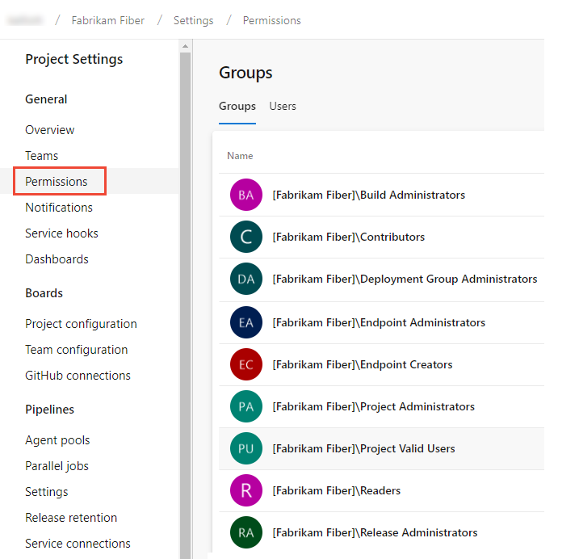
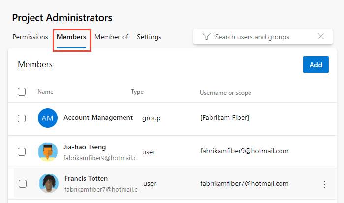
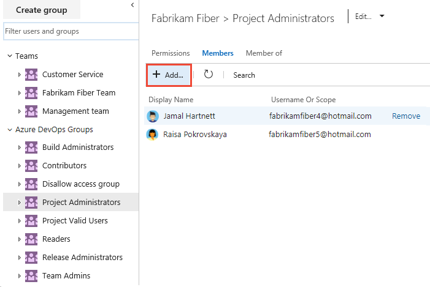
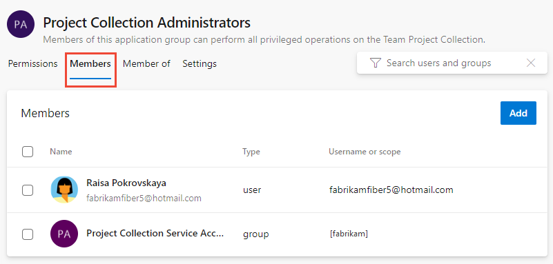

::: moniker range="azure-devops"

# Look up administrators and organization owner 

::: moniker-end

::: moniker range="<= azure-devops-2019"

# Look up administrators 

::: moniker-end

[!INCLUDE [temp](../../_shared/version-vsts-tfs-all-versions.md)]

When you need to have your permissions changed or you need to get access to select features or functions, you may need to find out who can grant them. Usually it is an administrator or the account owner.

For an overview of built-in security groups and default permission assignments, see [Default permissions and access](permissions-access.md).

## Prerequisites

* You must have a project. If you don't have a project yet, [create one](../projects/create-project.md).  
* You must be a member of the Project Valid Users Group or Project Collection Valid Users Group to view permissions. Users added to a project are automatically added to these security groups. 

## Show members of the Project Administrators group

If you aren't a Project Administrator, and you need to be, find someone who is, and have them add you. You can find who is a member of the Project Administrators group by choosing that group from the **Project Settings>Security** page and seeing who are members. 

::: moniker range="azure-devops"

> [!NOTE]   
> To enable the new user interface for the Project Permissions Settings Page, see [Enable preview features](../../project/navigation/preview-features.md).

#### [Preview page](#tab/preview-page) 

1. Open the web portal and choose the project where you want to lookup members of a Project Administrators group or any other project security group. To choose another project, see [Switch project, repository, team](../../project/navigation/go-to-project-repo.md).

2. Choose **Project Settings** and then **Permissions**.

	> [!div class="mx-imgBorder"]  
	> 

1. Choose **Project Administrators** group, and then **Members**.  

	> [!div class="mx-imgBorder"]  
	>  

1. Enter the name of the user account into the text box and then select from the match that appears. You can enter several identities recognized by the system into the **Add users and/or groups** box. The system automatically searches for matches. Choose the matches that meet your choices. 

	> [!div class="mx-imgBorder"]  
	>   

	> [!NOTE]   
	> Users that have limited access, such as Stakeholders, won't be able to access select features even if granted permissions to those features. To learn more, see [Permissions and access](permissions-access.md).

1. Choose **Save**. 

#### [Current page](#tab/current-page) 

1. Open the web portal and choose the project where you want to lookup members of a Project Administrators group or any other project security group. To choose another project, see [Switch project, repository, team](../../project/navigation/go-to-project-repo.md).

2. Choose **Project Settings** and then **Security**.

	*To see the full image, click to expand*.

	 

1. Choose **Project Administrators** group, and then the **Members** tab.  The list of members is shown.   

	> [!div class="mx-imgBorder"]  
	>  

* * *

::: moniker-end    

::: moniker range="azure-devops-2019"

1. Open the web portal and choose the project where you want to lookup members of a Project Administrators group or any other project security group. To choose another project, see [Switch project, repository, team](../../project/navigation/go-to-project-repo.md).

2. Choose **Project Settings** and then **Security**.

	*To see the full image, click to expand*.

	 

1. Choose the **Members** tab. The list of members is shown. 

	> [!div class="mx-imgBorder"]  
	>  

::: moniker-end  

::: moniker range="<= tfs-2018"  

1. Open the web portal and choose the project where you want to lookup members of a Project Administrators group or any other project security group. To choose another project, see [Switch project, repository, team](../../project/navigation/go-to-project-repo.md).  

1. Choose the  gear icon to open **Project Settings**.

     

2. Choose the **Security** page, **Project Administrators** group, and then the **Members** tab.  

	The list of members is shown. 

	> [!div class="mx-imgBorder"]  
	>  

::: moniker-end

## Show members of the Project Collection Administrators group

If you need elevated permissions, you'll have to request them from a member of the [Project Collection Administrators group](set-project-collection-level-permissions.md). Project collection administrators manage features and functions that impact all projects. 

::: moniker range="azure-devops"

To find out who is a member of the Project Collection Administrators group, check the **Permissions** settings at the collection level. 

> [!NOTE]   
> To enable the new user interface for the **Organization Permissions Settings Page v2**, see [Enable preview features](../../project/navigation/preview-features.md). The preview page provides a group settings page that the current page does not. 

1. Choose the  Azure DevOps logo to open **Projects**. Then choose  **Organization settings**.  

	> [!div class="mx-imgBorder"]  
	>   

1. Choose **Permissions** under the **Security** group, then **Project Collection Administrators** group, and then the **Members** tab. 

	> [!div class="mx-imgBorder"]  
	>   

::: moniker-end   

::: moniker range="azure-devops-2019"

To find out who is a member, check the **Security** settings at the collection level. 

1. Choose the  Azure DevOps logo to open **Projects**. Then choose **Admin settings**. 

	> [!div class="mx-imgBorder"]  
	>   

1. Choose **Security**, the **Project Collection Administrators** group, and then **Members**. 

	> [!div class="mx-imgBorder"]  
	>   

::: moniker-end  

::: moniker range="<= tfs-2018"

1. Choose the  settings icon and choose **Collection settings**.

	> [!div class="mx-imgBorder"]  
	>   

1. Choose **Security**, **Project Collection Administrators** group, and then **Members**. 

   

::: moniker-end

::: moniker range="azure-devops"

## Show who is the organization owner 

1. Choose the  Azure DevOps logo to open **Projects**. Then choose  **Organization settings**. 

	> [!div class="mx-imgBorder"]  
	>   

1. Choose **Overview** and scroll down to show the **Organization owner**.

   > [!div class="mx-imgBorder"]  
   > 

   To change the owner, see [Change organization owner](../accounts/change-organization-ownership.md). 

::: moniker-end

## Try this next

> [!div class="nextstepaction"]
> [Add users to a project or team](add-users-team-project.md) 

