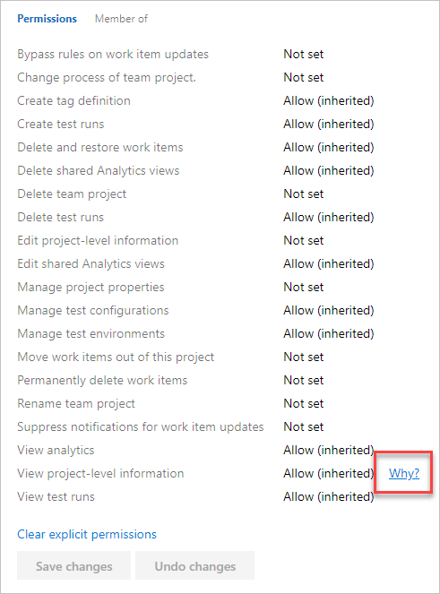
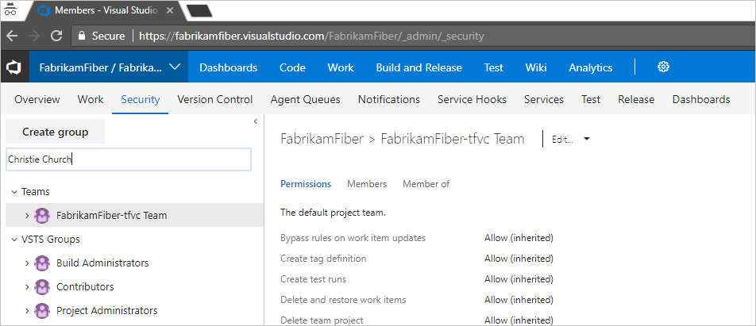

---
title: Troubleshoot permissions
titleSuffix: Azure DevOps
description: Learn how to resolve permissions issues in Azure DevOps.  
ms.assetid: 
ms.technology: devops-security
ms.topic: troubleshoot
ms.author: chcomley
author: chcomley
monikerRange: '<= azure-devops'
ms.date: 01/25/2021
--- 

# Troubleshoot permissions

[!INCLUDE [version-all](../../includes/version-all.md)]

## Look up permissions

You can look up permissions based on the following levels:
- object level    
- project level
- organization or project collection level  
- security role   
- team administrator role

For more information, see the [Permissions lookup guide](permissions-lookup-guide.md).
## Trace a permission

Use permission tracing to determine why a user's permissions aren't allowing them access. Learn how a user or an administrator can investigate the inheritance of permissions.

If a user's having permissions issues and you use default security groups or custom groups for permissions, you can investigate where those permissions are coming from by using our permissions tracing. Permissions issues could be due to one of the following scenarios:

- Their permissions haven't propagated yet. It can take up to 1 hour for Azure AD group memberships or permissions changes to propagate throughout Azure DevOps. If a user's having issues that don't resolve immediately, wait a day to see if they resolve.

- The user doesn't have the necessary access level. Access levels enable administrators to provide their users base access to the features they need, and only pay for those features. Several features can only be accessed with a Basic access level or higher. To assign access levels or check the access level of a user in your account, see the following article.

::: moniker range="azure-devops"

[Manage users and access in Azure DevOps](../accounts/add-organization-users.md) 

::: moniker-end

::: moniker range="< azure-devops"

[Change access levels](change-access-levels.md)

::: moniker-end

Users can receive their effective permissions either directly or via groups.

By following these steps, administrators can understand where exactly those permissions are coming from and adjust them, as needed.

::: moniker range="azure-devops"

1. Select **Project settings** > **Permissions** > **Users**, and then select the user.

   :::image type="content" source="media/permissions-page-enter-user-name.png" alt-text="Enter user name into filter box":::

   You should now have a user-specific view that shows what permissions they have.

2.  To trace why a user does or doesn't have any of the listed permissions, select the information icon next to the permission in question.

   :::image type="content" source="media/select-information-icon.png" alt-text="Select the information icon next to the permission in question":::

The resulting trace lets you know how they're inheriting the listed permission. You can then adjust the user's permissions by adjusting the permissions that are provided to the groups they're in.

::: moniker-end

::: moniker range="azure-devops-2019 || azure-devops-2020"

1. Select **Project settings** > **Security**, and then enter the user name into the filter box.

   :::image type="content" source="media/security-page-enter-user-name-2019.png" alt-text="Enter user name into the filter box":::

2. You should now have a user-specific view that shows what permissions they have. To trace why a user does or doesn't have any of the listed permissions, hover over the permission and choose **Why**.

   

The resulting trace lets you know how they're inheriting the listed permission. You can then adjust the user's permissions by adjusting the permissions that are provided to the groups they're in.

   :::image type="content" source="media/trace-permission-group-member-inheritance-2019.png" alt-text="Trace showing inherited permissions":::

::: moniker-end

::: moniker range="<= tfs-2018"

1.	Go to the Security page for the project that the user is having access problems.
2.	Enter their name into the box in the upper left-hand corner.
   
   

3.	You should now have a user-specific view that shows what permissions they have. To trace why a user does or doesn't have any of the listed permissions, hover over the permission and choose **Why**.

   :::image type="content" source="media/permissions-list-view-project-level-information.png" alt-text="Select Why to trace the permissions":::

The resulting trace lets you know how they're inheriting the listed permission. You can then adjust the user's permissions by adjusting those provided to the groups they're in.

::: moniker-end

For more information, see [Grant or restrict access to select features and functions](restrict-access.md) or [Change individual permissions](change-individual-permissions.md).

## Membership in a group which has lesser permissions

Group rule types are ranked in the following order: Subscriber > Basic + Test Plans > Basic > Stakeholder. Users always get the best access level between all the group rules, including Visual Studio (VS) subscription. 

See the following examples, showing how the subscriber detection factors into group rules.

### Example 1: group rule gives me more access

If I have a VS Pro subscription and I'm in a group rule that gives me Basic + Test Plans – what happens?

Expected: I get Basic + Test Plans because what the group rule gives me is greater than my subscription.

### Example 2: group rule gives me the same access

I have a Visual Studio Test Pro subscription and I'm in a group rule that gives me Basic + Test Plans – what happens?

Expected: I get detected as a Visual Studio Test Pro subscriber, because the access is the same as the group rule, and I'm already paying for the Visual Studio Test Pro, so I wouldn't want to pay again.

For more information, see the following articles:
- [Permissions and groups reference](permissions.md)
- [Manage teams and configure team tools](../../organizations/settings/manage-teams.md)
- [About permissions and inheritance](about-permissions.md)
## Rules applied to a work item type that restrict permissions

## Other areas where permissions might be applied

## Access level restriction

### Feature access

To use Azure DevOps features, users must be added to a security group with the appropriate permissions and granted access to the web portal. Limitations to select features are based on the access level and security group to which a user is assigned.

A user can lose access for the following reasons:

*   The user's Visual Studio subscription has expired. Meanwhile, the user can [work as a Stakeholder](../../organizations/security/get-started-stakeholder.md), or you can give the user Basic access until the user renews their subscription. After the user signs in, Azure DevOps restores access automatically.

*   The Azure subscription used for billing is no longer active. All purchases made with this subscription are affected, including Visual Studio subscriptions. To fix this issue, visit the [Azure account portal](https://portal.azure.com).

*   The Azure subscription used for billing was removed from your organization. Learn more about [linking your organization](../billing/set-up-billing-for-your-organization-vs.md).

*   Your organization has more users with Basic access than the number of users that you're paying for in Azure. Your organization includes five free users with Basic access. If you need to add more users with Basic access, you can [pay for these users](../billing/buy-basic-access-add-users.md). 

Otherwise, on the first day of the calendar month, users who haven't signed in to your organization for the longest time lose access first. If your organization has users who don't need access anymore, [remove them from your organization](../accounts/delete-organization-users.md).

## Related articles

- [About permissions](about-permissions.md)  
- [Security and permission management tools](security-tools-reference.md)  
- [Service accounts and dependencies](/azure/devops/server/admin/service-accounts-dependencies)  
- [Add users to an organization (Azure DevOps Services)](../accounts/add-organization-users.md)  
- [Add users to a team or a project](../../organizations/security/add-users-team-project.md)   
- [Add users to an administrator role](/azure/devops/server/admin/add-administrator)   
- [Make a user a team admin](../settings/manage-teams.md)  
