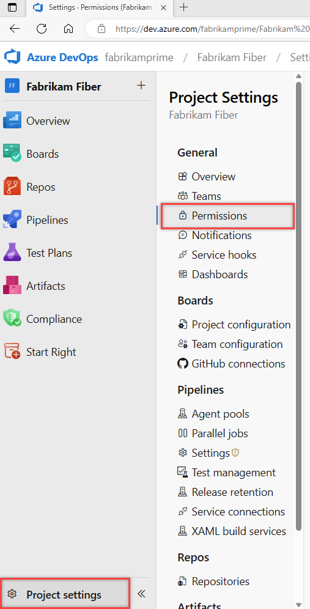
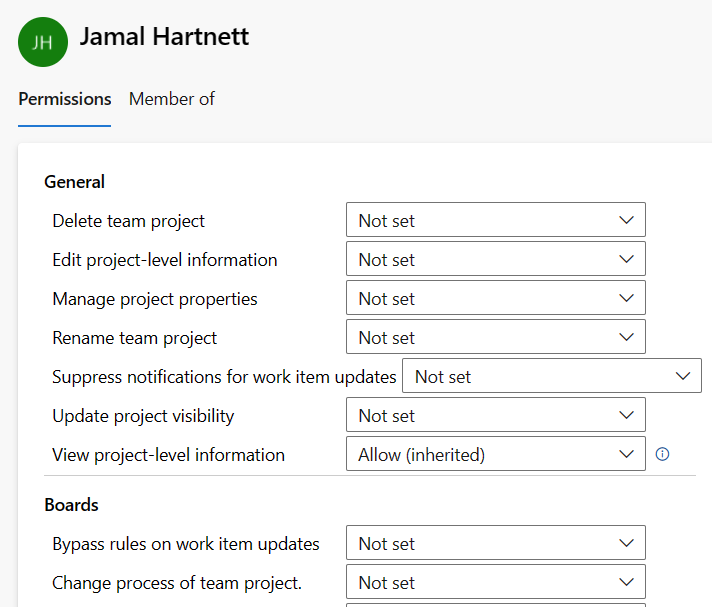
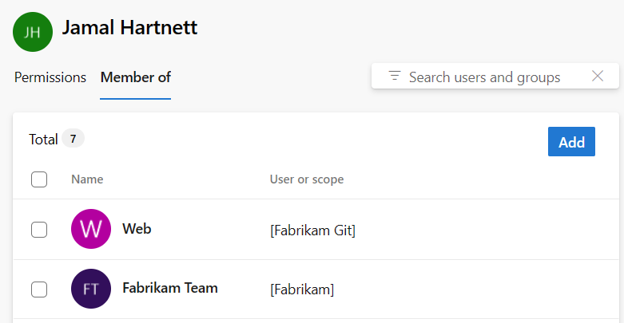
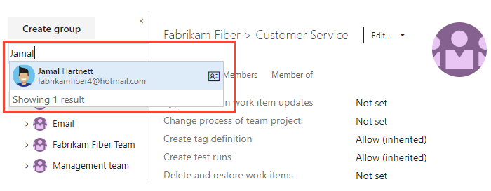
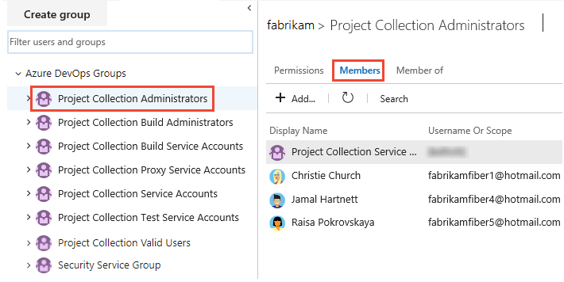

# View permissions for yourself or others

[!INCLUDE [version-all](../../includes/version-all.md)]

In this article, learn how to view your permissions or the permissions that are set for others in Azure DevOps. If you don't have a permission to access a feature or function, you can request it from the right resource.

Permissions are set at the collection, project, and object level as described in [About permissions and groups](about-permissions.md). So to view the permissions you have, you need to open the permissions at the object, project, or collection level.

## Prerequisites

* You must have a project to connect to. If you don't have a project yet, [create one](../projects/create-project.md).
* You must be a member of the Project Valid Users Group or Project Collection Valid Users Group to view permissions.

> [!NOTE]
> This article shows how to view permissions assigned to a user at the project-level or collection-level. However, the steps are similar when you work from the Security dialog of an object.

## View project-level permissions

::: moniker range="azure-devops"

> [!NOTE]   
> To enable the new user interface for the Project Permissions Settings Page, see [Enable preview features](../../project/navigation/preview-features.md).

#### [Preview page](#tab/preview-page) 

1. Choose **Project Settings** and then **Permissions**.

	 

2. Choose **Users**. To filter the list, enter a name into the *Search groups or users* box.

	> [!div class="mx-imgBorder"]  
	>  

3. Choose the name you want. The project-level permissions for that user displays. These permissions are based on the groups the user belongs to or the permissions set specifically for the user's account.    
	> [!div class="mx-imgBorder"]  
	>  

4. Choose **Member of** to see which security groups and teams that the user belongs to.  

    Here we see that *Jamal Hartnett* belongs to several teams and the Project Collection Administrators group for several projects. 

    > [!div class="mx-imgBorder"]
    >   

#### [Current page](#tab/current-page) 

1. Choose **Project Settings** and then **Security**.

    *To see the full image, click to expand*.

    > [!div class="mx-imgBorder"]  
    >  

2. Begin entering the name into the *Filter users and groups* box. The system automatically shows the names that begin with the characters you enter.  

    > [!div class="mx-imgBorder"]
    >   

3. Choose the name you want. The project-level permissions you have set are based on the groups you belong to or the permissions set for your account.      

    > [!div class="mx-imgBorder"]
    >   

4. Choose **Member of** to see which security groups the user belongs to.  

    Here we see that *Jamal Hartnett* belongs to several teams and the Project Collection Administrators group. 

    > [!div class="mx-imgBorder"]
    >   

* * * 

::: moniker-end

::: moniker range="< azure-devops"

1. Open **Project Settings**. Choose the  gear settings icon, and choose **Security**. 

    > [!div class="mx-imgBorder"]
    > 

2. Begin entering the name into the *Filter users and groups* box. The system automatically shows the names that begin with the characters you enter.  

    

3. Choose the name you want. The project-level permissions you have set are based on the groups you belong to or the permissions set for your account.      

    > [!div class="mx-imgBorder"]
    >   

    For a description of each permission, see [Permissions and groups reference](permissions.md#project-level). 

4. Choose **Member of** to see which security groups the user belongs to.  

    Here we see that *Jamal Hartnett* belongs to several teams and the Project Collection Administrators group. 

        

    For a description of each group, see [Permissions and groups reference](permissions.md#project-level-groups). 

::: moniker-end

## View organization or collection-level permissions 

Open admin settings for the organization or a project collection. 

::: moniker range="azure-devops"

1. Choose the :::image type="icon" source="/azure/devops/media/icons/project-icon.png" border="false"::: Azure DevOps logo to open **Projects**. Then choose **Organization settings**. 

    > [!div class="mx-imgBorder"]  
    >   

2. Choose **Permissions**, the **Project Collection Administrators** group, and then **Members**. 

    > [!div class="mx-imgBorder"]  
    >   
3. Follow steps 2 through 4 in the procedure outlined previously for view project-level permissions. 

::: moniker-end 

::: moniker range="azure-devops-2019 || azure-devops-2020"

1. Choose the :::image type="icon" source="/azure/devops/media/icons/project-icon.png" border="false"::: Azure DevOps logo to open **Projects**. Then choose **Admin settings**. 

    > [!div class="mx-imgBorder"]  
    >   

1. Choose **Security**, the **Project Collection Administrators** group, and then **Members**. 

    > [!div class="mx-imgBorder"]  
    >   

2. Follow steps 2 through 4 in the procedure outlined previously for view project-level permissions. 

::: moniker-end    

::: moniker range=">= tfs-2013 <= tfs-2018"

1. Choose the :::image type="icon" source="/azure/devops/media/icons/gear_icon.png" border="false"::: settings icon and select **Organization settings** or **Collection settings**.  

    > [!div class="mx-imgBorder"]  
    >   

1. Choose **Security**, **Project Collection Administrators** group, and then **Members**. 

   

2. Follow steps 2 through 4 in the procedure outlined previously for view project-level permissions. 

::: moniker-end

## View object-level permissions 

You can define the security or permissions for a number of objects. You access them from the context menu of the object. 

From the web portal, open the Security dialog for the object whose permissions you want to set. For specific instructions, see the following articles: 

<table width="80%">
<tbody valign="top">
<tr>
<th width="35%">Area</th>
<th width="65%">Task</th>
</tr>
<tr>
<td>Wiki &amp; Dashboard permissions</td>
<td>
<ul>
<li><a href="../../project/wiki/manage-readme-wiki-permissions.md" data-raw-source="[README &amp; Wiki](../../project/wiki/manage-readme-wiki-permissions.md)">README &amp; Wiki</a></li>
<li><a href="../../report/dashboards/dashboard-permissions.md" data-raw-source="[Dashboards](../../report/dashboards/dashboard-permissions.md)">Dashboards</a></li>

</ul>
</td>
</tr>
<tr>
<td>Azure Repos, Azure Pipelines/DevOps (code, build, test, release) permissions </td>
<td>
<ul>
<li><a href="../../repos/git/branch-permissions.md" data-raw-source="[Git branch](../../repos/git/branch-permissions.md)">Git branch</a></li>
<li><a href="set-git-tfvc-repository-permissions.md" data-raw-source="[Git repository](set-git-tfvc-repository-permissions.md)">Git repository</a></li>
<li><a href="set-git-tfvc-repository-permissions.md" data-raw-source="[TFVC](set-git-tfvc-repository-permissions.md)">TFVC</a></li>
<li><a href="../../pipelines/policies/set-permissions.md" data-raw-source="[Builds](../../pipelines/policies/set-permissions.md)">Builds</a></li>
<li><a href="../../pipelines/policies/set-permissions.md" data-raw-source="[Release pipeline security](../../pipelines/policies/set-permissions.md)">Release pipeline security</a></li>
<li><a href="../../pipelines/release/approvals/index.md" data-raw-source="[Approvals and approvers](../../pipelines/release/approvals/index.md)">Approvals and approvers</a></li> 
</ul>
</td>
</tr>
<tr>
<td>Azure Boards/Work tracking permissions</td>
<td>
<ul>
<li><a href="../../organizations/security/set-permissions-access-work-tracking.md" data-raw-source="[Area and iteration paths](../../organizations/security/set-permissions-access-work-tracking.md)">Area and iteration paths</a></li>
<li><a href="../../boards/queries/set-query-permissions.md" data-raw-source="[Work item query and folder](../../boards/queries/set-query-permissions.md)">Work item query and folder</a></li>
<li>Plan permissions</li> </ul>
</td>
</tr>
</tbody>
</table>

## Next steps

> [!div class="nextstepaction"]
> [Look up the organization owner or a Project Administrator](lookup-organization-owner-admin.md) 

## Related articles

- [Trace permissions](faq-trace-permissions.md)
- [Permissions and role lookup guide](permissions-lookup-guide.md)

