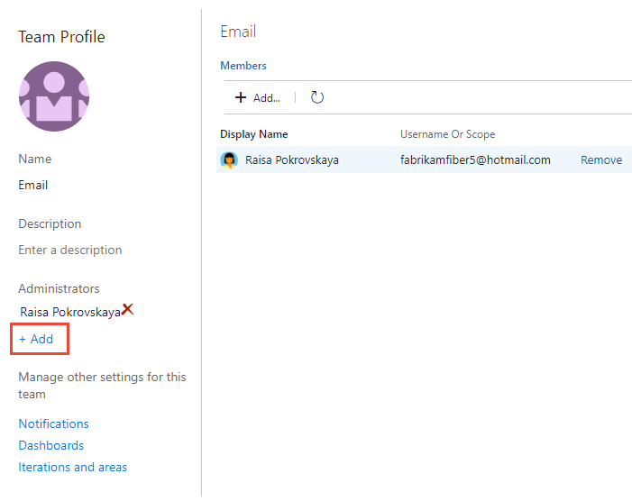
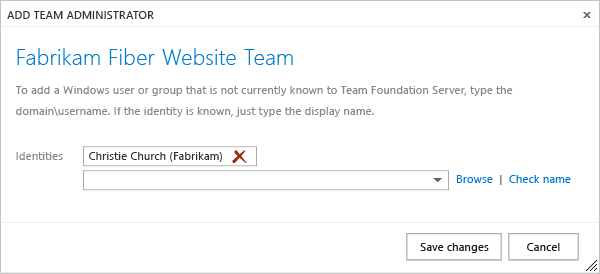

# Add a team administrator 

[!INCLUDE [temp](../../_shared/version-vsts-tfs-all-versions.md)]

  

It's always a good idea to have more than one person with administration permissions for an area. You need to be a team administrator to [Manage teams and configure team tools](manage-teams.md). 

As a team administrator, you can configure, customize, and manage all team-related activities for your team. These include being able to add team members, add team admins, and configure Agile tools and team assets. 

## Prerequisites

::: moniker range="azure-devops"
* You must be a member of a project. If you don't have a project yet, [create one](../projects/create-project.md). 
* You must be a [member of the Project Administrators group](../security/set-project-collection-level-permissions.md), or a team administrator for the team you want to update. 
::: moniker-end
::: moniker range="<= azure-devops-2019"
* You must be a member of a project. If you don't have a project yet, [create one](../projects/create-project.md). * You must be a [member of the Project Administrators group](../security/set-project-collection-level-permissions.md), or a team administrator for the team you want to update. 
::: moniker-end
To get added as a team administrator, ask another team admin, the organization owner, or a member of the [Project Administrators group](../security/set-project-collection-level-permissions.md) to add you.  

If you need to add a team, see [Add teams](add-teams.md).

## Open Project Settings>Team Profile and add an administrator

From the web portal, open the admin page for the team. 

[!INCLUDE [temp](../../_shared/new-navigation.md)]  

# [New navigation](#tab/new-nav)

::: moniker range=">= azure-devops-2019"

0. Choose **Project Settings** and choose **Teams**. 

	> [!div class="mx-imgBorder"]
	>  

0. Choose the team to configure, and then choose the **Add** link to open the dialog for adding user identities. 

	> [!div class="mx-imgBorder"]
	>   

0. Enter the identities you want to add to the team administrator role.     
	    
	> [!div class="mx-imgBorder"]
	> 
   
::: moniker-end    

::: moniker range=">= tfs-2013 <= tfs-2018"  
[!INCLUDE [temp](../../_shared/new-navigation-not-supported.md)]  
::: moniker-end  

# [Previous navigation](#tab/previous-nav)

::: moniker range=">= tfs-2017 <= tfs-2018 || azure-devops"

0. From the web portal and team context, choose the  gear icon to open **Team Settings**.

	> [!div class="mx-imgBorder"]  
	> 

	If you choose the  gear icon from the project context, then choose **Overview**, and select the team you want to configure.   

0. Choose the **Add** link to open the dialog for adding user identities.  

	  
   
0. Enter the identities you want to add to the team administrator role.   

	> [!div class="mx-imgBorder"]
	> 
   
::: moniker-end     

::: moniker range=">= tfs-2013 <= tfs-2015"  

0. From the web portal and team context, choose the  gear icon to open the administration page.

	> [!div class="mx-imgBorder"]  
	> 

	If you choose the  gear icon from the project context, then choose **Overview**, and select the team you want to add an administrator to.   

0. Choose the **Add** link to open the dialog for adding user identities.    
  
	

0. Enter the identities you want to add to the team administrator role.     

	    
	
::: moniker-end  

::: moniker range="azure-devops-2019"
[!INCLUDE [temp](../../_shared/previous-navigation-not-supported-azd.md)] 
::: moniker-end

---   

## Try this next  

> [!div class="nextstepaction"]
> [Manage teams and configure team tools](manage-teams.md) 

## Related articles

- [About teams & Agile tools](../../organizations/settings/about-teams-and-settings.md)
- [Manage portfolios](../../boards/plans/portfolio-management.md)
- [Set team favorites](../../project/navigation/set-favorites.md) 