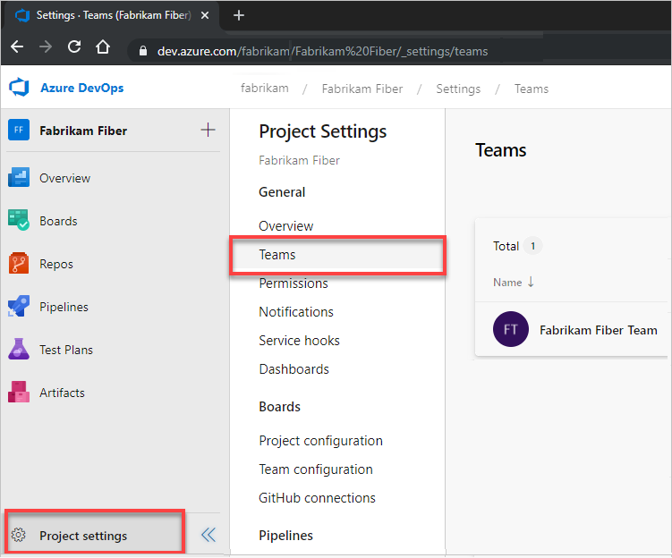
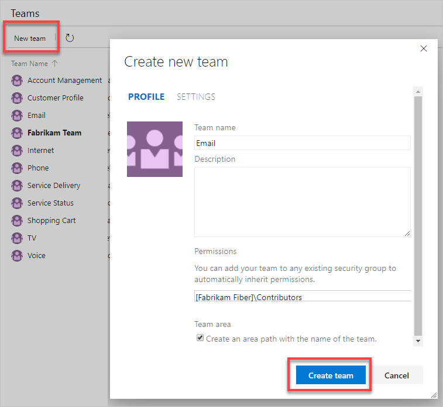
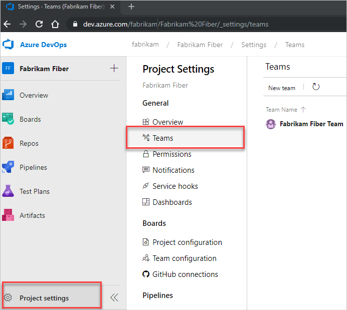
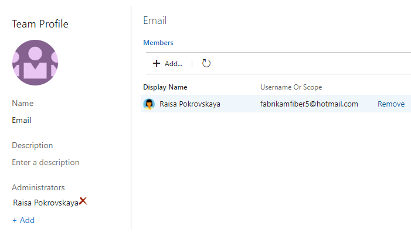
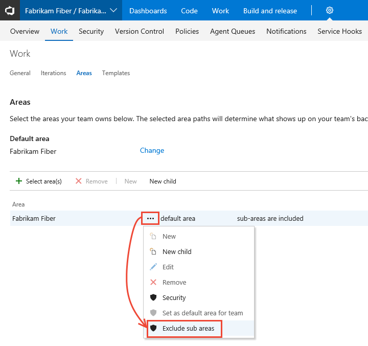
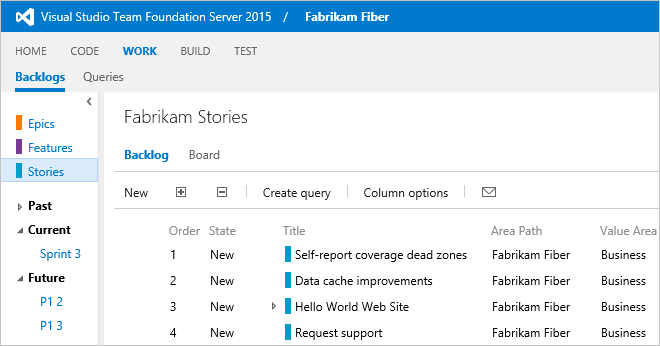

# Add team, go from one default team to others

[!INCLUDE [temp](../../includes/version-vsts-tfs-all-versions.md)]

As your organization grows, make sure that you configure your Agile tools to support that growth. Each team needs their own set of team tools to enable the autonomy it needs to manage their backlog and plan their sprints. For more information about features assigned to teams, see [About teams and Agile tools](about-teams-and-settings.md). 

Each new project is configured with a default team with the project name. You can rename the default team and you can reassign a new team as the default. 

> [!NOTE]    
> This article describes how to add a team or team members to a project defined in Azure DevOps. To learn about Microsoft Teams, see the Marketplace extension, [Microsoft Teams Integration](https://marketplace.visualstudio.com/items?itemName=ms-vsts.vss-services-teams). 
>
> For a good understanding on how to remain Agile as you add teams, review the [Scale Agile to Large Teams](/azure/devops/learn/agile/scale-agile-large-teams) article.

<a id="add-team"> </a>  

As your team grows, you can easily move from one team to two. In this example, we add two feature teams, Email and Voice, and maintain the Fabrikam Fiber default team with visibility across each of these two teams.  

## Prerequisites 

- If you don't have a project yet, [create one](../projects/create-project.md).  
- If you're not a Project Administrator, [get added as one](../../organizations/security/set-project-collection-level-permissions.md). Only members of the Project Administrators group can add and delete teams.   

## Add two feature teams 

::: moniker range="azure-devops"

> [!NOTE]   
> To enable the user interface for the **New Teams page**, see [Manage or enable features](../../project/navigation/preview-features.md).

::: moniker-end

#### [New Teams page](#tab/preview-page)

::: moniker range="azure-devops"

Add and configure two teams, Email and Voice. Here we show you how to add and configure the Email team. 

1. From the web portal, choose **Project settings** and open **Teams**. 
  
   

2. Choose **New team**. Give the team a name, and optionally a description. 
   
   
	 

3. Select the team to configure it, and then choose **Iterations and areas**. For more information, see [Define area paths and assign to a team](set-area-paths.md). See also [Define iteration paths, also known as sprints, and configure team iterations](set-iteration-paths-sprints.md). 

	 
	 

	> [!IMPORTANT]  
	> Team tools aren't available until the team's default area path is set. If you haven't created one or more Area Paths for the team to use, then [do that now](set-area-paths.md). Area Paths must be created for the project first, then assigned to the team. 

	From the team profile, you can do these additional tasks:  
   - [Add team administrators](add-team-administrator.md)
   - [Add team members](#add-team-members)
   - [Navigate to team notifications](../../notifications/howto-manage-team-notifications.md)
   - [Navigate to and set default team dashboard permissions](../../report/dashboards/dashboard-permissions.md)

To configure other team features, see [Manage teams and configure team tools](manage-teams.md).

::: moniker-end

[!INCLUDE [temp](../../includes/note-new-teams-not-supported.md)]  

#### [Current page](#tab/current-page) 

::: moniker range=">= azure-devops-2019"

From your web browser, you can view teams that have been added and add teams. 

Add and configure two teams, Email and Voice. Here we show you how to add and configure the Email team. 

1. From the web portal, choose **Project settings** and open **Teams**. 
   
   
   

2. Choose **New team**. Give the team a name, and optionally a description. 

	 
	 

3. Select the team to configure it, and then choose **Iterations and areas**. For more information, see [Define area paths and assign to a team](set-area-paths.md). See also [Define iteration paths, also known as sprints, and configure team iterations](set-iteration-paths-sprints.md). 

	 
   

	> [!IMPORTANT]  
	> Team tools aren't available until the team's default area path is set. If you haven't created one or more Area Paths for the team to use, then [do that now](set-area-paths.md). Area Paths must be created for the project first, then assigned to the team. 

	From the team profile, you can do these additional tasks:  
   - [Add team administrators](add-team-administrator.md)
   - [Add team members](#add-team-members)
   - [Navigate to team notifications](../../notifications/howto-manage-team-notifications.md)
   - [Navigate to and set default team dashboard permissions](../../report/dashboards/dashboard-permissions.md)

To configure other team features, see [Manage teams and configure team tools](manage-teams.md).

::: moniker-end

::: moniker range=">= tfs-2017 <= tfs-2018"

<a id="add-team-team-services" /> 

1. From the web portal, choose the :::image type="icon" source="../../media/icons/gear_icon.png" border="false"::: gear settings icon to open the **Project settings** page for the project.  

	  

2. Choose **New team**. Give the team a name, and make sure to select **Create an area path with the name of the team**. Or, leave it unchecked and assign the default area path for the team after it's created. You can choose an existing area path or add a new one at that time. Team tools aren't available until the team's default area path is set. 

   	
	 

3. Select the team to configure it. 

   
	 

	The Team Profile opens. From the team profile, you can [Add team members](#add-team-members) and [Add team administrators](add-team-administrator.md).

   	
	   

4. Select the set of sprints and area paths the team plans to use. For more information, see [Define iteration paths, also known as sprints, and configure team iterations](set-iteration-paths-sprints.md).

	> [!IMPORTANT]  
	> Team tools aren't available until the team's default area path is set. 

	To configure other team features, see [Manage teams and configure team tools](manage-teams.md).

5. To assign a team as the default team, choose the :::image type="icon" source="../../media/icons/actions-icon.png" border="false"::: actions icon for that team and select **Set team as project default**. 

::: moniker-end

::: moniker range=">= tfs-2013 <= tfs-2015"

<a id="add-team-tfs-2015" />

1. From the web portal, choose the :::image type="icon" source="../../media/icons/gear_icon.png" border="false"::: gear settings icon to open **Project Settings.**  

	 

2. Create a new team. Give the team a name, and make sure to select **Create an area path with the name of the team**. 

	Or, leave it unchecked and assign the default area path for the team after it's created. You can choose an existing area path or add a new one at that time. Team tools aren't available until the team's default area path is set. 

   
	 

3. Select the team from the Overview tab to configure it.  

   
	 

4. To select the set of sprints the team plans to use, open the **Iterations** page for the team. See [Define iteration paths (also known as sprints) and configure team iterations](set-iteration-paths-sprints.md#activate).  

5. To change the area paths assigned to the team, open the **Areas** page. See [Set team defaults, Set team default area path(s)](set-area-paths.md#team-area-paths).  
 
::: moniker-end

#### [Azure DevOps CLI](#tab/azure-devops-cli)

::: moniker range=">= azure-devops-2020"

From the Azure DevOps CLI command, you can list teams, add teams, and run other team management commands. 

[List teams](#list-teams) | [Add a team](#add-team) | [Move work items](#move-work-items) | [Update a team](rename-remove-team.md#update-team) | [Delete a team](rename-remove-team.md#delete-team)

<a id="list-teams" /> 

### List teams 

You can list teams using [Azure DevOps team list](/cli/azure/ext/azure-devops/devops/team#ext-azure-devops-az-devops-team-list). To get started, see [Get started with Azure DevOps CLI](../../cli/index.md).  

> [!div class="tabbedCodeSnippets"]
```CLI
az devops team list [--project]
                    [--skip]
                    [--top]
```

> [!TIP]
> If you don't specify a **top** number, 100 teams are returned. To list all teams in a project, specify a number for **top** which is greater than the current number of teams defined.  

#### Parameters

- **project**: Optional. Name or ID of the project. Example: --project "Fabrikam Fiber".  You can configure the default project using `az devops configure -d project=NAME_OR_ID`. Required if not configured as default or picked up via git config.
- **skip**: Optional. Number of teams to skip.  
- **top**: Optional. Maximum number of teams to return. 

::: moniker-end

[!INCLUDE [temp](../../includes/note-cli-supported-server.md)]  

::: moniker range=">= azure-devops-2020"

#### Example

For example, the following command returns the 11 teams defined in the Fabrikam Fiber project. For addition output formats, see [Output formats for Azure CLI commands](/cli/azure/format-output-azure-cli). 

Each team is assigned a unique ID. 

> [!div class="tabbedCodeSnippets"]
```CLI
C:\WINDOWS\system32>az devops team list --project "Fabrikam Fiber" --output table
ID                                    Name                Description
------------------------------------  ------------------  ----------------------------------------------------------------------------
7f099146-29a2-4798-9949-77c9f5f79653  Account Management  Management team focused on creating and maintaining customer services
2017b37a-486b-4222-ac84-b8b9eefa540e  Customer Profile    Feature team focused on securing account data
a90cd8f0-8e0d-42d6-aeb2-13442b826730  Email               Feature team delivering email apps
a48cb46f-7366-4f4b-baf5-b3632398ed1e  Fabrikam Team       The default project team. Was Fabrikam Fiber Team
e42fccbc-d96f-4c98-8168-7a85ecede548  Internet            Feature team developing web apps
b70aa504-33b4-4d17-a85d-0fbf4829a154  Phone               Feature team delivering phone apps
43e6bd2e-696f-492c-bbf7-9cde9cd420ea  Service Delivery    Management team responsible for ensure high performance delivery of services
8920d2ec-eed1-4792-8934-82a57abce7c2  Service Status      Feature team focused on monitoring and addressing service issues
9c676c8c-1910-4f73-b7b9-a946b5c551ae  Shopping Cart       Feature team managing shopping cart apps
64b86488-e105-4901-ba43-ffd48137bb93  TV                  Feature team developing TV apps
cda2b9b0-0335-4a0d-8bd0-67611d64ce9d  Voice               Feature team focused on voice communications
```

<a id="add-team-cli" /> 

### Add a team 

You can add a team using [Azure DevOps team create](/cli/azure/ext/azure-devops/devops/team#ext-azure-devops-az-devops-team-create). To get started, see [Get started with Azure DevOps CLI](../../cli/index.md).  

> [!div class="tabbedCodeSnippets"]
```CLI
az devops team create --name
                      [--description]
                      [--project] 
```

#### Parameters
 
- **name**: Required. Name of the new team.  
- **description**: Optional. Description of the new team.   
- **project**: Optional. Name or ID of the project. Example: --project "Fabrikam Fiber".  

#### Example

The following command adds a team named **Web** to the Fabrikam Fiber project, and returns a number of properties of the team. 

> [!div class="tabbedCodeSnippets"]
```CLI
C:\WINDOWS\system32>az devops team create --name Web --project "Fabrikam Fiber"
{
  "description": "",
  "id": "5385556a-254d-4ad4-bd11-71955e3a7070",
  "identity": {
    "descriptor": "Microsoft.TeamFoundation.Identity;S-1-9-1551374245-227716950-993605186-2584159299-2630527068-1-1113613831-2979292483-2600436946-77439922",
    "id": "5385556a-254d-4ad4-bd11-71955e3a7070",
    "isActive": true,
    "isContainer": true,
    "masterId": "5385556a-254d-4ad4-bd11-71955e3a7070",
    "memberOf": [],
    "members": [],
    "metaTypeId": 255,
    "properties": {
      "Account": {
        "$type": "System.String",
        "$value": "Web"
      },
      "Description": {
        "$type": "System.String",
        "$value": ""
      },
      "Domain": {
        "$type": "System.String",
        "$value": "vstfs:///Classification/TeamProject/56af920d-393b-4236-9a07-24439ccaa85c"
      },
      "LocalScopeId": {
        "$type": "System.String",
        "$value": "56af920d-393b-4236-9a07-24439ccaa85c"
      },
      "Microsoft.TeamFoundation.Team": {
        "$type": "System.Boolean",
        "$value": true
      },
      "SchemaClassName": {
        "$type": "System.String",
        "$value": "Group"
      },
      "ScopeId": {
        "$type": "System.String",
        "$value": "e03662ad-bec4-4a33-bb0f-86e365ee2d88"
      },
      "ScopeName": {
        "$type": "System.String",
        "$value": "Fabrikam Fiber"
      },
      "ScopeType": {
        "$type": "System.String",
        "$value": "TeamProject"
      },
      "SecuringHostId": {
        "$type": "System.String",
        "$value": "380ed149-33d0-4d78-a7ed-89921802f389"
      },
      "SecurityGroup": {
        "$type": "System.String",
        "$value": "SecurityGroup"
      },
      "SpecialType": {
        "$type": "System.String",
        "$value": "Generic"
      },
      "VirtualPlugin": {
        "$type": "System.String",
        "$value": ""
      }
    },
    "providerDisplayName": "[Fabrikam Fiber]\\Web",
    "resourceVersion": 2,
    "subjectDescriptor": "vssgp.Uy0xLTktMTU1MTM3NDI0NS0yMjc3MTY5NTAtOTkzNjA1MTg2LTI1ODQxNTkyOTktMjYzMDUyNzA2OC0xLTExMTM2MTM4MzEtMjk3OTI5MjQ4My0yNjAwNDM2OTQ2LTc3NDM5OTIy"
  },
  "identityUrl": "https://spsprodeus21.vssps.visualstudio.com/A380ed149-33d0-4d78-a7ed-89921802f389/_apis/Identities/5385556a-254d-4ad4-bd11-71955e3a7070",
  "name": "Web",
  "projectId": "56af920d-393b-4236-9a07-24439ccaa85c",
  "projectName": "Fabrikam Fiber",
  "url": "https://dev.azure.com/kelliott/_apis/projects/56af920d-393b-4236-9a07-24439ccaa85c/teams/5385556a-254d-4ad4-bd11-71955e3a7070"
}
```
::: moniker-end

[!INCLUDE [temp](../../includes/note-cli-not-supported.md)]  

* * *

<a id="add-team-members"> </a>  

## Add team members

When you set up a team structure for the first time, add user accounts as team members. This action provides access to the project and team assets. Moving from one team to two teams, team members already have access to the project. To support sharing code, planning, and tracking work, you must have access to the project. 

Several Agile tools, like capacity planning and team alerts, and dashboard widgets are team-scoped. That is, they automatically reference the user accounts of team members to support planning activities or sending alerts. 

::: moniker range="azure-devops"  

> [!NOTE]   
> You must first [add a user to a project or to your organization](../accounts/add-organization-users.md) or [set up your account to work with Azure AD](../accounts/access-with-azure-ad.md). This way you can add user identities to a team.

::: moniker-end
 
For more information, see [Add users to a project or specific team](../security/add-users-team-project.md). 

::: moniker range="< azure-devops"  

> [!NOTE]   
> The first time you add a user account, you must enter the full domain name and the alias. Afterwards, you can browse for that name by display name as well as account name. To learn more, see [Set up groups for use in Azure DevOps Server deployments](/azure/devops/server/admin/setup-ad-groups).

::: moniker-end 


## Move work items under teams 

Now that your two feature teams are configured, you need to move existing work items from their current assignments to the team's default area path. This way, the work items show up on each team's backlog. 

#### [New Teams page](#tab/preview-page)

[!INCLUDE [note-new-teams-not-supported](../../includes/note-new-teams-not-supported.md)]

#### [Current page](#tab/current-page) 
 
::: moniker range=">= azure-devops-2019"

1. [Create a query](../../boards/queries/using-queries.md) of all work items you want to reassign. Multi-select those items, which belong to each team, and [bulk edit the area path](../../boards/backlogs/bulk-modify-work-items.md).

   

2. After you bulk modify, do a bulk save.  
  
     

::: moniker-end

::: moniker range="<= tfs-2018"  

1. [Create a query](../../boards/queries/using-queries.md) of all work items you want to reassign. Multi-select those items belonging to each team, and [bulk edit the area path](../../boards/backlogs/bulk-modify-work-items.md).

2. After you bulk modify, do a bulk save.  

     

::: moniker-end  

#### [Azure DevOps CLI](#tab/azure-devops-cli)

<a id="move-work-items" /> 

::: moniker range=">= azure-devops-2020"

You can move work items to a new area paths using [az boards work-item update](/cli/azure/ext/azure-devops/boards/work-item#ext-azure-devops-az-boards-work-item-update).  

> [!div class="tabbedCodeSnippets"]
```CLI
az boards work-item update --id
                           [--area]
                           [--assigned-to]
                           [--description]
                           [--discussion]
                           [--fields]
                           [--iteration]
                           [--open]
                           [--reason]
                           [--state]
                           [--title]
```

#### Parameters

- **id**: Required. The ID of the work item to update.
- **area**: Optional. Absolute path of an area. Example: --path \ProjectName\Area\AreaName.  
- **assigned-to**: Optional. Name of the person the work item is assigned to *Jamal*.
- **description**: Optional. Description of the work item. 
- **discussion**: Optional. Comment to add to a discussion in a work item.
- **fields**: Optional. Space separated "field=value" pairs for custom fields you want to set.
- **iteration**: Optional. Absolute path of an iteration. Example: \ProjectName\Iteration\IterationName.  
- **open**: Optional. Open the work item in the default web browser. 
- **reason**: Optional. Reason for the state of the work item. 
- **state**: Optional. State of the work item, for example, *Active*. 
- **title**: Optional. Title of the work item. 

#### Example

You can only move one work item at a time using Azure DevOps CLI. In this example, we move work item ID=487 under the Fabrikam Fiber/Service Delivery/Email area path.

> [!div class="tabbedCodeSnippets"]
```CLI
C:\WINDOWS\system32>az boards work-item update --id 487 --area "Fabrikam Fiber\Service Delivery\Email"
{
  "fields": {
    "Microsoft.VSTS.Common.BacklogPriority": 1944453550.0,
    "Microsoft.VSTS.Common.Priority": 1,
    "Microsoft.VSTS.Common.Severity": "3 - Medium",
    "Microsoft.VSTS.Common.StateChangeDate": "2016-11-15T23:24:26.143Z",
    "Microsoft.VSTS.Common.ValueArea": "Business",
    "System.AreaPath": "Fabrikam Fiber\\Service Delivery\\Email",
    "System.AssignedTo": {
      "_links": {
        "avatar": {
          "href": "https://dev.azure.com/kelliott/_apis/GraphProfile/MemberAvatars/msa.ZmUwYjk5NmYtZTAyNS03NzBkLTgxNmYtMzk1NDQwYzViMzgw"
        }
      },
      "descriptor": "msa.ZmUwYjk5NmYtZTAyNS03NzBkLTgxNmYtMzk1NDQwYzViMzgw",
      "displayName": "Raisa Pokrovskaya",
      "id": "bd30c189-db0f-4dd6-9418-5d8b41dc1754",
      "imageUrl": "https://dev.azure.com/kelliott/_apis/GraphProfile/MemberAvatars/msa.ZmUwYjk5NmYtZTAyNS03NzBkLTgxNmYtMzk1NDQwYzViMzgw",
      "uniqueName": "fabrikamfiber5@hotmail.com",
      "url": "https://spsprodeus21.vssps.visualstudio.com/A380ed149-33d0-4d78-a7ed-89921802f389/_apis/Identities/bd30c189-db0f-4dd6-9418-5d8b41dc1754"
    },
    "System.BoardColumn": "New",
    "System.BoardColumnDone": false,
    "System.ChangedBy": {
      "_links": {
        "avatar": {
          "href": "https://dev.azure.com/kelliott/_apis/GraphProfile/MemberAvatars/msa.MmZhZDE3ZDAtMjRmZi03YjY5LWE5ZTUtMzYxMzQwOTZlNzNk"
        }
      },
      "descriptor": "msa.MmZhZDE3ZDAtMjRmZi03YjY5LWE5ZTUtMzYxMzQwOTZlNzNk",
      "displayName": "Kathryn",
      "id": "a0f9fe47-8a0a-438c-adfb-403c69664618",
      "imageUrl": "https://dev.azure.com/kelliott/_apis/GraphProfile/MemberAvatars/msa.MmZhZDE3ZDAtMjRmZi03YjY5LWE5ZTUtMzYxMzQwOTZlNzNk",
      "uniqueName": "kebelliott@msn.com",
      "url": "https://spsprodeus21.vssps.visualstudio.com/A380ed149-33d0-4d78-a7ed-89921802f389/_apis/Identities/a0f9fe47-8a0a-438c-adfb-403c69664618"
    },
    "System.ChangedDate": "2019-08-15T20:36:18.34Z",
    "System.CommentCount": 0,
    "System.CreatedBy": {
      "_links": {
        "avatar": {
          "href": "https://dev.azure.com/kelliott/_apis/GraphProfile/MemberAvatars/msa.MmZhZDE3ZDAtMjRmZi03YjY5LWE5ZTUtMzYxMzQwOTZlNzNk"
        }
      },
      "descriptor": "msa.MmZhZDE3ZDAtMjRmZi03YjY5LWE5ZTUtMzYxMzQwOTZlNzNk",
      "displayName": "Kathryn",
      "id": "a0f9fe47-8a0a-438c-adfb-403c69664618",
      "imageUrl": "https://dev.azure.com/kelliott/_apis/GraphProfile/MemberAvatars/msa.MmZhZDE3ZDAtMjRmZi03YjY5LWE5ZTUtMzYxMzQwOTZlNzNk",
      "uniqueName": "kebelliott@msn.com",
      "url": "https://spsprodeus21.vssps.visualstudio.com/A380ed149-33d0-4d78-a7ed-89921802f389/_apis/Identities/a0f9fe47-8a0a-438c-adfb-403c69664618"
    },
    "System.CreatedDate": "2016-11-15T23:24:26.143Z",
    "System.IterationPath": "Fabrikam Fiber\\Release 1\\Sprint 4",
    "System.Reason": "New defect reported",
    "System.State": "New",
    "System.TeamProject": "Fabrikam Fiber",
    "System.Title": "Check issues with permissions",
    "System.WorkItemType": "Bug",
    "WEF_1C5A9C9263944104B13DEF47AB16892F_Kanban.Column": "Backlog",
    "WEF_1C5A9C9263944104B13DEF47AB16892F_Kanban.Column.Done": false,
    "WEF_728F47E9D8BF470AB800917CB3E81BD0_Kanban.Column": "New",
    "WEF_728F47E9D8BF470AB800917CB3E81BD0_Kanban.Column.Done": false,
    "WEF_7ADD68E5D87D4B75AA575F3757C5FB14_Kanban.Column": "New",
    "WEF_7ADD68E5D87D4B75AA575F3757C5FB14_Kanban.Column.Done": false,
    "WEF_7E5E0F9353CB4F0091FCCE45C49F5636_Kanban.Column": "New",
    "WEF_7E5E0F9353CB4F0091FCCE45C49F5636_Kanban.Column.Done": false,
    "WEF_E825423B472B438797D4385614A48F91_Kanban.Column": "New",
    "WEF_E825423B472B438797D4385614A48F91_Kanban.Column.Done": false
  },
  "id": 487,
  "relations": [
    {
      "attributes": {
        "isLocked": false,
        "name": "Parent"
      },
      "rel": "System.LinkTypes.Hierarchy-Reverse",
      "url": "https://dev.azure.com/kelliott/56af920d-393b-4236-9a07-24439ccaa85c/_apis/wit/workItems/546"
    },
    {
      "attributes": {
        "isLocked": false,
        "name": "Child"
      },
      "rel": "System.LinkTypes.Hierarchy-Forward",
      "url": "https://dev.azure.com/kelliott/56af920d-393b-4236-9a07-24439ccaa85c/_apis/wit/workItems/374"
    }
  ],
  "rev": 24,
  "url": "https://dev.azure.com/kelliott/56af920d-393b-4236-9a07-24439ccaa85c/_apis/wit/workItems/487"
}

```

::: moniker-end

[!INCLUDE [temp](../../includes/note-cli-supported-server.md)]  

* * *


<a id="include-area-paths"> </a>  

## Configure the default project team 

One last step in moving from one team to two teams requires configuring the default project team to exclude subareas.  

#### [New Teams page](#tab/preview-page) 

::: moniker range="azure-devops"

1. Open **Project settings > Team configuration > Areas** settings page for the default project team, and change the setting as shown.  

	   
	   

2. Refresh the product backlog page for the team, and you see only those work items assigned to the *Fabrikam Fiber* area path.
  
     
   

::: moniker-end

[!INCLUDE [temp](../../includes/note-new-teams-not-supported.md)]  

#### [Current page](#tab/current-page) 

::: moniker range=">= azure-devops-2019" 

1. Open **Project settings > Team configuration > Areas** settings page for the default project team, and change the setting as shown.  

	   
	   

2. Refresh the product backlog page for the team, and you see only those work items assigned to the *Fabrikam Fiber* area path.  

	   
	 

::: moniker-end

::: moniker range=">= tfs-2017 <= tfs-2018"

1. Open the **Work > Areas** settings page for the default project team, and change the setting as shown.  

	   
	   

2. Refresh the product backlog page for the team, and you see only those work items assigned to the *Fabrikam Fiber* area path.  

     
     

::: moniker-end

::: moniker range="<= tfs-2015"  

1. Open the **Areas** settings page for the default project team, and change the setting as shown.  

	   

2. Refresh the product backlog page for the team, and you see only those work items assigned to the *Fabrikam Fiber* area path.  

     

::: moniker-end

#### [Azure DevOps CLI](#tab/azure-devops-cli)

::: moniker range=">= azure-devops-2020" 

You can set the default area path for a team or add an area path, using [az boards area team add](/cli/azure/ext/azure-devops/boards/area/team#ext-azure-devops-az-boards-area-team-add).  To get started, see [Get started with Azure DevOps CLI](../../cli/index.md). 

> [!div class="tabbedCodeSnippets"]
```CLI
az boards area team add --path  --team
                        [--include-sub-areas {false, true}]
                        [--project]
                        [--set-as-default]
```

#### Parameters

- **path**: Required. Absolute path of an area. Example: --path \ProjectName\Area\AreaName. 
- **team**: Required. Name or ID of the team.
- **include-sub-areas**: Optional. Include child nodes of the area path. Accepted values: false, true. 
- **project**: Optional. Name or ID of the project. Example: --project "Fabrikam Fiber".  
- **set-as-default**: Optional. Specify as the default area path for the team. Default: False.

::: moniker-end
[!INCLUDE [temp](../../includes/note-cli-supported-server.md)]  
::: moniker range=">= azure-devops-2020"

#### Example

For example, the following command adds the Voice area path to the Voice team for the Fabrikam Fiber project, sets it as the default and to include subareas. 

> [!div class="tabbedCodeSnippets"]
```CLI
C:\WINDOWS\system32>az boards area team add --path "\Fabrikam Fiber\Voice" --team Voice --project "Fabrikam Fiber" --include-sub-areas --set-as-default --include-sub-areas true --output table
Area                                   Include sub areas    Is Default
-------------------------------------  -------------------  ------------
Fabrikam Fiber\Service Delivery\Voice  False                False
Fabrikam Fiber\Voice                   True                 True
```

::: moniker-end

[!INCLUDE [temp](../../includes/note-cli-not-supported.md)]  


* * *


<a id="grant-add-permissions"></a>  

## Grant team members additional permissions  

For teams to work autonomously, you may want to provide them with permissions that they don't have by default. Suggested tasks include providing team administrators or team leads permissions to:  

- Create and edit child nodes under their default area path
- Create and edit child nodes under an existing iteration node 
- Create shared queries and folders under the Shared Queries folder

For more information on setting permissions and access for select users, see [Set permissions and access for work tracking](../security/set-permissions-access-work-tracking.md).

::: moniker range="< azure-devops" 

If your deployment is integrated with SQL Server Reports, you need to [Grant permissions to view or create SQL Server reports to team members](../../report/admin/grant-permissions-to-reports.md). 

::: moniker-end 

::: moniker range="<= tfs-2017" 

If your TFS deployment is integrated with a SharePoint product or SQL Server Reports, you need to manage membership for those products separately from their websites. 

-  [Set SharePoint site permissions](../security/set-sharepoint-permissions.md) 
-  [Grant permissions to view or create SQL Server reports in TFS](../../report/admin/grant-permissions-to-reports.md). 

::: moniker-end 

## Next steps

Configure your Agile tools to support how your team works. Also, consider adding one or more users as team administrators. Team administrators have the necessary permissions to add team members, add a picture to the team profile, and configure and manage all team features.  

> [!div class="nextstepaction"]
> [Add team administrator](add-team-administrator.md)
> or
> [Manage teams and configure team tools](manage-teams.md)

## Related articles

- [Rename or remove a team](rename-remove-team.md)
- [About teams and Agile tools](about-teams-and-settings.md)
- [Azure DevOps Teams CLI](/cli/azure/ext/azure-devops/devops/team)
- [Teams (REST API)](/rest/api/azure/devops/core/teams)
- [Work Items (REST API)](/rest/api/azure/devops/wit)
