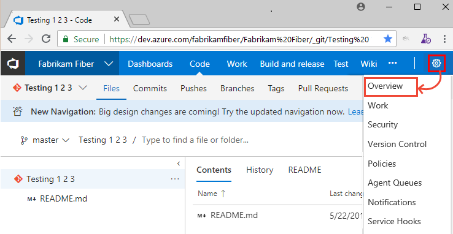
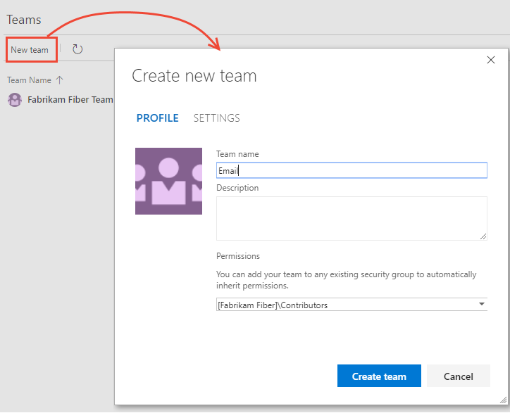
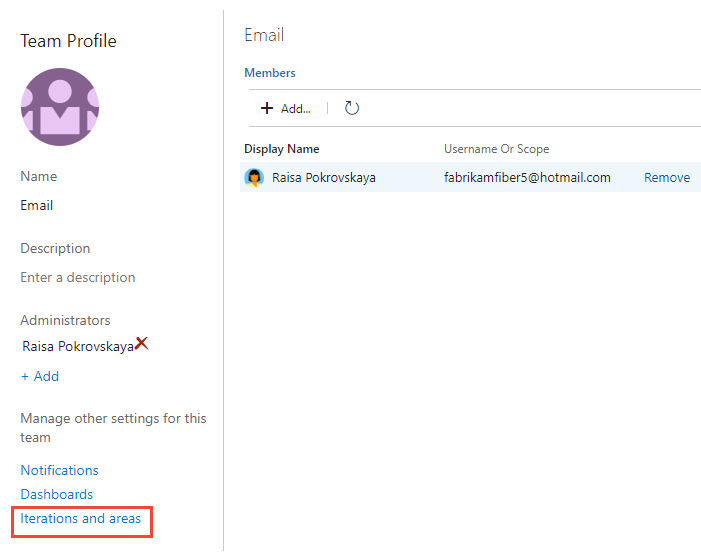
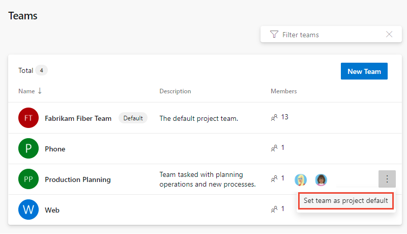
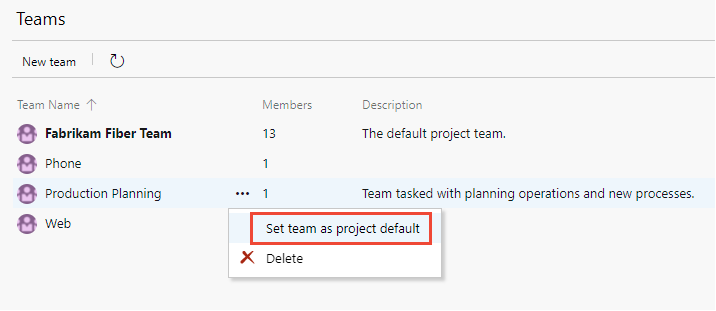

# Create or add a team 

[!INCLUDE [version-lt-eq-azure-devops](../../includes/version-lt-eq-azure-devops.md)]


 As your organization grows, you add teams to support that growth.  You create a team in Azure DevOps that corresponds to a group of project members focused on specific products, services, or feature areas. You add teams to provide them the tools they need to manage their backlog, plan sprints, configure dashboards, define alerts, and set team favorites.  

Each new project is configured with a default team with the project name. For example, the project named Fabrikam Fiber is configured with the default team Fabrikam Fiber Team. You can rename the default team and you can reassign a new team as the default.  

For a good understanding on how to remain Agile as you add teams, review [Scale Agile to Large Teams](/devops/plan/scaling-agile). For more information about team-configurable tools, see [About teams and Agile tools](about-teams-and-settings.md). 


> [!NOTE]    
> This article describes how to add a team or team members to a project defined in Azure DevOps. To learn about Microsoft Teams or the integration of Microsoft Teams with Azure Boards, see [Welcome to Microsoft Teams](/microsoftteams/teams-overview) or [Use the Azure Boards app in Microsoft Teams](../../boards/integrations/boards-teams.md). 

Use this article to learn how to perform the following tasks:  
::: moniker range="azure-devops"
> [!div class="checklist"]   
> * Create a team and add team administrators and team members       
> * Set the default team for a project  
> * List teams using Azure CLI
> * Grant additional permissions to teams 
::: moniker-end
::: moniker range="< azure-devops"
> [!div class="checklist"]   
> * Create a team and add team administrators and team members       
> * Set the default team for a project   
> * Grant additional permissions to teams 
::: moniker-end

To move work items assigned to one team to another team, see [Move work items from one team to another](../../boards/work-items/move-work-items.md).

## Prerequisites 

::: moniker range="azure-devops"
- To create a team or set the default team, you must be a member of the **Project Administrators** group. See [Change project-level permissions](../security/change-project-level-permissions.md). Only members of the Project Administrators group can add and delete teams.   
- To add members to a team or change its configuration, you must be a team administrator or member of the Project Administrators group. To get added as a team administrator, see [Add or remove a team administrator](add-team-administrator.md).
- To use Azure CLI commands, you must first install Azure CLI as described in [Get started with Azure DevOps CLI](../../cli/index.md).  
::: moniker-end
::: moniker range="< azure-devops"
- To create a team or set the default team, you must be a member of the **Project Administrators** group. See [Change project-level permissions](../security/change-project-level-permissions.md). Only members of the Project Administrators group can add and delete teams.   
- To add members to a team or change its configuration, you must be a team administrator or member of the Project Administrators group. To get added as a team administrator, see [Add or remove a team administrator](add-team-administrator.md).
::: moniker-end 

<a id="add-team"> </a>  

## Create a team and add team members

From your web browser, you can view, create, and configure teams. Only members of the Project Administrators group can create teams.

> [!NOTE]   
> When you create a team, you can automatically create the **Area Path** the team will use as a child node of the main project node. If you plan on creating a hierarchical team structure, you may want to first define the **Area Paths** at the project level, then create your teams, and then assign the **Area Path(s)** to be used by each team. To learn more about this team structure, see [Configure a hierarchy of teams](../../boards/plans/configure-hierarchical-teams.md).

::: moniker range="azure-devops"

From the Azure CLI tool, you can [list teams](#list-teams), [create a team](#add-team), [update a team configuration](rename-remove-team.md#update-team), and [delete a team](rename-remove-team.md#delete-team). 

::: moniker-end

[!INCLUDE [note-new-teams-page](../../includes/note-new-teams-page.md)]

#### [New Teams UI](#tab/preview-page) 

::: moniker range="azure-devops"
1. From the web portal, choose **Project settings** and open **Teams**.   

   

1. Choose **New team**.   

	:::image type="content" source="media/add-team/new-team-button-new-teams-preview.png" alt-text="Screenshot of choose New Team button, New Teams preview feature enabled.":::

1. Enter a team name and the names of project members who you want to assign to the team. Optionally, enter a description. You must add at least one name as a team **Administrator**. Select **Create an area path with the name of the team**, or leave it unchecked and assign the **Area Path** for the team after it's created. You can choose an existing area path or add a new one at that time. 

	:::image type="content" source="media/add-team/create-new-team-dialog-new-teams-preview.png" alt-text="Screenshot of Create a new team dialog, New Teams preview feature enabled.":::

	> [!NOTE] 
	> Consider adding one or more users as team administrators. Team administrators have the necessary permissions to add team members and configure all team settings&mdash;including backlogs, Kanban boards, and Taskboards. To learn more, see [Manage and configure team tools](manage-teams.md).   

1. When finished, select **Create**.  

1. Select the team to add a team image, or configure other team elements.  

1. Choose **Settings** to upload an image, change the team name, add a team administrator, or delete the team.   

	:::image type="content" source="media/add-team/team-settings-dialog-new-teams-preview.png" alt-text="Screenshot of Team Settings dialog, New Teams preview feature enabled.":::

1. Choose **Save** to save any changes you made. 

1.  Choose **Iterations and areas** to set the **Area Paths** and **Iteration Paths** for the team to use.   

	:::image type="content" source="media/add-team/team-settings-select-iterations-areas-new-teams-preview.png" alt-text="Screenshot of team settings, Iterations and areas highlighted, New Teams preview feature enabled.":::

	To learn how, see the following articles:  
		- [Define area paths and assign to a team](set-area-paths.md)  
		- [Define iteration paths, also known as sprints, and configure team iterations](set-iteration-paths-sprints.md).  

::: moniker-end

::: moniker range="< azure-devops"
Choose the **Current UI** tab. The New Teams Page UI is only available for Azure DevOps Services. 
::: moniker-end

#### [Current UI](#tab/current-page)  

::: moniker range=">= azure-devops-2019"

1. From the web portal, choose **Project settings** and open **Teams**.   

	
::: moniker-end

::: moniker range="tfs-2018"
1. From the web portal, choose **Project settings > Overview** :::image type="icon" source="../../media/icons/gear_icon.png" border="false":::.    

	  

::: moniker-end
2. Choose **New team**. Give the team a name, and optionally a description. Choose a security group to add team members to.  

	 

1. When finished, select **Create team**. As the creator of the team, you are automatically added as the team administrator. You can remove yourself as an administrator and assign others to that role in the following steps.

1. Select the team to add team administrators, team members, configure iterations and areas. The Team Profile opens.   
	From the team profile, you can perform these additional tasks:  
	- [Add team members](#add-team-members)
	- [Add and remove team administrators](add-team-administrator.md)
	- [Navigate to team notifications](../../notifications/manage-team-group-global-organization-notifications.md)
	- [Navigate to and set default team dashboard permissions](../../report/dashboards/dashboard-permissions.md)

	<a id="add-team-members" />

1. To add team members, choose **Add**. 

	> [!div class="mx-imgBorder"]  
	>    

4. Enter the sign-in addresses or display name for each account you want to add. Add them one at a time or all at the same time. You can enter several identities into the text box, separated by commas.

	

   > [!TIP]
   > You must enter user and group names one at a time. However, after entering a name, the account is added to the list, and you can enter another name in the Identities text box before choosing to save your changes.

	You may need to choose the :::image type="icon" source="../../media/icons/refresh.png" border="false"::: refresh icon to see your updates. 

6. To add an account as a team administrator, choose **Add** under the **Team Profile, Administrators** section. For details, see [Add a team administrator](add-team-administrator.md). To remove yourself as an administrator, choose the :::image type="icon" source="../../media/icons/delete-icon.png" border="false"::: **Delete** next to your name.

1. To configure the **Area Paths** and **Iteration Paths** for the team to use, choose **Iterations and areas**.   

   

	To learn how, see these articles: 
		- [Define area paths and assign to a team](set-area-paths.md)  
		- [Define iteration paths, also known as sprints, and configure team iterations](set-iteration-paths-sprints.md).  
 
#### [Azure DevOps CLI](#tab/azure-devops-cli)

<a id="add-team-cli" /> 

::: moniker range="azure-devops"

You can add a team using [Azure DevOps team create](/cli/azure/devops/team#az-devops-team-create). To get started, see [Get started with Azure DevOps CLI](../../cli/index.md).  

> [!div class="tabbedCodeSnippets"]
```azurecli
az devops team create --name [--description] [--project] 
```

#### Parameters
 
- **name**: Required. Name of the new team.  
- **description**: Optional. Description of the new team, enclose within parenthesis.    
- **project**: Optional. Name or ID of the project. Example: `--project "Fabrikam Fiber"`.  

#### Example

The following command adds a team named **Production Planning** to the *fabrikamprime* organization, *Fabrikam Fiber* project, and returns a number of properties assigned to the team in YAML output format.  

> [!div class="tabbedCodeSnippets"]
```azurecli
az devops team create --name "Production Planning" --description "Team tasked with planning operations and new processes." --output yaml
description: Team tasked with planning operations and new processes.
```

The YAML output listed below provides information on each of the attributes defined for the team. 

> [!div class="tabbedCodeSnippets"]
```YAML
id: d3ee0804-601e-459b-ba31-c70d0153ee6b
identity:
  descriptor: Microsoft.TeamFoundation.Identity;S-1-9-1551374245-1732201093-1654247747-2842177119-783707289-1-3902693433-3854875975-3003387648-1936292500
  id: d3ee0804-601e-459b-ba31-c70d0153ee6b
  isActive: true
  isContainer: true
  masterId: d3ee0804-601e-459b-ba31-c70d0153ee6b
  memberOf: []
  members: []
  metaTypeId: 255
  properties:
    Account:
      $type: System.String
      $value: Production Planning
    Description:
      $type: System.String
      $value: Team tasked with planning operations and new processes.
    Domain:
      $type: System.String
      $value: vstfs:///Classification/TeamProject/854a3f67-9962-43d1-a968-2e5f2eb66c99
    LocalScopeId:
      $type: System.String
      $value: 854a3f67-9962-43d1-a968-2e5f2eb66c99
    Microsoft.TeamFoundation.Team:
      $type: System.Boolean
      $value: true
    SchemaClassName:
      $type: System.String
      $value: Group
    ScopeId:
      $type: System.String
      $value: f0bedec1-eaee-4e51-ba15-01716ab2095e
    ScopeName:
      $type: System.String
      $value: Fabrikam Fiber
    ScopeType:
      $type: System.String
      $value: TeamProject
    SecuringHostId:
      $type: System.String
      $value: 5d5b8da6-3db7-4829-baf9-1e500c21cc12
    SecurityGroup:
      $type: System.String
      $value: SecurityGroup
    SpecialType:
      $type: System.String
      $value: Generic
    VirtualPlugin:
      $type: System.String
      $value: ''
  providerDisplayName: '[Fabrikam Fiber]\Production Planning'
  resourceVersion: 2
  subjectDescriptor: vssgp.Uy0xLTktMTU1MTM3NDI0NS0xNzMyMjAxMDkzLTE2NTQyNDc3NDctMjg0MjE3NzExOS03ODM3MDcyODktMS0zOTAyNjkzNDMzLTM4NTQ4NzU5NzUtMzAwMzM4NzY0OC0xOTM2MjkyNTAw
identityUrl: https://spsprodeus27.vssps.visualstudio.com/A5d5b8da6-3db7-4829-baf9-1e500c21cc12/_apis/Identities/d3ee0804-601e-459b-ba31-c70d0153ee6b
name: Production Plan
projectId: 854a3f67-9962-43d1-a968-2e5f2eb66c99
projectName: Fabrikam Fiber
url: https://fabrikamprime.visualstudio.com/_apis/projects/854a3f67-9962-43d1-a968-2e5f2eb66c99/teams/d3ee0804-601e-459b-ba31-c70d0153ee6b
```
 
::: moniker-end

[!INCLUDE [note-cli-not-supported-on-premises](../../includes/note-cli-not-supported-on-premises.md)]

* * *

Upon creation of a team, the following items are automatically configured:  
- Security group with the team name containing the members assigned to the team, for example, **[Fabrikam Fiber]\Production Planning**. You can use this name to filter queries or to **@mention** all members of the team. 
- Default notifications assigned to the team. To learn more, see [Manage notifications for a team, project, or organization](../../notifications/manage-team-group-global-organization-notifications.md).
- Default dashboard named **Overview** assigned to the team. To configure the dashboard, see [Add widgets to a dashboard](../../report/dashboards/add-widget-to-dashboard.md).

> [!IMPORTANT]   
> Configuring the **Area Paths** and **Iteration Paths** used by the team is essential for many of the Azure Board tools to work, such as Backlogs, Boards, Sprints, and Delivery Plans. Team tools aren't available until the team's default area path is set. **Area Paths** and **Iteration Paths** are first configured for the project and then assigned or selected by the team.  
>
> If you are moving from one team to two or more teams, you may want to review and revise the **Area Paths** assigned to the default project team. 


To configure other team features, see [Manage teams and configure team tools](manage-teams.md).

<a id="include-area-paths"> </a>  

## Set the default project team

Each project has a default team assigned. You can change which project is assigned as the default with the following procedures.   

#### [New Teams UI](#tab/preview-page) 
::: moniker range="azure-devops"
1. Open **Project settings > Teams** as indicated in the previous section. 

1. Choose :::image type="icon" source="../../media/icons/more-actions.png" border="false"::: **More options** for the team you want to designate as the default, and choose **Set team as project default**. 

	   
::: moniker-end

::: moniker range="< azure-devops"
Choose the **Current UI** tab. The New Teams Page UI is only available for Azure DevOps Services. 
::: moniker-end

#### [Current UI](#tab/current-page) 

::: moniker range=">= azure-devops-2019" 
1. Open **Project settings > Teams** as indicated in the previous section. 
::: moniker-end
::: moniker range="tfs-2018" 
1. Open **Project Settings > Overview** as indicated in the previous section. 
::: moniker-end 
1. Choose :::image type="icon" source="../../media/icons/actions-icon.png" border="false"::: to open the context menu for the team you want to designate as the default, and choose **Set team as project default**. 

	   

#### [Azure DevOps CLI](#tab/azure-devops-cli)

::: moniker range="azure-devops" 
There isn't an Azure CLI command to set the default team project. 
::: moniker-end 


[!INCLUDE [note-cli-not-supported-on-premises](../../includes/note-cli-not-supported-on-premises.md)]

* * *
  

<a id="list-teams" /> 

::: moniker range="azure-devops" 

## List teams with Azure CLI

You can list teams using [Azure DevOps team list](/cli/azure/devops/team#az-devops-team-list). To learn how to list team members, see [Add users to a team or project, List team members](../security/add-users-team-project.md#list-members).

> [!div class="tabbedCodeSnippets"]
```azurecli
az devops team list [--project]
                    [--skip]
                    [--top]
```

> [!TIP]
> If you don't specify a **top** number, 100 teams are returned. To list all teams in a project, specify a number for **top** which is greater than the current number of teams defined.  

#### Parameters

- **project**: Optional. Name or ID of the project. Example: --project "Fabrikam Fiber".  You can configure the default project using `az devops configure -d project=NAME_OR_ID`. Required if not configured as default or picked up via git config.
- **skip**: Optional. Number of teams to skip.  
- **top**: Optional. Maximum number of teams to return. 

#### Example

For example, the following command returns the 11 teams defined in the Fabrikam Fiber project. For addition output formats, see [Output formats for Azure CLI commands](/cli/azure/format-output-azure-cli). 

Each team is assigned a unique ID. 

> [!div class="tabbedCodeSnippets"]
```azurecli
az devops team list --project "Fabrikam Fiber" --output table
```

The table output listed below provides information on each of the attributes defined for the team. 

> [!div class="tabbedCodeSnippets"]
```azurecli
ID                                    Name                Description
------------------------------------  ------------------  ----------------------------------------------------------------------------
7f099146-29a2-4798-9949-77c9f5f79653  Account Management  Management team focused on creating and maintaining customer services
2017b37a-486b-4222-ac84-b8b9eefa540e  Customer Profile    Feature team focused on securing account data
a90cd8f0-8e0d-42d6-aeb2-13442b826730  Email               Feature team delivering email apps
a48cb46f-7366-4f4b-baf5-b3632398ed1e  Fabrikam Team       The default project team. Was Fabrikam Fiber Team
e42fccbc-d96f-4c98-8168-7a85ecede548  Internet            Feature team developing web apps
b70aa504-33b4-4d17-a85d-0fbf4829a154  Phone               Feature team delivering phone apps
43e6bd2e-696f-492c-bbf7-9cde9cd420ea  Service Delivery    Management team responsible for ensure high performance delivery of services
8920d2ec-eed1-4792-8934-82a57abce7c2  Service Status      Feature team focused on monitoring and addressing service issues
9c676c8c-1910-4f73-b7b9-a946b5c551ae  Shopping Cart       Feature team managing shopping cart apps
64b86488-e105-4901-ba43-ffd48137bb93  TV                  Feature team developing TV apps
cda2b9b0-0335-4a0d-8bd0-67611d64ce9d  Voice               Feature team focused on voice communications
```

::: moniker-end 

<a id="grant-add-permissions"></a>  

## Grant team members additional permissions  

For teams to work autonomously, you may want to provide them with permissions that they don't have by default. Suggested tasks include providing team administrators or team leads permissions to:  

- [Create and edit child nodes under their default area path](../security/set-permissions-access-work-tracking.md#create-child-nodes-modify-work-items-under-an-area-or-iteration-path) 
- [Create shared queries and folders under the **Shared Queries** folder](../../boards/queries/set-query-permissions.md)

For more information on setting permissions and access for select users, see [Set permissions and access for work tracking](../security/set-permissions-access-work-tracking.md).

::: moniker range="< azure-devops-2022" 

If your deployment is integrated with SQL Server Reports, you need to [Grant permissions to view or create SQL Server reports to team members](/previous-versions/azure/devops/report/admin/grant-permissions-to-reports). 

::: moniker-end 


## Next steps

> [!div class="nextstepaction"]
> [Move work items from one team to another team](../../boards/work-items/move-work-items.md) or 
> [Manage teams and configure team tools](manage-teams.md)

## Related articles

- [Rename or remove a team](rename-remove-team.md)
- [About teams and Agile tools](about-teams-and-settings.md)
- [Add users to a team or project](../security/add-users-team-project.md)

**Rest API resources**
- [Azure DevOps Teams CLI](/cli/azure/devops/team)
- [Teams (REST API)](/rest/api/azure/devops/core/teams)
- [Work Items (REST API)](/rest/api/azure/devops/wit)