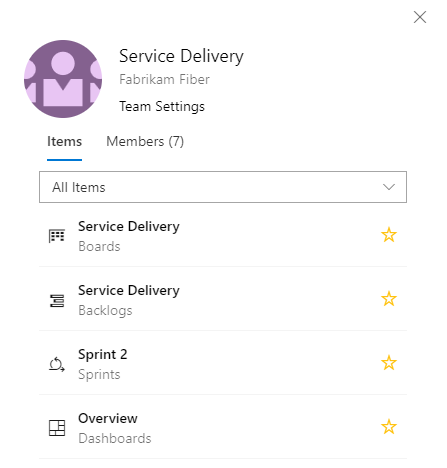
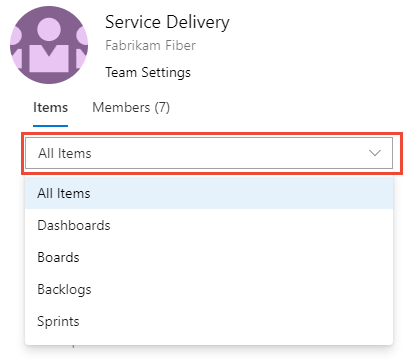
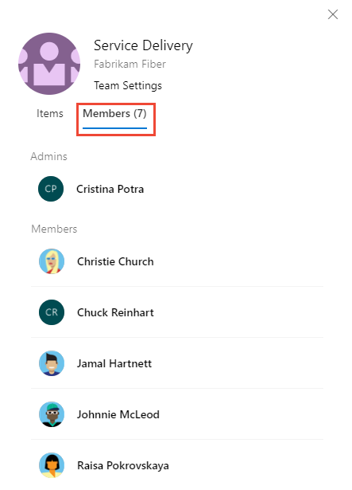
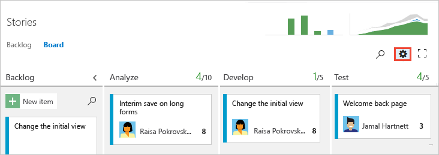

# Manage and configure team tools

[!INCLUDE [temp](../../_shared/version-ts-tfs-2015-2016.md)]  

While most permissions are governed by belonging to a security group or defined at the object level, team settings are managed by the team administrator role. Users assigned as a team administrator, are able to configure and manage all team tools. Specifically, when a team is added to a project, a project admin should [add one or more team administrators](add-team-administrator.md). 

Then, those team admins should look at performing these specific tasks: 
- Add team members 
- Configure area and iteration paths
- Configure backlogs and other common team settings
- Configure Kanban boards 

Optional tasks to consider include: 
- Configure and manage team dashboards
- Configure team notifications 

> [!NOTE]   
> In addition to team administrators, all members of the Project Administrators and Project Collection Administrators groups can manage settings for all teams. To add a team, see [Add teams](add-teams.md). 

::: moniker range=">= azure-devops-2019"
## Open the team profile and access team tools

- Open a team profile to quickly access items defined for a team. The team profile is available from the **Overview>Dashboards**, **Boards>Boards**, **Boards>Backlogs**, and **Boards>Sprints** pages. 

	> [!div class="mx-imgBorder"]  
	> 

	A panel opens that shows all items defined for the team. 

	> [!div class="mx-imgBorder"]  
	> 

- You can filter the list to show only **Dashboards**, **Boards**, **Backlogs**, or  **Sprints** by choosing from the menu. 

	> [!div class="mx-imgBorder"]  
	> 

- To view the team admins and members of the team, choose **Members**. 

	> [!div class="mx-imgBorder"]  
	> 

- To view or change the team configuration, choose **Team Settings**.  
	You can then perform the following tasks: 
	- Add [team members](../security/add-users-team-project.md#add-team-members)
	- Add [team admins](add-team-administrator.md)
	- Navigate to [team notifications](../../notifications/howto-manage-team-notifications.md)
	- Navigate to team [iterations](set-iteration-paths-sprints.md#open-team-settings) and [area paths](set-area-paths.md#open-team-settings). 
	- Update the [team description or profile picture](#team-description).

::: moniker-end

## Add users to a team
 
Several tools, such as capacity planning, team alerts, and dashboard widgets are team-scoped. That is, they automatically reference the users that have been added as members of a team to support planning activities or sending alerts. 

To add users to a team, see [Add users to a project or specific team](../security/add-users-team-project.md). 

All members of a team can favorite team artifacts and define work item templates. For details, see: 
- [Set personal or team favorites](../../project/navigation/set-favorites.md)
- [Use templates to add and update work items](../../boards/backlogs/work-item-template.md).

If team members don't have access to all the features they want, check that they have [the permissions needed for those features](../security/set-permissions-access-work-tracking.md).  

## Configure team areas and iterations 

A number of Agile tools depend on the area and iteration paths configured for the team as described in [About teams and Agile tools](about-teams-and-settings.md). 

Once project administrators have [added Area Paths](set-area-paths.md) and [Iteration Paths](set-iteration-paths-sprints.md) for a project, team administrators can select the area and iteration paths associated with their team. These settings affect a number of Agile tools available to the team. 

These include making the following associations for each team:  

- **Select team area paths**   
	Can select the default area path(s) associated with the team. These settings affect a number of Agile tools available to the team.	
- **Select team iteration paths or sprints** 
	Can select the default area path(s) associated with the team. These settings affect a number of Agile tools available to the team. 
 
For details, see [Define area paths and assign to a team](set-area-paths.md) and 
[Define iteration paths (aka sprints) and configure team iterations](set-iteration-paths-sprints.md). 

## Configure team backlogs and other common settings 

::: moniker range=">= tfs-2015"  
Team administrators can choose which backlog levels are active for a team. For example, a feature team may choose to show only the product backlog and a management team may choose to show only the feature and epic backlogs. Also, admins can choose whether bugs are treated similar to user stories and requirements or as tasks. 

Team admins can also choose which days are non-working days for the team. Sprint planning and tracking tools automatically consider days off when calculating capacity and sprint burndown.  
::: moniker-end  

::: moniker range=">= tfs-2015"  
You can configure most of your team settings from the common configuration dialog. 
::: moniker-end  

::: moniker range="tfs-2015"  
> [!NOTE]
> **Feature availability:** The common configuration dialog is available for TFS 2015.1 and later versions.  
::: moniker-end  

::: moniker range=">= tfs-2015"  
[!INCLUDE [temp](../../_shared/new-navigation.md)]  
::: moniker-end  

# [New navigation](#tab/new-nav)  

::: moniker range=">= azure-devops-2019"  

1. (1) Check that you have selected the right project, (2) choose Boards>Boards, and then (3) select the correct team from the team selector menu.

	> [!div class="mx-imgBorder"]
	> 

0. Make sure that you select the team backlog or board that you want to configure using the team selector. To learn more, see [Use breadcrumbs and selectors to navigate and open artifacts](../../project/navigation/use-breadcrumbs-selectors.md). 

0. Choose the product or portfolio backlog from the board-selection menu. 
	> [!div class="mx-imgBorder"]
	> 

0. Choose the  gear icon to configure the board and set general team settings.  

	> [!div class="mx-imgBorder"]
	>   

0. Choose a tab under any of the sections&mdash;**Cards**,**Board**, **Charts**, and **General**&mdash;to configure the cards or boards, the cumulative flow chart, or other team settings.   

	> [!div class="mx-imgBorder"]
	> 

::: moniker-end  

::: moniker range=">= tfs-2015 <= tfs-2018"  
[!INCLUDE [temp](../../_shared/new-navigation-not-supported.md)]  
::: moniker-end  

# [Previous navigation](#tab/previous-nav)  

::: moniker range=">= tfs-2015 <= tfs-2018 || azure-devops"

0. Make sure that you select the team from the project/team selector. You can switch your team focus to one that you've recently viewed from the project/team selector. If you don't see the team or project you want, choose **Browse&hellip;** or choose the  Azure DevOps logo to [access the **Projects** page](../../project/navigation/work-across-projects.md).  

	

0. Open **Work>Backlogs>Board**. 

	> [!div class="mx-imgBorder"]
	>  

1. Choose the board you want to configure and then choose the  gear icon to configure the board and set general team settings.  

	For example, from the Kanban board ...  
	::: moniker range="tfs-2017"  
	> [!div class="mx-imgBorder"]
	> 
	::: moniker-end  
	::: moniker range="tfs-2015"  
	
	::: moniker-end  
2. Choose a tab under **Cards** or **Board** to configure the cards and Kanban board columns and swimlanes.  

	::: moniker range=">= tfs-2017"  
	> [!div class="mx-imgBorder"]  
	> ![Common configuration dialog team settings]../.../boards/boards/_img/customize-cards/common-config-141.png)
	::: moniker-end  
	::: moniker range="tfs-2015"  
	
	::: moniker-end  

::: moniker-end  

::: moniker range="azure-devops-2019"
[!INCLUDE [temp](../../_shared/previous-navigation-not-supported-azd.md)] 
::: moniker-end

---

::: moniker range=">= tfs-2017"  

For details on each configuration option, see one of these topics:  

<table width="80%">
<tbody valign="top">
<tr>
<th width="35%">Area</th>
<th width="65%">Configuration task</th>
</tr>
<tr>
<td>Cards  </td>
<td>
<ul>
<li>[Add fields](../../boards/boards/customize-cards.md)</li>
<li>[Define styles](../../boards/boards/customize-cards.md#style-rule)</li>
<li>[Add tag colors](../../boards/boards/customize-cards.md#color-tags)</li>
<li>[Enable annotations](../../boards/boards/customize-cards.md#annotations)</li>
<li>[Configure inline tests](../../boards/boards/customize-cards.md#tests) </li>
</ul>
</td>
</tr>
<tr>
<td>Boards </td>
<td>
<ul>
<li>[Add columns](../../boards/boards/add-columns.md)</li>
<li>[Add swimlanes](../../boards/boards/expedite-work.md)</li>
<li>[Card reordering](../../boards/boards/reorder-cards.md) </li>
</ul>
</td>
</tr>
<tr>
<td>Chart</td>
<td>
<ul>
<li>[Configure cumulative flow chart](../../report/dashboards/cumulative-flow.md#configure) </li>
</ul>
</td>
</tr>
<tr>
<td>General  </td>
<td>
<ul>
<li>[Backlogs](select-backlog-navigation-levels.md)</li>
<li>[Working days](set-working-days.md)</li>
<li>[Working with bugs](show-bugs-on-backlog.md) </li>
</ul>
</td>
</tr>
</tbody>
</table>

::: moniker-end  

::: moniker range="tfs-2015"    

For details on each configuration option, see one of these topics:  

<table width="80%">
<tbody valign="top">
<tr>
<th width="35%">Area</th>
<th width="65%">Configuration task</th>
</tr>
<tr>
<td>Cards  </td>
<td>
<ul>
<li>[Add fields](../../boards/boards/customize-cards.md)</li>
<li>[Define styles](../../boards/boards/customize-cards.md#style-rule)</li>
<li>[Add tag colors](../../boards/boards/customize-cards.md#color-tags)</li>
</ul>
</td>
</tr>
<tr>
<td>Boards </td>
<td>
<ul>
<li>[Add columns](../../boards/boards/add-columns.md)</li>
</ul>
</td>
</tr>
<tr>
<td>Chart</td>
<td>
<ul>
<li>[Configure cumulative flow chart](../../report/dashboards/cumulative-flow.md#configure) </li>
</ul>
</td>
</tr>
<tr>
<td>General  </td>
<td>
<ul>
<li>[Backlogs](select-backlog-navigation-levels.md)</li>
<li>[Working days](set-working-days.md)</li>
<li>[Working with bugs](show-bugs-on-backlog.md) </li>
</ul>
</td>
</tr>
</tbody>
</table>

::: moniker-end  

## Configure Kanban boards 
Team administrators can fully customize the team's Kanban boards associate with the product and portfolio backlogs. You configure a Kanban board by first defining the columns and WIP limits from the common configuration dialog. For guidance, see [Kanban basics](../../boards/boards/kanban-basics.md).  
* [Columns](../../boards/boards/add-columns.md)  
* [WIP limits](../../boards/boards/wip-limits.md)    
* [Definition of Done](../../boards/boards/definition-of-done.md)  

::: moniker range=">= tfs-2015" 
Additional elements you can configure include: 
* [Split columns](../../boards/boards/split-columns.md)   
* [Swimlanes](../../boards/boards/expedite-work.md)  
* [Card fields, styles, tag colors, annotations, and card reordering](../../boards/boards/customize-cards.md#kanban-board)    
::: moniker-end

::: moniker range=">= tfs-2017" 

## Add and manage team dashboards   

::: moniker-end
::: moniker range=">= azure-devops-2019"
By default, all team members can add and edit team dashboards. In addition, team administrators can manage permissions for team dashboards. For details, see [Add and manage dashboards](../../report/dashboards/dashboard-permissions.md#set-permissions). 
::: moniker-end

::: moniker range=">= tfs-2017 <= tfs-2018" 
Team administrators can add, configure, and manage permissions for team dashboards. For details, see [Add and manage dashboards](../../report/dashboards/dashboard-permissions.md#set-permissions). 

::: moniker-end

<a id="team-description" />
## Update team description and picture

Team settings also include the team name, description, and team profile image. To add a team picture. Open the Team Profile and choose the picture icon. The maximum file size is 4 MB. 

## Manage team notifications 

Team administrators can add and modify alerts so that the team can receive email notifications as changes occur to work items, code reviews, source control files, and builds. A number of alerts are defined for each team. For details, see [Manage team alerts](../../notifications/howto-manage-team-notifications.md).

<a id="team-rooms" />

::: moniker range=">= tfs-2015 <= tfs-2017"
## Manage team rooms 

Team administrators can add users and events to team rooms, and add team rooms. Team rooms are chat rooms limited to team members. For details, see [Collaborate in a team room](../../notifications/collaborate-in-a-team-room.md).  

> [!NOTE]  
> Team rooms are deprecated for TFS 2018 and later versions as described in [Deprecation of team rooms](https://blogs.msdn.microsoft.com/devops/2017/01/04/deprecation-of-the-team-rooms-in-team-services-and-tfs/) blog post. Several good solutions are available that integrate well with TFS that support notifications and chat, such as [Microsoft Teams](../../service-hooks/services/teams.md) and [Slack](../../service-hooks/services/slack.md).   

::: moniker-end

## Related articles

- [About projects and scaling your organization](../projects/about-projects.md)
- [About teams and Agile tools](about-teams-and-settings.md)  
- [Add teams](add-teams.md) 
- [Add a team administrator](add-team-administrator.md) 

