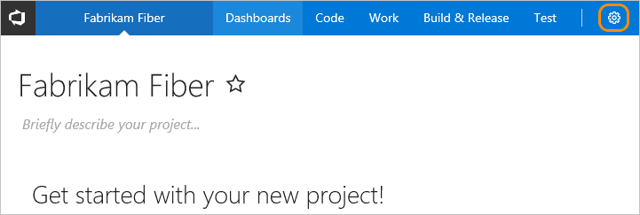
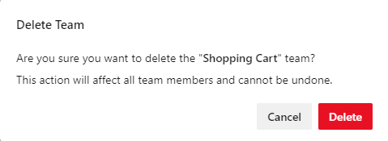

# Rename or remove a team  

[!INCLUDE [temp](../../includes/version-all.md)]

As your organization changes, you may need to rename or remove a team.  

When you rename a team, the new name propagates throughout Azure DevOps. The following team artifacts are automatically renamed:
- Team security group 
- Team backlogs and boards
- Team dashboards 
 
> [!TIP]    
> Update any queries that reference the old team security group name. 

When you remove or delete a team, all of its configuration settings get deleted. These settings include team dashboards, backlogs, and boards. Data defined for work items that are assigned to the team are left unchanged. Once deleted, you can't recover the team configurations. 
 
## Prerequisites 

- To rename a team, you must be a team administrator or a member of the [Project Administrators group](../security/set-project-collection-level-permissions.md). 
- To remove or delete a team, you must be a member of the [Project Administrators group](../security/set-project-collection-level-permissions.md). 

## Rename a team

::: moniker range="azure-devops"

> [!NOTE]   
> To enable the user interface for the **New Teams Page**, see [Manage or enable features](../../project/navigation/preview-features.md).

::: moniker-end

#### [New Teams Page](#tab/preview-page) 

::: moniker range="azure-devops"

1. From the web portal, choose **Project settings** and open **Teams**. 

   

1. Choose the team you want to rename, and then choose **Settings**.  

1. Under **Team Details**, enter a new name for the team. Optionally, add a new description.  

	> [!div class="mx-imgBorder"]
	> 

1. Choose **Save**.

::: moniker-end

[!INCLUDE [temp](../../includes/note-new-teams-not-supported.md)]  

#### [Current page](#tab/current-page) 

::: moniker range=">= azure-devops-2019"

1. From the web portal, choose **Project settings** and open **Teams**. 

   

1. Choose the team you want to rename. Under the Team Profile, enter the new name and optionally update the description.  Choose **Save** when done. 

	> [!div class="mx-imgBorder"]
	> 

To configure other team features, see [Manage teams and configure team tools](manage-teams.md).

::: moniker-end

::: moniker range=">= tfs-2017 <= tfs-2018"

<a id="add-team-team-services" /> 

1. From the web portal, choose **Project settings** :::image type="icon" source="../../media/icons/gear_icon.png" border="false":::.  

	 

1. Choose the team you want to rename. Under the Team Profile, enter the new name and optionally update the description.  Choose **Save** when done. 

	> [!div class="mx-imgBorder"]
	> 

To configure other team features, see [Manage teams and configure team tools](manage-teams.md).

::: moniker-end

::: moniker range="<= tfs-2015"

<a id="add-team-tfs-2015" />

1. From the web portal, choose **Project settings** :::image type="icon" source="../../media/icons/gear_icon.png" border="false":::.

	  

1. Choose the team you want to rename. Under the Team Profile, enter the new name and optionally update the description.  Choose **Save** when done. 

	> [!div class="mx-imgBorder"]
	> 


To configure other team features, see [Manage teams and configure team tools](manage-teams.md).
 
::: moniker-end

#### [Azure DevOps CLI](#tab/azure-devops-cli) 

<a id="update-team" /> 

::: moniker range=">= azure-devops-2020"

You can rename a team or its description using [Azure DevOps team update](/cli/azure/devops/team#ext-azure-devops-az-devops-team-update). To get started, see [Get started with Azure DevOps CLI](../../cli/index.md).  

> [!div class="tabbedCodeSnippets"]
```azurecli
az devops team update --team
                      [--description]
                      [--name]
                      [--org]
                      [--project]
```

#### Parameters
- **team**: Optional. Name or ID of a team.  
- **description**: Optional. Description to apply to the team.  
- **name**: Optional. Name to apply to rename the team.   
- **org**: Optional. URL of organization. You can configure the default organization using `az devops configure -d org=URL`. Required if not configured as default or picked up via git config.
- **project**: Optional. Name or ID of the project. Example: --project "Fabrikam Fiber".  You can configure the default project using `az devops configure -d project=NAME_OR_ID`. Required if not configured as default or picked up via git config.

::: moniker-end

[!INCLUDE [temp](../../includes/note-cli-supported-server.md)]  

::: moniker range=">= azure-devops-2020"

#### Example

For example, the following command renames the Account Management team to Organization Management. For addition output formats, see [Output formats for Azure CLI commands](/cli/azure/format-output-azure-cli). 

> [!div class="tabbedCodeSnippets"]
```azurecli
az devops team update --team "Account Management" --name "Organization Management" --description "Management team focused on creating and maintaining customer services for organizations"
{
  "description": "Management team focused on creating and maintaining customer services for organizations",
  "id": "7f099146-29a2-4798-9949-77c9f5f79653",
  "identity": {
    "descriptor": "Microsoft.TeamFoundation.Identity;S-1-9-1551374245-227716950-993605186-2584159299-2630527068-1-4146437839-3810360391-2614259327-2922617790",
    "id": "7f099146-29a2-4798-9949-77c9f5f79653",
    "isActive": true,
    "isContainer": true,
    "masterId": "7f099146-29a2-4798-9949-77c9f5f79653",
    "memberOf": [],
    "members": [],
    "metaTypeId": 255,
    "properties": {
      "Account": {
        "$type": "System.String",
        "$value": "Account Management"
      },
      "Description": {
        "$type": "System.String",
        "$value": "Management team focused on creating and maintaining customer services"
      },
      "Domain": {
        "$type": "System.String",
        "$value": "vstfs:///Classification/TeamProject/56af920d-393b-4236-9a07-24439ccaa85c"
      },
      "LocalScopeId": {
        "$type": "System.String",
        "$value": "56af920d-393b-4236-9a07-24439ccaa85c"
      },
      "Microsoft.TeamFoundation.Team": {
        "$type": "System.String",
        "$value": "True"
      },
      "SchemaClassName": {
        "$type": "System.String",
        "$value": "Group"
      },
      "ScopeId": {
        "$type": "System.String",
        "$value": "e03662ad-bec4-4a33-bb0f-86e365ee2d88"
      },
      "ScopeName": {
        "$type": "System.String",
        "$value": "Fabrikam Fiber"
      },
      "ScopeType": {
        "$type": "System.String",
        "$value": "TeamProject"
      },
      "SecuringHostId": {
        "$type": "System.String",
        "$value": "380ed149-33d0-4d78-a7ed-89921802f389"
      },
      "SecurityGroup": {
        "$type": "System.String",
        "$value": "SecurityGroup"
      },
      "SpecialType": {
        "$type": "System.String",
        "$value": "Generic"
      },
      "VirtualPlugin": {
        "$type": "System.String",
        "$value": ""
      }
    },
    "providerDisplayName": "[Fabrikam Fiber]\\Account Management",
    "resourceVersion": 2,
    "subjectDescriptor": "vssgp.Uy0xLTktMTU1MTM3NDI0NS0yMjc3MTY5NTAtOTkzNjA1MTg2LTI1ODQxNTkyOTktMjYzMDUyNzA2OC0xLTQxNDY0Mzc4MzktMzgxMDM2MDM5MS0yNjE0MjU5MzI3LTI5MjI2MTc3OTA"
  },
  "identityUrl": "https://spsprodeus21.vssps.visualstudio.com/A380ed149-33d0-4d78-a7ed-89921802f389/_apis/Identities/7f099146-29a2-4798-9949-77c9f5f79653",
  "name": "Organization Management",
  "projectId": "56af920d-393b-4236-9a07-24439ccaa85c",
  "projectName": "Fabrikam Fiber",
  "url": "https://dev.azure.com/fabrikam/_apis/projects/56af920d-393b-4236-9a07-24439ccaa85c/teams/7f099146-29a2-4798-9949-77c9f5f79653"
}
```
::: moniker-end

[!INCLUDE [temp](../../includes/note-cli-not-supported.md)]  

* * *

## Set a team as the default

When a project is created, a default team is created based on the project name. 

To change the default, open **Project Settings>Teams**, choose :::image type="icon" source="../../media/icons/more-actions.png" border="false"::: **More options** next to the team you want as the new default, and select **Set team as project default**.   


## Delete a team 

You can delete any team except the default team. At least one team must be defined for a project.

> [!IMPORTANT]   
> Deleting a team deletes all team configuration settings, including team dashboards, backlogs, and boards. Data defined for work items assigned to the team are left unchanged. Once deleted, you can't recover the team configurations. 

::: moniker range="azure-devops"

> [!NOTE]   
> To enable the user interface for the **New Teams Page**, see [Manage or enable features](../../project/navigation/preview-features.md).

::: moniker-end

#### [New Teams Page](#tab/preview-page) 

::: moniker range="azure-devops"

1. From the web portal, choose **Project settings** and open **Teams** as shown in the previous section.

1. Choose the team you want to delete and then scroll down to the Delete Team section. Choose **Delete Team**.    

	> [!div class="mx-imgBorder"]
	> 

1. Choose **Delete** in the confirmation box to complete the delete operation. 

	> [!div class="mx-imgBorder"]
	>  

::: moniker-end

[!INCLUDE [temp](../../includes/note-new-teams-not-supported.md)]  

#### [Current page](#tab/current-page) 

::: moniker range=">= azure-devops-2019"

1. To delete a team, choose **Project Settings > Teams** > **&hellip;** for the team you want to delete, and select the **Delete** option.   

	> [!div class="mx-imgBorder"]  
	>   

	> [!IMPORTANT]   
	> Deleting a team deletes all team configuration settings, including team dashboards, backlogs, and boards. Data defined for work items assigned to the team are left unchanged. Once deleted, you can't recover the team configurations. 

2. To complete the delete operation, you must enter the name of the WIT as shown. 

	

::: moniker-end

::: moniker range="<= tfs-2018"

1. To delete a team, choose **Project Settings** > **Work** > **Overview** > **&hellip;** for the team you want to delete, and select the **Delete** option.   

	

2. To complete the delete operation, you must enter the name of the WIT as shown. 

	

::: moniker-end

#### [Azure DevOps CLI](#tab/azure-devops-cli)

<a id="delete-team" /> 

::: moniker range=">= azure-devops-2020"

You can delete a team using [az devops team delete](/cli/azure/devops/team#ext-azure-devops-az-devops-team-delete).  

> [!div class="tabbedCodeSnippets"]
```azurecli
az devops team delete --id
                      [--project]
                      [--yes]
```

#### Parameters

- **id**: Required. The ID of the team to delete.
- **project**: Optional. Name or ID of the project. Example: --project "Fabrikam Fiber".
- **yes**: Optional. Specify to not prompt for confirmation. 

#### Example

> [!div class="tabbedCodeSnippets"]
```azurecli
az devops team delete --id 5385556a-254d-4ad4-bd11-71955e3a7070 --project "Fabrikam Fiber"
Are you sure you want to delete this team? (y/n): y

```

::: moniker-end

[!INCLUDE [temp](../../includes/note-cli-not-supported.md)]  


* * *

## Related articles

- [Add teams](add-teams.md)  
- [About teams and Agile tools](about-teams-and-settings.md)  
- [Azure DevOps Teams CLI](/cli/azure/devops/team)  
- [Teams (REST API)](/rest/api/azure/devops/core/teams)  
- [Work Items (REST API)](/rest/api/azure/devops/wit)  
