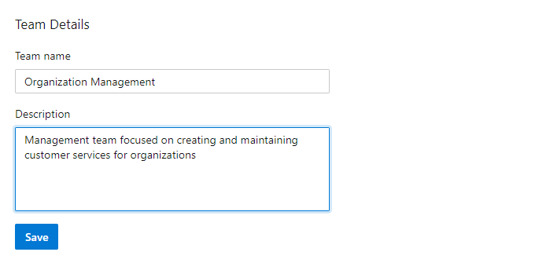
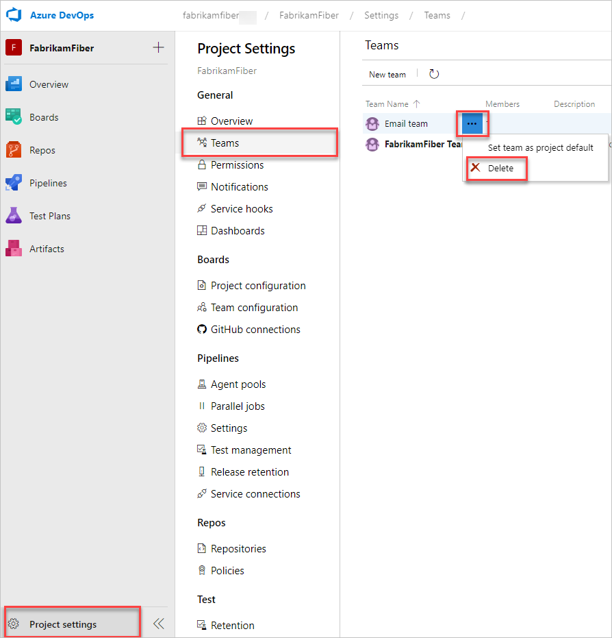
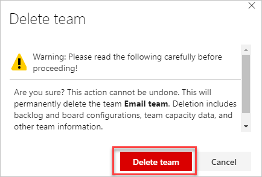

# Rename or remove a team  

[!INCLUDE [temp](../../includes/version-vsts-tfs-all-versions.md)]

As your organization changes, you may have a need to rename a team or remove it. 
 
## Prerequisites 

- To rename a team, you must be a team administrator or a member of the [Project Administrators group](../security/set-project-collection-level-permissions.md). 
- To remove or delete a team, you must be a member of the [Project Administrators group](../security/set-project-collection-level-permissions.md). 

## Rename a team

::: moniker range="azure-devops"

> [!NOTE]   
> To enable the new user interface for the **New Teams Page**, see [Enable preview features](../../project/navigation/preview-features.md).

#### [Preview page](#tab/preview-page) 

1. From the web portal, choose **Project settings** and open **Teams**. 

   

2. Choose the team you want to rename, and then choose **Settings**.   

3. Under **Team Details**, enter a new name for the team. Optionally, add a new description.  

	> [!div class="mx-imgBorder"]
	> 

1. Choose **Save**.

#### [Current page](#tab/current-page) 

1. From the web portal, choose **Project settings** and open **Teams**. 

   

2. Choose the team you want to rename. Under the Team Profile, enter the new name and optionally update the description.  Choose **Save** when done. 

	> [!div class="mx-imgBorder"]
	> 

To configure other team features, see [Manage teams and configure team tools](manage-teams.md).

#### [Azure DevOps CLI](#tab/azure-devops-cli)

From the Azure DevOps CLI command, you can update a team's name and description. 

<a id="update-team" /> 

You can rename a team using [Azure DevOps team update](/cli/azure/ext/azure-devops/devops/team#ext-azure-devops-az-devops-team-update). To get started, see [Get started with Azure DevOps CLI](../../cli/index.md).  

> [!div class="tabbedCodeSnippets"]
```CLI
az devops team update --team
                      [--description]
                      [--name]
                      [--org]
                      [--project]
```

#### Parameters
- **team**: Optional. Name or ID of a team.  
- **description**: Optional. Description to apply to the team.  
- **name**: Optional. Name to apply to rename the team.   
- **org**: Optional. URL of organization. You can configure the default organization using `az devops configure -d org=URL`. Required if not configured as default or picked up via git config.
- **project**: Optional. Name or ID of the project. Example: --project "Fabrikam Fiber".  You can configure the default project using `az devops configure -d project=NAME_OR_ID`. Required if not configured as default or picked up via git config.


#### Example

For example, the following command renames the Account Management team to Organization Management. For addition output formats, see [Output formats for Azure CLI commands](/cli/azure/format-output-azure-cli). 

> [!div class="tabbedCodeSnippets"]
```CLI
C:\WINDOWS\system32>az devops team update --team "Account Management" --name "Organization Management" --description "Management team focused on creating and maintaining customer services for organizations"
{
  "description": "Management team focused on creating and maintaining customer services for organizations",
  "id": "7f099146-29a2-4798-9949-77c9f5f79653",
  "identity": {
    "descriptor": "Microsoft.TeamFoundation.Identity;S-1-9-1551374245-227716950-993605186-2584159299-2630527068-1-4146437839-3810360391-2614259327-2922617790",
    "id": "7f099146-29a2-4798-9949-77c9f5f79653",
    "isActive": true,
    "isContainer": true,
    "masterId": "7f099146-29a2-4798-9949-77c9f5f79653",
    "memberOf": [],
    "members": [],
    "metaTypeId": 255,
    "properties": {
      "Account": {
        "$type": "System.String",
        "$value": "Account Management"
      },
      "Description": {
        "$type": "System.String",
        "$value": "Management team focused on creating and maintaining customer services"
      },
      "Domain": {
        "$type": "System.String",
        "$value": "vstfs:///Classification/TeamProject/56af920d-393b-4236-9a07-24439ccaa85c"
      },
      "LocalScopeId": {
        "$type": "System.String",
        "$value": "56af920d-393b-4236-9a07-24439ccaa85c"
      },
      "Microsoft.TeamFoundation.Team": {
        "$type": "System.String",
        "$value": "True"
      },
      "SchemaClassName": {
        "$type": "System.String",
        "$value": "Group"
      },
      "ScopeId": {
        "$type": "System.String",
        "$value": "e03662ad-bec4-4a33-bb0f-86e365ee2d88"
      },
      "ScopeName": {
        "$type": "System.String",
        "$value": "Fabrikam Fiber"
      },
      "ScopeType": {
        "$type": "System.String",
        "$value": "TeamProject"
      },
      "SecuringHostId": {
        "$type": "System.String",
        "$value": "380ed149-33d0-4d78-a7ed-89921802f389"
      },
      "SecurityGroup": {
        "$type": "System.String",
        "$value": "SecurityGroup"
      },
      "SpecialType": {
        "$type": "System.String",
        "$value": "Generic"
      },
      "VirtualPlugin": {
        "$type": "System.String",
        "$value": ""
      }
    },
    "providerDisplayName": "[Fabrikam Fiber]\\Account Management",
    "resourceVersion": 2,
    "subjectDescriptor": "vssgp.Uy0xLTktMTU1MTM3NDI0NS0yMjc3MTY5NTAtOTkzNjA1MTg2LTI1ODQxNTkyOTktMjYzMDUyNzA2OC0xLTQxNDY0Mzc4MzktMzgxMDM2MDM5MS0yNjE0MjU5MzI3LTI5MjI2MTc3OTA"
  },
  "identityUrl": "https://spsprodeus21.vssps.visualstudio.com/A380ed149-33d0-4d78-a7ed-89921802f389/_apis/Identities/7f099146-29a2-4798-9949-77c9f5f79653",
  "name": "Organization Management",
  "projectId": "56af920d-393b-4236-9a07-24439ccaa85c",
  "projectName": "Fabrikam Fiber",
  "url": "https://dev.azure.com/kelliott/_apis/projects/56af920d-393b-4236-9a07-24439ccaa85c/teams/7f099146-29a2-4798-9949-77c9f5f79653"
}
```

---

::: moniker-end

::: moniker range="azure-devops-2019"

1. From the web portal, choose **Project settings** and open **Teams**. 

   

2. Choose the team you want to rename. Under the Team Profile, enter the new name and optionally update the description.  Choose **Save** when done. 

	> [!div class="mx-imgBorder"]
	> 


To configure other team features, see [Manage teams and configure team tools](manage-teams.md).

::: moniker-end


::: moniker range=">= tfs-2017 <= tfs-2018"

<a id="add-team-team-services" /> 

1. From the web portal, choose the  gear settings icon to open the **Project settings** page for the project.  

	 

2. Choose the team you want to rename. Under the Team Profile, enter the new name and optionally update the description.  Choose **Save** when done. 

	> [!div class="mx-imgBorder"]
	> 

To configure other team features, see [Manage teams and configure team tools](manage-teams.md).

::: moniker-end

::: moniker range=">= tfs-2013 <= tfs-2015"

<a id="add-team-tfs-2015" />

1. From the web portal, choose the  gear settings icon to open **Project Settings.**  

	


To configure other team features, see [Manage teams and configure team tools](manage-teams.md).
 
::: moniker-end

## Delete a team 

::: moniker range="azure-devops"

> [!NOTE]   
> To enable the new user interface for the **New Teams Page**, see [Enable preview features](../../project/navigation/preview-features.md).

#### [Preview page](#tab/preview-page)

1. To delete a team, open **Project settings > Teams**, choose the &hellip; context menu for the team you want to delete, and select the **Delete** option.   
	> [!div class="mx-imgBorder"]  
	>   

	> [!IMPORTANT]   
	> Deleting a team deletes all team configuration settings, including team dashboards, backlogs, and boards. Data defined for work items assigned to the team are left unchanged. Once deleted, you can't recover the team configurations. 

2. To complete the delete operation, you must type the name of the WIT as shown. 

	


#### [Current page](#tab/current-page) 

1. To delete a team, open **Project Settings > Teams**, choose the &hellip; context menu for the team you want to delete, and select the **Delete** option.   

	> [!div class="mx-imgBorder"]  
	>   

	> [!IMPORTANT]   
	> Deleting a team deletes all team configuration settings, including team dashboards, backlogs, and boards. Data defined for work items assigned to the team are left unchanged. Once deleted, you can't recover the team configurations. 

2. To complete the delete operation, you must type the name of the WIT as shown. 

	

#### [Azure DevOps CLI](#tab/azure-devops-cli)

<a id="delete-team" /> 

You can delete a team using [az devops team delete](/cli/azure/ext/azure-devops/devops/team#ext-azure-devops-az-devops-team-delete).  

> [!div class="tabbedCodeSnippets"]
```CLI
az devops team delete --id
                      [--project]
                      [--yes]
```

#### Parameters

- **id**: Required. The id of the team to delete.
- **project**: Optional. Name or ID of the project. Example: --project "Fabrikam Fiber".
- **yes**: Optional. Specify to not prompt for confirmation. 

#### Example

> [!div class="tabbedCodeSnippets"]
```CLI
C:\WINDOWS\system32>az devops team delete --id 5385556a-254d-4ad4-bd11-71955e3a7070 --project "Fabrikam Fiber"
Are you sure you want to delete this team? (y/n): y

```

* * *

::: moniker-end

::: moniker range="azure-devops-2019"

1. To delete a team, open **Project Settings > Teams**, choose the &hellip; context menu for the team you want to delete, and select the **Delete** option.   
	> [!div class="mx-imgBorder"]  
	>   

	> [!IMPORTANT]   
	> Deleting a team deletes all team configuration settings, including team dashboards, backlogs, and boards. Data defined for work items assigned to the team are left unchanged. Once deleted, you can't recover the team configurations. 

2. To complete the delete operation, you must type the name of the WIT as shown. 

	

::: moniker-end


::: moniker range="<= tfs-2018"

1. To delete a team, open **Project Settings>Work>Overview**, choose the &hellip; context menu for the team you want to delete, and select the **Delete** option.   

	
 
	> [!IMPORTANT]   
	> Deleting a team deletes all team configuration settings, including team dashboards, backlogs, and boards. Data defined for work items assigned to the team are left unchanged. Once deleted, you can't recover the team configurations. 

2. To complete the delete operation, you must type the name of the WIT as shown. 

	

::: moniker-end


<a id="grant-add-permissions"></a>  

## Grant team members additional permissions  

For teams to work autonomously, you may want to provide them with permissions that they don't have by default. Suggested tasks include providing team administrators or team leads permissions to:  

- Create and edit child nodes under their default area path
- Create and edit child nodes under an existing iteration node 
- Create shared queries and folders under the Shared Queries folder

For more information on setting the above permissions or restricting access for select users, see [Set permissions and access for work tracking](../security/set-permissions-access-work-tracking.md).


::: moniker range=">= tfs-2018 <= azure-devops-2019" 

If your Azure DevOps Server or TFS deployment is integrated with SQL Server Reports, you'll need to [Grant permissions to view or create SQL Server reports to team members](../../report/admin/grant-permissions-to-reports.md). 

::: moniker-end 

::: moniker range="<= tfs-2017" 

If your TFS deployment is integrated with a SharePoint product or SQL Server Reports, you'll need to manage membership for those products separately from their websites. 

-  [Set SharePoint site permissions](../security/set-sharepoint-permissions.md) 
-  [Grant permissions to view or create SQL Server reports in TFS](../../report/admin/grant-permissions-to-reports.md). 

::: moniker-end 

## Next steps

Once you've created a team, you'll want to configure your Agile tools to support how your team works. Also, consider adding one or more users as team administrators. Team administrators have the necessary permissions to add team members, add a picture to the team profile, and configure and manage all team features.  

> [!div class="nextstepaction"]
> [Add team administrator](add-team-administrator.md)
> or
> [Manage teams and configure team tools](manage-teams.md)


## Related articles

- [About teams and Agile tools](about-teams-and-settings.md)
- [Azure DevOps Teams CLI](/cli/azure/ext/azure-devops/devops/team)
- [Teams (REST API)](/rest/api/azure/devops/core/teams)
- [Work Items (REST API)](/rest/api/azure/devops/wit)
