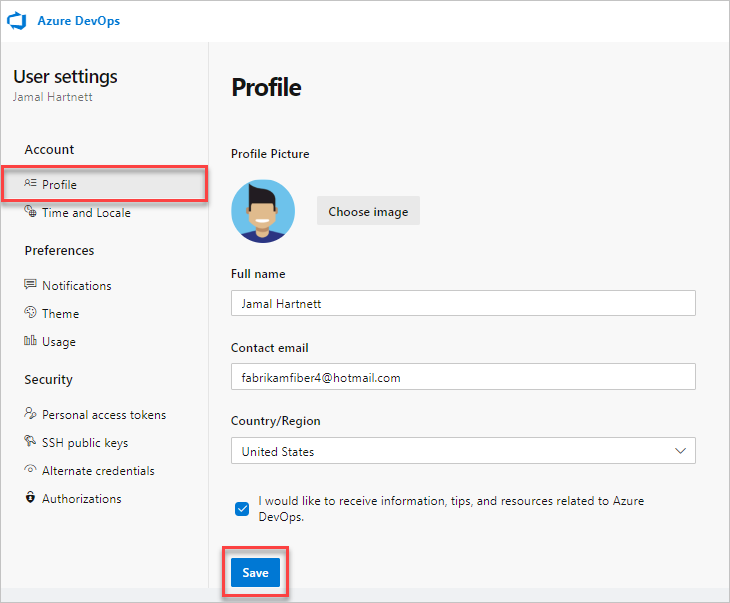
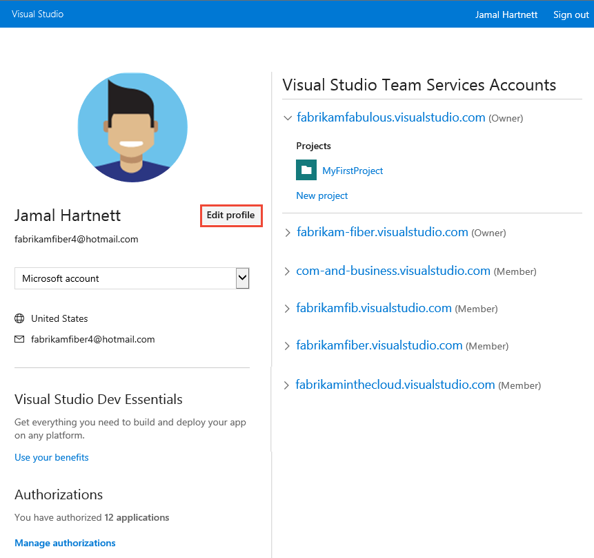
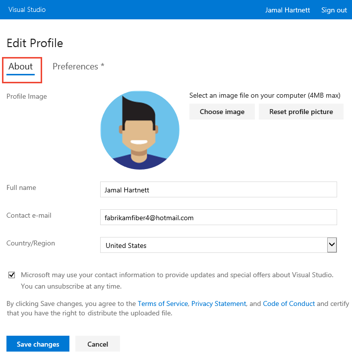

# Set user preferences

[!INCLUDE [version-lt-eq-azure-devops](../../includes/version-lt-eq-azure-devops.md)]

::: moniker range="azure-devops"

You can set user preferences on the user profile page in Azure DevOps. Changes can include the picture, display name, preferred email, and UI theme. These settings only apply to Azure DevOps.

> [!TIP]
> - To change the settings for your work or school account, see [Change work or school account settings in the My Account portal](https://support.microsoft.com/account-billing/change-work-or-school-account-settings-in-the-my-account-portal-e50bfccb-58e9-4d42-939c-a60cb6d56ced).
> - You can't change the UI theme if you're using Internet Explorer. For more information about the browsers we support, see [Azure DevOps client compatibility](/azure/devops/server/compatibility?view=azure-devops&preserve-view=true).
> - Language settings apply only to your profile page.

See the following articles for setting other user preferences:

- [Change time and locale](../accounts/change-time-zone.md#change-user-profile-time-zone): Change the preferred language, date and time patterns, and time zone.  
- [Manage personal notifications](../../notifications/manage-your-personal-notifications.md): Add or review subscriptions to event changes.  
- [Refresh or re-evaluate your permissions](../security/troubleshoot-permissions.md#refresh-permissions): Use to refresh permissions and make any recent changes take effect.  
- [Manage preview features](../../project/navigation/preview-features.md): Enable or disable a preview feature for your user account.  

[!INCLUDE [preview-features-enabled](../../includes/preview-features-enabled-new-account.md)]

::: moniker-end

::: moniker range="azure-devops-2019 || azure-devops-2020"

On the Azure DevOps user profile page, you can change the user picture, display name, preferred email, language, date and time pattern, time zone, and other user interface preferences. 

See the following articles for setting more user preferences:

- [Use personal access tokens](../accounts/use-personal-access-tokens-to-authenticate.md) 
- [Use SSH key authentication](../../repos/git/use-ssh-keys-to-authenticate.md) 
- [Manage personal notifications](../../notifications/manage-your-personal-notifications.md)  

[!INCLUDE [preview-features-enabled](../../includes/preview-features-enabled-new-account.md)]

::: moniker-end

::: moniker range="tfs-2018"

On your user profile page, you can change your picture, display name, preferred email, language, date and time pattern, time zone, and other user interface preferences.

Other tools for setting your Azure DevOps preferences include [Notifications](../../notifications/manage-your-personal-notifications.md) to add or review subscriptions to event changes.

::: moniker-end
## Set preferences

::: moniker range="azure-devops"

1. From the home page, select :::image type="icon" source="../../media/icons/user-settings-gear.png" border="false"::: **User settings**, and then select **Profile**.

   

2. From the **Profile** page, you can change the profile picture, display name, contact information, and country. Select **Save**. Select the **Time and Locale** tab to change more settings, like language, date and time pattern, time zone, and UI theme.

   

::: moniker-end

::: moniker range="azure-devops-2019 || azure-devops-2020"

1. To change the user preferences, open the user profile menu, and then select **My profile**.

	:::image type="content" source="media/user-preferences/open-profile-menu-2020.png" alt-text="Screenshot of select the user profile menu, and then My profile.":::

2. From the **General** tab, you can change the following information:
   - Profile picture
   - Display name
   - Preferred email 
   - Whether borders appear for fields on work item forms.

	:::image type="content" source="media/user-preferences/user-profile-dialog-general-tab.png" alt-text="User Profile dialog, General tab.":::

3. From the **Locale** tab, you can change the preferred language, date and time pattern, and time zone. 

	:::image type="content" source="media/user-preferences/user-profile-dialog-locale-tab.png" alt-text="User Profile dialog, Locale tab.":::

4. To change the UI theme, go back to the profile menu and select **Theme**. Choose between **Dark** and **Light**.
5. Select **Save**.

::: moniker-end

::: moniker range="tfs-2018"

1. To change the user preferences, open the user profile menu.

	

2. Choose **Edit profile**. 

	> [!div class="mx-imgBorder"]  
	> 

3. From the **About** page, you can change the user profile picture, display name, contact information, and country. 

	> [!div class="mx-imgBorder"]  
	> 

4. From the **Preferences** page, you can change the following information:
    - preferred language
    - date and time pattern
    - time zone
    - UI theme

	> [!div class="mx-imgBorder"]  
	> 

::: moniker-end

User profile settings are updated.

## Related articles

- [Time zone settings and usage](../settings/timezone-settings-usage.md)
- [Manage personal notifications](../../notifications/manage-your-personal-notifications.md)  
- [Usage](../../integrate/concepts/rate-limits.md)  
- [Set favorites](../../notifications/manage-your-personal-notifications.md)  
- [Personal access tokens](../accounts/use-personal-access-tokens-to-authenticate.md)
