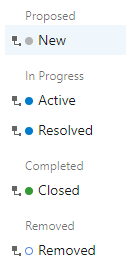
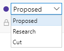
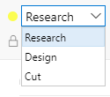
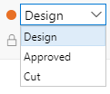
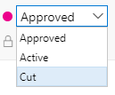
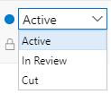
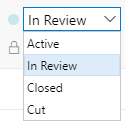
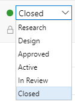
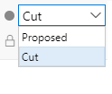

# Apply rules to workflow states (Inheritance process)   

[!INCLUDE [temp](../../../boards/includes/version-vsts-plus-azdevserver-2019.md)]

After you add or modify your workflow states for a work item type, you may want to define one or more rules that are applied depending on the workflow state change. Adding rules to workflow states supports the following scenarios: 

::: moniker range="azure-devops"

- Support an approval process 
- Prevent unauthorized users from setting an invalid state 
- Make a field required or read-only or other value based on State changes
- Restrict transition from one state to another
- Restrict or allow State transitions to specific users or groups  
- Maintain a controlled workflow process to support auditing requirements 
- Automate closure of parent work items
::: moniker-end

::: moniker range=">= azure-devops-2019 < azure-devops"

- Support an approval process 
- Make a field required or read-only or other value based on State changes
- Automate closure of parent work items

::: moniker-end

Review this article to understand how to define rules that apply when you change a workflow state.  

::: moniker range="azure-devops"

>[!div class="checklist"]      
> - Understand the types of workflow rules 
> - Workflow state and rule limits and best practices 
> - Set a field value or make a field read-only or required based on State selection 
> - Restrict state transitions 
> - Automate state transitions of parent work items  

<!--- Restrict or allow State transitions to specific users or groups --> 
::: moniker-end

::: moniker range=">= azure-devops-2019 < azure-devops"

>[!div class="checklist"]  
> - Understand the types of workflow rules 
> - Workflow state and rule limits and best practices 
> - Set a field value or make a field read-only or required based on State selection 
> - Automate state transitions of parent work items  

::: moniker-end

[!INCLUDE [temp](../includes/note-on-prem-link.md)]

## Workflow rules 

::: moniker range="azure-devops"

The following table indicates the three groups of workflow rules you can define. The first group applies standard actions when a work item is created, in a selected state, or is moved from one state to another. These standard actions set the value of a field or makes a field read-only or required. In this group, you can specify one or two conditions and several actions. 

The second and third groups support restricting state transitions. These two groups allow you to specify one and only one condition indicating the state a work item has moved to. You can then specify one or more actions to restrict the transition from that state to other states.  

---
:::row:::
   :::column span="2":::
      **Condition**
   :::column-end:::
   :::column span="2":::
      **Supported Actions**
   :::column-end:::
:::row-end:::  
---  
:::row:::  
   :::column span="4":::
      **Set field value or make read-only/required based on State**
   :::column-end:::
:::row-end:::
:::row:::  
   :::column span="2":::
      > [!div class="mx-imgBorder"]  
      > 
   :::column-end:::
   :::column span="2":::
      > [!div class="mx-imgBorder"]  
      > 
   :::column-end:::
:::row-end:::
---  
:::row:::  
   :::column span="4":::
      **Retrict a transition based on State**
   :::column-end:::
:::row-end:::
:::row:::  
   :::column span="2":::
      > [!div class="mx-imgBorder"]  
      > 
   :::column-end:::
   :::column span="2":::
      > [!div class="mx-imgBorder"]  
      > 
   :::column-end:::
:::row-end:::
---  
:::row:::  
   :::column span="4":::
      **Retrict a transition based on State and user or group membership**
   :::column-end:::
:::row-end:::
:::row:::  
   :::column span="2":::
      > [!div class="mx-imgBorder"]  
      > 
   :::column-end:::
   :::column span="2":::
      > [!div class="mx-imgBorder"]  
      > 
   :::column-end:::
:::row-end:::
--- 

::: moniker-end

::: moniker range=">= azure-devops-2019 < azure-devops"

Workflow conditions and actions you can set are illustrated in the following images. You can apply standard actions when a work item is created, in a selected state, or is moved from one state to another. These standard actions set the value of a field or make a field read-only or required. For this set of rules you can specify one or two conditions and several actions. 

---
:::row:::
   :::column span="2":::
      **Condition**
   :::column-end:::
   :::column span="2":::
      **Supported Actions**
   :::column-end:::
:::row-end:::  
---  
:::row:::  
   :::column span="4":::
      **Set field value or make read-only/required based on State**
   :::column-end:::
:::row-end:::
:::row:::  
   :::column span="2":::
      > [!div class="mx-imgBorder"]  
      > 
   :::column-end:::
   :::column span="2":::
      > [!div class="mx-imgBorder"]  
      > 
   :::column-end:::
:::row-end:::
---  

::: moniker-end

[!INCLUDE [temp](../includes/automatic-update-project.md)]

## Workflow state and rule limits 

The following table summarizes the workflow state and rule limits for the Inheritance process. 
  

|Object|Inheritance limit|  
|------|-----------------|  
| Work item types defined for a process | 64 |
| Workflow states defined for a work item type | 32 |
| Rules defined for a work item type | 1024 |
 

When defining workflow states and rules, we recommend that you consider the following guidance in order to minimize performance issues.  
- Minimize the number of rules you define for a WIT. While you can create multiple rules for a WIT, addition rules can negatively impact performance when a user adds and modifies work items. When users save work items, the system validates all rules associated with the fields for its work item type. Under certain conditions, the rule validation expression is too complex for SQL to evaluate.  
- Minimize the number of custom WITs you define.  

Workflow rules are applied when adding or modifying work items through any of the following interfaces: 
- Web portal: Work item form, bulk updates, updates in query view  ​
- Web portal: Kanban Board or Taskboard, move work item to column​
- Visual Studio 2017 and earlier versions, work item form 
- CSV file format: bulk import or update 
- Excel​: bulk import or update 
- REST API​: add or modify work items 

## Define a rule  

Prior to defining a rule based on workflow states, make sure you first define the following elements: 
- The workflow states that you want as described in [Customize a workflow](customize-process-workflow.md)
- If your rule requires specification of a custom field, add that field to the work item type as described in [Add and manage fields](customize-process-field.md)
- If your rule requires specification of a security group to grant or restrict changes based on user or group membership, define that security group as described in [Add a group and change its permissions at the organization or collection-level group](../../security/set-project-collection-level-permissions.md#collection-level). 

For the basics of defining rules, see [Add a custom rule](custom-rules.md). You must meet the prerequisites defined in that article.  

## Set field value or make field read-only or required  

With the first grouping of rules, you can specify one or two conditions and up to 10 actions per rule.  

### Example of ensuring team lead approval prior to active work 

In this example, development teams want to ensure that no User Story is worked on until approved by a team lead. The default workflow states are in use and only a single custom field, *Approved By*, and security group, *Team Leads Group*, are added. 

#### Default workflow states 

> [!div class="mx-imgBorder"]  
> 

#### Rule requirements 

To ensure approval prior to active work, the following rules must be defined:  

- Require the *Approved By* field be filled in when the State moves from *New* to *Active*  
- Restrict users who don't belong to the *Team Leads Group* to fill in the *Approved By* field  
- Clear the *Approved By* field when the State moves to *New* or *Removed*   

#### Rule definitions  

The rule requirements translate to the following four rule definitions. 

&nbsp;&nbsp;&nbsp;

---
:::row:::
   :::column span="":::
      **Rule name**
   :::column-end:::
   :::column span="":::
      **Condition**
   :::column-end:::
   :::column span="2":::
      **Actions**
   :::column-end:::
:::row-end:::  
---  
:::row:::
   :::column span="":::
      **Approved By cleared when New** 
   :::column-end:::
   :::column span="":::
      When `A work item state changes to New`
   :::column-end:::
   :::column span="2":::
      Then `Clear the value of Approved By`  
   :::column-end:::
:::row-end:::  
:::row:::
   :::column span="":::
      **Approved By cleared when Removed** 
   :::column-end:::
   :::column span="":::
      When `A work item state changes to Removed`
   :::column-end:::
   :::column span="2":::
      Then `Clear the value of Approved By`  
   :::column-end:::
:::row-end:::  
:::row:::
   :::column span="":::
      **Approved By Read-only** 
   :::column-end:::
   :::column span="":::
      When `Current user is not member of group Team Leads Group`
   :::column-end:::
   :::column span="2":::
      Then `Make read-only Approved By`  
   :::column-end:::
:::row-end:::  
:::row:::
   :::column span="":::
      **Approved By required** 
   :::column-end:::
   :::column span="":::
      When `A work item state changes from New to Active`
   :::column-end:::
   :::column span="2":::
      Then `Make required Approved By`  
   :::column-end:::
:::row-end:::  

---  

::: moniker range="azure-devops"

## Restrict state transitions 

When specifying the condition, `A work item state moved from ...`, you can specify only that condition. You can specify up to 10 actions.   

### Example of restricting state transitions and Approved state

In keeping with the terminology used by a business group, the following workflow states are defined for the User Story. The *New*, *Resolved*, and *Removed* inherited states are hidden. Instead, *Proposed*, *In Review*, and *Cut* States are used. In addition, three additional States are defined: *Investigate*, *Design*, and *Approved*. These States should follow the sequence as shown in the following image. 

> [!div class="mx-imgBorder"]  
> 

Without any restrictions, users can move from one State to any other State, both forward and backward within the sequence. 

#### Rule requirements 

To support a more controlled workflow, the business group decided to institute rules that would support the following forward and reverse state transitions on the User Story work item type.   

- *Proposed* can only move to *Research* and *Cut* 
- *Research* can only move to *Design* and *Cut* 
- *Design* can only move to *Research*, *Approved*, and *Cut* 
- *Approved* can only move to *Design*, *Active*, and *Cut*
- *Active* can only move to *In Review*  
- *In Review* can only move to *Active* (Additional work found), *Closed* or *Cut* 
- *Closed* can move to *Research*, *Design*, *Active*, *In Review* (Allows for cases where user closed the work item in error)
- *Cut* can only move to *Proposed*. 

> [!NOTE]   
> When restricting state transitions, consider those cases where a user moves a state in error. You want users to be able to recover gracefully. 

Additionally, the business group wants to apply rules for required fields:  

- Require the *Approved By* field be filled in when the State moves from Approved to Active 
- Only allow users who belong to the Authorized Approvers group to fill in the *Approved By* field
- Clear the *Approved By* field when the State moves to *Cut*  
- Require the *Acceptance Criteria* is filled in when the State moves to *Active* 
 
#### Rule definitions 

To implement the above restrictions, the process administrator adds a custom *Approved By* identity field, an *Authorized Approvers* security group, and the following eleven rules. 

&nbsp;&nbsp;&nbsp;

---
:::row:::
   :::column span="":::
      **Rule name**
   :::column-end:::
   :::column span="":::
      **Condition**
   :::column-end:::
   :::column span="2":::
      **Actions**
   :::column-end:::
:::row-end:::  
---  
:::row:::
   :::column span="":::
      **Proposed state** 
   :::column-end:::
   :::column span="":::
      When `A work item state moved from Proposed`
   :::column-end:::
   :::column span="2":::
      Then `Restrict the state transition to Design`  
      And `Restrict the state transition to Approved`  
      And `Restrict the state transition to Active`  
      And `Restrict the state transition to In Review`  
      And `Restrict the state transition to Closed`  
   :::column-end:::
:::row-end:::  
:::row:::
   :::column span="":::
      **Research state** 
   :::column-end:::
   :::column span="":::
      When `A work item state moved from Research`
   :::column-end:::
   :::column span="2":::
      Then `Restrict the state transition to Proposed`  
      And `Restrict the state transition to Approved`  
      And `Restrict the state transition to Active`  
      And `Restrict the state transition to In Review`  
      And `Restrict the state transition to Closed`  
   :::column-end:::
:::row-end:::  
:::row:::
   :::column span="":::
      **Design state** 
   :::column-end:::
   :::column span="":::
      When `A work item state moved from Design`
   :::column-end:::
   :::column span="2":::
      Then `Restrict the state transition to Proposed`  
      And `Restrict the state transition to Research`  
      And `Restrict the state transition to Active`  
      And `Restrict the state transition to In Review`  
      And `Restrict the state transition to Closed`  
   :::column-end:::
:::row-end:::  
:::row:::
   :::column span="":::
      **Approved state** 
   :::column-end:::
   :::column span="":::
      When `A work item state moved from Approved`  
   :::column-end:::
   :::column span="2":::
      Then `Restrict the state transition to Proposed`  
      And `Restrict the state transition to Research`  
      And `Restrict the state transition to Design`  
      And `Restrict the state transition to In Review`  
      And `Restrict the state transition to Closed`  
   :::column-end:::
:::row-end:::  
:::row:::
   :::column span="":::
      **Active state**
   :::column-end:::
   :::column span="":::
      When `A work item state moved from Active`  
   :::column-end:::
   :::column span="2":::
      Then `Restrict the state transition to Proposed`  
      And `Restrict the state transition to Research`  
      And `Restrict the state transition to Design`  
      And `Restrict the state transition to Approved`  
      And `Restrict the state transition to Closed`  
   :::column-end:::
:::row-end:::  
:::row:::
   :::column span="":::
      **In Review state** 
   :::column-end:::
   :::column span="":::
      When `A work item state moved from In Review`  
   :::column-end:::
   :::column span="2":::
      Then `Restrict the state transition to Proposed`  
      And `Restrict the state transition to Research`  
      And `Restrict the state transition to Design`  
      And `Restrict the state transition to Approved`  
   :::column-end:::
:::row-end:::  
:::row:::
   :::column span="":::
      **Closed state** 
   :::column-end:::
   :::column span="":::
      When `A work item state moved from Closed`  
   :::column-end:::
   :::column span="2":::
      Then `Restrict the state transition to Proposed`  
      And `Restrict the state transition to Cut`  
   :::column-end:::
:::row-end:::  
:::row:::
   :::column span="":::
      **Cut state** 
   :::column-end:::
   :::column span="":::
      When `A work item state moved from Cut`  
   :::column-end:::
   :::column span="2":::
      Then `Restrict the state transition to Research`  
      And `Restrict the state transition to Design`  
      And `Restrict the state transition to Approved`  
      And `Restrict the state transition to Active`  
      And `Restrict the state transition to In Review`  
      And `Restrict the state transition to Closed`  
   :::column-end:::
:::row-end::: 
:::row:::
   :::column span="":::
      **Approved state required fields**
   :::column-end:::
   :::column span="":::
      When `A work item changes from Approved to Active`  
   :::column-end:::
   :::column span="2":::
      Then `Make required Acceptance Criteria`  
      And `Make required Approved By`  
   :::column-end:::
:::row-end:::  
:::row:::
   :::column span="":::
      **Authorized Approvers**
   :::column-end:::
   :::column span="":::
      When `Current user is not a member of Authorized Approvers`  
   :::column-end:::
   :::column span="2":::
      Then `Make read-only Approved By`  
   :::column-end:::
:::row-end:::  
:::row:::
   :::column span="":::
      **Clear Approved By field**
   :::column-end:::
   :::column span="":::
      When `A work item state changes to Cut`  
   :::column-end:::
   :::column span="2":::
      Then `Clear the value of Approved By`  
   :::column-end:::
:::row-end:::  
---

### Verify state transition restrictions 

Once the rules are defined for the process and the project updated with the process, refresh your browser and check the operations through the work item form and from the Kanban browser.  

For the rules defined in the previous table, you should see the following State drop-down menus. Open the Kanban board and check the ability to move from one State to another. 

|**Proposed**|**Research**|**Design**|**Approved**|    
|:----------:|:----------:|:--------:|:--------:|    
| | | | |
|**Active**|**In Review**|**Closed**|**Cut**|   
| | || |

## Restrict state transition based on user or group membership 

When specifying one of the two conditions based on user or group membership, `Current user is member of group ...` or `Current user is not member of group ...`, you can specify only one condition. Also, if specifying the action `Restrict the transition to state...`, you can only specify one action. 

::: moniker-end

## Automate state transitions of parent work items 

To automate State transitions of parent work items based on the State assignments made to their child work items, you can add a web hook and use the code and configuration provided in the [Automate State Transitions](https://github.com/microsoft/azure-boards-automate-state-transitions) GitHub project. 

> [!NOTE]   
> The [Automate State Transitions](https://github.com/microsoft/azure-boards-automate-state-transitions) GitHub project is not a supported feature of Azure Boards and therefore not supported by the product team. For questions, suggestions, or issues you have when using these extensions, raise them in the GitHub project page.   

## Related articles

[!INCLUDE [temp](../includes/note-audit-log-support-process.md)]

- [Customize a workflow](customize-process-workflow.md) 
- [Add a custom rule](custom-rules.md) 
  

<!---

VS1640113: It is not allowed to have multiple rules with the same action type using the same conditions. The rules ['Transition restriction', 'Active state'] have the action type 'ProhibitedValues' using the same conditions. Change the conditions of the rule to fix this error.

--> 
