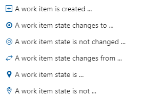

# Apply rules to workflow states  

After you add or modify your workflow states for a work item type, you may want to define one or more rules that are applied depending on the workflow state change. Adding rules to workflow states supports the following scenarios: 

- Restrict transition from one state to another
- Transitions can be restricted to specific users or groups 
- Restrict reopening closed work items 

Restrict transitions based on user or group 

Support an approval process 

Implementing restricted [State] transitions will enable us to
- accurately rely on the state
- control who does what
- prevent unauthorised users from setting an invalid state (accidentally or otherwise)
- prevent users from maliciously circumventing process (eg. Setting a work item straight to ‘Approved’)
- ensure all expected users in a User Story are part of the value chain
- demonstrate, for audit purposes, that we have a tested, reliable and controlled process in place.

Review this article to support defining workflow rules:

>[!div class="checklist"]      
> - Understand the two categories of workflow rules  
> - Define group 1 rules
> - Restrict state transitions 

## Two categories of workflow rules 

The following table indicates the two groups of workflow rules you can define. The first group applies standard actions when a work item is created, in a selected state, or is moved from one state to another. These standard actions sets the value of a field or makes a field read-only or required. In this group, you can specify one or two conditions and several actions. 

The second group supports restricting state transitions. This group allows you to specify one and only one condition indicating the state a work item has moved to. You can then specify one or more actions to restrict the transition from that state to other states. 

---
:::row:::
   :::column span="":::
      **Condition**
   :::column-end:::
   :::column span="2":::
      **Actions**
   :::column-end:::
:::row-end:::  
---  
:::row:::  
   :::column span="":::
      
   :::column-end:::
   :::column span="2":::
      - 
   :::column-end:::
:::row-end:::
:::row:::  
   :::column span="":::
      
   :::column-end:::
   :::column span="2":::
      - 
   :::column-end:::
:::row-end:::

--- 

## Automate state transitions of parent work items 

https://github.com/microsoft/azure-boards-automate-state-transitions 

