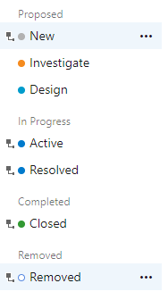
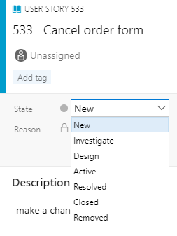
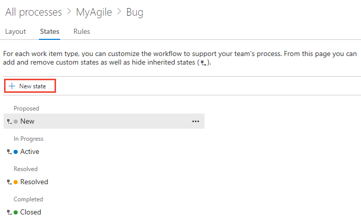
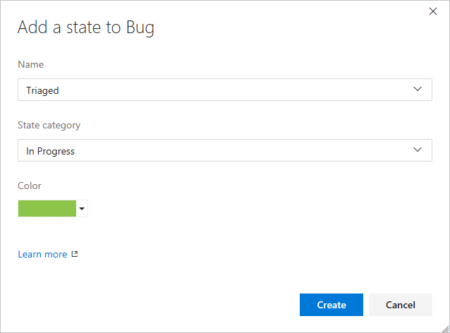
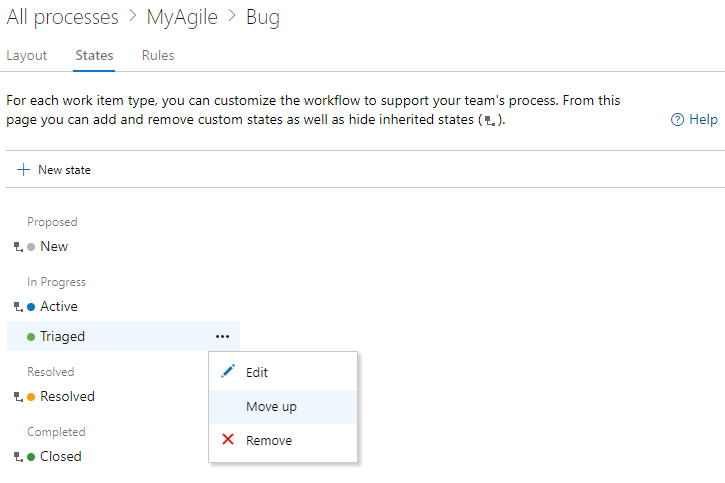
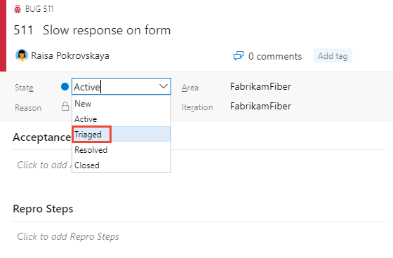
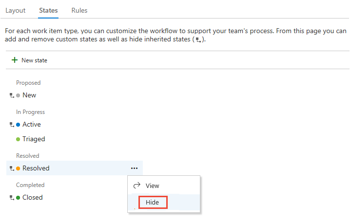
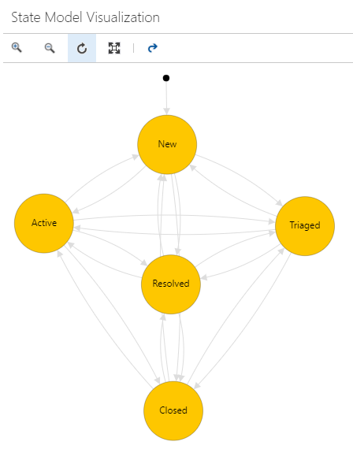

# Customize the workflow (Inheritance process)  

[!INCLUDE [version-gt-eq-2019](../../../includes/version-gt-eq-2019.md)]

Each work item type is associated with a workflow that supports tracking the status of work as it moves from creation to completion. To support your business and team processes, you can add custom states to most work item types (WITs). For example, you may want to insert a Triaged state for bugs, or a Design state for features or user stories.  

Here, the Bug WIT has been customized to support a Triaged state. The state and reason fields appear on the work item form in the header area.

  

This article addresses the supported workflow customization options and  how to customize a workflow. Specifically, you'll learn about:

>[!div class="checklist"]      
> - Supported workflow customization scenarios 
> - Impact to team boards when you customize a workflow  
> - End-to-end workflow customization steps   
> - How to add or remove a custom workflow state 
> - How to hide or unhide an inherited workflow state 
> - How to view a graphic depiction of the state model 

For documentation on the workflow for build and release DevOps tasks, see [Use Azure Pipelines](../../../pipelines/get-started/pipelines-get-started.md).

[!INCLUDE [temp](../includes/note-on-prem-link.md)]

## Supported customizations 

[!INCLUDE [temp](../includes/process-customize-workflow.md)]

### State drop-down menu sequence 

The **State** drop-down menu lists States within the sequence you order them within each state category. For newly added work items, the first State in the *Proposed* category is assigned as the default State.  

The following image illustrates the State sequence defined for User Story and its corresponding drop-down menu. 

> [!div class="mx-imgBorder"]  
> &nbsp;&nbsp;&nbsp;&nbsp;&nbsp;&nbsp;  

Within each category, you can move custom states up or down. 

## Impact to teams with workflow changes

Teams may need to update their board configuration when the following customizations are made: 

- You add a custom State  
- You change the category of a custom State  
- You add a custom or inherited work item type to a backlog level ([Customize your backlogs or boards](customize-process-backlogs-boards.md)) 

States that you add to the task WIT adds columns to the Taskboard. If you [track bugs along with tasks](../show-bugs-on-backlog.md), then states you add to the bug WIT also add columns to the Taskboard. You don't have to add the same states to each of these WITs, however, you may want to do so in order to  update the status in the same way and to minimize the number of columns that get added. 

[!INCLUDE [temp](../includes/process-prerequisites.md)] 

[!INCLUDE [temp](../includes/open-process-admin-context-ts.md)]

[!INCLUDE [temp](../includes/automatic-update-project.md)] 

## Add a workflow state   

States you add appear in the drop-down menu for the States field shown in work item forms and the query editor. A transition to and from the State you add is created to every other State. Also, default reasons are defined, such as *Moved to state Triaged*, *Moved out of state Triaged*.

1. From the **Work Item Types** page, choose the work item type you want to modify, choose **States**, and then choose **New State**.    

	> [!div class="mx-imgBorder"]  
	>  

	If the <strong>New state</strong> option is disabled, you don't have the necessary permissions to edit the process. See [Set permissions and access for work tracking, Customize an inherited process](../../../organizations/security/set-permissions-access-work-tracking.md#customize-an-inherited-process).

2. Enter the name of the State, choose its category and color, and then click **Save**. The color you specify appears throughout the product including on the work item form and when the State field appears on a backlog, boards, query results, and more.  

	> [!div class="mx-imgBorder"]
	>  

	::: moniker range="azure-devops"
	> [!NOTE]   
	> Any workflow state you add to the *In Progress* or *Resolved* state categories will cause the **Activated By**/**Activated Date** and **Resolved By**/**Resolved Date** fields to update with workflow state changes in and out of these categories. For more information, see [Query by assignment or workflow changes, Activated By/Date and Resolved By/Date fields](../../../boards/queries/query-by-workflow-changes.md#activated-resolved-fields).  
	::: moniker-end

1. (Optional) To change the sequence of the State within the drop-down menu, choose the :::image type="icon" source="../../../media/icons/actions-icon.png" border="false"::: context menu icon and choose **Move up** or **Move down**. 

	> [!div class="mx-imgBorder"]
	>  

1. When you've finished adding states for the WIT, verify your changes by refreshing your browser and open a work item of the type you customized. 

	Here we show the State drop-down menu with Triaged selected. 

	> [!div class="mx-imgBorder"]  
	>  

2. Remember, when you add a State to a WIT, which is associated with a backlog level, each team that uses the board needs to [update their column settings](../../../boards/boards/add-columns.md).

## Edit a state

You can edit the category or the color of a custom state. However, you can't change the name of the custom state. 

1. Choose <strong>Edit</strong> from the &hellip; context menu for the state you want to modify.  
  
	> [!div class="mx-imgBorder"]  
	> 

1. Modify the category or color, and then choose <strong>Save</strong>. 

2. If you change the category, teams that use the board need to update their [column settings](../../../boards/boards/add-columns.md).    
 

## Hide or remove a custom state

When you hide or remove a state:  
- The state no longer appears in the State drop-down menu for the WIT
- No changes occur to the work item history     
- Existing work items maintain their state value, but are in an invalid state. If you want to make a change to the work item, you must first update the state values. You may want to create a query and do a bulk update to move the affected work items into a valid state. If you add the state back to the work item type, the work items revert to a valid state.  

## Hide or unhide an inherited state 

You can hide an inherited state that your team doesn't use in its workflow process. However, you must have at least one state defined for each category. 

1. Open the &hellip; context menu for the state you want to hide and choose the <strong>Hide</strong> option. 

	Here we hide the Resolved state for the Bug WIT. 

	> [!div class="mx-imgBorder"]  
	>   

	> [!NOTE]    
	> If you hide the state of a WIT tracked on a board, each team  that uses the board needs to [update their column settings](../../../boards/boards/add-columns.md).

2. To unhide, open the &hellip; context menu and choose the **Unhide** option.  
 

## Remove a custom state 

1. Open the &hellip; context menu for the state you want to remove, and choose <strong>Remove</strong>. You can only remove a custom state.     

1. From the Remove State dialog, click <strong>Remove</strong>.   

	  

## View the State workflow model 

You can view the State workflow model by installing the [State Model Visualization](https://marketplace.visualstudio.com/items?itemName=taavi-koosaar.StateModelVisualization) Marketplace extension. This extension adds a new hub under Boards labeled **State Visualizer**. On that page you can choose a work item type and view the workflow state model. 

> [!NOTE]   
> The State Model Visualization extension is not a supported feature of Azure Boards and therefore not supported by the product team. For questions, suggestions, or issues you have when using the extension, visit the [extension page](https://marketplace.visualstudio.com/items?itemName=taavi-koosaar.StateModelVisualization). 

For example, the following image shows the Bug workflow that has been customized to have a **Triaged** state. This view illustrates the default transitions of the workflow model. All states can transition from one state to another. 

> [!div class="mx-imgBorder"]  
>   

You can zoom in and zoom out of the view. Also, you can move the state nodes around to gain a better view of the state model. 

## Related articles   

[!INCLUDE [temp](../includes/note-audit-log-support-process.md)]

- [How workflow states and state categories are used in Backlogs and Boards](../../../boards/work-items/workflow-and-state-categories.md) 
- [Add or modify a work item type](customize-process-work-item-type.md)
- [Add and manage fields](customize-process-field.md)  
- [Customize a form](customize-process-form.md)
- [Customize a project using an inherited process](customize-process.md) 
- [Add or edit board columns](../../../boards/boards/add-columns.md)  
- [Query by workflow or board changes](../../../boards/queries/query-by-workflow-changes.md)    

