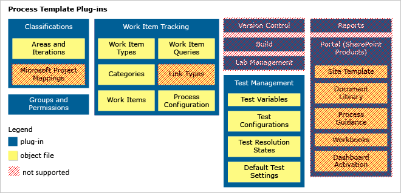
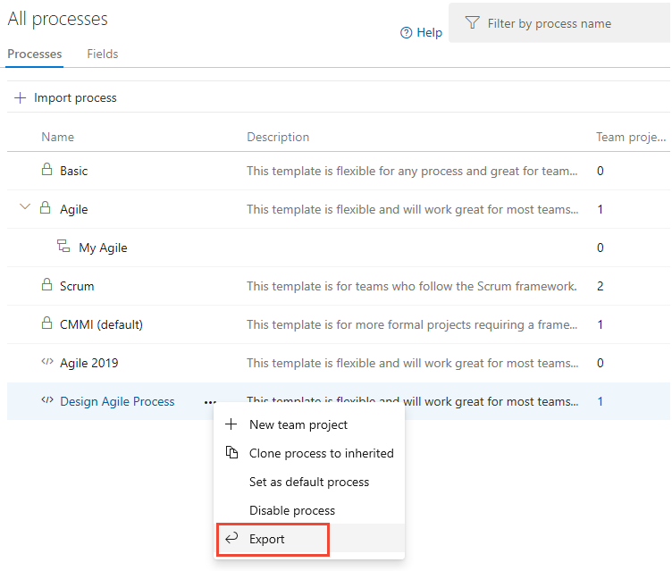

# Customize a Hosted XML process

**Azure DevOps Services (Hosted XML)**

Azure DevOps Services supports adding and updating processes through an administrative experience that is a web-based [import process](import-process.md). After you add a process, you can create one or more projects from it. You can update the process at any time by importing it again. The changes made to the process template are then applied to all projects that use the process.

> [!IMPORTANT]
> With the Hosted XML process model, you customize work tracking by updating select XML definition files of a process template. This feature is available only when data is migrated to Azure DevOps Services by use of [Team Foundation Server Database Import Service](../../../../migrate/migration-overview.md).
>
>To learn more about customization and process models, see [Customize work tracking](../../../../reference/customize-work.md).

A process is a zip file that contains a set of interdependent files. These files define the building blocks of the work-item tracking system and other subsystems in Azure DevOps Services. Some building blocks update existing projects, while others apply only to new projects. See the following table for the full list of building blocks.

:::row:::
   :::column span="1":::
   **Used when importing/updating a process**
   :::column-end:::
   :::column span="3":::
   **Used when creating a new project**
   :::column-end:::
   :::column span="3":::
   **Replaced by system defaults**
   :::column-end:::
   :::column span="3":::
   **Ignored** 
   :::column-end:::<br/>
:::row-end:::
:::row:::
   :::column span="1":::
   
   Work Item Tracking  

   WITs  

   Categories  

   Process Configuration  

   :::column-end:::
   :::column span="3":::
   
   Areas and Iterations  

   Test Management  

   Work Items  

   Work Item Queries  

   :::column-end:::
   :::column span="3":::
   
   Build  

   Lab Management  

   Version Control  

   :::column-end:::
   :::column span="3":::
   
   Microsoft Project Mappings  

   Reports  
 
   Portal (SharePoint Products)   

   :::column-end:::
:::row-end:::



There are differences between what Azure DevOps Services supports and what on-premises Team Foundation Server supports. For a summary of these differences, see [Process template customizations differences](differences.md).

## How to customize a process

When you customize a process, starting with a well-defined process is easier than building a new one.

If you update an existing process you've used with on-premises Team Foundation Server, make sure it conforms to the [constraints placed on templates for import](#rule-summary).

<a id="open-process-wit"></a>

[!INCLUDE [temp](../../includes/open-process-admin-context-ts-only.md)]

### Export and import a process

1. From the **Processes** tab, select the ellipsis (...) to open the shortcut menu for the Hosted XML process that you want to export. You can export only Hosted XML processes.

    > [!div class="mx-imgBorder"]
    > 

   Save the zip file and extract all files from it.

1. Rename the process within the ProcessTemplate.xml file located in the root directory.

   Name the process to distinguish it from existing ones.

   ```<name>MyCompany Agile Process  </name>```

   Change the version type, and change the major and minor numbers. Provide a distinct GUID for the type as in this example:

   ```<version type="F50EFC58-C2FC-4C66-9814-E395D90778A3" major="1" minor="1"/>```

1. Apply [supported customizations](#supported-customizations).

1. Create a zip file of all files and folders in the root directory.

1. [Import the zip file of your custom process](import-process.md).

<a id="supported-customizations"></a>

## Supported customizations

You can apply the following customizations to your process: 

* [Add, remove, or modify a WIT](../../../../reference/add-modify-wit.md).
* [Add or modify a field](../../../../reference/add-modify-wit.md).
* [Add up to five portfolio backlogs](../../../../reference/add-portfolio-backlogs.md).
* [Add categories](../../../../reference/xml/use-categories-to-group-work-item-types.md) that you'll use in your process configuration.
* [Modify process configuration](../../../../reference/xml/process-configuration-xml-element.md).
* [Add global lists](../../../../reference/xml/define-global-lists.md).

The following section lists limitations that the system imposes.

<a id="restrictions"></a>
<a id="rule-summary"></a>

## Restrictions

You can import up to 32 processes into Azure DevOps Services. Your custom processes must conform to all of the following summarized rules. Otherwise, validation error messages might appear upon import.

* [Process](#process)
  * [Process configuration](#process-configuration)
  * [Categories](#categories) 
  * [Work item types](#work-item-types)
    * [Fields](#work-item-fields)
      * [Limits](#limits)
      * [Required fields](#required-fields) 
      * [Rule restrictions](#rule-restrictions)
      * [Consistent names and attributes](#consistent-names-attributes) 
      * [Identity fields](#identity-fields)
      * [Workflow](resolve-errors.md#wit-workflow-definitions) 
      * [Global lists](#wit-global-list-definitions) 
    * [Workflow](#work-item-workflow) 
    * [Form layout](#work-item-form-layout)

<a id="process"></a>

### Process template

Your ProcessTemplate.xml file must conform to the syntax and rules described in [ProcessTemplate XML element reference](../../../../reference/process-templates/process-template-xml-elements-reference.md). Also, it must meet the following conditions:

* Limits the number of defined WITs to 64
* Contains only one Categories.xml definition file
* Contains only one ProcessConfiguration.xml definition file
* Uses unique friendly names across all fields and WIT definitions

Also, your process must pass the following validation checks:

* Process names are unique and contain at most 155 Unicode characters.
  * A template with the same name and version GUID as an existing process overwrites that process.
  * A template with the same name but a different version GUID generates an error.
  * Process names can't contain the following special characters:
     ```. , ; ' ` : / \ * | ? " & % $ ! + = ( ) [ ] { } < >```.\
    See [Naming restrictions](../../naming-restrictions.md) for additional constraints.
* Process folders contain no .exe files. Even if you can import a process that contains an .exe file, project creation fails.
* The process's total size is at most 2 GB. Otherwise, project creation fails.

<a id="process-configuration"></a>

### Process configuration

The ProcessConfiguration.xml definition file must conform to the syntax and rules described in [ProcessConfiguration XML element reference](../../../../reference/xml/process-configuration-xml-element.md). Also, it must meet the following conditions:

* Specifies all **TypeFields** elements
* Is limited to five portfolio backlogs
* Contains only one unparented portfolio backlog
* Specifies only one parent portfolio backlog for each subordinate portfolio backlog
* Contains required workflow state-to-metastate mappings and doesn't reference unsupported metastates

<a id="categories"></a>

### Categories

The Categories.xml definition file must conform to the syntax and rules described in [Categories XML element reference](../../../../reference/xml/categories-xml-element-reference.md). Also, it must meet the following conditions:

* Is limited to 32 categories
* Defines all categories referenced in the ProcessConfiguration.xml file

<a id="work-item-types"></a>

### Work item types

A **WITD** element and its child elements must conform to the syntax and rules described in [WITD XML element reference](../../../../reference/xml/all-witd-xml-elements-reference.md). Also, it must meet the following conditions:

* There are at most 512 fields within a single WIT and 512 fields across all WITs.
* The friendly name and required **refname** attribute assigned to a WIT are unique within the set of WIT definition files.
* The required **refname** attribute value doesn't contain disallowed characters or use the disallowed namespaces System.*Name* and Microsoft.*Name*.
* Reference names contain at least one period (.), and all other characters are letters with no spaces.
* The **WITD** element contains a **FORM** element that defines a **WebLayout** element conforming to the syntax specified in [WebLayout and Control elements](../../../../reference/xml/weblayout-xml-elements.md).

<a id="work-item-fields"></a>

### Work item fields

A **FIELDS** element and its child elements must conform to the syntax and rules described in [FIELD XML element reference](../../../../reference/xml/field-definition-element-reference.md). Also, it must meet the following conditions:

* The friendly name and required **refname** attribute assigned to a WIT are unique within the set of WIT definition files.
* The required **refname** attribute value doesn't contain disallowed characters or use the disallowed namespaces System.*Name* and Microsoft.*Name*.
* Reference names contain at least one period (.), and all other characters are letters with no spaces.

A **FIELD** element and its child elements can contain a **GLOBALLIST** element.

<a id="limits"></a>

#### Limit restrictions

* A **FIELDS** element is limited to 512 fields.
* A work item type is limited to 64 person-name fields. A person-name field is one with the attribute and value ```syncnamechanges=true```.
* An **ALLOWEDVALUES** or **SUGGESTEDVALUES** element is limited to 512 **LISTITEM** elements.
* A field is limited to 1,024 rules.

<a id="required-fields"></a>

#### Required fields

The following fields are specified in the ProcessConfiguration.xml file:

* For all WITs in a category that defines a process-configuration backlog, specify the fields used for the attributes and values ```type=Team``` and ```type=Order```.
* For all WITs in a category that defines a regular backlog or portfolio backlog, specify the field used for ```type=Effort```.
* For all WITs in the category that defines the **TaskBacklog** element, specify:
    * The field used for ```type=RemainingWork```.
    * The field used for ```type=Activity```.
    * The **ALLOWEDVALUES** rule for the field used for ```type=Activity```.

<a id="rule-restrictions"></a>

#### Rule restrictions

In addition to the standard [field-rule restrictions](../../../../organizations/settings/work/rule-reference.md), the following restrictions are enforced:

* Field-rule elements can't specify the **for** and **not** attributes.
* **FIELD** elements can't contain the child-rule elements **CANNOTLOSEVALUE**, **NOTSAMEAS**, **MATCH**, and **PROHIBITEDVALUES**.
* Except for the following fields, **FIELD** definitions for System.*Name* fields can't contain field rules.
    * System.Title can contain the rules **REQUIRED** and **DEFAULT**.
    * System.Description can contain the rules **REQUIRED** and **DEFAULT**.
    * System.AssignedTo can contain the rules **REQUIRED**, **DEFAULT**, **ALLOWEXISTINGVALUE**, and **VALIDUSER**.
    * System.ChangedBy can contain the rules **REQUIRED**, **DEFAULT**, **ALLOWEXISTINGVALUE**, and **VALIDUSER**.

<a id="consistent-names-attributes"></a>

#### Consistent names and attributes

Within a process or a project collection, **name**, **type**, and other attributes that a **FIELD** element defines must be the same across all WIT definitions.

<a id="identity-fields"></a>

#### Identity fields 

Identity fields correspond to fields used to contain account, user, or group names. The following core system fields are hard-coded as identity fields:

* Assigned To (System.AssignedTo)
* Authorized As (System.AuthorizedAs)
* Changed By (System.ChangedBy)
* Created By (System.CreatedBy)
* Activated By (Microsoft.VSTS.Common.ActivatedBy)
* Closed By (Microsoft.VSTS.Common.ClosedBy)
* Resolved By (Microsoft.VSTS.Common.ResolvedBy)

##### Add a custom identity field

A string field is recognized as an identity field when you specify the attribute **syncnamechanges** as True.   

##### Rule restrictions on identity fields

For the current release of process import, don't specify any of the following rules within a **FIELD** definition.

* **SUGGESTEDVALUES**
* Rules that contain nonidentity values.

##### Correct example

To limit the account names that are valid within an identity field, specify the ```VALIDUSER``` element with a group name attribute.

```xml
    <FIELD name="Project Manager" refname="Fabrikam.ProgramManager" type="String" reportable="dimension" syncnamechanges="true">
        <ALLOWEXISTINGVALUE />
        <VALIDUSER group="[PROJECT]\Program Manager Group" />
        <HELPTEXT>The program manager responsible for signing off on the user story.</HELPTEXT>
    </FIELD>
```

Before you import the process, make sure you've created the group in the projects that the process updates.

##### Incorrect example

The following example isn't valid because it specifies:

* An ```ALLOWEDVALUES``` element.
* A ```DEFAULT``` element that specifies the nonidentity string ```value="Not Assigned"```.

```xml
    <FIELD name="Project Manager" refname="Fabrikam.ProgramManager" type="String" reportable="dimension" syncnamechanges="true">
        <ALLOWEXISTINGVALUE />
        <ALLOWEDVALUES>
          <LISTITEM value="[PROJECT]\Program Manager Group" />
          <LISTITEM value="Not Assigned" />
        </ALLOWEDVALUES>
        <DEFAULT from="value" value="Not Assigned" />
        <VALIDUSER />
        <HELPTEXT>The program manager responsible for signing off on the user story.</HELPTEXT>
    </FIELD>
```
<a id="work-item-workflow"></a>

### Workflow

A **WORKFLOW** element and its child elements must conform to the syntax and rules described in [WORKFLOW XML element reference](../../../../reference/xml/all-workflow-xml-elements-reference.md). Also, it must meet the following conditions:

* Limits each WIT to 16 workflow states
* Defines all workflow states that are mapped to metastates in the ProcessConfiguration definition file
* Defines a transition between all workflow states mapped to the "Proposed" state category and workflow states mapped to the "InProgress" state category
* Defines a transition between all workflow states mapped to the "InProgress" state category and workflow states mapped to the "Complete" state category.

For a description of state category and mappings, see [Workflow states and state categories](../../../../boards/work-items/workflow-and-state-categories.md).

<a id="wit-global-list-definitions"></a>

### Global lists

For the Hosted XML process model, the following limits are placed on global-list import:

* There are at most 64 global lists.
* There are at most 512 items per list.
* Approximately 10,000 items can be defined in total among all global lists that are specified across all WITs.

<a id="work-item-form-layout"></a>

### Form layout 

A **FORM** element and its child elements must conform to the syntax and rules described in [FORM XML element reference](../../../../reference/xml/all-form-xml-elements-reference.md).

A **Control** element can't specify a custom control. Custom controls aren't supported.

## Related articles

- [Import and export a Hosted XML process](import-process.md)
- [Rules and rule evaluation](../rule-reference.md)
- [Change a project from Hosted XML to an inherited process](../change-process-from-hosted-to-inherited.md)
- [Clone a Hosted XML process to an Inheritance process](../upgrade-hosted-to-inherited.md)
- [Supported operations when moving from Hosted XML to an inherited process](../upgrade-support-hosted-to-inherited.md)
