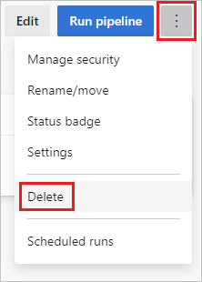

## Next steps

You've just learned how to create your first Azure Pipeline. Now you're ready to configure a pipeline for the language of your choice:

* [.NET Core](../ecosystems/dotnet-core.md)
* [Containers](../ecosystems/containers/build-image.md)
* [Go](../ecosystems/go.md)
* [Java](../ecosystems/java.md)
* [Node.js](../ecosystems/javascript.md)
* [Python](../ecosystems/python.md)

Or, you can proceed to [customize the pipeline](../customize-pipeline.md) you just created.

To run your pipeline in a container, see [Container jobs](../process/container-phases.md).

For details about building GitHub repositories, see [Build GitHub repositories](../repos/github.md).

To learn what else you can do in YAML pipelines, see [YAML schema reference](../yaml-schema.md).

### Clean up

If you created any test pipelines, they are easy to delete when you are done with them. 

#### [Browser](#tab/browser)

To delete a pipeline, navigate to the summary page for that pipeline, and choose **Delete** from the **...** menu at the top-right of the page. Type the name of the pipeline to confirm, and choose **Delete**.



#### [Azure DevOps CLI](#tab/azure-devops-cli/)

To delete a pipeline using Azure CLI, you can use the [az devops pipeline delete](/cli/azure/ext/azure-devops/pipelines?view=azure-cli-latest#ext-azure-devops-az-pipelines-delete) command. This command requires the `id` of the pipeline to delete, which you can get using the [az devops pipeline list](/cli/azure/ext/azure-devops/pipelines?view=azure-cli-latest#ext-azure-devops-az-pipelines-list) command. 

> [!NOTE]
> If this is your first time using `az devops pipelines` commands, see [Get started with Azure DevOps CLI](../cli/index.md).

### az pipelines list

```Azure CLI
az pipelines list [--detect {false, true}]
                  [--folder-path]
                  [--name]
                  [--org]
                  [--project]
                  [--query-order {ModifiedAsc, ModifiedDesc, NameAsc, NameDesc, None}]
                  [--repository]
                  [--repository-type {bitbucket, git, github, githubenterprise, svn, tfsgit, tfsversioncontrol}]
                  [--top]
```

#### Parameters

- **detect**: Automatically detect organization. Accepted values: **false**, **true**
- **folder-path**: If specified, filters to definitions under this folder.
- **name**: Limit results to pipelines with this name or starting with this name. Examples: "FabCI" or "Fab*".
- **org** or **organization**: Azure DevOps organization URL. You can configure the default organization using `az devops configure -d organization=ORG_URL`. Required if not configured as default or picked up via git config. Example: `https://dev.azure.com/MyOrganizationName/`.
- **project** or **p**: Name or ID of the project. You can configure the default project using `az devops configure -d project=NAME_OR_ID`. Required if not configured as default or picked up via git config.
- **query-order**: Order of the results. Accepted values: **ModifiedAsc**, **ModifiedDesc**, **NameAsc**, **NameDesc**, **None**
- **repository**: Limit results to pipelines associated with this repository.
- **repository-type**: Limit results to pipelines associated with this repository type. It is mandatory to pass **repository** argument along with this argument. Accepted values: **bitbucket**, **git**, **github**, **githubenterprise**, **svn**, **tfsgit**, **tfsversioncontrol**
- **top**:Maximum number of pipelines to list.

* * *