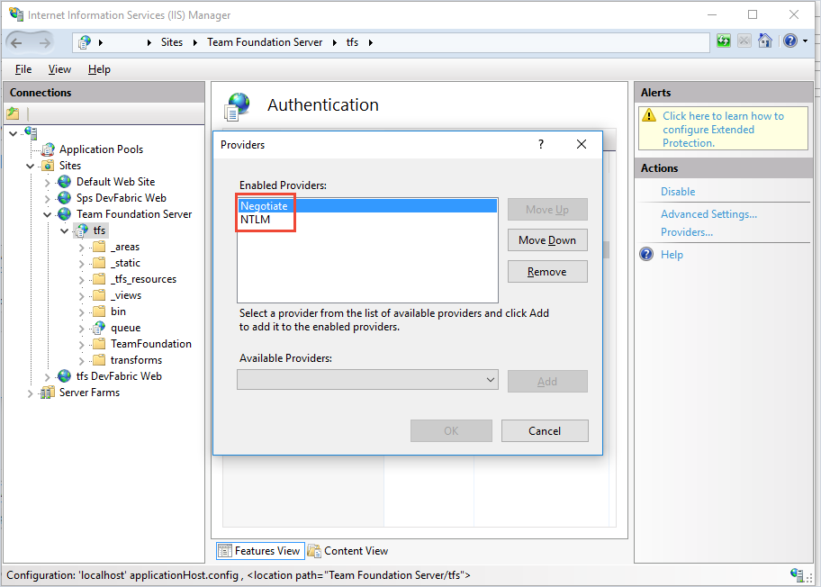
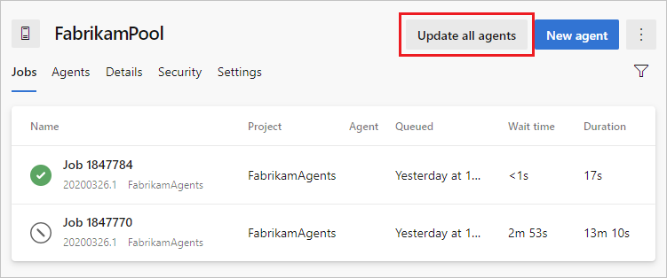
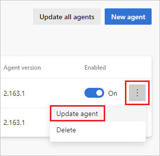
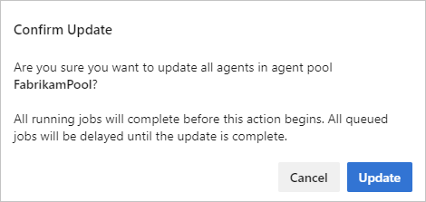

# Azure Pipelines agents

[!INCLUDE [version-lt-eq-azure-devops](../../includes/version-lt-eq-azure-devops.md)]

::: moniker range="tfs-2018"

[!INCLUDE [temp](../includes/concept-rename-note.md)]

::: moniker-end

To build your code or deploy your software using Azure Pipelines, you need at least one agent. As you add more code and people, you'll eventually need more.

When your pipeline runs, the system begins one or more jobs.
An agent is computing infrastructure with installed agent software that runs one job at a time.

::: moniker range=">= azure-devops-2019"
Jobs can be run [directly on the host machine of the agent](../process/phases.md) or [in a container](../process/container-phases.md).
::: moniker-end

::: moniker range="azure-devops"

## Microsoft-hosted agents

[!INCLUDE [include](includes/hosted-agent-intro.md)]

[Learn more about Microsoft-hosted agents](hosted.md).

::: moniker-end

<h2 id="install">Self-hosted agents</h2>

An agent that you set up and manage on your own to run jobs is a **self-hosted agent**.
You can use self-hosted agents in Azure Pipelines or Azure DevOps Server, formerly named Team Foundation Server (TFS).
Self-hosted agents give you more control to install dependent software needed for your builds and deployments.
Also, machine-level caches and configuration persist from run to run, which can boost speed.

> [!NOTE]
> Although multiple agents can be installed per machine, we strongly suggest to only install one agent per machine. Installing two or more agents may adversely affect performance and the result of your pipelines.

::: moniker range="azure-devops"

> [!TIP]
> Before you install a self-hosted agent you might want to see if a Microsoft-hosted agent pool will work for you. In many cases this is the simplest way to get going. [Give it a try](hosted.md).

:::moniker-end

You can install the agent on Linux, macOS, or Windows machines. You can also install an agent on a Docker container. For more information about installing a self-hosted agent, see:

* [macOS agent](v2-osx.md)
* [Linux agent](v2-linux.md) (x64, ARM, ARM64, RHEL6)
* [Windows agent](v2-windows.md) (x64, x86)
* [Docker agent](docker.md)

> [!NOTE]
> On macOS, you need to clear the special attribute on the download archive to prevent Gatekeeper protection from displaying for each assembly in the tar file when `./config.sh` is run. The following command clears the extended attribute on the file:
>
> ```bash
> xattr -c vsts-agent-osx-x64-V.v.v.tar.gz  ## replace V.v.v with the version in the filename downloaded.
> 
> # then unpack the gzip tar file normally:
> 
> tar xvfz vsts-agent-osx-x64-V.v.v.tar.gz
> ```

After you've installed the agent on a machine, you can install any other software on that machine as required by your jobs.

::: moniker range="azure-devops"

> [!NOTE]
> Agents are widely backward compatible. Any version of the agent should be compatible with any Azure DevOps version as long as Azure DevOps isn't demanding a higher version of the agent.
>
> We only support the most recent version of the agent since that is the only version guaranteed to have all up-to-date patches and bug fixes.

## Azure virtual machine scale set agents

Azure virtual machine scale set agents are a form of self-hosted agents that can be auto-scaled to meet your demands. This elasticity reduces your need to run dedicated agents all the time. Unlike Microsoft-hosted agents, you have flexibility over the size and the image of machines on which agents run.

You specify a virtual machine scale set, a number of agents to keep on standby, a maximum number of virtual machines in the scale set, and Azure Pipelines manages the scaling of your agents for you.

For more information, see [Azure virtual machine scale set agents](scale-set-agents.md).

::: moniker-end

## Parallel jobs

::: moniker range="azure-devops"

**Parallel jobs** represents the number of jobs you can run at the same time in your organization. If your organization has a single parallel job, you can run a single job at a time in your organization, with any additional concurrent jobs being queued until the first job completes. To run two jobs at the same time, you need two parallel jobs. In Azure Pipelines, you can run parallel jobs on Microsoft-hosted infrastructure or on your own (self-hosted) infrastructure. 

Microsoft provides a free tier of service by default in every organization that includes at least one parallel job. Depending on the number of concurrent pipelines you need to run, you might need more parallel jobs to use multiple Microsoft-hosted or self-hosted agents at the same time. For more information on parallel jobs and different free tiers of service, see [Parallel jobs in Azure Pipelines](../licensing/concurrent-jobs.md).

::: moniker-end

::: moniker range="< azure-devops"

You might need more parallel jobs to use multiple agents at the same time:

* [Parallel jobs in TFS](../licensing/concurrent-pipelines-tfs.md)

::: moniker-end

::: moniker range=">= azure-devops-2019 < azure-devops"

> [!IMPORTANT]
> Starting with Azure DevOps Server 2019, you do not have to pay for self-hosted concurrent jobs in releases. You are only limited by the number of agents that you have.

::: moniker-end

<h2 id="capabilities">Capabilities</h2>

Every self-hosted agent has a set of capabilities that indicate what it can do. Capabilities are name-value pairs that are either automatically discovered by the agent software, in which case they are called **system capabilities**, or those that you define, in which case they are called **user capabilities**.

The agent software automatically determines various system capabilities such as the name of the machine, type of operating system, and versions of certain software installed on the machine. Also, environment variables defined in the machine automatically appear in the list of system capabilities.

> [!NOTE]
> Storing environment variables as capabilities means that when an agent runs, the stored capability values are used to set the environment variables. Also, any changes to environment variables that are made while the agent is running won't be picked up and used by any task. If you have sensitive environment variables that change and you don't want them to be stored as capabilities, you can have them ignored by setting the `VSO_AGENT_IGNORE` environment variable, with a comma-delimited list of variables to ignore. For example, `PATH` is a critical variable that you might want to ignore if you're installing software.   

When you author a pipeline, you specify certain **demands** of the agent. The system sends the job only to agents that have capabilities matching the [demands](../process/demands.md) specified in the pipeline. As a result, agent capabilities allow you to direct jobs to specific agents.

> [!NOTE]
>
> Demands and capabilities are designed for use with self-hosted agents so that jobs can be matched with an agent that 
> meets the requirements of the job. When using Microsoft-hosted agents, you select an image for the agent that 
> matches the requirements of the job, so although it is possible to add capabilities to a Microsoft-hosted agent, you don't need 
> to use capabilities with Microsoft-hosted agents.

### Configure agent capabilities

#### [Browser](#tab/browser)

You can view the details of an agent, including its version and system capabilities, and manage its user capabilities, by navigating to **Agent pools** and selecting the **Capabilities** tab for the desired agent.

1. In your web browser, navigate to Agent pools:

   [!INCLUDE [agent-pools-tab](includes/agent-pools-tab.md)]

1. Navigate to the capabilities tab:
 
   [!INCLUDE [agent-capabilities](includes/agent-capabilities-tab.md)]

1. To register a new capability with the agent, choose **Add a new capability**.

#### [Azure DevOps CLI](#tab/azure-devops-cli/)

::: moniker range="> azure-devops-2019"

You can view the details of an agent, including its version, and system and user capabilities, by using the following [az pipelines agent](/cli/azure/pipelines/agent) Azure CLI methods.

[List agents](#list-agents) | [Show agent details](#show-agent-details)

> [!NOTE]
> If this is your first time using [az pipelines](/cli/azure/pipelines) commands, see [Get started with Azure DevOps CLI](../../cli/index.md).

### List agents

You can list your agents using the [az pipelines agent list](/cli/azure/pipelines/agent#az-pipelines-agent-list) command.

```azurecli
az pipelines agent list --pool-id
                        [--agent-name]
                        [--demands]
                        [--detect {false, true}]
                        [--include-assigned-request {false, true}]
                        [--include-capabilities {false, true}]
                        [--include-last-completed-request {false, true}]
                        [--org]
                        [--subscription]
```

#### Parameters

- **pool-id**: (Required) The agent pool containing the agents.
- **agent-name**: Filter on agent name.
- **demands**: Filter by demands the agents can satisfy. Comma separated list.
- **detect**: Automatically detect organization. Accepted values: **false**, **true**
- **include-assigned-request**: Whether to include details about the agents' current work. Accepted values: **false**, **true**
- **include-capabilities**: Whether to include the agents' capabilities in the response. Accepted values: **false**, **true**
- **include-last-completed-request**: Whether to include details about the agents' most recent completed work. Accepted values: **false**, **true**
- **org** or **organization**: Azure DevOps organization URL. You can configure the default organization using az devops configure -d organization=ORG_URL. Required if not configured as default or picked up via git config. Example: `https://dev.azure.com/MyOrganizationName/`.
- **subscription**: Name or ID of subscription. You can configure the default subscription using az account set -s NAME_OR_ID.

#### Example

The following example lists all agents in pool `ID: 4` in table format. To retrieve the ID of pools, use [az pipelines pool list](pools-queues.md?tabs=yaml#list-agent-pools). This example uses the following default configuration: `az devops configure --defaults organization=https://dev.azure.com/fabrikam-tailspin project=FabrikamFiber`

```azurecli
az pipelines agent list --pool-id 4 --output table

ID    Name          Is Enabled    Status    Version
----  ------------  ------------  --------  ---------
3     Hosted Agent  True          offline   2.155.1
```

### Show agent details

You can retrieve agent details using the [az pipelines agent show](/cli/azure/pipelines/agent#az-pipelines-agent-show) command.

```azurecli
az pipelines agent show --agent-id
                        --pool-id
                        [--detect {false, true}]
                        [--include-assigned-request {false, true}]
                        [--include-capabilities {false, true}]
                        [--include-last-completed-request {false, true}]
                        [--org]
                        [--subscription]
```

#### Parameters

- **agent-id** or **id**: (Required) The agent ID to get information about.
- **pool-id**: (Required) The agent pool containing the agents.
- **detect**: Automatically detect organization. Accepted values: **false**, **true**
- **include-assigned-request**: Whether to include details about the agents' current work. Accepted values: **false**, **true**
- **include-capabilities**: Whether to include the agents' capabilities in the response. Accepted values: **false**, **true**
- **include-last-completed-request**: Whether to include details about the agents' most recent completed work. Accepted values: **false**, **true**
- **org** or **organization**: Azure DevOps organization URL. You can configure the default organization using az devops configure -d organization=ORG_URL. Required if not configured as default or picked up via git config. Example: `https://dev.azure.com/MyOrganizationName/`.
- **subscription**: Name or ID of subscription. You can configure the default subscription using az account set -s NAME_OR_ID.

#### Example

The following example displays agent details for the agent with the ID of `3`. This example uses the following default configuration: `az devops configure --defaults organization=https://dev.azure.com/fabrikam-tailspin project=FabrikamFiber`

```azurecli
az pipelines agent show --agent-id 3 --pool-id 4 --include-capabilities true
This command group is in preview. It may be changed/removed in a future release.
{
  "accessPoint": null,
  "assignedAgentCloudRequest": null,
 
  <Some properties omitted for space>

  "status": "offline",
  "statusChangedOn": null,
  "systemCapabilities": {
    "ANDROID_HOME": "",
    "ANDROID_NDK_HOME": "",
    "Agent.Name": "Hosted Agent",
    "Agent.Version": "2.160.1",

    <Some capabilities omitted for space>

    "sh": "",
    "subversion": "",
    "svn": "",
    "xcode": ""
  },
  "userCapabilities": null,
  "version": "2.160.1"
}
}
```

You can also use `--output table` which returns an abbreviated version of the same information.

```azurecli
az pipelines pool show --id 4 --output table

ID    Name                             Is Hosted    Pool Type
----  -------------------------------  -----------  -----------
4     Hosted Windows 2019 with VS2019  True         automation
```

::: moniker-end

[!INCLUDE [temp](../../includes/note-cli-not-supported.md)] 

* * *

> [!TIP]
>
> After you install new software on a self-hosted agent, you must restart the agent for the new capability to show up. For more information, see [Restart Windows agent](v2-windows.md#how-do-i-restart-the-agent), [Restart Linux agent](v2-linux.md#how-do-i-restart-the-agent), and [Restart Mac agent](v2-osx.md#how-do-i-restart-the-agent).

<h2 id="communication">Communication</h2>

::: moniker range="azure-devops"

### Communication with Azure Pipelines

::: moniker-end

### Communication with TFS

The agent communicates with Azure Pipelines or Azure DevOps Server to determine which job it needs to run, and to report the logs and job status. This communication is always initiated by the agent. All the messages from the agent to Azure Pipelines or Azure DevOps Server happen over HTTP or HTTPS, depending on how you configure the agent. This pull model allows the agent to be configured in different topologies as shown below.

::: moniker range="< azure-devops"

::: moniker-end

::: moniker range="azure-devops"

::: moniker-end

Here is a common communication pattern between the agent and Azure Pipelines or Azure DevOps Server.

1. The user registers an agent with Azure Pipelines or Azure DevOps Server by adding it to an [agent pool](pools-queues.md). You need to be an [agent pool administrator](pools-queues.md#security) to register an agent in that agent pool. The identity of agent pool administrator is needed only at the time of registration and is not persisted on the agent, nor is it used in any further communication between the agent and Azure Pipelines or Azure DevOps Server. Once the registration is complete, the agent downloads a _listener OAuth token_ and uses it to listen to the job queue.

2. The agent listens to see if a new job request has been posted for it in the job queue in Azure Pipelines/Azure DevOps Server using an HTTP long poll. When a job is available, the agent downloads the job as well as a _job-specific OAuth token_. This token is generated by Azure Pipelines/Azure DevOps Server for the scoped identity [specified in the pipeline](../build/options.md). That token is short lived and is used by the agent to access resources (for example, source code) or modify resources (for example, upload test results) on Azure Pipelines or Azure DevOps Server within that job.

3. After the job is completed, the agent discards the job-specific OAuth token and goes back to checking if there is a new job request using the listener OAuth token.

The payload of the messages exchanged between the agent and Azure Pipelines/Azure DevOps Server are secured using asymmetric encryption. Each agent has a public-private key pair, and the public key is exchanged with the server during registration. The server uses the public key to encrypt the payload of the job before sending it to the agent. The agent decrypts the job content using its private key. This is how secrets stored in pipelines or variable groups are secured as they are exchanged with the agent.

::: moniker range="azure-devops"

### Communication to deploy to target servers

When you use the agent to deploy artifacts to a set of servers, it must have "line of sight"
connectivity to those servers. The Microsoft-hosted agent pools, by default, have
connectivity to Azure websites and servers running in Azure.

> [!NOTE]
> If your Azure resources are running in an Azure Virtual Network, you can get the 
> [Agent IP ranges](hosted.md#agent-ip-ranges) where Microsoft-hosted agents are deployed 
> so you can configure the firewall rules for your Azure VNet to allow access by the agent.

If your on-premises environments do not have connectivity to a Microsoft-hosted agent pool
(which is typically the case due to intermediate firewalls), you'll need to
manually configure a self-hosted agent on on-premises computer(s). The agents must have connectivity to the target
on-premises environments, and access to the Internet to connect to Azure Pipelines or Team Foundation Server,
as shown in the following schematic.


::: moniker-end

<a name="configure-tfs-authentication"></a>
## Authentication

To register an agent, you need to be a member of the [administrator role](pools-queues.md#security) in the agent pool. The identity of agent pool administrator is needed only at the time of registration and is not persisted on the agent, and is not used in any subsequent communication between the agent and Azure Pipelines or Azure DevOps Server. In addition, you must be a local administrator on the server in order to configure the agent. 

::: moniker range="azure-devops"

Your agent can authenticate to Azure Pipelines using the following method:

::: moniker-end

::: moniker range="< azure-devops"

Your agent can authenticate to Azure DevOps Server or TFS using one of the following methods:

::: moniker-end


### Personal Access Token (PAT): 
[Generate](../../organizations/accounts/use-personal-access-tokens-to-authenticate.md) and use a PAT to connect an agent with Azure Pipelines or TFS 2017 and newer. PAT is the only scheme that works with Azure Pipelines. The PAT must have **Agent Pools (read, manage)** scope (for a [deployment group](../release/deployment-groups/index.md) agent, the PAT must have **Deployment group (read, manage)** scope), and while a single PAT can be used for registering multiple agents, the PAT is used only at the time of registering the agent, and not for subsequent [communication](#communication). For more information, see the Authenticate with a personal access token (PAT) section in the [Windows](v2-windows.md#authenticate-with-a-personal-access-token-pat), [Linux](v2-linux.md#authenticate-with-a-personal-access-token-pat), or [macOS](v2-osx.md#authenticate-with-a-personal-access-token-pat) self-hosted agents articles.

To use a PAT with Azure DevOps Server, your server must be configured with HTTPS. See [Web site settings and security](/azure/devops/server/admin/websitesettings).

::: moniker range="< azure-devops"

### Integrated

Connect a Windows agent to TFS using the credentials of the signed-in user through a Windows authentication scheme such as NTLM or Kerberos.

To use this method of authentication, you must first configure your TFS server.

1. Sign into the machine where you are running TFS.

1. Start Internet Information Services (IIS) Manager. Select your TFS site and make sure Windows Authentication is enabled with a valid provider such as NTLM or Kerberos.


### Negotiate

Connect to TFS as a user other than the signed-in user through a Windows authentication scheme such as NTLM or Kerberos.

To use this method of authentication, you must first configure your TFS server.

1. Log on to the machine where you are running TFS.

1. Start Internet Information Services (IIS) Manager. Select your TFS site and make sure Windows Authentication is enabled with the Negotiate provider and with another method such as NTLM or Kerberos.





### Alternate
Connect to TFS using Basic authentication. To use this method, you must first [configure HTTPS on TFS](/azure/devops/server/admin/websitesettings).

To use this method of authentication, you must configure your TFS server as follows:

1. Sign in to the machine where you are running TFS.

1. Configure basic authentication. See [Using `tfx` against Team Foundation Server 2015 using Basic Authentication](https://github.com/Microsoft/tfs-cli/blob/master/docs/configureBasicAuth.md).

::: moniker-end

<h2 id="interactive-or-service">Interactive vs. service</h2>

You can run your self-hosted agent as either a service or an interactive process.
After you've configured the agent, we recommend you first try it
in interactive mode to make sure it works. Then, for production use,
we recommend you run the agent in one of the following modes so
that it reliably remains in a running state. These modes also
ensure that the agent starts automatically if the machine is restarted.

1. **As a service**. You can leverage the service manager of the
   operating system to manage the lifecycle of the agent. In addition, the
   experience for auto-upgrading the agent is better when it is run
   as a service.

1. **As an interactive process with auto-logon enabled**. In some cases,
   you might need to run the agent interactively for production use -
   such as to run UI tests. When the agent is configured to run in this
   mode, the screen saver is also disabled. Some domain policies may
   prevent you from enabling auto-logon or disabling the screen saver. In
   such cases, you may need to seek an exemption from the domain policy,
   or run the agent on a workgroup computer where the domain policies
   do not apply.

   > [!NOTE]
   > There are security risks when you enable automatic logon
   > or disable the screen saver because you enable other users to walk
   > up to the computer and use the account that automatically logs on. If you configure the agent to run
   > in this way, you must ensure the computer is physically protected;
   > for example, located in a secure facility. If you use
   > Remote Desktop to access the computer on which an agent is running
   > with auto-logon, simply closing the Remote Desktop causes the
   > computer to be locked and any UI tests that run on this agent may
   > fail. To avoid this, use the [tscon](/windows-server/administration/windows-commands/tscon)
   > command to disconnect from Remote Desktop. For example:
   >
   > `%windir%\System32\tscon.exe 1 /dest:console`

<h2 id="account">Agent account</h2>

Whether you run an agent as a service or interactively, you can choose
which computer account you use to run the agent. (Note that this is different
from the credentials that you use when you register the agent with
Azure Pipelines or Azure DevOps Server.) The choice of agent account depends solely on the needs
of the tasks running in your build and deployment jobs.

For example, to run tasks that use Windows authentication to access an external
service, you must run the agent using an account that has access
to that service. However, if you are running UI tests such as Selenium or Coded UI tests that
require a browser, the browser is launched in the context of the agent account.

On Windows, you should consider using a service account such as Network Service or Local Service.
These accounts have restricted permissions and their passwords don't expire, meaning
the agent requires less management over time.

## Agent version and upgrades

::: moniker range="azure-devops"

We update the agent software every few weeks in Azure Pipelines.
We indicate the agent version in the format `{major}.{minor}`.
For instance, if the agent version is `2.1`, then the major version is 2 and the minor version is 1.

Microsoft-hosted agents are always kept up-to-date.
If the newer version of the agent is only different in _minor_ version, self-hosted agents can usually be updated automatically (configure this setting in **Agent pools**, select your agent, **Settings** - the default is enabled) by Azure Pipelines.
An upgrade is requested when a platform feature or one of the tasks used in the pipeline requires a newer version of the agent.

If you run a self-hosted agent interactively, or if there is a newer _major_ version of the agent available, then you may have to manually upgrade the agents.
You can do this easily from the **Agent pools** tab under your organization.
Your pipelines won't run until they can target a compatible agent.

### To update self-hosted agents

1. Navigate to **Project settings**, **Agent pools**.

    

2. Select your agent pool and choose **Update all agents**.

    

    You can also update agents individually by choosing **Update agent** from the **...** menu.

    

3. Select **Update** to confirm the update.

    

4. An update request is queued for each agent in the pool, that runs when any currently running jobs complete. Upgrading typically only takes a few moments - long enough to download the latest version of the agent software (approximately 200 MB), unzip it, and restart the agent with the new version. You can monitor the status of your agents on the **Agents** tab.

::: moniker-end

::: moniker range="< azure-devops"

We update the agent software with every update in Azure DevOps Server and TFS.
We indicate the agent version in the format `{major}.{minor}`.
For instance, if the agent version is `2.1`, then the major version is 2 and the minor version is 1.

When your Azure DevOps Server or TFS server has a newer version of the agent, and that newer agent is only different in _minor_ version, it can usually be automatically upgraded.
An upgrade is requested when a platform feature or one of the tasks used in the pipeline requires a newer version of the agent.
Starting with Azure DevOps Server 2019, you don't have to wait for a new server release.
You can [upload a new version of the agent to your application tier](#can-i-update-my-v2-agents-that-are-part-of-an-azure-devops-server-pool), and that version will be offered as an upgrade.

If you run the agent interactively, or if there is a newer _major_ version of the agent available, then you may have to manually upgrade the agents.
You can do this easily from the **Agent pools** tab under your project collection.
Your pipelines won't run until they can target a compatible agent.

::: moniker-end

You can view the version of an agent by navigating to **Agent pools** and selecting the **Capabilities** tab for the desired agent, as described in [Configure agent capabilities](#configure-agent-capabilities).

To trigger agent update programmatically you can use Agent update API as described in section [How can I trigger agent updates programmatically for specific agent pool?](#how-can-i-trigger-agent-updates-programmatically-for-specific-agent-pool).

> [!NOTE]
> For servers with no internet access, manually copy the agent zip file to `C:\ProgramData\Microsoft\Azure DevOps\Agents\` to use as a local file.

## FAQ

[!INCLUDE [include](includes/v2/qa-agent-version.md)]

<h3 id="private-agent-performance-advantages">Do self-hosted agents have any performance advantages over Microsoft-hosted agents?</h3>

In many cases, yes. Specifically:

* If you use a self-hosted agent, you can run incremental builds. For example, if you define a pipeline that does not clean the repo and does not perform a clean build, your builds will typically run faster. When you use a Microsoft-hosted agent, you don't get these benefits because the agent is destroyed after the build or release pipeline is completed.

* A Microsoft-hosted agent can take longer to start your build. While it often takes just a few seconds for your job to be assigned to a Microsoft-hosted agent, it can sometimes take several minutes for an agent to be allocated depending on the load on our system.

### Can I install multiple self-hosted agents on the same machine?

Yes. This approach can work well for agents that run jobs that don't consume many shared resources. For example, you could try it for agents that run releases that mostly orchestrate deployments and don't do much work on the agent itself.

You might find that in other cases you don't gain much efficiency by running multiple agents on the same machine. For example, it might not be worthwhile for agents that run builds that consume much disk and I/O resources.

You might also run into problems if parallel build jobs are using the same singleton tool deployment, such as npm packages. For example, one build might update a dependency while another build is in the middle of using it, which could cause unreliable results and errors.

::: moniker range=">= azure-devops-2019"

### What’s the behavior of agents when the pipeline jobs are cancelled?

For Microsoft-hosted agents, the agent is torn down and returned to the Azure Pipelines pool.

For self-hosted agents:

When a pipeline is cancelled, the agent sends a sequence of commands to the process executing the current step. The first command is sent with a timeout of 7.5 seconds. If the process has not terminated, a second command is sent with a timeout of 2.5 seconds. If the process has not terminated, the agent issues a command to kill the process. If the process does not honor the two initial termination requests, it will be killed. From the initial request to termination takes approximately 10 seconds.

The commands issued to the process are different based on the agent operating system.

* macOS and Linux - The commands sent are SIGINT, followed by SIGTERM, followed by SIGKILL.
* Windows - The commands sent to the process are Ctrl+C, followed by Ctrl+Break, followed by Process.Kill.

### How can I trigger agent updates programmatically for specific agent pool?

You can trigger agent updates for the pool by using next API:

```
POST https://dev.azure.com/{organization}/_apis/distributedtask/pools/{poolId}/messages?agentId={agentId}&api-version=6.0
```

#### URI Parameters

| Name           | In    | Required | Type          | Description                                                                            |
| -------------- | ----- | -------- | ------------- | -------------------------------------------------------------------------------------- |
| `agentId`      | query | False    | string        | The agent to update. If not specified - update will be triggered for all agents.       |
| `organization` | path  | True     | string        | The name of the Azure DevOps organization.                                             |
| `poolId`       | path  | True     | integer int32 | The agent pool to use                                                                  |
| `api-version`  | query | False    | string        | Version of the API to use. This should be set to '6.0' to use this version of the api. |


To trigger agent update - request body should be empty.

> [!NOTE]
> Azure Pipelines Agent is open source on [GitHub](https://github.com/microsoft/azure-pipelines-agent).
> 
## Learn more

For more information about agents, see the following modules from the [Build applications with Azure DevOps](/training/paths/build-applications-with-azure-devops/) learning path.
* [Choose a Microsoft-hosted or self-hosted build agent](/training/modules/host-build-agent/2-choose-a-build-agent)
* [Host your own build agent in Azure Pipelines](/training/modules/host-build-agent/)

::: moniker-end
