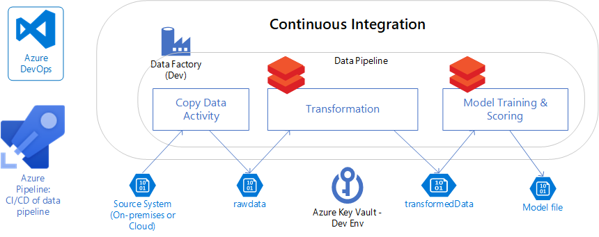

# Azure CI/CD data pipelines

[!INCLUDE [version-eq-azure-devops](../../../../includes/version-eq-azure-devops.md)]

This article explains Azure continuous integration and continuous delivery (CI/CD) data pipelines and their importance for data science.

You can use data pipelines to:

- Ingest data from various data sources.
- Process and transform the data.
- Save the processed data to a staging location for others to consume.

Enterprise data pipelines can evolve into more complicated scenarios with multiple source systems and various supported downstream applications.

Data pipelines provide:

- Consistency, by transforming data into a consistent format for users to consume.
- Error reduction, by using automated data pipelines to eliminate human errors when manipulating data.
- Efficiency, by reducing time spent on data processing transformation.

Data pipelines let data professionals focus on their core job functions, getting insights from the data and helping businesses make better decisions.

## Continuous integration and continuous delivery (CI/CD)

Continuous integration and continuous delivery (CI/CD) is a software development approach where all developers work together in a shared code repository of code. As developers make changes, automated processes detect code issues. The outcome of using CI/CD is a faster development lifecycle with lower error rates.

## CI/CD data pipelines in data science

Building machine learning models is similar to traditional software development in that data scientists write code to train and score machine learning models. But unlike traditional software based on code, data science machine learning models are based on both code, such as algorithms and hyperparameters, and the data used to train the models. Most data scientists say they spend 80% of their time doing data preparation, cleaning, and feature engineering.

To ensure the quality of the machine learning models, techniques such as A/B testing are also used to compare and maintain model performance. A/B testing usually uses one control model and one or more treatment models. Multiple machine learning models might be used concurrently, adding another layer of complexity for the CI/CD of machine learning models. A CI/CD data pipeline is crucial for the data science team to deliver quality machine learning models to the business in a timely manner.

## Next steps
> [!div class="nextstepaction"]
> [Build a data pipeline with Azure](build-data-pipeline.md)
