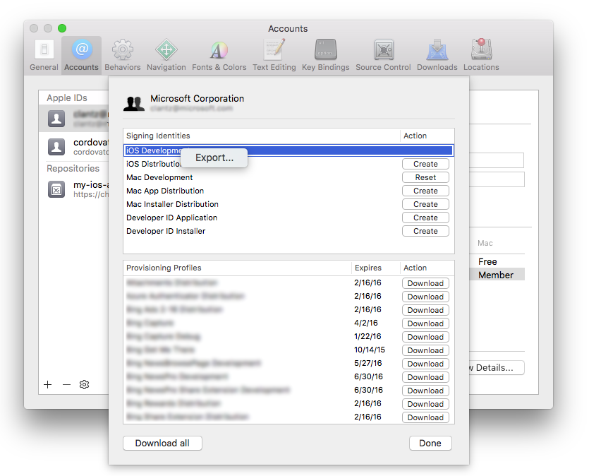
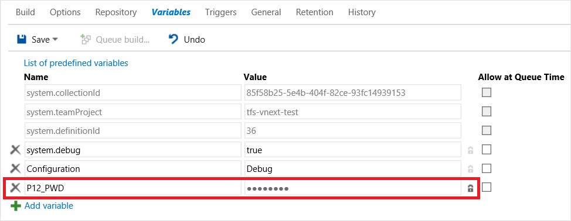
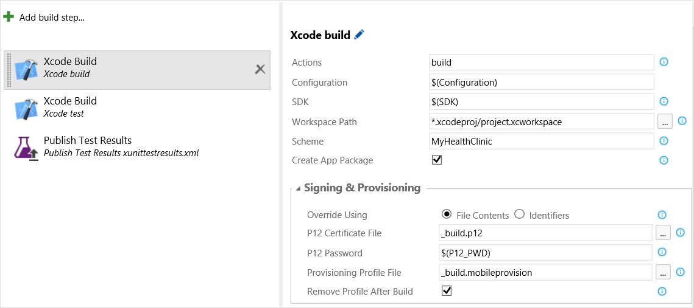
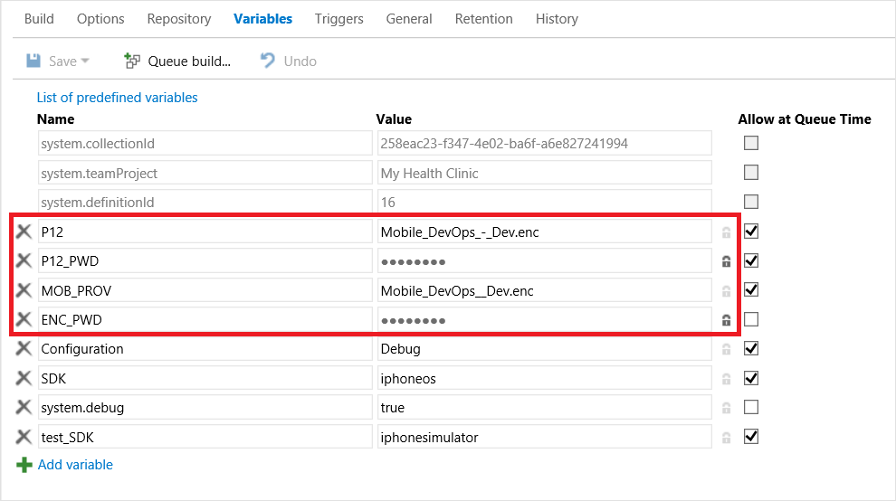
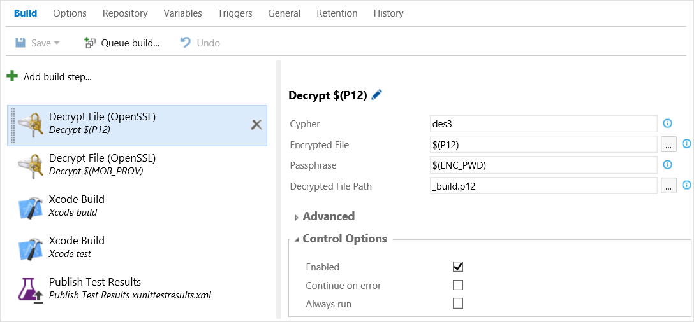
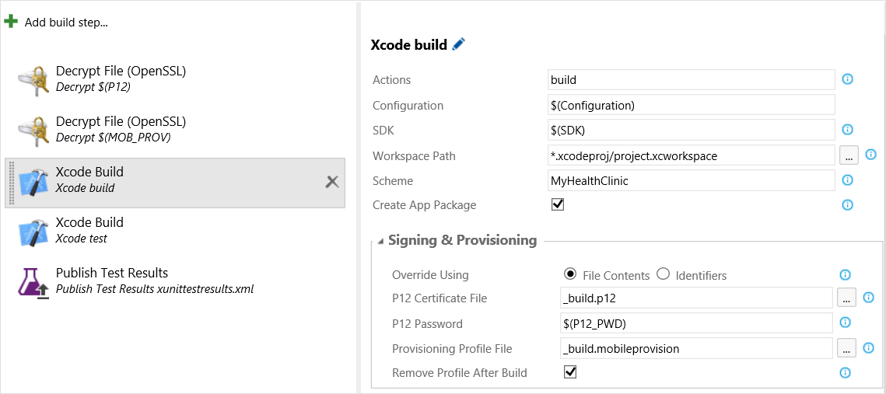
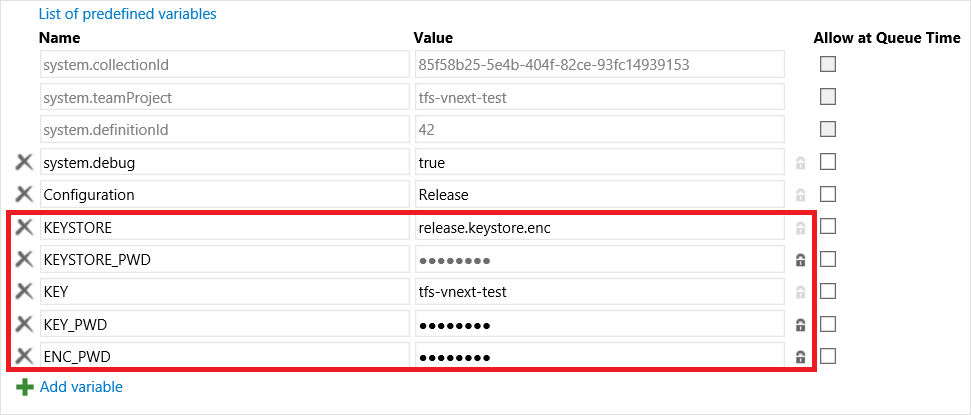

# Sign your mobile app

**[VSTS](app-signing.md) | [TFS 2018](app-signing.md) | TFS 2017.2**

::: moniker range="<= tfs-2018"
[!INCLUDE [temp](../../_shared/pipeline-aka-definition.md)]
::: moniker-end

When developing an app for Android or iOS, you will eventually need to manage signing certificates, and in the case of iOS, [provisioning profiles](https://developer.apple.com/library/ios/documentation/IDEs/Conceptual/AppStoreDistributionTutorial/Introduction/Introduction.html#//apple_ref/doc/uid/TP40013839). This article will highlight some features to help you manage and secure them for your app.

> **Tip**: When building on a Mac, you should either set up the [agent](../../agents/agents.md) as a launchd service (./svc.sh install) or run it as an interactive process (./run.sh).

This article covers:

- [Using a certificate and mobile provisioning profile in your Xcode build](#iosfile)
- [Using preinstalled signing identities and mobile provisioning profiles in your Xcode or Xamarin.iOS build](#iosinstall)
- [Building and signing Android and Xamarin.Android projects](#android)

<a name="iosfile"></a>
## Using a certificate and mobile provisioning file in your Xcode build

1. After creating your development and/or distribution signing certificate, export it to a .p12 file using either Keychain Access or Xcode.
  1. To export using Xcode, first go to Xcode &gt; Preferences... &gt; Accounts and select your Apple Developer account.
  2. Click "View Details..." and then right click on the signing identity you wish to export, and click "Export...".
  3. Enter a filename and password. Take note of the password as you will need it later.

      

      Alternatively you can follow a similar process using the "Keychain Access" app on macOS or even generate a signing certificate on Windows. Use the procedure [described in this article](http://docs.phonegap.com/phonegap-build/signing/ios/) if you prefer this method instead.

2. Next, get a copy of the provisioning profile you want to use.

  1. You can download your mobile provisioning profile from the Apple Developer portal, unless your app uses automatic signing. You can also use Xcode to access one installed on your machine.
  2. First go to the same screen you used to get the .p12 file above.
  3. Next, right click the provisioning profile you want and select "Show in Finder".
  4. Copy the file highlighted to another location and give it a descriptive filename.
      

3. At this point you can opt to add these two files directly to source control or add an extra layer of security by encrypting them first. **See the next section for details on this step.**

4. Next, go to VSTS / TFS and open your Xcode or Xamarin.iOS build pipeline and go to the **Variables** tab. Here, enter the password for the .p12 file:
  - **P12_PWD**: Password to the .p12 file in its unencrypted form. *Be sure to click the "lock" icon.* This will secure your password and obscure it in all logs.
	

5. Finally, update your Xcode or Xamarin.iOS step with references to these two files. The build step will automatically determine the correct "signing identity" based on the contents of the .p12, create a temporary keychain with the .p12 in it and use that exclusively for this build, install the mobile provisioning profile, determine the correct UUID based on the contents of the .mobileprovision profile, and then remove everything after the build.

    Enter the following values under the **Signing & Provisioning** category for the Xcode or Xamarin.iOS build task:

    - **Override Using**: File Contents
    - **P12 Certificate File**: Path to the .p12 file in the repository
    - **P12 Password**: $(P12_PWD)
    - **Provisioning Profile File**: Path to the .mobileprovision file in the repository
    - **Remove Profile After Build**: Checked if you want the provisioning profile to be removed from the system after the build. Only check this if you will have one agent that only runs this build, as it is installed in a global location and could be accessed by other builds.

      

You are now all set! Any build agent that is running will now be able to build your app without any certificate management on the build machine itself.  Simply repeat the process of adding different certificates and provisioning profiles to your source repository to enable separate dev, beta (ad hoc), and distribution builds.

In the next section, we'll cover how to add another layer of security by encrypting these files.

### Optional: Using an encrypted .p12 and .mobileprovision file
You can add an extra layer of security by to your project by encrypting your .p12 and .mobileprovision files so that only those that have been given the appropriate credentials have permission to use them. The **Decrypt File** task makes this easy to set up in your build task.

1. First, encrypt your files.
  0. Open the Terminal app on your Mac.
  0. Change to the folder containing your .p12 file and .mobileprovision file.
  0. Type the following:
    ```
    openssl des3 -in iphonedeveloper.p12 -out iphonedeveloper.p12.enc
    ```
    substituting des3 for any encryption cypher you'd like to use and the appropriate input and output file names.
  0. Enter a passphrase to encrypt the certificate when prompted and note this as you will use it later.

2. Next, add these two files to source control (the encrypted .p12 and .mobileprovision files). This is secure particularly if you are using a private repository since a malicious user would need access to the repository, the encryption passphrase, and the P12 passphrase to be able to use your information without permission. Remove any unencrypted copies if present.

3. Now, set up your build pipeline to decrypt the files at build time.

  1. Open your Xcode or Xamarin.iOS build pipeline and go to the **Variables** tab and enter the following:
     - **P12**: Path to your encrypted .p12 file in source control.
     - **P12_PWD**: Password to the unencrypted .p12 file. *Be sure to click the "lock" icon.* This will secure your password and obscure it in all logs.
     - **MOB_PROV**: Path to your encrypted mobile provisioning profile.
     - **ENC_PWD**: The passphrase you used to encrypt the .p12 and .mobileprovision files. If you used two different passphrase you'll need two variables.  Again, *be sure to click the "lock" icon.*
      

  2. Under the **Build** tab in your build pipeline, add two **Decrypt File** (OpenSSL) steps and move these to the top of your build pipeline.

  3. Now, enter the proper information using the variables you created above to decrypt the two files to a static filename.
     - **Cypher**: The cypher you specified while encrypting. (Ex: des3)
     - **Encrypted File**: $(P12) for one step and $(MOB_PROV) for the other
     - **Passphrase**: $(ENC_PWD)
     - **Decrypted File Path**: _build.p12 for one step and _build.mobileprovision for the other
      

4. Finally, update the Xcode Build step to reference the decrypted files.

    - **Override Using**: File Contents
    - **P12 Certificate File**: _build.p12
    - **P12 Password**: $(P12_PWD)
    - **Provisioning Profile File**: _build.mobileprovision
    - **Remove Profile After Build**: Checked if you want the provisioning profile to be removed from the system after the build. Only check this if you will have one agent that only runs this build, as it is installed in a global location and could be accessed by other builds.
      

 You are now all set! Any build agent that is running will now be able to securely build your app without any certificate management on the build machine itself. Simply repeat the process of adding different certificates and provisioning profiles to your source repository to enable separate dev, beta (ad hoc), and distribution builds.

<a name="iosinstall"></a>
## Using preinstalled signing identities and mobile provisioning profiles in your Xcode build
If you prefer to simply use a signing identity and provisioning profile you have installed on your Mac, you may do this as well and there are some features that can help deal with common pitfalls.

While you can just allow the build to attempt to auto-match or use identities and profiles in your Xcode project, you can follow these steps to override the project and get very specific about the exact identity you want to use.

Follow these steps:

0. Determine the full name of the identity and the UUID of the provisioning profile you wish to use.
  1. Find the full name of your signing identity by opening the Terminal app and typing the following:
    ```
    security find-identity -v -p codesigning
    ```
    You will see a list of signing identities in the form "iPhone Developer/Distribution: Developer Name (ID)". If the identity is invalid, you will see something like (CSSMERR_TP_CERT_REVOKED) after the identity.

  2. Take note of the identity you want to use including the ID as this string is truly unique.

  3. Next, find the UUID for the provisioning profile you want to use by following these steps.

     1. Open Xcode and go to Xcode &gt; Preferences... &gt; Accounts and select your Apple Developer account.

     2. Click "View Details..." and right click the provisioning profile you want and select "Show in Finder".
      

  4. The name of the file that is highlighted is the UUID of your provisioning profile.

0. Now update your Xcode or Xamarin.iOS build step with references to these two identifiers. Enter the following values under the **Signing & Provisioning** category for the Xcode or Xamarin.iOS build task:

    - **Override Using**: Identifiers
    - **Signing Identity**: Full signing identity you found using the security command above
    - **Provisioning Profile UUID**: UUID of the provisioning profile from the filename above


0. Next, if you are running the build agent as a launch agent, you will need to set up the build to unlock the default keychain.

  1. Go to the **Variables** tab and enter the following:

     - **KEYCHAIN_PWD**: Password to your default keychain. This is normally the password for the user that is starting the agent. *Be sure to click the "lock" icon.*


  2. Update the Xcode step to unlock the keychain entering the following values under the **Signing & Provisioning** category for the Xcode or Xamarin.iOS build task:

     - **Unlock Default Keychain**: Checked
     - **Default Keychain Password**: $(KEYCHAIN_PWD)

<a name="android"></a>
## Building and signing Android and Xamarin.Android projects
Managing Android signing is relatively simple. The [Android documentation](http://developer.android.com/tools/publishing/app-signing.html) on the topic largely covers what you need to know to generate and use a keystore file containing your signing certificate.

However, here are a few additional tips that can help you get your app up and running quickly while still keeping your signing certificate secure.

Follow these steps:

0. **Windows only**: You may need to install openssl.exe. If you have the [Git command line tools](http://www.git-scm.com/downloads) installed, openssl may already be in your path (Ex: C:\Program Files (x86)\Git\bin). If not, install the command line tools or download a binary distribution of OpenSSL for Windows from [one of the community mirrors](http://go.microsoft.com/fwlink/?LinkID=627128) and add it to your path. This will also need to be done on any Windows machines running the build agent.

0. Now, encrypt the keystore for your app.
    0. Open a terminal or command prompt and go to where your keystore is located.
    0. Type the following:
    ```
    openssl des3 -in release.keystore -out release.keystore.enc
    ``` substituting des3 for any encryption cypher you'd like to use and the appropriate input and output file names.
    0. Enter a passphrase to encrypt the certificate when prompted and note this as you will use it later.

0. Next, add the encrypted keystore to source control. This is secure particularly if you are using a private repository since a malicious user would need access to the repository, the encryption passphrase, the keystore password, and the alias password to be able to use your information without permission.

0. Finally we'll update your build pipeline to decrypt and use the keystore.

    0. Open your Android or Xamarin.iOS build pipeline and go to the **Variables** tab. Here we will enter the following:
     - **KEYSTORE**: Path to your encrypted keystore file in source control.
     - **KEYSTORE_PWD**: Password to the unencrypted keystore file. *Be sure to click the "lock" icon.* This will secure your password and obscure it in all logs.
     - **KEY**: The key alias for the signing certificate you generated.
     - **KEY_PWD**: The password for the key associated with the specified alias. *Again, be sure to click the "lock" icon.*
     - **ENC_PWD**: The passphrase you used to encrypt the keystore file. *Be sure to click the "lock" icon.*

      

    0. Under the **Build** tab in your build pipeline, add a **Decrypt File** (OpenSSL) step and move this to the top of your build pipeline.

0. Now, enter the proper information using the variables you created above to decrypt the file to a static filename.

    - **Cypher**: The cypher you specified while encrypting. (Ex: des3)
    - **Encrypted File**: $(KEYSTORE)
    - **Passphrase**: $(ENC_PWD)
    - **Decrypted File Path**: _build.keystore

      

0. Finally, updating the actual build step to use these values you entered is simple regardless of your build system.

    1. If you are using the **Gradle, Ant, or Maven** build tasks, you can add the following under **Options**:

      ```
      -Pkey.store=_build.keystore -Pkey.store.password=$(KEYSTORE_PWD) -Pkey.alias=$(KEY) -Pkey.alias.password=$(KEY_PWD)
      ```     
      

    2. If you are using the **Android Signing** task, you can add the following under **Jarsign Options**:

      - **Keystore File**: _build.keystore
      - **Keystore Password**: $(KEYSTORE_PWD)
      - **Key Alias**: $(KEY)
      - **KEY Password**: $(KEY_PWD)

You are now all set! Any build agent will now be able to securely build your app without any certificate management on the build machine itself.

## Q & A

<!-- BEGINSECTION class="md-qanda" -->

[!INCLUDE [temp](../../_shared/qa-agents.md)]

::: moniker range="< vsts"
[!INCLUDE [temp](../../_shared/qa-versions.md)]
::: moniker-end

<!-- ENDSECTION -->
