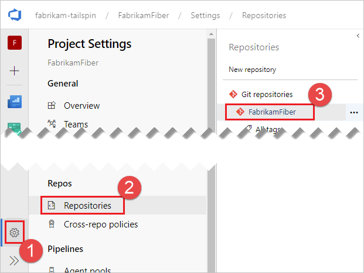
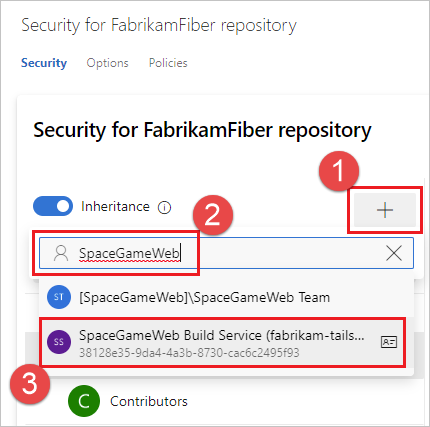
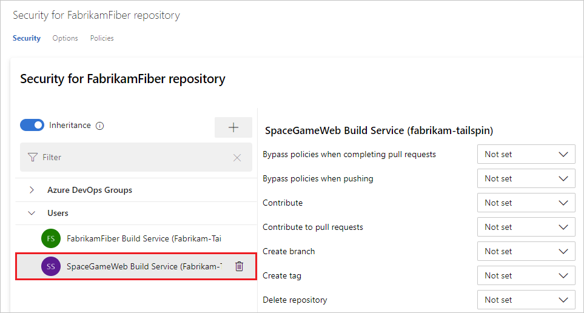
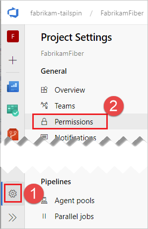
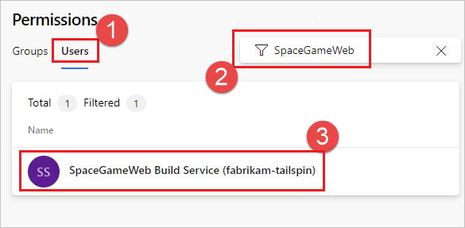
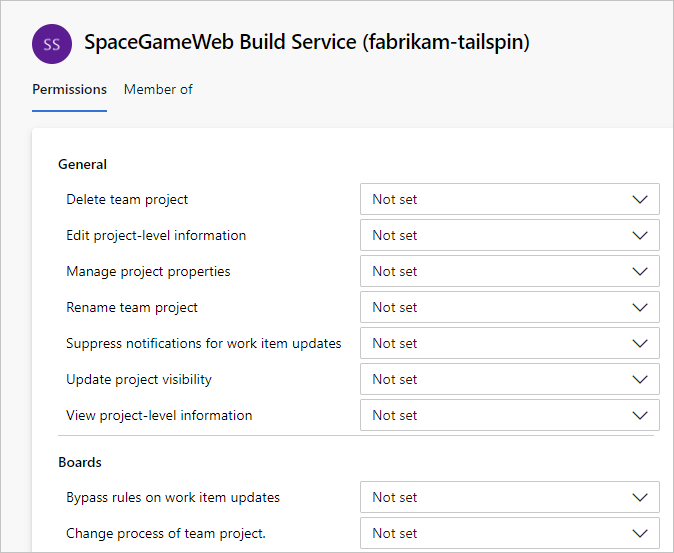

# Build options

::: moniker range="<= tfs-2018"

[!INCLUDE [temp](../includes/concept-rename-note.md)]

::: moniker-end

## Create a work item on failure

If the build pipeline fails, you can automatically create a work item to track getting the problem fixed. You can specify the work item type.

You can also select if you want to assign the work item to the requestor. For example, if this is a CI build, and a team member checks in some code that breaks the build, then the work item is assigned to that person.

**Additional Fields:** You can set the value of work item fields. For example:

| Field | Value |
|---|---|
| ```System.Title``` | ```Build $(Build.BuildNumber) failed``` |
| ```System.Reason``` |  ```Build failure``` |

**Q:** What other work item fields can I set? **A:**  [Work item field index](../../boards/work-items/guidance/work-item-field.md)


## Allow scripts to access the OAuth token

Select this check box if you want to enable your script to use the build pipeline OAuth token.

For an example, see [Use a script to customize your build pipeline](../scripts/powershell.md).


## Default agent pool

::: moniker range="<= tfs-2017"

> **TFS 2017.1 and older**
>
> This section is available under <b>General<b> tab.

::: moniker-end

Select the [pool](../agents/pools-queues.md) that's attached to the pool that contains the agents you want to run this pipeline.

> [!TIP]
> If your code is in Azure Pipelines and you run your builds on Windows, in many cases the simplest option is to use the [Hosted pool](../agents/hosted.md).

## Build job authorization scope

::: moniker range="<= tfs-2017"

> **TFS 2017.1 and older**
>
> This section is available under <b>General<b> tab.

::: moniker-end

Specify the authorization scope for a build job. Select:

* **Project Collection** if the build needs access to multiple projects.
* **Current Project** if you want to restrict this build to have access only the resources in the current project.

::: moniker range=">=azure-devops-2020"

### Scoped build identities

Azure DevOps uses two built-in identities to execute pipelines.

* A **collection-scoped identity**, which has access to all projects in the collection (or organization for Azure DevOps Services)
* A **project-scoped identity**, which has access to a single project

 These identities are allocated permissions necessary to perform build/release execution time activities when calling back to the Azure DevOps system. There are built-in default permissions, and you may also manage your own permissions as needed.
 
The **collection-scoped identity** name has the following format:
- `Project Collection Build Service ({OrgName})`
- For example, if the organization name is `fabrikam-tailspin`, this account has the name `Project Collection Build Service (fabrikam-tailspin)`.
 
The **project-scoped identity** name has the following format:
- `{Project Name} Build Service ({Org Name})`
- For example, if the organization name is `fabrikam-tailspin` and the project name is `SpaceGameWeb`, this account has the name `SpaceGameWeb Build Service (fabrikam-tailspin)`.

By default, the collection-scoped identity is used, unless the **Limit job authorization scope to current project** is set in **Project Settings** > **Settings**.


**Limit job authorization scope to current project** can also be set at the organization level in **Organization Settings**. When **Limit job authorization scope to current project** is set in **Organization Settings**, it is grayed out and can't be set in **Project Settings**.


### Managing Permissions

One result for setting project-scoped access may be that the project-scoped identity may not have permissions to a resource that the collection-scoped one did have.
 
A solution is to assign permissions directly to the project-scoped identity, if required. These can be assigned cross-project within the same project collection. 

> [!NOTE]
> If you don't see the project-scoped identities, you must first enable **Limit job authorization scope to current project** and then run a pipeline in that project.

#### Configure permissions to access another repo in the same project project collection

In this example, the `fabrikam-tailspin/SpaceGameWeb` project-scoped build identity is granted permission to access the `FabrikamFiber` repository in the `fabrikam-tailspin/FabrikamFiber` project.

1. In the **FabrikamFiber** project, navigate to **Project settings**, **Repositories**, **FabrikamFiber**.

    

2.  Choose the **+** icon, start to type in the name **SpaceGameWeb**, and select the **SpaceGameWeb Build Service** account.

    

3. Configure the desired permissions for that user.

    

#### Configure permissions to access other resources in the same project collection

In this example, the `fabrikam-tailspin/SpaceGameWeb` project-scoped build identity is granted permissions to access other resources in the `fabrikam-tailspin/FabrikamFiber` project.

1. In the **FabrikamFiber** project, navigate to **Project settings**, **Permissions**.

    

2.  Choose **Users**, start to type in the name **SpaceGameWeb**, and select the **SpaceGameWeb Build Service** account. If you don't see any search results initially, select **Expand search**.

    

3. Configure the desired permissions for that user.

    

::: moniker-end

## Build (run) number

This documentation has moved to [Build (run) number](../process/run-number.md).
