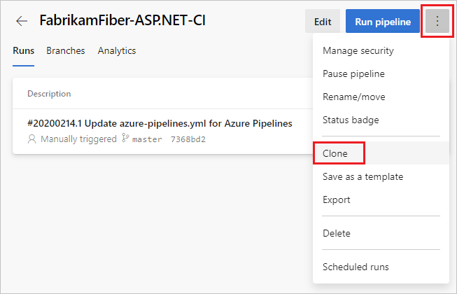

# Clone or import a pipeline

Instead of creating a pipeline from scratch, you can often copy an existing pipeline and use it as a starting point. For YAML pipelines, the process is as easy as copying the YAML from one pipeline to another. For pipelines created in the classic editor, the procedure depends on whether the pipeline to copy is in the same project as the new . If the pipeline to copy is in the same project, you can clone it, and if it is in a different project you can export it from that project and import it into your project.

## Clone a pipeline

#### [YAML](#tab/yaml/)

:::moniker range=">= azure-devops-2019"

For YAML pipelines, the process for cloning is to copy the YAML from the source pipeline and use it as the basis for the new pipeline.

:::moniker-end

:::moniker range="azure-devops-2019"

1. Navigate to your pipeline, and choose **Edit**.

    :::image type="content" source="media/pipeline-details-2019.png" alt-text="Pipeline details in Azure DevOps Server 2019":::

2. Copy the pipeline YAML from the editor, and paste it into the YAML editor for your new pipeline.

3. To customize your newly cloned pipeline, see [Customize your pipeline](../customize-pipeline.md).

:::moniker-end

:::moniker range="> azure-devops-2019"

1. [Navigate](multi-stage-pipelines-experience.md#navigating-pipelines) to the [pipeline details](multi-stage-pipelines-experience.md#view-pipeline-details) for your pipeline, and choose **Edit**.

    

2. Copy the pipeline YAML from the editor, and paste it into the YAML editor for your new pipeline.

3. To customize your newly cloned pipeline, see [Customize your pipeline](../customize-pipeline.md).

:::moniker-end

:::moniker range="< azure-devops-2019"
    This version of TFS doesn't support YAML pipelines.
:::moniker-end

#### [Classic](#tab/classic/)

If your new pipeline can be created by copying another pipeline in the same project, follow the instructions in this section. If your pipeline is in another project, you can use [import/export](#export-and-import-a-pipeline) to copy the pipeline.

1. Navigate to the pipeline details page for your pipeline. If you have the `definitionId` you can browse to it using the following URL: `https://dev.azure.com/{org}/{project}/_build?definitionId={id}&_a=summary`

2. Choose **...** and select **Clone**.

    

3. Your pipeline is cloned with **-clone** appended to the name. Choose **Save** or **Save & queue** to save the cloned pipeline.

> [!NOTE]
> The **Clone** entry is only present on the context menu if your pipeline was created in the classic editor.

* * *

## Export and Import a pipeline

You can create a new pipeline by exporting an existing one and then importing it. This is especially useful in cases where the new pipeline has to be created in a separate project.

#### [YAML](#tab/yaml/)

:::moniker range=">= azure-devops-2019"

In a YAML pipeline, exporting and importing is the same process as cloning. You can simply copy the pipeline YAML from the editor and paste it into the YAML editor for your new pipeline.

:::moniker-end

:::moniker range="azure-devops-2019"

1. Navigate to your pipeline, and choose **Edit**.

    :::image type="content" source="media/pipeline-details-2019.png" alt-text="Pipeline details in Azure DevOps Server 2019":::

2. Copy the pipeline YAML from the editor, and paste it into the YAML editor for your new pipeline.

3. To customize your newly cloned pipeline, see [Customize your pipeline](../customize-pipeline.md).

:::moniker-end

:::moniker range="> azure-devops-2019"

1. [Navigate](multi-stage-pipelines-experience.md#navigating-pipelines) to the [pipeline details](multi-stage-pipelines-experience.md#view-pipeline-details) for your pipeline, and choose **Edit**.

    

2. Copy the pipeline YAML from the editor, and paste it into the YAML editor for your new pipeline.

3. To customize your newly cloned pipeline, see [Customize your pipeline](../customize-pipeline.md).

:::moniker-end

:::moniker range="< azure-devops-2019"
    This version of TFS doesn't support YAML pipelines.
:::moniker-end

#### [Classic](#tab/classic/)

In addition to cloning, you can also create new build or release definitions by exporting an existing definition and then importing it. This is especially useful in cases where the new definition has to be created in a separate project.

1. Navigate to the pipeline details page for your pipeline. 

2. Choose **...** and select **Export**.

    > [!div class="mx-imgBorder"]
    > 

3. When prompted, save the JSON file in your local machine. The browser will save the file in the download directory as per your browser settings.

4. To import the pipeline, navigate to the **Builds** or **Releases** page in your project. Choose **+New** and select the corresponding import pipeline option.

    > [!div class="mx-imgBorder"]
    > 

5. You will now be prompted to select a JSON file to import its contents. Browse to and select the JSON file that you previously exported.

7. After import is complete, you will be shown the new pipeline that is created. Note that exporting a pipeline strips any project specific data like agent pools, service connections etc. You will have to once again provide these details. 

> [!NOTE]
> The **Export** item is only present on the context menu if your pipeline was created in the classic editor.

* * *

## Next steps

Learn to [customize the pipeline](../customize-pipeline.md) you just cloned or imported.
