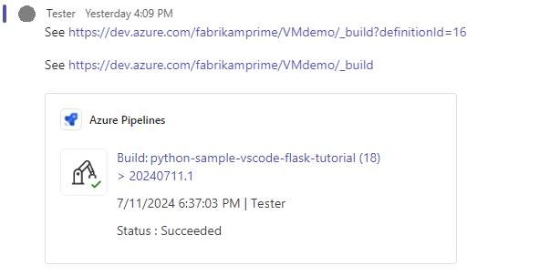
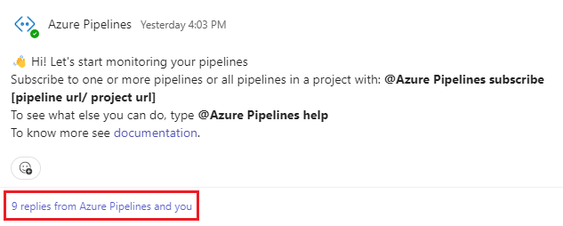

 
# Use Azure Pipelines with Microsoft Teams

[!INCLUDE [version-eq-azure-devops](../../includes/version-eq-azure-devops.md)]

The [Azure Pipelines app for Microsoft Teams](https://appsource.microsoft.com/product/office/WA200000055?src=wnblogmar2018) lets you monitor events for your pipelines. You can set up and get notifications in your Teams channel for releases, pending approvals, completed builds, and so on. You can also approve releases from within your Teams channel.

[!INCLUDE [temp](../../includes/feature-support-cloud-only.md)] 

## Prerequisites

- You must have an Azure DevOps project. For more information, see [Create a project](../../organizations/projects/create-project.md).
- To set up pipeline subscriptions, you must be a Project Administrator.

## Set up the Azure Pipelines app

1. In Microsoft Teams, go to the **Apps** store, search for **Azure Pipelines**, and then select **Azure Pipelines**.
   
   :::image type="content" source="media/integrations-teams/select-azure-pipelines-from-microsot-teams.png" alt-text="Screenshot of selecting the Apps button, then Azure Pipelines button.":::

2. Select the **Open** dropdown arrow, and then select **Add to a team**.
 
   :::image type="content" source="media/integrations-teams/open-and-add-to-a-team.png" alt-text="Screenshot of selecting Open button and then Add to a team button.":::

3. Select or enter your team name, and then choose **Set up a bot**.
   
   :::image type="content" source="media/integrations-teams/set-up-a-bot.png" alt-text="Selecting the Set up a bot button.":::

4. In the Teams conversation pane, enter `@azurePipelines signin`.
5. Select **Sign in** and complete authentication to Azure Pipelines. 

## Use commands

Use the following commands to monitor all pipelines in a project or only specific pipelines.

- **Monitor all pipelines in a project.** The URL can be to any page within your project, except URLs to pipelines. For example, `@azure pipelines subscribe https://dev.azure.com/myorg/myproject/`.

   ```
   @azure pipelines subscribe [project url]
   ```

- **Monitor a specific pipeline:** The pipeline URL can be to any page within your pipeline that has a `definitionId` or `buildId/releaseId` present in the URL. For example, `@azure pipelines subscribe https://dev.azure.com/myorg/myproject/_build?definitionId=123`.

   ```
   @azure pipelines subscribe [pipeline url]
   ```

   Another example of a release pipeline that's subscribed to the *Release deployment started*, *Release deployment completed*, and *Release deployment approval pending* notifications is `@azure pipelines subscribe https://dev.azure.com/myorg/myproject/_release?definitionId=123&view=mine&_a=releases`.

> [!NOTE]
> * We don't support deployment approvals that have applied the **Revalidate identity of approver before completing the approval** policy.
> * Enable 'Third party application access via OAuth' to receive notifications for the organization in Azure DevOps.
## Manage subscriptions

When you subscribe to a pipeline, a few subscriptions get created by default without any filters applied. You might want to customize these subscriptions. For example, you might want to get notified only when builds fail or when deployments get pushed to a production environment. The Azure Pipelines app supports filters to customize what you see in your channel. To manage your subscriptions, complete the following steps.

1. Run the `@azure pipelines subscriptions` command.
2. Select **View all subscriptions**. In the list of subscriptions, if there's a subscription you don't want, select **Remove**.
   :::image type="content" source="media/integrations-teams/subscriptions-list-teams.png" alt-text="View of list of subscriptions.":::
3. Scroll down and select **Add subscription**.
4. Select the required pipeline and event.
5. Select the appropriate filters, and then **Save**.

   **Example 1:** Get notifications for failed builds.

   :::image type="content" source="media/integrations-teams/build-failure-notification.png" alt-text="Visual of build failures in Teams.":::

   **Example 2:** Get notifications only if the deployments get pushed to the production environment.

   :::image type="content" source="media/integrations-teams/pushed-to-prod-notification.png" alt-text="Visual of failure notification.":::

   > [!NOTE]
   > * Team Administrators can't remove or modify subscriptions that are created by Project Administrators.
   > * Notifications aren't supported inside chat/direct messages.

## Approve deployments from your channel

You can approve deployments from within your channel without going to the Azure Pipelines portal. Subscribe to the *Release deployment approval pending* notification for classic Releases or the *Run stage waiting for approval* notification for YAML pipelines. Both of these subscriptions get created by default when you subscribe to the pipeline.

:::image type="content" source="media/integrations-teams/approve-teams.png" alt-text="In Teams, notice ready for approval.":::

Whenever the running of a stage is pending for approval, a notification card with options to approve or reject the request gets posted in the channel. Approvers can review the details of the request in the notification and take appropriate action. In the following example, the deployment was approved and the approval status shows on the card.

:::image type="content" source="media/integrations-teams/approved-teams.png" alt-text="Card showing approved deployment.":::

The Azure Pipelines app supports all of the checks and approval scenarios present in the Azure Pipelines portal. You can approve requests as an individual or for a team.

## Search and share pipeline information using compose extension

To help users search and share information about pipelines, Azure Pipelines app for Microsoft Teams supports compose extension. You can now search for pipelines by pipeline ID or by pipeline name. For compose extension to work, users must sign in to the Azure Pipelines project that they're interested in either by running `@azure pipelines signin` command or by signing in to the compose extension directly.

> [!div class="mx-imgBorder"]
> 

## Previews of pipeline URLs

When you add a pipeline URL to Teams, you see a preview similar to the following images. The preview helps to keep pipeline-related conversations relevant and up-to-date. You can choose between compact and expanded cards.

**Example 1:** Build URL preview

> [!div class="mx-imgBorder"]
> 

**Example 2:** Release URL preview

> [!div class="mx-imgBorder"]
> 

Once you're signed in, this feature works for all channels in a team in Microsoft Teams.

## Unsubscribe from a pipeline channel

Use the following command to unsubscribe from all pipelines within a project.

```
@azure pipelines unsubscribe all [project url]
```

**Example:** Unsubscribe all with URL

```
@azure pipelines unsubscribe all https://dev.azure.com/myorg/myproject
```

This command deletes all the subscriptions related to any pipeline in the project and removes the pipelines from the channel. 

> [!IMPORTANT] 
> Only Project Administrators can run this command.

## Link your notifications

Link a set of related notifications to reduce the space occupied by notifications in a channel. All notifications linked to a particular run of a pipeline get linked together.

**Example 1:** Compact view of linked notifications. 

> [!div class="mx-imgBorder"]
> 

**Example 2:** Expanded view of linked notifications.

> [!div class="mx-imgBorder"]
> 

## Use commands in Azure Pipelines app

See the following commands supported by the Azure Pipelines app:

| Slash command        | Functionality  |
| -------------------- |----------------|
| @azure pipelines subscribe [pipeline url/ project url]      | Subscribe to a pipeline or all pipelines in a project to receive notifications| 
| @azure pipelines subscriptions      | Add or remove subscriptions for this channel | 
| @azure pipelines feedback | Report a problem or suggest a feature |
| @azure pipelines help     | Get help on the slash commands |
| @azure pipelines signin  | Sign in to your Azure Pipelines account |
| @azure pipelines signout  | Sign out from your Azure Pipelines account |
| @azure pipelines unsubscribe all [project url] | Remove all pipelines (belonging to a project) and their associated subscriptions from a channel |

 ## Connect multi-tenants

If you're using a different email or tenant for Microsoft Teams and Azure DevOps, do the following steps to sign in and connect based on your use case.

|Use case  |Email ID & tenant in Microsoft Teams |Email ID & tenant in Azure DevOps  |Sign in action |
|---------|---------|---------|---------|
|1     |email1@abc.com (tenant 1)        |  email1@abc.com (tenant 1)     | Select **Sign in**        |
|2     |  email1@abc.com (tenant 1)      | email2@pqr.com (tenant 2)       | - Sign in to Azure DevOps. <br> - In the same browser, start a new tab and go to https://teams.microsoft.com/.<br> - Run the `sign in` command and select **Sign in**.        |
|3     |email1@abc.com (tenant 1)         |  email2@pqr.com (tenant 2)       | - Select **Sign in with different email address**.<br> - In the email ID picker, use the email2 to sign in.       |
|4     | email1@abc.com (tenant 1)        | email2@pqr.com (non-default tenant 3)        | Currently not supported.       |

## Troubleshoot 

[!INCLUDE [troubleshooting](includes/troubleshoot-authentication.md)]

In the **same browser**, start a new tab and sign in to `https://teams.microsoft.com/`. Run the `@Azure Pipelines signout` command and then run the `@Azure Pipelines signin` command in the channel where the Azure Pipelines app for Microsoft Teams is installed.

Select the `Sign in` button and you get redirected to a consent page like the one in the following example. Ensure that the directory shown beside the email is same as what you chose in the previous step. Accept and complete the sign in process.

> [!div class="mx-imgBorder"]
> 

If these steps don't resolve your authentication issue, reach out to us at [Developer Community](https://developercommunity.visualstudio.com/spaces/21/index.html).

## Related articles

- [Use Azure Boards with Microsoft Teams](../../boards/integrations/boards-teams.md)
- [Use Azure Repos with Microsoft Teams](../../repos/integrations/repos-teams.md)
