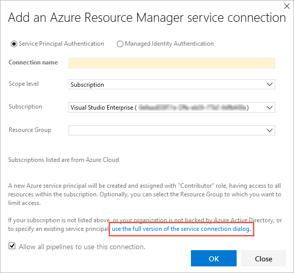

# Create an Azure service connection

**Azure Pipelines | TFS 2018 | TFS 2017**

::: moniker range="<= tfs-2018"
[!INCLUDE [temp](../_shared/concept-rename-note.md)]
::: moniker-end

This topic explains how to create an Azure Resource Manager service connection for connecting
to Microsoft Azure resources. It starts by showing the simple case where you select the 
subscription, and optionally the Azure Resource Group, to which you want to connect. Use this
approach:

* If you are connecting from Azure Pipelines, and not from TFS.
* If you are the owner of both the Azure and the Azure DevOps subscriptions you are connecting from, and both accept the same credentials as you are currently signed into Azure Pipelines with.
* You do not need to further limit the permissions for Azure resources accessed through the service connection.
* You are not connecting to [Azure Stack](#connect-stack) or an [Azure Government Cloud](#connect-govt).

If you have problems using this simple approach (such as no subscriptions being shown in the drop-down list),
or if you want to further limit users' permissions, you can do so by using a service principal as shown [here](#use-spn).  

## Create an Azure Resource Manager service connection

1. Open the **Services** page from the "settings" icon in the top menu bar.

   

1. Choose **+ New service connection** and select **Azure Resource Manager**.

   

1. Fill in the following parameters for the service connection.

   | Parameter | Description |
   | --------- | ----------- |
   | Connection Name | Required. The name you will use to refer to this service connection in task properties. This is not the name of your Azure subscription. |
   | Subscription | Select an existing Azure subscription. If you don't see any Azure subscriptions or instances, see [Troubleshoot Azure Resource Manager service connections](../release/azure-rm-endpoint.md). |
   | Resource Group | Leave empty to allow users to access all resources defined within the subscription - users will be able to access only the resources defined within that group. Or select a resource group to which you want to restrict the users' access - users will be able to access only the resources defined within that group. |

1. After the new service connection is created:

   * If you are using it in the UI, select the connection name you assigned in the **Azure subscription** setting of your pipeline.
   * If you are using it in YAML, copy the connection name into your code as the **azureSubscription** value.

See also: [Troubleshoot Azure Resource Manager service connection](../release/azure-rm-endpoint.md).

## Create an Azure Resource Manager service connection with an existing service principal

1. If you want to use a pre-defined set of access permissions, and you don't already have a suitable service principal defined, follow one of these tutorials to create a new service principal:

   * [Use the portal to create an Azure Active Directory application and service principal that can access resources](https://docs.microsoft.com/azure/azure-resource-manager/resource-group-create-service-principal-portal)
   * [How to create and test Azure Service Principal using Azure CLI](https://blogs.msdn.microsoft.com/arsen/2016/05/11/how-to-create-and-test-azure-service-principal-using-azure-cli/)

1. Open the **Services** page from the "settings" icon in the top menu bar.

   

1. Choose **+ New service connection** and select **Azure Resource Manager**.

   

1. Switch from the simplified version of the dialog to the full version using the link in the dialog.

   

1. Enter a user-friendly name to use when referring to this service connection.

1. Select the Environment name (such as Azure Cloud, Azure Stack, or an Azure Government Cloud).

1. Enter the Environment URL if required. For Azure Stack, this will be something like `https://management.local.azurestack.external`

1. Download and run [this PowerShell script](https://github.com/Microsoft/vsts-rm-extensions/blob/master/TaskModules/powershell/Azure/SPNCreation.ps1) in an Azure PowerShell window.
   When prompted, enter your subscription name, password, role (optional), and the type of cloud such as Azure Cloud (the default), Azure Stack, or an Azure Government Cloud.

1. Copy these fields from the output of the PowerShell script into the Azure subscription dialog textboxes:

   * Subscription ID
   * Subscription Name
   * Service Principal ID
   * Service Principal Key
   * Tenant ID

1. After the new service connection is created:

   * If you are using it in the UI, select the connection name you assigned in the **Azure subscription** setting of your pipeline.
   * If you are using it in YAML, copy the connection name into your code as the **azureSubscription** value.

1. If required, modify the service principal to expose the appropriate permissions. For more details, see 
   [Use Role-Based Access Control to manage access to your Azure subscription resources](https://docs.microsoft.com/azure/role-based-access-control/role-assignments-portal).
   [This blog post](http://blogs.msdn.com/b/visualstudioalm/archive/2015/10/04/automating-azure-resource-group-deployment-using-a-service-principal-in-visual-studio-online-build-release-management.aspx)
   also contains more information about using service principal authentication.

See also: [Troubleshoot Azure Resource Manager service connections](../release/azure-rm-endpoint.md).

## Connect to an Azure Government Cloud

For information about connecting to an Azure Government Cloud, see:

* [Connecting from Azure Pipelines (Azure Government Cloud)](https://docs.microsoft.com/azure/azure-government/documentation-government-get-started-connect-with-vsts)

## Connect to Azure Stack

For information about connecting to Azure Stack, see:

* [Connect to Azure Stack](https://docs.microsoft.com/azure/azure-stack/azure-stack-connect-azure-stack)
* [Connect Azure Stack to Azure using VPN](https://docs.microsoft.com/azure/azure-stack/azure-stack-connect-vpn)
* [Connect Azure Stack to Azure using ExpressRoute](https://docs.microsoft.com/azure/azure-stack/azure-stack-connect-expressroute)

[!INCLUDE [rm-help-support-shared](../_shared/rm-help-support-shared.md)]
