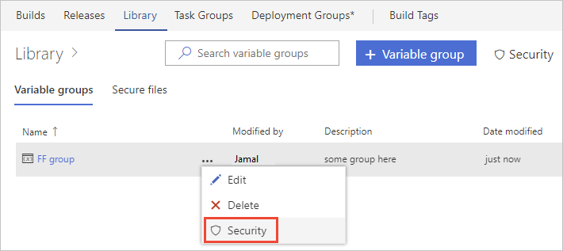
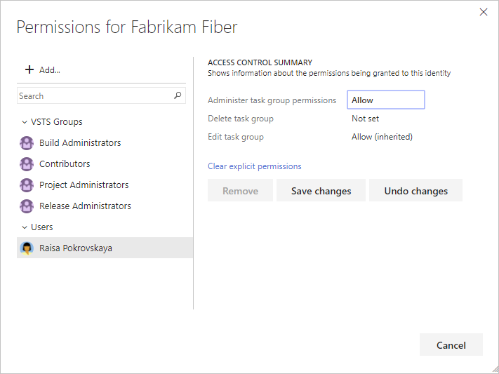
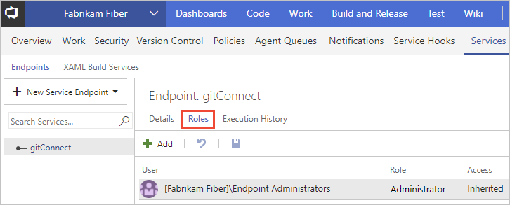

# Add users to Azure Pipelines

**Azure Pipelines | Azure DevOps Server 2020 | Azure DevOps Server 2019 | TFS 2018 - TFS 2015**

Permissions for build and release pipelines are primarily set at the object-level for a specific build or release, or for select tasks, at the collection level.

You can manage security for different types of resources such as variable groups, secure files, and deployment groups by adding users or groups to that role. Project administrator can grant or restrict access to project resources. If you want to allow a team member to edit pipelines, you must be a project administrator in order to do so.

::: moniker range="> tfs-2018"

1. Navigate to your project's summary page: `https://dev.azure.com/{your-organization}/{your-project}`

1. Select the **Invite** button to add a user to your project, and then fill out the required fields. Select **Add** when you are done.

    :::image type="content" source="media/project-invite-button.png" alt-text="Invite button":::

    :::image type="content" source="media/project-invite-dialog-box.png" alt-text="Add users to your project":::

1. The new user must accept the invitation before they can start creating or modifying pipelines.

## Verify permissions for contributors

> [!NOTE]
> A security best practice is to only grant permissions to required users or groups. The **Contributors** group may be too broad in a given project.  

To verify the permissions for your project's contributors, make sure you are a member of the *Build Administrators group* or the *Project Administrators group*. See [Set permissions at the project- or collection-level](../../organizations/security/set-project-collection-level-permissions.md) for more details.

1. From within your project, select **Pipelines** > **Pipelines**. Select the **All** tab, and then select the more actions menu then **Manage security**.

    :::image type="content" source="media/security-menu-item.png" alt-text="Manage pipeline security":::

1. On the permissions dialog box, make sure the following **Contributors** permissions are set to Allow.

    :::image type="content" source="media/builds-permissions-dialog-box.png" alt-text="Set up the contributors permissions":::

::: moniker-end

::: moniker range="<= tfs-2018"

## Set permissions for build pipelines

1. From within your project, select **Build and Release**, and then select **Builds** to access your build pipelines.

    :::image type="content" source="media/build-release-tfs.png" alt-text="Access builds in TFS":::

1. Select **Security** to set the permissions for all build pipelines.

    :::image type="content" source="media/set-build-release-permissions/open-all-build-definitions-security.png" alt-text="Access all builds security permissions":::

   To set permissions for a specific build pipeline, select the context menu for that build and select **Security**.

    :::image type="content" source="media/set-build-release-permissions/set-build-permission-open-dialog.png" alt-text="Configure build permissions":::

1. Choose the group you want to set permissions for, and then change the permission setting to grant or restrict access. In the following example, we change the contributors permission to allow editing build definitions.

    :::image type="content" source="media/set-build-release-permissions/set-build-permission-dialog.png" alt-text="Contributors permissions - allow editing build definitions":::

1. Select **Save changes** when you are done.

## Set permissions for release pipelines

1. From within your project, select **Build and Release**, and then select **Releases** to access your release pipelines.

    :::image type="content" source="media/set-build-release-permissions/release-pipelines-tfs.png" alt-text="Access release pipelines TFS":::

1. Select the context menu for **All release definitions**, and then select **Security**.

    :::image type="content" source="media/set-build-release-permissions/all-releases-security.png" alt-text="All security releases":::

1. Choose the group you want to set permissions for, and then change the permission setting to grant or restrict access. In the following example, we change the contributors permission to prohibit the deletion of release definitions.

    :::image type="content" source="media/set-build-release-permissions/set-release-permission-dialog.png" alt-text="Configure permissions for release pipelines":::

1. Select **Save changes** when you are done.

<a id="deployment-group" />
<a id="variable-group" />
<a id="library" />

::: moniker-end

::: moniker range=">= tfs-2017 <= tfs-2018"

## Manage Library roles for variable groups, secure files, and deployment groups

Permissions for [variable groups](../library/variable-groups.md), [secure files](../library/secure-files.md), and [deployment groups](../release/deployment-groups/index.md) are managed by roles. For a description of the roles, see [About security roles](../../organizations/security/about-security-roles.md).

> [!NOTE]
> **Feature availability**: These features are available on Azure Pipelines and TFS 2017 and later versions.

You can set the security for all artifacts for a project, as well as set the security for individual artifacts. The method is similar for all three artifact types. You set the security for variable groups and secure files from **Azure Pipelines**, **Library** page, and for deployment groups, from the **Deployment groups** page.

For example, here we show how to set the security for variable groups.  

1. **Build-Release** hub, **Library** page, open the Security dialog for all variable groups.

    

   If you want to manage the permissions for a specific variable group, then open the Security dialog for that group.

    

1. Add the user or group and choose the role you want them to have.

   For example, here we deny access to several permissions for the Contributors group.

    

1. Click **Add**.  

::: moniker-end

::: moniker range=">= tfs-2017 <= tfs-2018"

<a id="task-group" />

## Manage task group permissions

Permissions for task groups are subject to a hierarchical model. You use task groups to encapsulate a sequence of tasks already defined in a build or a release pipeline into a single reusable task. You [define and manage task groups](../library/task-groups.md) in the **Task groups** tab of **Azure Pipelines**.

> [!NOTE]
> **Feature availability**: These features are available on Azure Pipelines and TFS 2017 and later versions.

1. From the web portal **Build-Release** hub, **Task groups** page, open the Security dialog for all task groups.

    

   If you want to manage the permissions for a specific task group, then open the Security dialog for that group.

1. Add the user or group and then set the permissions you want them to have.

   For example, here we add Raisa and set her permissions to Administer all task groups.

    

1. Click **Add**.

::: moniker-end

::: moniker range="<= tfs-2018"

<a id="collection-level" /> 

## Set collection-level permissions to administer build resources
 
1. From the web portal user context, open the admin context by clicking the  gear Settings icon and choosing **Organization settings** or **Collection settings**.

1. Click **Security**, and then choose the group whose permissions you want to modify.

   Here we choose the Build Administrators group and change the **Use build resources** permission. For a description of each permissions, see [Permissions and groups reference, Collection-level permissions](../../organizations/security/permissions.md#collection-level).

   

1. Save your changes.

::: moniker-end

::: moniker range=">= tfs-2015 <= tfs-2018"

## Manage permissions for agent pools and service connections

You manage the security for [agent pools](../agents/pools-queues.md) and [service connections](../library/service-endpoints.md) by adding users or groups to a role. The method is similar for both agent pools and service connections. You will need to be a member of the Project  Administrator group to manage the security for these resources.
 
> [!NOTE]
> **Feature availability**: These features are available on Azure Pipelines and TFS 2015 and later versions.

For example, here we show how to add a user to the Administrator role for a service connection.  

1. From the web portal, click the  gear Settings icon to open the project settings admin context.

1. Click **Services**, click the service connection that you want to manage, and then click **Roles**.   

   

1. Add the user or group and choose the role you want them to have. For a description of each role, see [About security roles](../../organizations/security/about-security-roles.md).

   For example, here we add Raisa to the Administrator role.

     

1. Click **Add**.  

::: moniker-end

::: moniker range=">= tfs-2018 <= tfs-2018"

## Manage permissions for agent pools and deployment pools  

You manage the security for [agent pools](../agents/pools-queues.md) and [deployment pools](../release/deployment-groups/index.md) by adding users or groups to a role. The method is similar for both types of pools.
 
> [!NOTE]
> **Feature availability**: These features are available on Azure Pipelines and TFS 2018 and later versions.

You will need to be a member of the Project Collection Administrator group to manage the security for a pool. Once you've been added to the Administrator role, you can then manage the pool. For a description of each role, see [About security roles](../../organizations/security/about-security-roles.md).

1. From the web portal, click the  gear Settings icon and choose Organization settings or Collection settings to open the collection-level settings admin context.

1. Click **Deployment Pools**, and then open the **Security** dialog for all deployment pools.    

    

   If you want to manage the permissions for a specific deployment group, then open the Security dialog for that group.

1. Add the user or group and choose the role you want them to have.

   For example, here we add Raisa to the Administrator role.

     

1. Click **Add**.  

::: moniker-end

## Related articles 

- [Set pipelines permissions](../policies/permissions.md)
- [Default permissions and access](../../organizations/security/permissions-access.md) 
- [Permissions and groups reference](../../organizations/security/permissions.md) 
