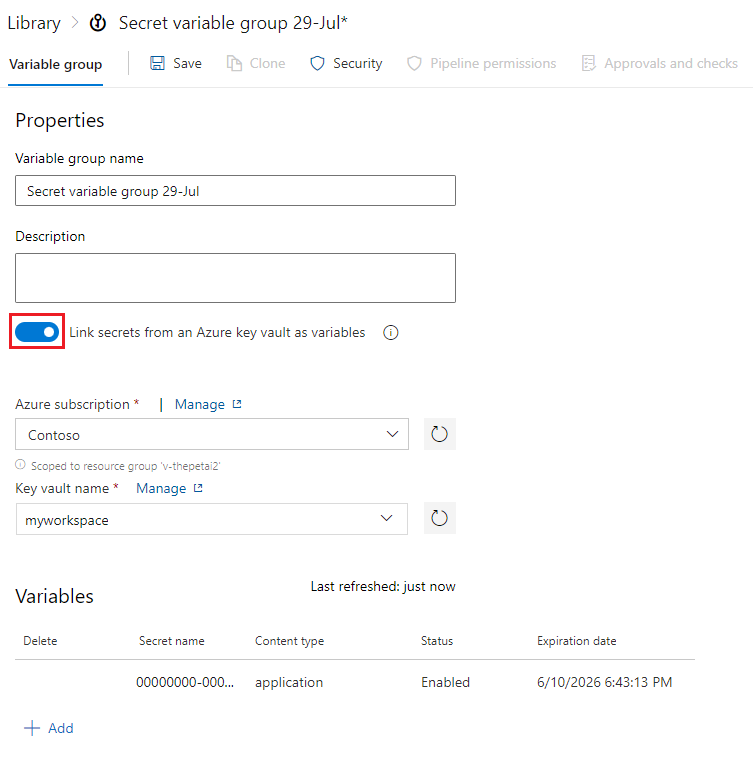

You can create a variable group that links to an existing Azure key vault, and map selected Key Vault secrets to the variable group. Only the secret names are mapped to the variable group, not the secret values. Pipeline runs that link to the variable group fetch the latest secret values from the vault.

Any changes made to existing secrets in the key vault are automatically available to all the pipelines that use the variable group. However, if secrets are added to or deleted from the vault, the associated variable groups don't automatically update. You must explicitly update the secrets to include in the variable group.

Although Key Vault supports storing and managing cryptographic keys and secrets in Azure, Azure Pipelines variable group integration supports mapping only key vault secrets. Cryptographic keys and certificates aren't supported.

### Prerequisites

- An Azure key vault that contains your secrets. You can create a key vault by using the [Azure portal](https://portal.azure.com).
- An Azure [service connection](service-endpoints) for your project that has at least **Get** and **List** management permissions on the key vault. You can provide these permissions when you create the variable group with the linked key vault, or you can provide them in the Azure portal by following these steps:
  1. Open **Settings** for the key vault, and then choose **Access configuration** > **Go to access policies**.
  1. On the **Access policies** page, if your Azure Pipelines project isn't listed under **Applications** with at least **Get** and **List** permissions, select **Create**.
  1. Under **Secret permissions**, select **Get** and **List**, and then select **Next**.
  1. Select your service principal, and then select **Next**.
  1. Select **Next** again, review the settings, and then select **Create**.

### Create the variable group

1. In your Azure DevOps project, select **Pipelines** > **Library** > **+ Variable group**.
1. On the **Variable groups** page, enter a name and optional description for the variable group.
1. Enable the **Link secrets from an Azure key vault as variables** toggle.
1. Select your Azure subscription endpoint and key vault name.
1. If you didn't set permissions in the Azure portal, enable Azure DevOps to access the key vault by selecting **Authorize** next to the vault name.
1. On the **Choose secrets** screen, select specific secrets from your vault for mapping to this variable group, and then select **OK**.
1. Select **Save** to save the secret variable group.

