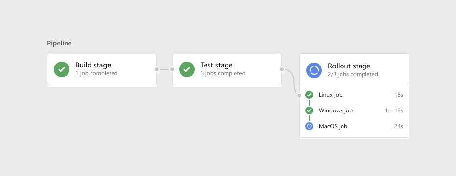
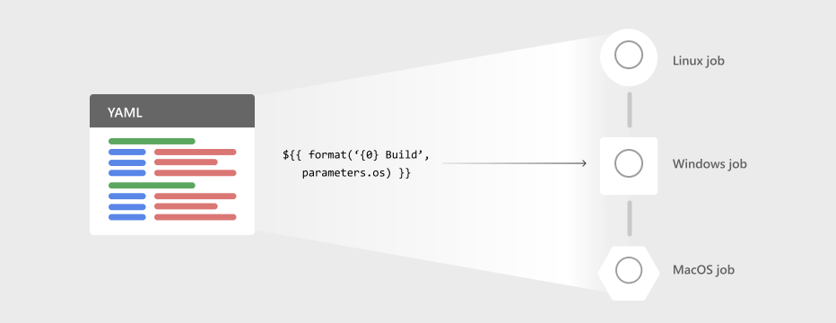
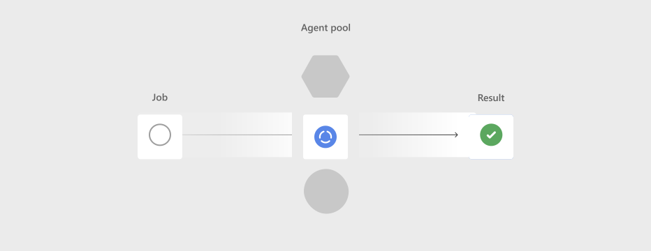
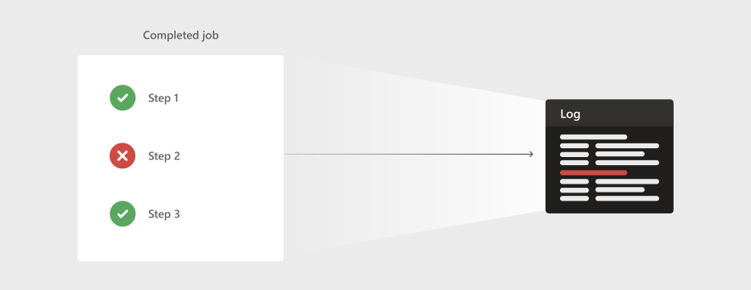

# Pipeline run sequence



When you run a pipeline, a lot of things happen under the covers.
While you often won't need to know about them, once in a while it's useful to have the big picture.
At a high level, Azure Pipelines will:
- [Process the pipeline](#process-the-pipeline)
- [Request one or more agents to run jobs](#request-an-agent)
- Hand off jobs to agents and collect the results

On the agent side, for each job, an agent will:
- [Get ready for the job](#prepare-to-run-a-job)
- [Run each step in the job](#run-each-step)
- [Report results to Azure Pipelines](#report-and-collect-results)

Jobs may [succeed, fail, or be canceled](#state-and-conditions).
There are also situations where a job [may not complete](#timeouts-and-disconnects).
Understanding how this happens can help you troubleshoot issues.

Let's break down each action one by one.

## Process the pipeline



To turn a pipeline into a run, Azure Pipelines goes through several steps in this order:
1. First, expand [templates](templates.md) and evaluate [template expressions](templates.md).
2. Next, evaluate dependencies at the [stage](stages.md) level to pick the first stage(s) to run.
3. For each stage selected to run, evaluate [dependencies at the job level](phases.md#dependencies) to pick the first job(s) to run.
4. For each job selected to run, expand [multi-configs](phases.md#parallelexec) (`strategy: matrix` or `strategy: parallel` in YAML) into multiple runtime jobs.
5. For each runtime job, evaluate [conditions](conditions.md) to decide whether that job is eligible to run.
6. [Request an agent](#request-an-agent) for each eligible runtime job.

As runtime jobs complete, Azure Pipelines will see if there are new jobs eligible to run.
If so, steps 4 - 6 repeat with the new jobs.
Similarly, as stages complete, steps 2 - 6 will be repeated for any new stages.

This ordering helps answer a common question: why can't I use certain variables in my template parameters?
Step 1, template expansion, operates solely on the text of the YAML document.
Runtime variables don't exist during that step.
After step 1, template parameters have been completely resolved and no longer exist.

## Request an agent

Whenever Azure Pipelines needs to run a job, it will ask the [pool](../agents/pools-queues.md) for an [agent](../agents/agents.md).
([Server jobs](phases.md#server-jobs) are an exception, since they run on the Azure Pipelines server itself.)
[Microsoft-hosted](../agents/hosted.md) and [self-hosted](../agents/pools-queues.md) agent pools work slightly differently.

### Microsoft-hosted agent pool requests

First, the service checks on your organization's parallel jobs.
It adds up all running jobs on all Microsoft-hosted agents and compares that with the number of parallel jobs purchased.
If there are no available parallel slots, the job has to wait on a slot to free up.

Once a parallel slot is available, the job is routed to the requested agent type.
Conceptually, the Microsoft-hosted pool is one giant, global pool of machines.
(In reality, it's a number of different physical pools split by geography and operating system type.)
Based on the `vmImage` (in YAML) or pool name (in the classic editor) requested, an agent is selected.



All agents in the Microsoft pool are fresh, new virtual machines which haven't run any pipelines before.
When the job completes, the agent VM will be discarded.

### Self-hosted agent pool requests

Similar to the [Microsoft-hosted pool](#microsoft-hosted-agent-pool-requests), the service first checks on your organization's parallel jobs.
It adds up all running jobs on all self-hosted agents and compares that with the number of parallel jobs purchased.
If there are no available parallel slots, the job has to wait on a slot to free up.

Once a parallel slot is available, the self-hosted pool is examined for a compatible agent.
Self-hosted agents offer [capabilities](../agents/agents.md#capabilities), which are strings indicating that particular software is installed or settings are configured.
The pipeline has [demands](demands.md), which are the capabilities required to run the job.
If a free agent whose capabilities match the pipeline's demands cannot be found, the job will continue waiting.
If there are no agents in the pool whose capabilities match the demands, the job will fail.

Self-hosted agents are typically re-used from run to run.
This means that a pipeline job can have side effects: warming up caches, having most commits already available in the local repo, and so on.

## Prepare to run a job

Once an agent has accepted a job, it has some preparation work to do.
The agent downloads (and caches for next time) all the [tasks](tasks.md) needed to run the job.
It creates working space on disk to hold the source code, artifacts, and outputs used in the run.
Then it begins [running steps](#run-each-step).

## Run each step

Steps are run sequentially, one after another.
Before a step can start, all the previous steps must be finished (or skipped).


Steps are implemented by [tasks](tasks.md).
Tasks themselves are implemented as Node.js or PowerShell scripts.
The task system routes inputs and outputs to the backing scripts.
It also provides some common services such as altering the system path and creating new [pipeline variables](variables.md).

Each step runs in its own process, isolating it from the environment left by previous steps.
Because of this process-per-step model, environment variables are not preserved between steps.
However, tasks and scripts have a mechanism to communicate back to the agent: [logging commands](../scripts/logging-commands.md).
When a task or script writes a logging command to standard out, the agent will take whatever action is requested.

There is an agent command to create new pipeline variables.
Pipeline variables will be automatically converted into environment variables in the next step.
In order to set a new variable `myVar` with a value of `myValue`, a script can do this:

```bash
echo '##vso[task.setVariable variable=myVar]myValue'
```

```powershell
Write-Host "##vso[task.setVariable variable=myVar]myValue"
```

## Report and collect results

Each step can report warnings, errors, and failures.
Errors and warnings are reported to the pipeline summary page, marking the task as "succeeded with issues".
Failures are also reported to the summary page, but they mark the task as "failed".
A step is a failure if it either explicitly reports failure (using a `##vso` command) or ends the script with a non-zero exit code.



As steps run, the agent is constantly sending output lines to the service.
That's why you can see a live feed of the console.
At the end of each step, the entire output from the step is also uploaded as a log file.
Logs can be downloaded once the pipeline has finished.
Other items that the agent can upload include [artifacts](../artifacts/pipeline-artifacts.md) and [test results](../test/review-continuous-test-results-after-build.md).
These are also available after the pipeline completes.

## State and conditions

The agent keeps track of each step's success or failure.
As steps succeed with issues or fail, the job's status will be updated.
The job always reflects the "worst" outcome from each of its steps: if a step fails, the job also fails.

Before running a step, the agent will check that step's [condition](conditions.md) to determine whether it should run.
By default, a step will only run when the job's status is succeeded or succeeded with issues.
Many jobs have cleanup steps which need to run no matter what else happened, so they can specify a condition of "always()".
Cleanup steps might also be set to run only on [cancellation](#timeouts-and-disconnects).
A succeeding cleanup step cannot save the job from failing; jobs can never go back to success after entering failure.

## Timeouts and disconnects

Each job has a timeout.
If the job has not completed in the specified time, the server will cancel the job.
It will attempt to signal the agent to stop, and it will mark the job as canceled.
On the agent side, this means canceling all remaining steps and uploading any remaining [results](#report-and-collect-results).

Jobs have a grace period known as the cancel timeout in which to complete any cancellation work.
(Remember, steps can be marked to run [even on cancellation](#state-and-conditions).)
After the timeout plus the cancel timeout, if the agent has not reported that work has stopped, the server will mark the job as a failure.

Because Azure Pipelines distributes work to agent machines, from time to time, agents may stop responding to the server.
This can happen if the agent's host machine goes away (power loss, VM turned off) or if there's a network failure.
To help detect these conditions, the agent sends a heartbeat message once per minute to let the server know it's still operating.
If the server doesn't receive a heartbeat for five consecutive minutes, it assumes the agent will not come back.
The job is marked as a failure, letting the user know they should re-try the pipeline.

::: moniker range="azure-devops"
## Manage runs through the CLI

Using the Azure DevOps CLI, you can list the pipeline runs in your project and view details about a specific run. You can also add and delete tags in your pipeline run. 

### Prerequisites

- You must have installed the Azure DevOps CLI extension as described in [Get started with Azure DevOps CLI](/azure/devops/cli/index).
- Sign into Azure DevOps using `az login`.
- For the examples in this article, set the default organization using `az devops configure --defaults organization=YourOrganizationURL`.

### List pipeline runs

List the pipeline runs in your project with the [az pipelines runs list](/cli/azure/ext/azure-devops/pipelines/runs#ext-azure-devops-az-pipelines-runs-list) command. To get started, see [Get started with Azure DevOps CLI](../../cli/index.md).

```azurecli 
az pipelines runs list [--branch]
                       [--org]
                       [--pipeline-ids]
                       [--project]
                       [--query-order {FinishTimeAsc, FinishTimeDesc, QueueTimeAsc, QueueTimeDesc, StartTimeAsc, StartTimeDesc}]
                       [--reason {all, batchedCI, buildCompletion, checkInShelveset, individualCI, manual, pullRequest, schedule, triggered, userCreated, validateShelveset}]
                       [--requested-for]
                       [--result {canceled, failed, none, partiallySucceeded, succeeded}]
                       [--status {all, cancelling, completed, inProgress, none, notStarted, postponed}]
                       [--tags]
                       [--top]
``` 

#### Optional parameters 

- **branch**: Filter by builds for this branch.
- **org**: Azure DevOps organization URL. You can configure the default organization using `az devops configure -d organization=ORG_URL`. Required if not configured as default or picked up using `git config`. Example: `--org https://dev.azure.com/MyOrganizationName/`.
- **pipeline-ids**: Space-separated IDs of definitions for which to list builds.
- **project**: Name or ID of the project. You can configure the default project using `az devops configure -d project=NAME_OR_ID`. Required if not configured as default or picked up using `git config`.
- **query-order**: Define the order in which pipeline runs are listed. Accepted values are *FinishTimeAsc*, *FinishTimeDesc*, *QueueTimeAsc*, *QueueTimeDesc*, *StartTimeAsc*, and *StartTimeDesc*.
- **reason**: Only list builds for this specified reason. Accepted values are *batchedCI*, *buildCompletion*, *checkInShelveset*, *individualCI*, *manual*, *pullRequest*, *schedule*, *triggered*, *userCreated*, and *validateShelveset*.
- **requested-for**: Limit to the builds requested for a specified user or group.
- **result**: Limit to the builds with a specified result. Accepted values are *canceled*, *failed*, *none*, *partiallySucceeded*, and *succeeded*.
- **status**: Limit to the builds with a specified status. Accepted values are *all*, *cancelling*, *completed*, *inProgress*, *none*, *notStarted*, and *postponed*.
- **tags**: Limit to the builds with each of the specified tags. Space separated.
- **top**: Maximum number of builds to list.

#### Example 

The following command lists the first three pipeline runs which have a status of **completed** and a result of **succeeded**, and returns the result in table format.  

```azurecli 
az pipelines runs list --status completed --result succeeded --top 3 --output table

Run ID    Number      Status     Result     Pipeline ID    Pipeline Name               Source Branch    Queued Time                 Reason
--------  ----------  ---------  ---------  -------------  --------------------------  ---------------  --------------------------  ------
125       20200124.1  completed  succeeded  12             Githubname.pipelines-java  master           2020-01-23 18:56:10.067588  manual
123       20200123.2  completed  succeeded  12             Githubname.pipelines-java  master           2020-01-23 11:55:56.633450  manual
122       20200123.1  completed  succeeded  12             Githubname.pipelines-java  master           2020-01-23 11:48:05.574742  manual
``` 


### Show pipeline run details

Show the details for a pipeline run in your project with the [az pipelines runs show](/cli/azure/ext/azure-devops/pipelines/runs#ext-azure-devops-az-pipelines-runs-show) command. To get started, see [Get started with Azure DevOps CLI](../../cli/index.md).

```azurecli 
az pipelines runs show --id
                       [--open]
                       [--org]
                       [--project]
``` 

#### Parameters 

- **id**: Required. ID of the pipeline run.
- **open**: Optional. Opens the build results page in your web browser.
- **org**: Azure DevOps organization URL. You can configure the default organization using `az devops configure -d organization=ORG_URL`. Required if not configured as default or picked up using `git config`. Example: `--org https://dev.azure.com/MyOrganizationName/`.
- **project**: Name or ID of the project. You can configure the default project using `az devops configure -d project=NAME_OR_ID`. Required if not configured as default or picked up using `git config`.

#### Example 

The following command shows details for the pipeline run with the ID **123** and returns the results in table format. It also opens your web browser to the build results page.

```azurecli 
az pipelines runs show --id 122 --open --output table

Run ID    Number      Status     Result     Pipeline ID    Pipeline Name               Source Branch    Queued Time                 Reason
--------  ----------  ---------  ---------  -------------  --------------------------  ---------------  --------------------------  --------
123       20200123.2  completed  succeeded  12             Githubname.pipelines-java  master           2020-01-23 11:55:56.633450  manual
```

### Add tag to pipeline run

Add a tag to a pipeline run in your project with the [az pipelines runs tag add](/cli/azure/ext/azure-devops/pipelines/runs/tag#ext-azure-devops-az-pipelines-runs-tag-add) command. To get started, see [Get started with Azure DevOps CLI](../../cli/index.md).

```azurecli 
az pipelines runs tag add --run-id
                          --tags
                          [--org]
                          [--project]
``` 

#### Parameters 

- **run-id**: Required. ID of the pipeline run.
- **tags**: Required. Tags to be added to the pipeline run (comma-separated values).
- **org**: Azure DevOps organization URL. You can configure the default organization using `az devops configure -d organization=ORG_URL`. Required if not configured as default or picked up using `git config`. Example: `--org https://dev.azure.com/MyOrganizationName/`.
- **project**: Name or ID of the project. You can configure the default project using `az devops configure -d project=NAME_OR_ID`. Required if not configured as default or picked up using `git config`.

#### Example 

The following command adds the tag **YAML** to the pipeline run with the ID **123** and returns the result in JSON format.  

```azurecli 
az pipelines runs tag add --run-id 123 --tags YAML --output json

[
  "YAML"
]
```

### List pipeline run tags

List the tags for a pipeline run in your project with the [az pipelines runs tag list](/cli/azure/ext/azure-devops/pipelines/runs/tag#ext-azure-devops-az-pipelines-runs-tag-list) command. To get started, see [Get started with Azure DevOps CLI](../../cli/index.md).

```azurecli 
az pipelines runs tag list --run-id
                           [--org]
                           [--project]
``` 

#### Parameters 

- **run-id**: Required. ID of the pipeline run.
- **org**: Azure DevOps organization URL. You can configure the default organization using `az devops configure -d organization=ORG_URL`. Required if not configured as default or picked up using `git config`. Example: `--org https://dev.azure.com/MyOrganizationName/`.
- **project**: Name or ID of the project. You can configure the default project using `az devops configure -d project=NAME_OR_ID`. Required if not configured as default or picked up using `git config`.

#### Example 

The following command lists the tags for the pipeline run with the ID **123** and returns the result in table format.  

```azurecli
az pipelines runs tag list --run-id 123 --output table

Tags
------
YAML
```

### Delete tag from pipeline run

Delete a tag from a pipeline run in your project with the [az pipelines runs tag delete](/cli/azure/ext/azure-devops/pipelines/runs/tag#ext-azure-devops-az-pipelines-runs-tag-delete) command. To get started, see [Get started with Azure DevOps CLI](../../cli/index.md).

```azurecli 
az pipelines runs tag delete --run-id
                             --tag
                             [--org]
                             [--project]
``` 

#### Parameters 

- **run-id**: Required. ID of the pipeline run.
- **tag**: Required. Tag to be deleted from the pipeline run.
- **org**: Azure DevOps organization URL. You can configure the default organization using `az devops configure -d organization=ORG_URL`. Required if not configured as default or picked up using `git config`. Example: `--org https://dev.azure.com/MyOrganizationName/`.
- **project**: Name or ID of the project. You can configure the default project using `az devops configure -d project=NAME_OR_ID`. Required if not configured as default or picked up using `git config`.

#### Example 

The following command deletes the **YAML** tag from the pipeline run with ID **123**.  

```azurecli 
az pipelines runs tag delete --run-id 123 --tag YAML
```
::: moniker-end
