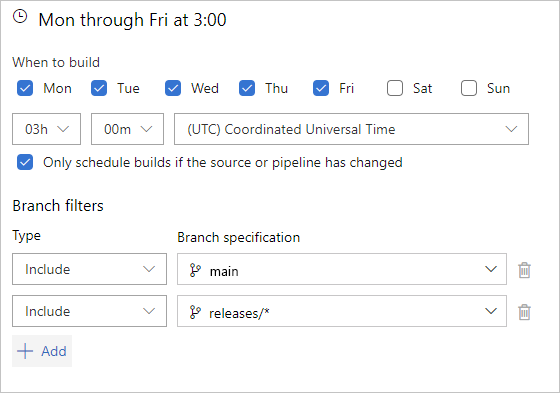
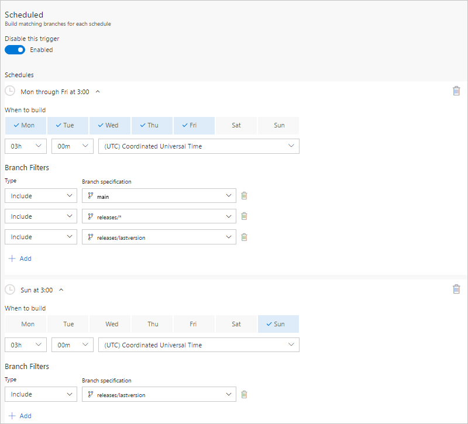
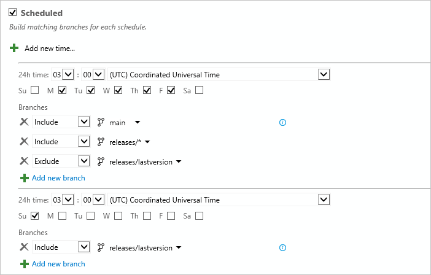

# Configure schedules for pipelines (classic)

::: moniker range="<= tfs-2018"
[!INCLUDE [temp](../includes/concept-rename-note.md)]
::: moniker-end

Azure Pipelines provides several different types of triggers to start your pipeline based on events such as a push to a branch or a pull request. In addition to these event-based triggers, Azure Pipelines provides the capability to run a pipeline based on a schedule. This article provides guidance on classic scheduled triggers. For information on other trigger types, see [Triggers in Azure Pipelines](../build/triggers.md). For informtion on YAML scheduled triggers, see [Configure schedules to run pipelines](scheduled-triggers.md)

## Scheduled trigger editor

From the **Triggers** tab, add a scheduled trigger and select the days and times when you want to run the build.

::: moniker range=">= azure-devops-2019"

::: moniker-end

::: moniker range=">= tfs-2017 <= tfs-2018"

::: moniker-end

::: moniker range="<= tfs-2017"

::: moniker-end

If your repository is Azure Repos Git, GitHub, or Other Git, then you can also specify branches to include and exclude. If you want to use wildcard characters, then type the branch specification (for example, `features/modules/*`) and then press Enter.

## Examples

### Nightly build of Git repo in multiple time zones

::: moniker range=">= azure-devops-2019"

In this example, the classic editor scheduled trigger has two entries, producing the following builds.

* Every Monday - Friday at 3:00 AM (UTC + 5:30 time zone), build branches that meet the `features/india/*` branch filter criteria

    

* Every Monday - Friday at 3:00 AM (UTC - 5:00 time zone), build branches that meet the `features/nc/*` branch filter criteria

    

::: moniker-end

::: moniker range=">= tfs-2017 <= tfs-2018"

::: moniker-end

::: moniker range="<= tfs-2017"

::: moniker-end

### Nightly build with different frequencies

::: moniker range=">=azure-devops-2019"

**Azure Pipelines and Azure DevOps 2019 Server**

In this example, the classic editor scheduled trigger has two entries, producing the following builds.

* Every Monday - Friday at 3:00 AM UTC, build branches that meet the `main` and `releases/*` branch filter criteria

    

* Every Sunday at 3:00 AM UTC, build the `releases/lastversion` branch, even if the source or pipeline hasn't changed

    

::: moniker-end

::: moniker range=">= tfs-2017 <= tfs-2018"

**TFS 2017.3 through TFS 2018**

::: moniker-end

::: moniker range="<= tfs-2017"

**TFS 2017.1 and older versions**

::: moniker-end

## Only schedule builds if the source or pipeline has changed

::: moniker range="<=tfs-2018"

> [!NOTE] 
> Scheduled builds always run on schedule regardless of code changes on TFS 2018.1 and lower.

::: moniker-end

::: moniker range="tfs-2018"

> [!NOTE]
> The [Skip scheduled builds if nothing has changed in the repo](/azure/devops/release-notes/2017/dec-11-vsts#skip-scheduled-builds-if-nothing-has-changed-in-the-repo) support described in this section is supported in TFS 2018.2 and higher.

::: moniker-end

::: moniker range=">=tfs-2018"

To configure the scheduled pipeline to build only if there has been a change since the last build, check **Only schedule builds if the source or pipeline has changed**.

::: moniker-end

## See also

- [Triggers in Azure Pipelines](../build/triggers.md)
