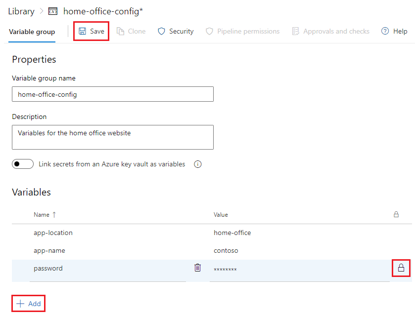

# Set secret variables

Secret variables are encrypted variables that you can use in pipelines without exposing their value. Secret variables can be used for private information like passwords, IDs, and other identifying data that you wouldn't want to have exposed in a pipeline. Secret variables are encrypted at rest with a 2048-bit RSA key and are available on the agent for tasks and scripts to use. 

The recommended ways to set secret variables are in the UI, in a variable group, and in a variable group from Azure Key Vault. You can also set secret variables in script tasks but this is not recommended since anyone who can access your pipeline will be able to also see the secret.

Secret variables set in the pipeline settings UI for a pipeline are scoped to the pipeline where they are set. You can use variable groups to share secret variables across pipelines. 

## Secret variable in the UI

You can set secret variables in the pipeline editor when you are editing an individual pipeline. You'll encrypt and make a pipeline variable secret by selecting the lock :::image type="icon" source="media/variables/secret-variable-icon.png" border="false"::: icon. 

You set secret variables the same way for YAML and Classic. 

[!INCLUDE [set secret variable in UI](includes/set-secrets.md)]

## Use a secret variable in the UI

#### [YAML](#tab/yaml/)

You'll need to map secret variable as environment variables to reference them in YAML pipelines. In this example, there are two secret variables defined in the UI, `SecretOne` and `SecretTwo`. The value of `SecretOne` is `foo` and the value of `SecretTwo` is `bar`. 

```yml
steps:
- powershell: |
      Write-Host "My first secret variable is $env:FOO_ONE"
      $env:FOO_ONE -eq "foo"
  env:
    FOO_ONE: $(SecretOne)
- bash: |
    echo "My second secret variable: $FOO_TWO"
    if [ "$FOO_TWO" = "bar" ]; then
        echo "Strings are equal."
    else
        echo "Strings are not equal."
    fi
  env:
    FOO_TWO: $(SecretTwo) 
```

The pipeline outputs:

```
My first secret variable is ***
True
My second secret variable: ***
Strings are equal.
```
For a more detailed example, see [Define variables](variables.md#secret-variables).


#### [Classic](#tab/classic/)


Unlike a normal variable, secret are not automatically decrypted into environment variables for scripts. You need to explicitly map secret variables.

In this example, the variable `mySecret` is set on the Variables tab. The value of `mySecret` is `foo`.

:::image type="content" source="media/variables/set-secret-var-classic.png" alt-text="Screenshot of setting a secret variable in Classic. ":::

Each task that needs to use the secret as an environment variable does remapping. If you want to use the secret variable called `mySecret` from a script, use the `Environment` section of the scripting task's input variables. Set the environment variable name to `FOO_ONE`, and set the value to `$(mySecret)`. 

:::image type="content" source="media/variables/secret-passed-variable-classic.png" alt-text="Screenshot of mapped secret environment variable in Classic.":::

The script outputs `True`.

---

## Set a secret variable in a variable group

You can add secrets to a variable group or link secrets from an existing [Azure Key Vault](/azure/key-vault/general/basic-concepts). 

### Create new variable groups 

1. Select **Pipelines** > **Library** > **+ Variable group**.

   :::image type="content" source="../library/media/add-variable-group.png" alt-text="Screenshot of Add variable group button highlighted with red box.":::

1. Enter a name and description for the group.

1. Optional: Move the toggle to link secrets from an Azure key vault as variables. For more information, see [Use Azure Key Vault secrets](../release/azure-key-vault.md).

1. Enter the name and value for each [variable](../release/variables.md#custom-variables) to include in the group, choosing **+ Add** for each one. 

1. To make your variable secure, choose the "lock" icon at the end of the row.

1. When you're finished adding variables, select **Save**.

   

Variable groups follow the [library security model](../library/index.md#library-security).

### Link secrets from an Azure key vault

[!INCLUDE [set secret variable in UI](includes/variable-groups-link-secrets.md)]


## Use the Azure Key Vault task

You can use the Azure Key Vault task to include secrets in your pipeline. This task allows the pipeline to connect to your Azure Key Vault and retrieve secrets to use as pipeline variables.

1. In the pipeline editor, select **Show assistant** to expand the assistant panel. 

1. Search for `vault` and select the [Azure Key Vault task](../tasks/deploy/azure-key-vault.md). 

    :::image type="content" source="../release/media/azure-key-vault/configure-azure-key-vault-task.png" alt-text="Add the Azure Key Vault task.":::
 
The **Make secrets available to whole job** option is not currently supported in Azure DevOps Server 2019 and 2020.

To learn more about the Azure Key Vault task, see [Use Azure Key Vault secrets in Azure Pipelines](../release/azure-key-vault.md). 
 

## Secret variable in a script

You can use the `task.setvariable` logging command to set variables in PowerShell and Bash scripts. This is the least secure way to work with secret variables. The recommended ways to set secret variables are in the UI, in a variable group, and in a variable group from Azure Key Vault.

To set a variable as a script with a logging command, you'll need to pass the `issecret` flag. 

[!INCLUDE [set secret variable in UI](includes/secret-variables-logging.md)]

Learn more about [setting and using variables in scripts](set-variables-scripts.md). 
