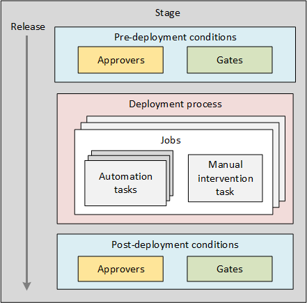

# Release approvals and gates overview

[!INCLUDE [version-rm-dev14](../../_shared/version-rm-dev14.md)]

::: moniker range="<= tfs-2018"
[!INCLUDE [temp](../../_shared/concept-rename-note.md)]
::: moniker-end

A release pipeline specifies the end-to-end release pipeline for an app to be deployed across a range of environments.
Deployments to each environment are fully automated by using 
[phases](../../process/phases.md) and [tasks](../../process/tasks.md).

**Approvals** and **gates** give you additional control over the start and completion of the deployment pipeline.
Each environment in a release pipeline can be configured with pre-deployment and post-deployment conditions
that can include waiting for users to manually approve or reject deployments, and checking with other automated
systems until specific conditions are verified. In addition, you can configure a manual intervention to pause the
deployment pipeline and prompt users to carry out manual tasks, then resume or reject the deployment.

>At present, gates are available only in Azure Pipelines.

The following diagram shows how these features are combined in an environment of a release pipeline.

By using approvals, gates, and manual intervention you can take full control of your releases
to meet a wide range of deployment requirements. Typical scenarios where approvals, gates, and manual intervention
are useful include the following.

| Scenario | Feature(s) to use |
| --- | --- |
| Some users must manually validate the change request and approve the deployment to an environment. | [Pre-deployment approvals](approvals.md) |
| Some users must manually sign off the app after deployment before the release is promoted to other environments. | [Post-deployment approvals](approvals.md) |
| You want to ensure there are no active issues in the work item or problem management system before deploying a build to an environment.  | [Pre-deployment gates](gates.md) |
| You want to ensure there are no incidents from the monitoring or incident management system for the app after it's been deployed, before promoting the release. | [Post-deployment gates](gates.md) |
| After deployment you want to wait for a specified time before prompting some users for a manual sign-off.  | [Post-deployment gates](gates.md) and [post-deployment approvals](approvals.md) |
| During the deployment pipeline a user must manually follow specific instructions and then resume the deployment. | [Manual Intervention](../../tasks/utility/manual-intervention.md) | 
| During the deployment pipeline you want to prompt the user to enter a value for a parameter used by the deployment tasks, or allow the user to edit the details of this release. | [Manual Intervention](../../tasks/utility/manual-intervention.md) | 
| During the deployment pipeline you want to wait for monitoring or information portals to detect any active incidents, before continuing with other deployment phases.  | Planned | 

You can, of course, combine all three techniques within a release pipeline to fully achieve your own deployment requirements.

## Related topics

* [Approvals](approvals.md)
* [Gates](gates.md)
* [Manual intervention](../../tasks/utility/manual-intervention.md)
* [Environments](../environments.md)
* [Triggers](../triggers.md)
* [Release pipelines and releases](index.md)

## See also

* [Video: Deploy quicker and safer with gates in Azure Pipelines](https://channel9.msdn.com/Events/Connect/2017/T181)
* [Configure your release pipelines for safe deployments](https://blogs.msdn.microsoft.com/visualstudioalm/2017/04/24/configuring-your-release-pipelines-for-safe-deployments/)

[!INCLUDE [rm-help-support-shared](../../_shared/rm-help-support-shared.md)]
