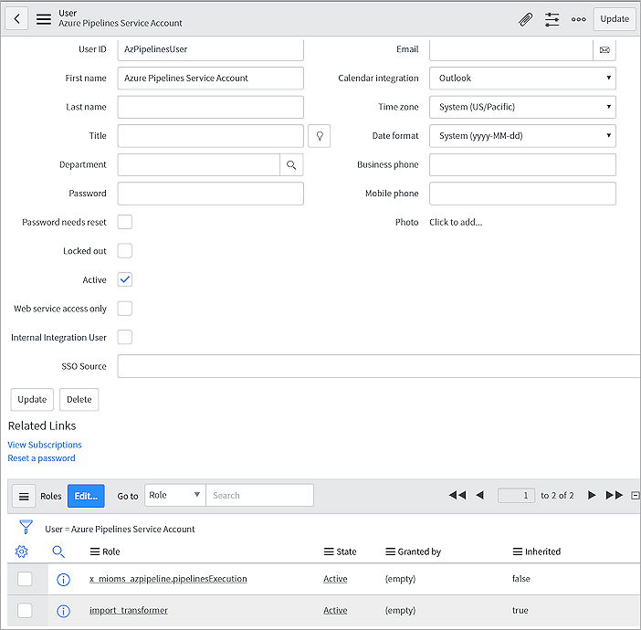
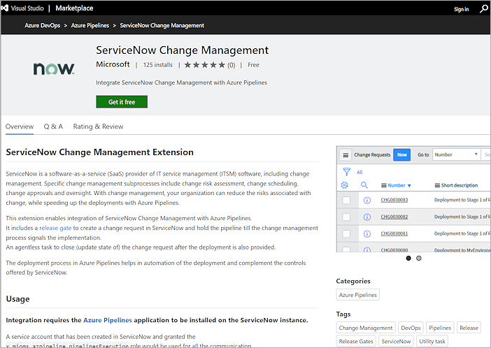
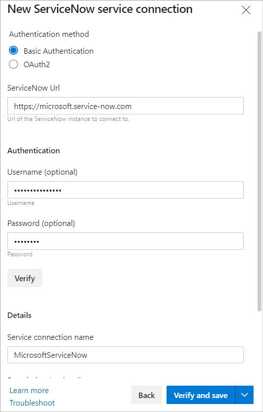
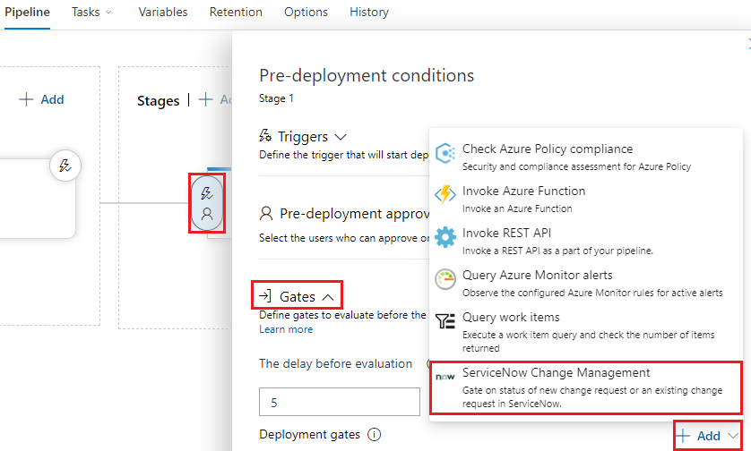
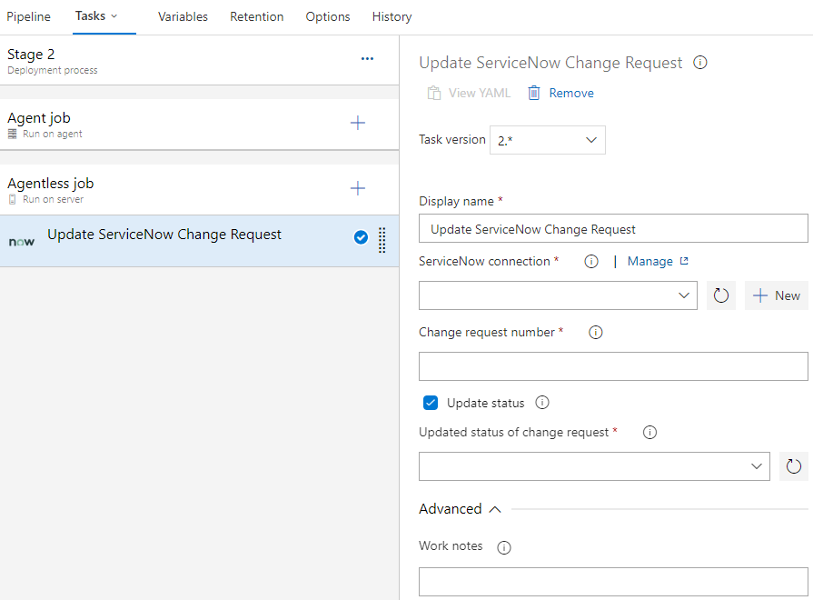
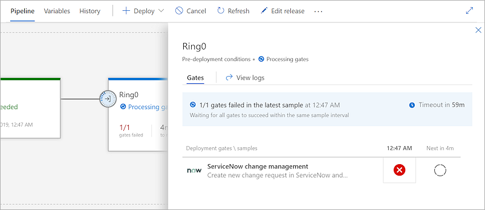
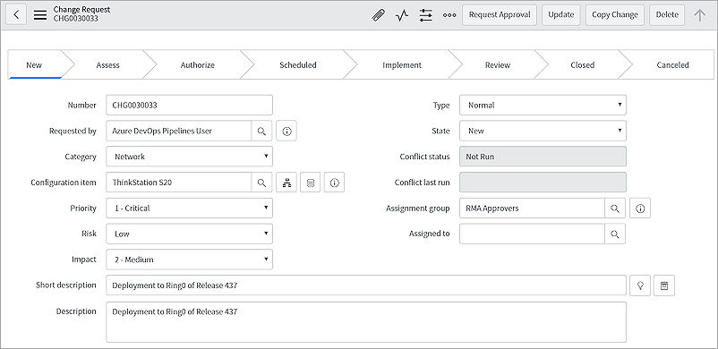
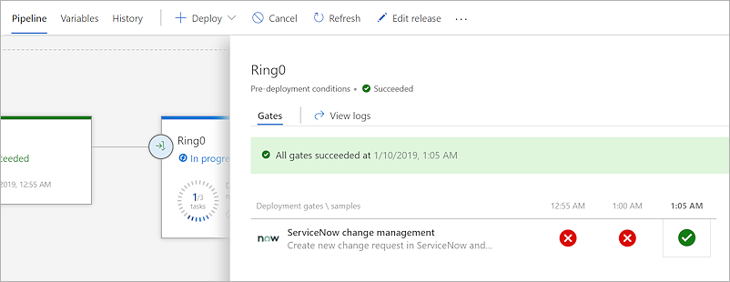
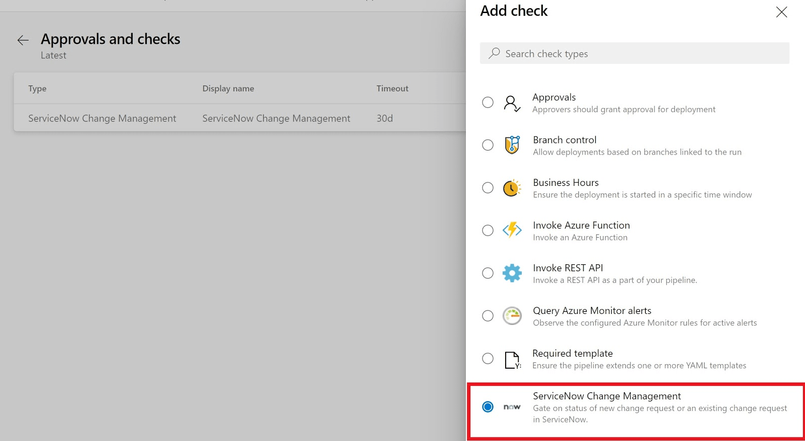

# Integrate with ServiceNow change management

[!INCLUDE [version-team-services](../../includes/version-team-services.md)]

Azure Pipelines and ServiceNow bring an integration of Azure Pipelines with
ServiceNow Change Management to enhance collaboration between development and IT teams.
By including change management in CI/CD pipelines, teams can reduce the risks associated
with changes and follow service management methodologies such as ITIL,
while gaining all DevOps benefits from Azure Pipelines.

This topic covers:

* Configuring ServiceNow for integrating with Azure Pipelines
* Including ServiceNow change management process as a release gate or a check
* Monitoring change management process from releases and pipeline runs
* Keeping ServiceNow change requests updated with deployment result

## Prerequisites 

This tutorial extends [Use approvals and gates](../deploy-using-approvals.md) and [Define approvals & checks](../../process/approvals.md).

You'll need a non-developer instance
of [ServiceNow](https://www.servicenow.com/) to which applications can be installed from the store.

## Configure the ServiceNow instance

1. Install the [Azure Pipelines](https://store.servicenow.com/sn_appstore_store.do#!/store/application/fa788cb5dbb5630040669c27db961940)
   application on your ServiceNow instance. You'll require **Hi** credentials to complete the installation.
   Refer to the [documentation](https://store.servicenow.com/sn_appstore_store.do#!/store/help?article=KB0010019)
   for more details on getting and installing applications from the ServiceNow store.

1. Create a new user in ServiceNow and grant it the `x_mioms_azpipeline.pipelinesExecution` role.

   

## Set up the Azure DevOps organization

1. Install the [ServiceNow Change Management extension](https://marketplace.visualstudio.com/items?itemName=ms-vscs-rm.vss-services-servicenowchangerequestmanagement)
   on your Azure DevOps organization.

   

   Follow the instructions to "Get it Free"

1. Create a new ServiceNow [service connection](../../library/service-endpoints.md)
   in the Azure DevOps project used for managing your pipelines.
   You can use basic auth and use the user name, password for the service account created in ServiceNow. Alternatively, you can also authenticate using oAuth. [Learn More](https://github.com/microsoft/azure-pipelines-extensions/blob/master/Extensions/ServiceNow/Src/readme.md#create-service-connection-for-servicenow-in-azure-pipelines)
   
   

## Designer release pipelines

### Add a gate to the pipeline

1. In your release pipeline, add a pre-deployment gate for ServiceNow Change Management.
 
   

1. Select the ServiceNow service connection you created earlier and enter the values for the properties of the change request. 

   

   **Inputs for the gate:**

   - **ServiceNow connection**: Connection to the ServiceNow instance used for change management.
   - **Action**: Gate on status of new change request or an existing change request.
   - **Change type**: Type of the change request.
   - **Standard change template**: Change template name for the change request.
   - **Short description**: A summary of the change.
   - **Change query criteria**: Criteria for querying change request. Must uniquely identify the change request. Gate would fail if multiple matching change requests are found.
   - **Query string/Change request number**: Change request to use.

   Additional properties can be set in the created change request using the following inputs. 
   **Note**: Available inputs change based on the selected change type.

   - **Description**: A detailed description of the change.
   - **Category**:  The category of the change eg. Hardware, Network, Software.
   - **Priority**: Priority of the change.
   - **Risk**: The risk level for the change.
   - **Impact**: The effect that the change has on business.
   - **Configuration Item**: Configuration item (CI) that the change applies to.
   - **Assignment group**:  The group that the change is assigned to.
   - **Schedule of change request**: Schedule of the change as honored by the ServiceNow workflow. Date and time should be in UTC and format should be `yyyy-MM-ddTHH:mm:ssZ. eg. 2018-01-31T07:56:59Z.`
   - **Additional change request parameters**:  Additional properties of the change request to set.                                                                                      Name must be field name (not label) prefixed with 'u_' `eg. u_backout_plan`.                                                            Value must be a valid, accepted value in ServiceNow. Invalid entries are ignored.

   **Gate Success Criteria** :
   - **Desired state of change request**: The gate would succeed and the pipeline continues when the change request status is same as the provided value.
   - **Advanced**: Specifies an expression that controls when this gate should succeed. The change request is captured as `root['result']` in the response from ServiceNow. Example - `and(eq(root['result'].state, 'New'),eq(root['result'].risk, 'Low'))`. [Learn more](https://docs.microsoft.com/en-us/azure/devops/pipelines/process/expressions?view=azure-devops).

   **Gate Output Variables** :                                                                                                             
   ServiceNow gate produces output variables.                                                                                               You must specify reference name to be able to use these output variables in the deployment workflow. Gate variables can be accessed by using `"PREDEPLOYGATE"` as a `prefix` in **an agentless job** in the workflow. For eg. when reference name is set to 'gate1', then the change number can be obtained as `$(PREDEPLOYGATE.gate1.CHANGE_REQUEST_NUMBER)`.

   - **CHANGE_REQUEST_NUMBER** : Number of the change request.
   - **CHANGE_SYSTEM_ID** : Sys Id of the change request.

1. At the end of your deployment process, add an agentless phase with a task to update the status of the change after deployment.

   

   **Inputs for Update change request task:**

   - **ServiceNow connection**: Connection to the ServiceNow instance used for change management.
   - **Change request number**: Number of the change request to update.
   - **Update status**: Select this option to update status of the change request.
   - **Updated status of change request** : Status to set for the change request. This input is available if `Update status` is selected.
   - **Close code and notes**: Closure information for the change request.
   - **Work notes**: Work notes for the change request.
   - **Additional change request parameters**:  Additional properties of the change request to set.

   > The update task would fail if none of the fields in the change request are updated during the execution of the task. ServiceNow ignores invalid fields and values passed to the task. 

### Execute a release

1. Create a new release from the configured release pipeline in Azure DevOps

1. After completing the Dev stage, the pipeline creates a new change request in ServiceNow
   for the release and waits for it to reach the desired state. 

   

1. The values defined as gate parameters will be used. You can get the change number that was created from the logs.

   

1. The ServiceNow change owner will see the release in the queue as a new change. 

   

1. The release that caused the change to be requested can be tracked from the **Azure DevOps Pipeline metadata** section of the change.

   
 
1. The change goes through its normal life cycle: Approval, Scheduled, and more until it is ready for implementation. 

1. When the change is ready for implementation (it is in the Implement state), the release in Azure DevOps proceeds.
   The gates status will be as shown here:

   

1. After the deployment, the change request is closed automatically. 

## YAML Pipelines

This tutorial assumes you have a yaml pipeline with a single stage that deploys to an environment called 'latest'. 

### Add a check

1. Add the 'ServiceNow Change Management' check to the environment. The check configuration details remain the same as the gate in designer release pipelines. 

   

### Add the update change task to the job

1. Add a server job to the specific stage and execute the 'UpdateChangeRequest' task in it. The 'changenumber' field is optional. We shall leave it empty, so the pipeline updates the change created for the current stage.

   

### Run the pipeline

1. Create a new run for the pipeline

1. At the start of the stage. A new change request would be automatically created with the specified properties. The pipeline would wait for check to complete i.e. for the change to reach the desired state.

1. Once the check is complete, the stage shall start execution. The change would be closed when update task at the end of the stage executes. 

   

## FAQs

### Q: What versions of ServiceNow are supported?

**A**: The integration is compatible with Kingston and above ServiceNow versions.

### Q: What types of change request can be managed with the integration?

**A**: Normal, standard and emergency change requests are supported with this integration.

### Q: How do I set additional change properties?

**A**: You can specify additional change properties of the change request in the **Additional change request parameters** field.
The properties are specified as key-value pairs in JSON format, the name being the field name (not the label)
prefixed with `u_` in ServiceNow and a valid value.

### Q: Can I update custom fields in the change request with additional change request parameters?

**A**: If custom fields are defined in ServiceNow for the change requests, mapping of the custom fields in import set
transform map must be added. See [ServiceNow Change Management Extension](https://github.com/Microsoft/azure-pipelines-extensions/tree/master/Extensions/ServiceNow/Src) for details.

### Q: I don't see drop-down values populated for Category, Status, and others. What should I do?

**A**: Change Management Core and Change Management - State Model plugins must be active on your ServiceNow instance for the drop-downs to work.
See [Upgrade change management](https://docs.servicenow.com/bundle/istanbul-it-service-management/page/product/change-management/task/migrate-change-mgmt-pre-geneva.html)
and [Update change request states](https://docs.servicenow.com/bundle/istanbul-it-service-management/page/product/change-management/task/state-model-activate-tasks.html) for more details.

## Related topics

* [Approvals and gates overview](index.md)
* [Approvals and checks](../../process/approvals.md)
* [Manual intervention](../deploy-using-approvals.md#configure-maninter)
* [Use approvals and gates to control your deployment](../../release/deploy-using-approvals.md)
* [Stages](../../process/stages.md)
* [Triggers](../triggers.md)

## See also

* [Video: Deploy quicker and safer with gates in Azure Pipelines](https://channel9.msdn.com/Events/Connect/2017/T181)
* [Configure your release pipelines for safe deployments](https://devblogs.microsoft.com/devops/configuring-your-release-pipelines-for-safe-deployments/)
* [Tutorial: Use approvals and gates to control your deployment](../deploy-using-approvals.md)
* [Twitter sentiment as a release gate](https://blogs.msdn.microsoft.com/bharry/2017/12/15/twitter-sentiment-as-a-release-gate/)
* [GitHub issues as a release gate](https://www.visualstudiogeeks.com/DevOps/github-issues-as-deployment-gate-in-vsts-rm)
* [Author custom gates](https://github.com/Microsoft/azure-pipelines-tasks/blob/master/docs/authoring/gates.md). [Library with examples](https://github.com/Microsoft/vsts-rm-extensions/tree/master/ServerTaskHelper/DistributedTask.ServerTask.Remote.Common) 

[!INCLUDE [rm-help-support-shared](../../includes/rm-help-support-shared.md)]
