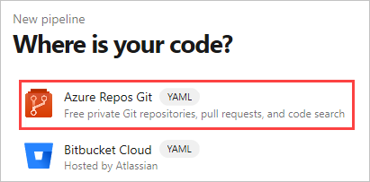
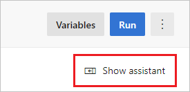
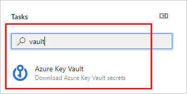
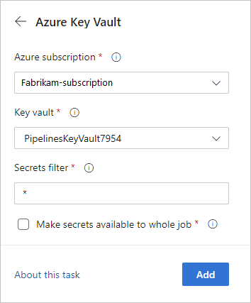
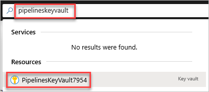
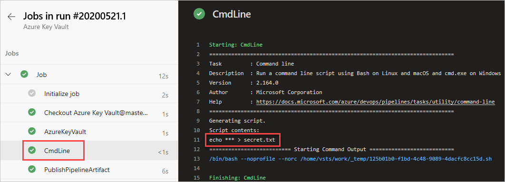
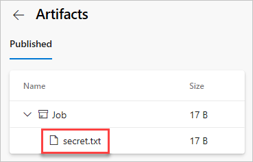

# Use secrets from Azure Key Vault in Azure Pipelines

[!INCLUDE [version-server-2019-rtm](../includes/version-server-2019-rtm.md)]

[Azure Key Vault](/azure/key-vault/general/basic-concepts) helps teams to securely store and manage sensitive information such as API keys, passwords, certificates, etc.
 
In this tutorial, you will learn about:

> [!div class="checklist"]
> * Creating an Azure Key Vault using the Azure CLI
> * Adding a secret and configuring access for the Azure Key Vault 
> * Securely using secrets in your pipeline

## Prerequisites

[!INCLUDE [include](../includes/azure-prerequisites.md)]

* An Azure DevOps organization. If you don't have one, you can [create one for free](../get-started/pipelines-sign-up.md). 

> [!TIP]
> Another way of working with secrets is using [Secret variables](../process/variables.md#secret-variables) in your Azure Pipeline or setting up [secret variables in variable groups](../process/variables.md#reference-secret-variables-in-variable-groups).

<a name="creating-azure-key-vault"></a>

## Create an Azure Key Vault

This tutorial uses a simple scenario to illustrate the integration between Azure Pipelines and Azure Key Vault. The first step is to create an Azure Key Vault. This can be done through Azure portal or Azure CLI. We will use the CLI in this tutorial

[!INCLUDE [include](../ecosystems/includes/sign-in-azure-cli.md)]


1. If you have more than one Azure subscription associated with your account, use the command below to specify a default subscription. You can use `az account list` to generate a list of your subscriptions.

    ```Azure CLI
    az account set --subscription <your_subscription_name_or_ID>
    ```

1. Run the following command to set a default Azure region for your subscription. You can use `az account list-locations` to generate a list of available regions.

    ```Azure CLI
    az configure --defaults location=<your_region>
    ```

    For example, this command will select the westus2 region:

    ```Azure CLI
    az configure --defaults location=westus2
    ```

1. Run the following command to create a new resource group.

    ```Azure CLI
    az group create --name <your-resource-group>
    ```
   
1. Run the following command to create a new key vault.

    ```Azure CLI
    az keyvault create \
      --name <your-key-vault> \
      --resource-group <your-resource-group>
    ```

1. Run the following command to create a new secret in your key vault. Secrets are stored as a key value pair. In the example below, `Password` is the key and `mysecretpassword` is the value. 

    ```Azure CLI
    az keyvault secret set \
      --name "Password" \
      --value "mysecretpassword" \
      --vault-name <your-key-vault>
    ```

## Sign in to Azure Pipelines

> [!TIP]
> You will need to switch back and forth between Azure and Azure DevOps during this tutorial. It is recommended that you open a new tab to perform the upcoming Azure DevOps tasks.

[!INCLUDE [include](../ecosystems/includes/sign-in-azure-pipelines.md)]

[!INCLUDE [include](../ecosystems/includes/create-project.md)]

## Create the pipeline

### Create a repo

We will use YAML to create our pipeline but first we need to create our new repo. 

1. Sign in to your Azure DevOps organization and navigate to your project.

1. Go to **Repos**, and then select **Initialize** to initialize a new repo with a README.

    > [!div class="mx-imgBorder"]  
    > 

### Create a new pipeline

1. Go to **Pipelines**, and then select **New Pipeline**.

1. Select **Azure Repos Git**.

    > [!div class="mx-imgBorder"]  
    > 

1. Select the repo you created earlier. It should have the same name as your Azure DevOps project.

1. Select **Starter pipeline**.

1. The default pipeline will include a few scripts that run echo commands. Those are not needed so we can delete them. Your new YAML file will now look like this:

    ```
	trigger:
	- main
	
	pool:
	  vmImage: 'ubuntu-latest'
	
	steps:
    ```

1. Select **Show assistant** to expand the assistant panel. This panel provides convenient and searchable list of pipeline tasks.  

    > [!div class="mx-imgBorder"]  
    > 

1. Search for **vault** and select the [**Azure Key Vault**](../tasks/deploy/azure-key-vault.md) task.

    > [!div class="mx-imgBorder"]  
    > 

1. Select and authorize the Azure subscription you used to create your Azure key vault earlier. Select the key vault and select **Add** to insert the task at the end of the pipeline. This task allows the pipeline to connect to your Azure Key Vault and retrieve secrets to use as pipeline variables.

    > [!NOTE]
    > **Make secrets available to whole job** is not currently supported in Azure DevOps Server.

    > [!div class="mx-imgBorder"]  
    > 

    > [!NOTE]
	> This process creates a principal in Azure that will need to be granted access to the key vault. We will set up permissions in a later step.

1. This step is optional. To verify the retrieval and processing of our secret through the pipeline, add the script below to your YAML file to print the secret to a text file and publish it for review. This is not recommended and it is for demonstration purposes only.

    ```
    - script: echo $(Password) > secret.txt

    - publish: secret.txt
    ```

    > [!NOTE]
    > YAML is very particular about formatting and indentation. Make sure your YAML file is indented properly.

1. Do not save or run the pipeline yet. It will fail at this time because the pipeline does not have permissions to access the key vault yet.

### Configure Azure Key Vault access

1. Go to [Azure portal](https://azure.microsoft.com/).

1. Use the search bar at the top to search for your key vault you created earlier and select it.

    > [!div class="mx-imgBorder"]  
    > 

1.  Under **Settings** Select **Access policies**.

1. Select **Add Access Policy** to add a new policy.

1. For **Secret permissions**, select **Get** and **List**.

1. Select the option to select a principal and search for yours.

    A security principal is an object that represents a user, group, service, or application that's requesting access to Azure resources. Azure assigns a unique object ID to every security principal. The default naming convention is `[Azure DevOps account name]-[Azure DevOps project name]-[subscription ID]` so if your account is https://dev.azure.com/Contoso and your team project is AzureKeyVault, your principal would look something like this `Contoso-AzureKeyVault-[subscription ID]`.

    > [!TIP]
    > You may need to minimize the Azure CLI panel to see the **Select** button in the principal search panel.
    
1. Select **Add** to create the access policy.

1. Select **Save**.

## Run and review the pipeline

1. Return to the open pipeline tab where you left off.

1. Select **Save** then **Save** again to commit your changes and trigger the pipeline.

1. Select the pipeline job view the execution logs.  

    > [!NOTE]
    > You may be asked to allow the pipeline to access Azure resources, if prompted select **Allow**. You will only have to approve it once. 

1. Select the **CmdLine** job to view the logs. Note that the actual secret is not part of the logs. 

    > [!div class="mx-imgBorder"]  
    > 

1. Return to the pipeline summary and select the published artifact.

    > [!div class="mx-imgBorder"]  
    > 

1. Under **Job** select the **secret.txt** file to view it.

    > [!div class="mx-imgBorder"]  
    > 

1. The text file contains our secret: `mysecretpassword`. This concludes the optional verification step we mentioned earlier.

## Clean up resources

Follow the steps below to delete the resources we created in this tutorial:

1. If you created a new organization to host your project, see [how to delete your organization](../../organizations/accounts/delete-your-organization.md), otherwise [delete your project](../../organizations/projects/delete-project.md)).

1. All Azure resources created during this tutorial are hosted under a single resource group `PipelinesKeyVaultResourceGroup`. Run the following command to delete the resource group and all of its resources.

    ```aAzure CLI
    az group delete --name PipelinesKeyVaultResourceGroup
    ```

## Next steps

> [!div class="nextstepaction"]
> [Architect secure infrastructure in Azure](/learn/paths/architect-secure-infrastructure/)
> [Secure your cloud data](/learn/paths/secure-your-cloud-data/)
