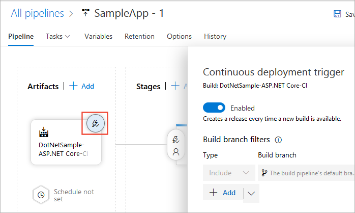
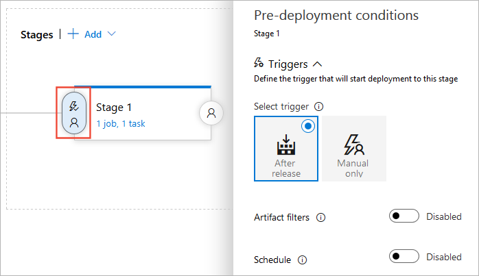
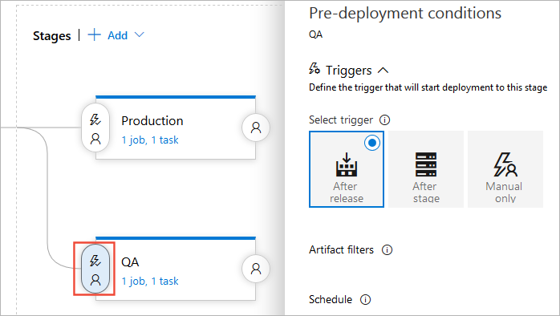
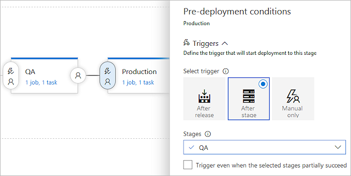
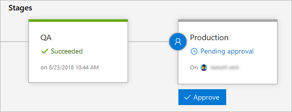
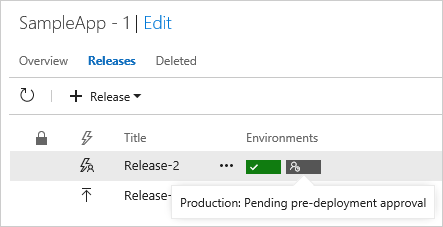
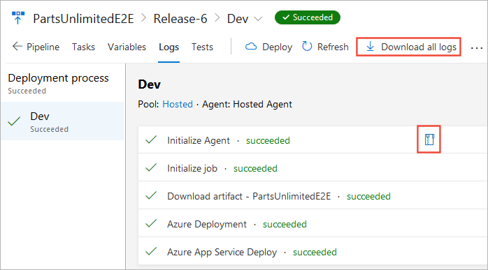

# Define your multi-stage continuous deployment (CD) pipeline

[!INCLUDE [version-tfs-2015-rtm](../includes/version-tfs-2015-rtm.md)]

::: moniker range="<= tfs-2018"

[!INCLUDE [temp](../includes/concept-rename-note.md)]

::: moniker-end

Azure Pipelines provide a highly configurable and manageable pipeline for releases to multiple stages such as development, staging, QA, and production. it also offer the opportunity to implement gates and approvals at each specific stage.

In this tutorial, you will learn about:

> [!div class="checklist"]
> * Configure triggers within release pipelines
> * Extend release pipelines by adding stages
> * Configure stages as a multi-stage release pipeline
> * Add approvals to release pipelines
> * Create releases and monitor deployments to each stage

## Prerequisites

You'll need:

* A release pipeline that contains at least one stage. If you don't already have one, you can create it by working through any of the following quickstarts and tutorials:

  - [Deploy to an Azure Web App](../apps/cd/deploy-webdeploy-webapps.md)
  - [Azure DevOps Project](../get-started-azure-devops-project.md)
  - [Deploy to IIS web server on Windows](../apps/cd/deploy-webdeploy-iis-deploygroups.md)

* Two separate targets where you will deploy the app. These could be virtual machines, web servers, on-premises physical deployment groups, or other types of deployment target.
  In this example, we are using Azure App Services website instances. If you decide to do the same, you will have to choose names that are unique, but it's a good idea to include
  "QA" in the name of one, and "Production" in the name of the other so that you can easily identify them. Use the Azure portal to create a new web app.

## Continuous deployment (CD) triggers

Enabling continuous deployment trigger will instruct the pipeline to automatically create a new release every time a new build is available.

1. In **Azure Pipelines**, open the **Releases** tab. Select your release pipeline select **Edit**.

   > [!div class="mx-imgBorder"]  
   > 

1. Select the **Continuous deployment trigger** icon in the **Artifacts** section to open the trigger panel. Make sure this is enabled so that a new release is created after every new successful build is completed.

   > [!div class="mx-imgBorder"]    
   > 

1. Select the **Pre-deployment conditions** icon in the **Stages** section to open the conditions panel.
   Make sure that the trigger for deployment to this stage is set to **After release**. This means that a deployment will be initiated automatically when a new release is created from this release pipeline.   

   > [!div class="mx-imgBorder"]  
   > 

   You can also setup [Release triggers](triggers.md), [Stage triggers](triggers.md#stage-triggers) or [schedule deployments](triggers.md##scheduled-release-triggers).

## Extend a release pipeline by adding stages

In this section, you will add a new stage to the release pipeline. The two stages will deploy your app to the "QA" and "Production" stages (in our example, two Azure App Services websites). This is a typical scenario where you deploy initially to a test or staging server, and then to a live or production server. Each [stage](../process/stages.md)
represents one deployment target.

1. Select the **Pipeline** tab in your release pipeline and select the existing stage. Change the name of your stage to **Production**.

   > [!div class="mx-imgBorder"]
   > 

1. Select the **+ Add** drop-down list and choose **Clone stage** (the clone option is available only when an existing stage is selected).

   > [!div class="mx-imgBorder"]
   > 

   Typically, you want to use the same deployment methods with a test and a production stage so that you can be sure your deployed apps will behave the same way. Cloning an existing stage is a good way to ensure you have the same settings for both. You then just need to change the deployment targets.

1. Your cloned stage will have the name **Copy of Production**. Select it and change the name to **QA**.

   > [!div class="mx-imgBorder"]   
   > 

1. To reorganize the stages in the pipeline, select the **Pre-deployment conditions** icon in your **QA** stage and set the trigger to **After release**. The pipeline diagram will then show the two stages in parallel.

   > [!div class="mx-imgBorder"]   
   > 

1. Select the **Pre-deployment conditions** icon in your **Production** stage and set the trigger to **After stage**, then select **QA** in the **Stages** drop-down list.
   The pipeline diagram will now indicate that the two stages will execute in the correct order.

   > [!div class="mx-imgBorder"]    
   > 

   > [!NOTE]   
   > You can set up your deployment to start when a deployment to the previous stage is _partially_ successful. This means that the deployment will continue even if a specific non-critical task have failed. This is usually used in a fork and join deployments that deploy to different stages in parallel.
    
1. Select the **Tasks** drop-down list and select the **QA** stage.

   > [!div class="mx-imgBorder"] 
   > 

1. Depending on the tasks that you are using, change the settings so that this stage deploys to your "QA" target. In our example, we will be using **Deploy Azure App Service** task as shown below. 

   > [!div class="mx-imgBorder"]
   > 

## Add approvals within a release pipeline

The release pipeline you have modified deploys to test and then to production. If the deployment to test fails, the trigger
on the production stage does not fire, and so it is not deployed to production. However, it is typically the case that
you want the deployment to pause after _successful_ deployment to the test website so that you can verify the app is working correctly before
you deploy to production. In this section, you will add an approval step to the release pipeline to achieve this.

1. Back in the **Pipeline** tab of the release pipeline, choose the **Pre-deployment conditions** icon in the **Stages** section
   to open the conditions panel. Scroll down to the **Pre-deployment approvers** section and enable pre-deployment approvers.

   

1. In the **Approvers** section, choose your user(s) from the list. You
   can type part of a name to search for matches. Also make sure you clear (untick) the checkbox 
   **User requesting a release...** so that you can approve your own releases.

   

   You can add as many approvers as you need, both individual users and organization groups.
   It's also possible to set up post-deployment approvals by choosing the icon at the right side of the stage item in the pipeline diagram.
   For more information, see [Approvals and gates overview](approvals/index.md).

1. Save the modified release pipeline.

   

## Create a release

Now that you have completed the modifications to the release pipeline, it's time to start the deployment. To do this, you
create a release from the release pipeline. A release may be created automatically; for example, the continuous deployment
trigger is set in the release pipeline. This means that modifying
the source code will start a new build and, from that, a new release. However, in this section you will create a new release manually.

1. Open the **Release** drop-down list and choose **Create release**.

   

1. Enter a description for the release, check that the correct artifacts are selected, and then choose **Create**.

   

1. After a few moments, a banner appears indicating that the new release was created.
   Choose the link (the name of the release).

   

1. The release summary page opens showing details of the release. In the **Stages** section,
   you will see the deployment status for the "QA" stage change to "Succeeded" and, at that point,
   an icon appears indicating that the release is now waiting for approval.

   

   Other views, such as the list of releases, also display an icon that indicates approval is pending.
   The icon shows a pop-up containing the stage name and more details when you point to it.
   This makes it easy for an administrator to see which releases are awaiting approval, as well as the overall progress of all releases.    

   

1. Choose the icon or link to open the approval dialog. Enter a brief note about the
   approval, and choose **Approve**.

   

   Notice that you can defer a deployment to a specific day and time; for example, a time when you expect the app to be only lightly loaded.
   You can also reassign the approval to another user. Release administrators can open _any_ approval
   and over-ride it to accept or reject that deployment.

## Monitor and track deployments

In this section, you will see how you can monitor and track deployments - in this example to two Azure App Services websites -
from the release you created in the previous section.

1. In the release summary, hover over a stage and choose the **Logs** link that appears.

   

   While the deployment is taking place, the logs page shows the live log from the agent.
   After the deployment is complete, links to the logs for each task step are displayed in the right pane.
   
1. Select any of the pipeline steps to show just the log file contents for that step.
   This makes it easier to trace and debug individual parts of the overall deployment. Alternatively, download
   the individual log files, or a zip of all the log files, from the icons and links in the page.

   

1. If you are having problems with a deployment, you can get more information from the log files by
   [running the release in debug mode](../../pipelines/release/variables.md#debug-mode).

## Next step

> [!div class="nextstepaction"]
> [Use approvals and gates to control your deployment](deploy-using-approvals.md)
