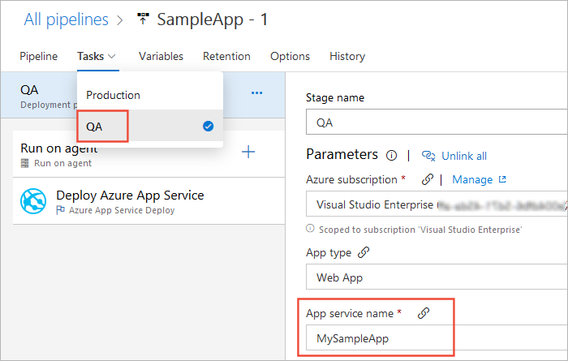
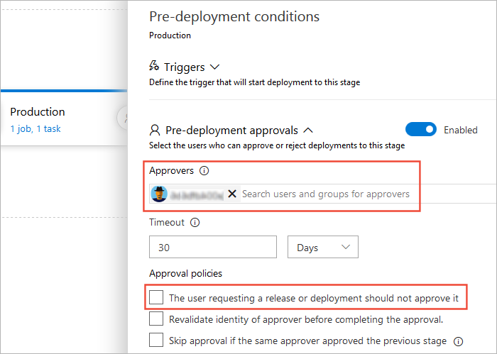
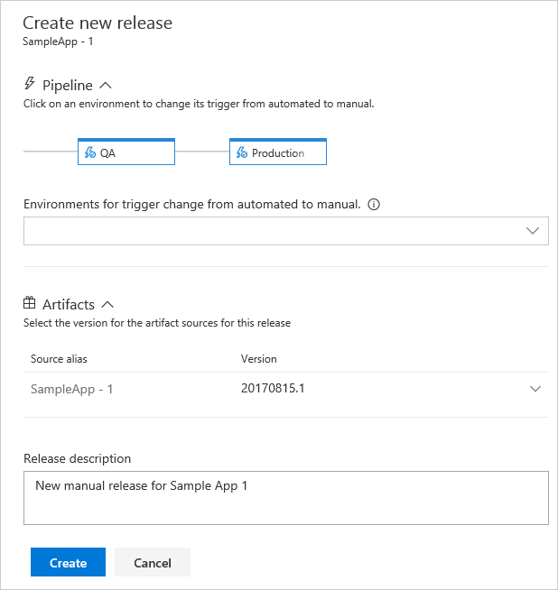

# Define your multi-stage continuous deployment (CD) pipeline

[!INCLUDE [version-tfs-2015-rtm](../includes/version-tfs-2015-rtm.md)]

::: moniker range="<= tfs-2018"

[!INCLUDE [temp](../includes/concept-rename-note.md)]

::: moniker-end

Azure Pipelines provide a highly configurable and manageable pipeline for releases to multiple stages such as development, staging, QA, and production. it also offer the opportunity to implement gates and approvals at each specific stage.

In this tutorial, you will learn about:

> [!div class="checklist"]
> * Configure triggers within release pipelines
> * Extend release pipelines by adding stages
> * Configure stages as a multi-stage release pipeline
> * Add approvals to release pipelines
> * Create releases and monitor deployments to each stage

## Prerequisites

You'll need:

* A release pipeline that contains at least one stage. If you don't already have one, you can create it by working through any of the following quickstarts and tutorials:

  - [Deploy to an Azure Web App](../apps/cd/deploy-webdeploy-webapps.md)
  - [Azure DevOps Project](../get-started-azure-devops-project.md)
  - [Deploy to IIS web server on Windows](../apps/cd/deploy-webdeploy-iis-deploygroups.md)

* Two separate targets where you will deploy the app. These could be virtual machines, web servers, on-premises physical deployment groups, or other types of deployment target.
  In this example, we are using Azure App Services website instances. If you decide to do the same, you will have to choose names that are unique, but it's a good idea to include
  "QA" in the name of one, and "Production" in the name of the other so that you can easily identify them. Use the Azure portal to create a new web app.

## Continuous deployment (CD) triggers

Enabling continuous deployment trigger will instruct the pipeline to automatically create a new release every time a new build is available.

1. In **Azure Pipelines**, open the **Releases** tab. Select your release pipeline select **Edit**.

   > [!div class="mx-imgBorder"]  
   > 

1. Select the **Continuous deployment trigger** icon in the **Artifacts** section to open the trigger panel. Make sure this is enabled so that a new release is created after every new successful build is completed.

   > [!div class="mx-imgBorder"]    
   > 

1. Select the **Pre-deployment conditions** icon in the **Stages** section to open the conditions panel.
   Make sure that the trigger for deployment to this stage is set to **After release**. This means that a deployment will be initiated automatically when a new release is created from this release pipeline.   

   > [!div class="mx-imgBorder"]  
   > 

   You can also setup [Release triggers](triggers.md), [Stage triggers](triggers.md#stage-triggers) or [schedule deployments](triggers.md##scheduled-release-triggers).

## Add stages

In this section, we will add two new stages to our release pipeline: QA and production (Two Azure App Services websites in this example). This is a typical scenario where you would deploy initially to a test or staging server, and then to a live or production server. Each [stage](../process/stages.md) represents one deployment target.

1. Select the **Pipeline** tab in your release pipeline and select the existing stage. Change the name of your stage to **Production**.

   > [!div class="mx-imgBorder"]
   > 

1. Select the **+ Add** drop-down list and choose **Clone stage** (the clone option is available only when an existing stage is selected).

   > [!div class="mx-imgBorder"]
   > 

   Typically, you want to use the same deployment methods with a test and a production stage so that you can be sure your deployed apps will behave the same way. Cloning an existing stage is a good way to ensure you have the same settings for both. You then just need to change the deployment targets.

1. Your cloned stage will have the name **Copy of Production**. Select it and change the name to **QA**.

   > [!div class="mx-imgBorder"]   
   > 

1. To reorganize the stages in the pipeline, select the **Pre-deployment conditions** icon in your **QA** stage and set the trigger to **After release**. The pipeline diagram will then show the two stages in parallel.

   > [!div class="mx-imgBorder"]   
   > 

1. Select the **Pre-deployment conditions** icon in your **Production** stage and set the trigger to **After stage**, then select **QA** in the **Stages** drop-down list.
   The pipeline diagram will now indicate that the two stages will execute in the correct order.

   > [!div class="mx-imgBorder"]    
   > 

   > [!NOTE]   
   > You can set up your deployment to start when a deployment to the previous stage is _partially_ successful. This means that the deployment will continue even if a specific non-critical task have failed. This is usually used in a fork and join deployments that deploy to different stages in parallel.
    
1. Select the **Tasks** drop-down list and select the **QA** stage.

   > [!div class="mx-imgBorder"] 
   > 

1. Depending on the tasks that you are using, change the settings so that this stage deploys to your "QA" target. In our example, we will be using **Deploy Azure App Service** task as shown below. 

   > [!div class="mx-imgBorder"]
   > 

## Add Pre-deployment approvals

The release pipeline we previously modified deploys to QA and production. If the deployment to QA fails then deployment to production won't trigger.
It is recommended to always verify if your app is working properly in QA or test stage before deploying to production. Adding approvals will ensure all the criteria are met before deploying to the next stage. To add approvals to your pipeline follow the steps below:

1. Select the **Pipeline** tab,  **Pre-deployment conditions** icon then **Pre-deployment approvers**.

   > [!div class="mx-imgBorder"] 
   > 

1. In the **Approvers** text box, enter the user(s) that will be responsible for approving the deployment. It is also recommended to uncheck the **The user requesting a release or deployment should not approve it** check box.

   > [!div class="mx-imgBorder"] 
   > 

   You can add as many approvers as you need, both individual users and organization groups. It's also possible to set up post-deployment approvals by selecting the "user" icon at the right side of the stage in the pipeline diagram. For more information, see [Releases gates and approvals](approvals/index.md).

1. Select **Save**.

   > [!div class="mx-imgBorder"] 
   > 

## Create a release

Now that the release pipeline setup is complete, it's time to start the deployment. To do this, we will manually create a new release. Usually a release is created automatically when a new build artifact is available. However, in this scenario we will create it manually.

1. Select the **Release** drop-down list and choose **Create release**.

   > [!div class="mx-imgBorder"] 
   > 

1. Enter a description for your release, check that the correct artifacts are selected, and then select **Create**.

   > [!div class="mx-imgBorder"]
   > 

1. A banner will appear indicating that a new release has been create. Select the release link to see more details.

   > [!div class="mx-imgBorder"]
   > 

1. The release summary page will show the status of the deployment to each stage.

   > [!div class="mx-imgBorder"]
   > 

   Other views, such as the list of releases, also display an icon that indicates approval is pending. The icon shows a pop-up containing the stage name and more details when you point to it. This makes it easy for an administrator to see which releases are awaiting approval, as well as the overall progress of all releases.    

   > [!div class="mx-imgBorder"]
   > 

1. Select the _pending_approval_ icon to open the approval window panel. Enter a brief comment, and select **Approve**.

   > [!div class="mx-imgBorder"]
   > 

> [!NOTE]   
> You can schedule deployment at a later date, for example during non-peak hours. You can also reassign approval to a different user. Release administrators can access and override all approval decisions.

## Monitor and track deployments

Deployment logs help you monitor and debug the release of your application. To check the logs of our deployment follow the steps below:

1. In the release summary, hover over a stage and select **Logs**.

   > [!div class="mx-imgBorder"]
   > 

   During deployment you can still access the logs page to see the live logs of every task.
   
1. Select any task to see the logs for that specific task. This makes it easier to trace and debug deployment issues. You can also download individual task logs, or a zip of all the log files.

   > [!div class="mx-imgBorder"]
   > 

1. If you need additional information to debug your deployment you can [run the release in debug mode](../../pipelines/release/variables.md#debug-mode).

## Next step

> [!div class="nextstepaction"]
> [Use approvals and gates to control your deployment](deploy-using-approvals.md)
