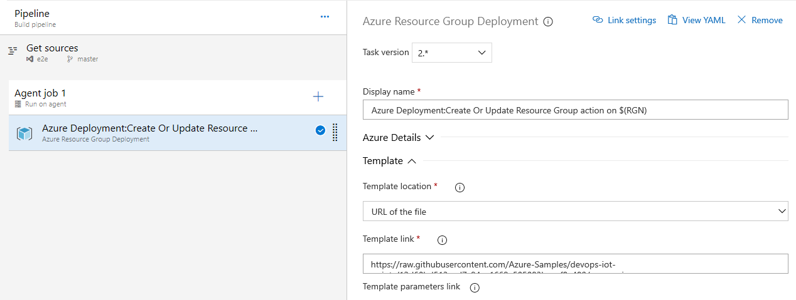
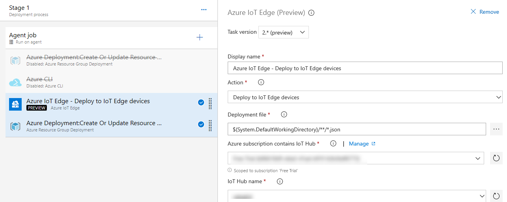

# Automatically deploy to IoT edge devices 

[!INCLUDE [include](../includes/version-team-services.md)]

In this tutorial, you'll learn how to build an Azure Internet of Things (IoT) solution, push the created module images to your Azure Container Registry (ACR), create a deployment manifest, and then deploy the modules to targeted IoT edge devices.

## Prerequisites

1. **Visual Studio (VS) Code** to create an Iot Edge module. You can download it from [here](https://code.visualstudio.com/?wt.mc_id=DX_841432).

1. **Azure DevOps Services organization**. If you don't yet have one, you can [get one for free](../../user-guide/sign-up-invite-teammates.md).

1. **Microsoft Azure Account**. If you don't yet have one, you [can create one for free](https://azure.microsoft.com/free/).

1. [Azure IoT tools](https://marketplace.visualstudio.com/items?itemName=vsciot-vscode.azure-iot-tools) for VS Code.

1. [Docker CE](https://docs.docker.com/install/).

1. Create an [Azure Container Registry](https://docs.microsoft.com/azure/container-registry/container-registry-get-started-portal).

## Create an IoT Edge project

The following steps creates an [IoT Edge](https://docs.microsoft.com/azure/iot-edge/tutorial-csharp-module#create-a-module-project) module project that's based on .NET Core SDK by using VS Code and Azure IoT tools.

1. In the VS Code, select **View > Command Palette** to open the VS Code command palette.

1. In the command palette, enter and run the command **Azure: Sign in** and follow the instructions to sign in your Azure account. If you're already signed in, you can skip this step.

1. In the command palette, enter and run the command **Azure IoT Edge: New IoT Edge solution**. Follow the prompts in the command palette to create the solution.

    <table><thead><tr><th>Field</th><th>Values</th></tr></thead>
    <tr><td>Select Folder</td><td>Choose the location on your development machine for VS Code to create the solution files</td></tr>
    <tr><td>Provide a solution name</td><td>Enter a descriptive name for your solution or accept the default EdgeSolution</td></tr>
    <tr><td>Select module template</td><td>Choose <b>C# Module</b></td></tr>
    <tr><td>Provide a module name</td><td>Name your module <b>CSharpModule</b></td></tr>
    <tr><td>Provide Docker image repository for the module</td><td>An image repository includes the name of your container registry and the name of your container image. Your container image is prepopulated from the name that you have provided in the last step. Replace <b>localhost:5000</b> with the login server value from your Azure container registry. You can retrieve the login server from the Overview page of your container registry in the Azure portal.</td></tr>
    </table>

The VS Code window loads your IoT Edge solution workspace. The solution workspace contains five top-level components.

1. **modules** - contains **C#** code for your module as well as Dockerfiles for building your module as a container image

1. **.env** - file stores your container registry credentials

1. **deployment.template.json** - file contains the information that the IoT Edge runtime uses to deploy the modules on a device

1. **deployment.debug.template.json** - file contains the debug version of modules

1. **.vscode** and **.gitignore** - do not edit

If you didn't specify a container registry when creating your solution, but accepted the default localhost:5000 value, you won't have a .env file.

## Add registry credentials

The environment file stores the credentials for your container registry and shares them with the IoT Edge runtime. The runtime needs these credentials to pull your private images onto the IoT Edge device.

1. In the VS Code explorer, open the .env file.

1. Update the fields with the user name and password values that you copied from your Azure container registry.

1. Save this file.

## Build your IoT Edge solution

In the previous section, you created an IoT Edge solution using CSharpModule. Now you need to build the solution as a container image and push it to the container registry.

1. In the VS Code explorer, right-click on the **deployment.template.json** file and select **Build IoT Edge solution**.

1. Upon successful build, you should see an image with the following format **registryname.azurecr.io/csharpmodule:0.0.1-amd64.**

## Push the code to Azure Repo

If your workspace isn't under Git source control, you can easily create a Git repository with the **Initialize Repository** command.

1. In the VS Code, select **View > Command Palette** to open the VS Code command palette.

1. Run the **Git: Initialize Repository** command from the Command Palette. Running Initialize Repository will create the necessary Git repository metadata files and show your workspace files as untracked changes ready to be staged.

1. Select **View > Terminal** to open the terminal. To **push, pull** and **sync** you need to have a Git origin set up. You can get the required URL from the repo host. Once you have that URL, you need to add it to the Git settings by running a couple of command line actions as shown below.

    ```Git
    git remote add origin https://<org name@dev.azure.com>/<org name>/<project name>/_git/<repo name>
    git push -u origin --all
    ```

1. From the browser, navigate to the repo. You should see the code.

## Create a build pipeline

You can use Azure Pipelines to build your projects on Windows, Linux, or macOS without needing to set up any infrastructure of your own. The [Microsoft-hosted agents](https://docs.microsoft.com/azure/devops/pipelines/agents/hosted?tabs=yaml) in Azure Pipelines have several released versions of the .NET Core SDKs preinstalled.

1. Navigate to your team project on Azure DevOps.

2. Navigate to **Pipelines | Builds**. From the **New** drop-down menu, select **New build pipeline** to create a new one.

3. The default option for build pipelines involves using YAML to define the process. For this lab, select **use the classic editor**.

4. The first thing you’ll need to do is to configure the source repository. This build will use the **main** branch of the **IoT Edge module** repo. Leave the defaults and select **Continue**.

5. Select **Empty job**.

6. Select the Agent pool **Hosted Ubuntu 1604** from the drop down.

7. Select **+** and search for **Azure Resource Group Deployment** task. Select **add**. Configure the task as shown below -

   <table><thead><tr><th>Field</th><th>Values</th></tr></thead>
   <tr><td>Azure subscription</td><td>(Required) Name of <a href="../library/connect-to-azure.md" data-raw-source="[Azure Resource Manager service connection](../library/connect-to-azure.md)">Azure Resource Manager service connection</a></td></tr>
   <tr><td>Action</td><td>(Required) Action to perform. Leave the default value as is</td></tr>
   <tr><td>Resource group</td><td>(Required) Provide the name of a resource group</td></tr>
   <tr><td>Location</td><td>(Required) Provide the location for deploying the resource group</td></tr>
   <tr><td>Template location</td><td>(Required) Set the template location to <b>URL of the file</b></td></tr>
   <tr><td>Template link</td><td>(Required) <a href="https://raw.githubusercontent.com/Azure-Samples/devops-iot-scripts/12d60bd513ead7c94aa1669e505083beaef8a480/arm-acr.json" data-raw-source="https://raw.githubusercontent.com/Azure-Samples/devops-iot-scripts/12d60bd513ead7c94aa1669e505083beaef8a480/arm-acr.json">https://raw.githubusercontent.com/Azure-Samples/devops-iot-scripts/12d60bd513ead7c94aa1669e505083beaef8a480/arm-acr.json</a></td></tr>
   <tr><td>Override template parameters</td><td><b>-registryName YOUR_REGISTRY_NAME -registrySku &quot;Basic&quot; -registryLocation &quot;YOUR LOCATION&quot;</td></tr>
   </table>

   > [!NOTE]
   > Save the pipeline and queue the build. The above step will create an Azure Container Registry. This is required to push the IoT module images.

   

8. Edit the pipeline, and select **+**, and search for the **Azure IoT Edge** task. Select **add**. This step will build the module images.  

9. Select **+** and search for the **Azure IoT Edge** task. Select **add**. Configure the task as shown below -

    <table><thead><tr><th>Field</th><th>Values</th></tr></thead>
   <tr><td>Action</td><td>Select an Azure IoT Edge action to <b>Push module images</b></td></tr>
   <tr><td>Container registry type</td><td>Select the Container registry type <b>Azure Container Registry</b></td></tr>
   <tr><td>Azure subscription</td><td>Select the Azure Resource Manager subscription for the deployment</td></tr>
   <tr><td>Azure Container Registry</td><td>Select an Azure Container Registry from the dropdown which was created in the step 5</td></tr>
   </table>

10. Select **+** and search for **Publish Build Artifacts** task. Select **add**. Set the path to publish to **$(Build.ArtifactStagingDirectory)/deployment.amd64.json**.

11. Save the pipeline and queue the build.

     

## Create a release pipeline

The build pipeline has already built a Docker image and pushed it to an Azure Container Registry. In the release pipeline we will create an IoT hub, IoT Edge device in that hub, deploy the sample module from the build pipeline, and provision a virtual machine to run as your IoT Edge device.

1. Navigate to the **Pipelines | Releases**.

2. From the **New** drop-down menu, select **New release pipeline** to create a new release pipeline. 

3. Select **Empty job** to create the pipeline.

4. Select **+** and search for **Azure Resource Group Deployment** task. Select **add**. Configure the task as shown below. 

    <table><thead><tr><th>Field</th><th>Values</th></tr></thead>
   <tr><td>Azure subscription</td><td>(Required) Name of <a href="../library/connect-to-azure.md" data-raw-source="[Azure Resource Manager service connection](../library/connect-to-azure.md)">Azure Resource Manager service connection</a></td></tr>
   <tr><td>Action</td><td>(Required) Action to perform. Leave the default value as is</td></tr>
   <tr><td>Resource group</td><td>(Required) Provide the name of a resource group</td></tr>
   <tr><td>Location</td><td>(Required) Provide the location for deploying the resource group</td></tr>
   <tr><td>Template location</td><td>(Required) Set the template location to <b>URL of the file</b></td></tr>
   <tr><td>Template link</td><td>(Required) <a href="https://raw.githubusercontent.com/Azure-Samples/devops-iot-scripts/12d60bd513ead7c94aa1669e505083beaef8a480/arm-iothub.json" data-raw-source="https://raw.githubusercontent.com/Azure-Samples/devops-iot-scripts/12d60bd513ead7c94aa1669e505083beaef8a480/arm-iothub.json">https://raw.githubusercontent.com/Azure-Samples/devops-iot-scripts/12d60bd513ead7c94aa1669e505083beaef8a480/arm-iothub.json</a></td></tr>
   <tr><td>Override template parameters</td><td><b>-iotHubName IoTEdge -iotHubSku &quot;S1&quot;</td></tr>
   </table>

5. Select **+** and search for **Azure CLI** task. Select **add** and configure the task as shown below. 

   - **Azure subscription**: Select the Azure Resource Manager subscription for the deployment

   - **Script Location**: Set the type to **Inline script** and copy paste the below script
    
     ```azurecli
     (az extension add --name azure-cli-iot-ext && az iot hub device-identity show --device-id YOUR_DEVICE_ID --hub-name YOUR_HUB_NAME) || (az iot hub device-identity create --hub-name YOUR_HUB_NAME --device-id YOUR_DEVICE_ID --edge-enabled && TMP_OUTPUT="$(az iot hub device-identity show-connection-string --device-id YOUR_DEVICE_ID --hub-name YOUR_HUB_NAME)" && RE="\"cs\":\s?\"(.*)\"" && if [[ $TMP_OUTPUT =~ $RE ]]; then CS_OUTPUT=${BASH_REMATCH[1]}; fi && echo "##vso[task.setvariable variable=CS_OUTPUT]${CS_OUTPUT}")
     ```

     In the above script, replace the following with your details -

   - hub name

   - device id

     > [!NOTE]
     > Save the pipeline and queue the release. The above 2 steps will create an IoT Hub.

     

6. Edit the pipeline and select **+** and search for the **Azure IoT Edge** task. Select **add**. This step will Deploy the module images to IoT Edge devices. Configure the task as shown below.

    <table><thead><tr><th>Field</th><th>Values</th></tr></thead>
   <tr><td>Action</td><td>Select an Azure IoT Edge action to <b>Deploy to IoT Edge devices</b></td></tr>
   <tr><td>Deployment file</td><td>$(System.DefaultWorkingDirectory)/<em>*/</em>.json</b></td></tr>
   <tr><td>Azure subscription contains IoT Hub</td><td>Select an Azure subscription that contains IoT Hub</td></tr>
   <tr><td>Iot Hub name</td><td>Select the IoT Hub</td></tr>
   <tr><td>Choose single/multiple device</td><td>Select Single Device</td></tr>
   <tr><td>IoT Edge device ID</td><td>Input the IoT Edge device ID</td></tr>
   </table>

7. Select **+** and search for **Azure Resource Group Deployment** task. Select **add**. Configure the task as shown below.

    <table><thead><tr><th>Field</th><th>Values</th></tr></thead>
   <tr><td>Azure subscription</td><td>(Required) Name of <a href="../library/connect-to-azure.md" data-raw-source="[Azure Resource Manager service connection](../library/connect-to-azure.md)">Azure Resource Manager service connection</a></td></tr>
   <tr><td>Action</td><td>(Required) Action to perform. Leave the default value as is</td></tr>
   <tr><td>Resource group</td><td>(Required) Provide the name of a resource group</td></tr>
   <tr><td>Location</td><td>(Required) Provide the location for deploying the resource group</td></tr>
   <tr><td>Template location</td><td>(Required) Set the template location to <b>URL of the file</b></td></tr>
   <tr><td>Template link</td><td>(Required) <a href="https://raw.githubusercontent.com/Azure-Samples/devops-iot-scripts/12d60bd513ead7c94aa1669e505083beaef8a480/arm-linux-vm.json" data-raw-source="https://raw.githubusercontent.com/Azure-Samples/devops-iot-scripts/12d60bd513ead7c94aa1669e505083beaef8a480/arm-linux-vm.json">https://raw.githubusercontent.com/Azure-Samples/devops-iot-scripts/12d60bd513ead7c94aa1669e505083beaef8a480/arm-linux-vm.json</a></td></tr>
   <tr><td>Override template parameters</td><td><b>-edgeDeviceConnectionString $(CS_OUTPUT) -virtualMachineName &quot;YOUR_VM_NAME&quot; -adminUsername &quot;devops&quot; -adminPassword &quot;$(vmPassword)&quot; -appInsightsLocation &quot;&quot; -virtualMachineSize &quot;Standard_A0&quot; -location &quot;YOUR_LOCATION&quot; </td></tr>
   </table>

8. Disable the first 2 tasks in the pipeline. Save and queue.

    

9. Once the release is complete, go to IoT hub in the Azure portal to view more information.
