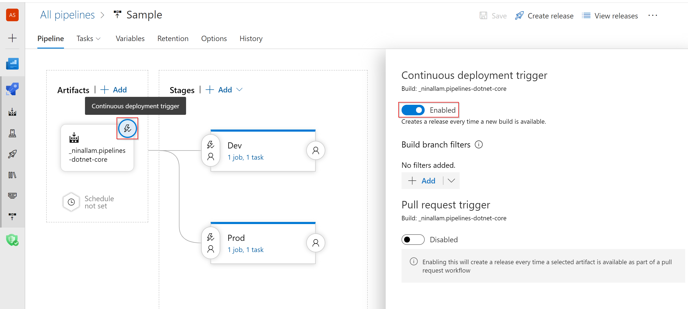
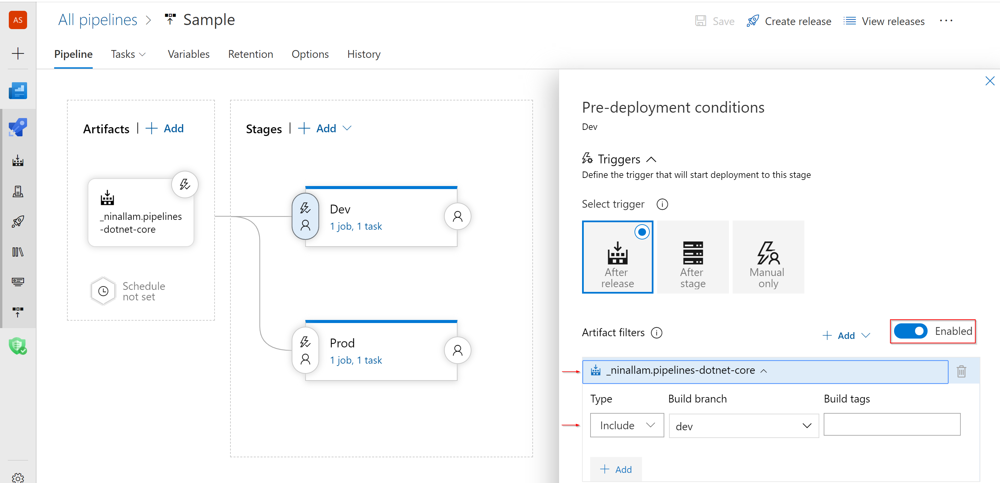
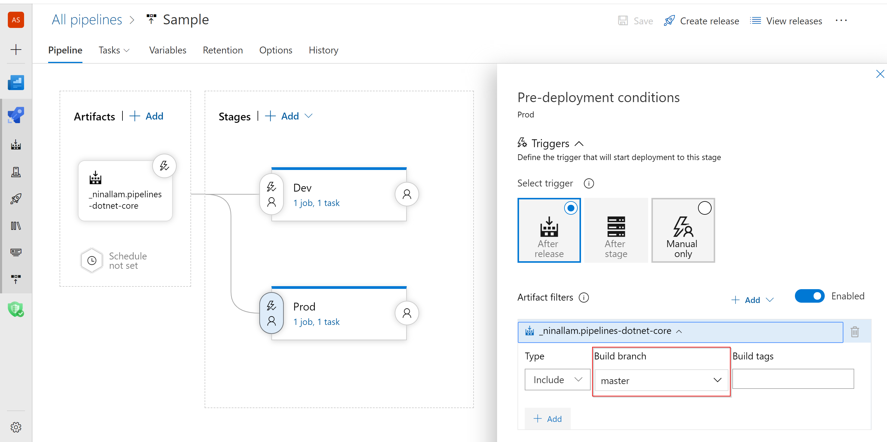

# Deploy from multiple branches using Azure Pipelines

**Azure Pipelines | Azure DevOps Server 2019**

Artifact filters can be used with release triggers to deploy from multiple branches. Applying the artifact filter to a specific branch results in the artifact deploying to a specific stage only when those filter conditions are met.

## Prerequisites

You'll need:

* A working build for your repository

  - [Build multiple branches](/azure/devops/pipelines/build/ci-build-git)
 
* Two separate targets where you will deploy the app. These could be virtual machines, web servers, on-premises physical deployment groups, or other types of deployment target. You will have to choose names that are unique, but it's a good idea to include "Dev" in the name of one, and "Prod" in the name of the other so that you can easily identify them.

## Set up a release pipeline

1. In **Azure Pipelines**, open the **Releases** tab. Create a New release Pipeline, select **Add an artifact** and specify your build artifact.

1. Select the **Continuous deployment trigger** icon in the **Artifacts** section to open up the _continuous deployment trigger_ panel and switch the button to **Enabled**.

  > [!div class="mx-imgBorder"]  
  > 

1. Add a stage with a name **Dev**. This stage will be triggered when a build artifact is published from the dev branch.

1. Choose the **Pre-deployment conditions** icon in the **Stages** section to open up the _pre-deployment conditions_ panel. Under _select trigger_ select **After release**. This means that a deployment will be initiated automatically when a new release is created from this release pipeline.   

1. Enable the **Artifact filters**. Select Add and specify your artifact. In the **Build branch** select the dev branch then Save.

  > [!div class="mx-imgBorder"]  
  > 

1. Add another stage and name it **Prod**. This stage will be triggered when a build artifact is published from the master branch. Repeat steps 4-5 and replace **Build branch** to master.

  > [!div class="mx-imgBorder"]  
  > 

1. Add your appropriate deployment tasks in each stage.

Now the next time you have a successful build, the artifact filter will detect which branch triggered that build and only the appropriate stage will get deployed.

  > [!div class="mx-imgBorder"] 
  > 

## Related articles

- [Release triggers](triggers.md)

If you encounter issues or have any suggestions, please feel free to ask questions or suggest a feature on our [Azure DevOps Developer Community](https://developercommunity.visualstudio.com/spaces/21/index.html).
