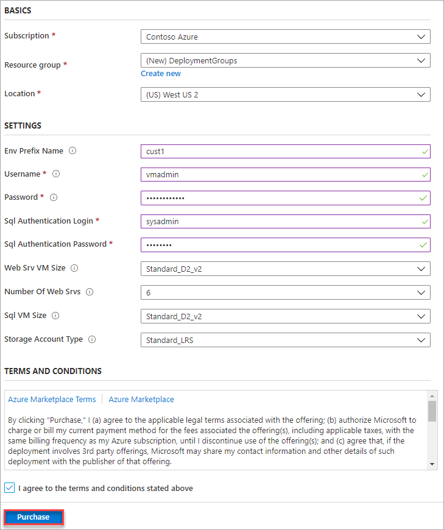
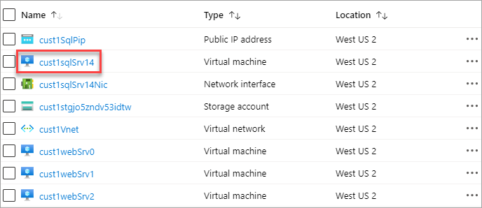
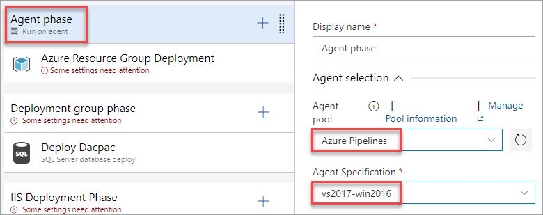
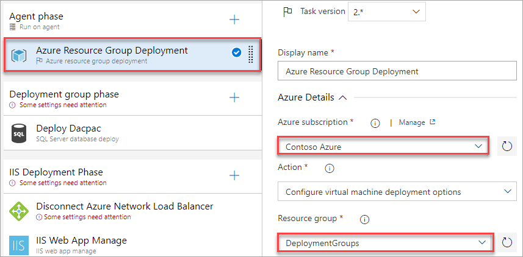
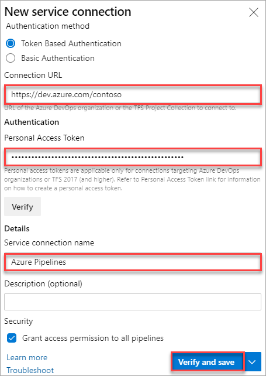
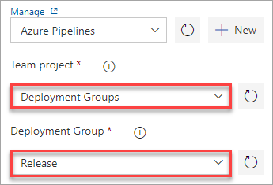
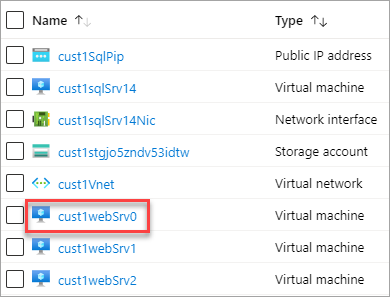
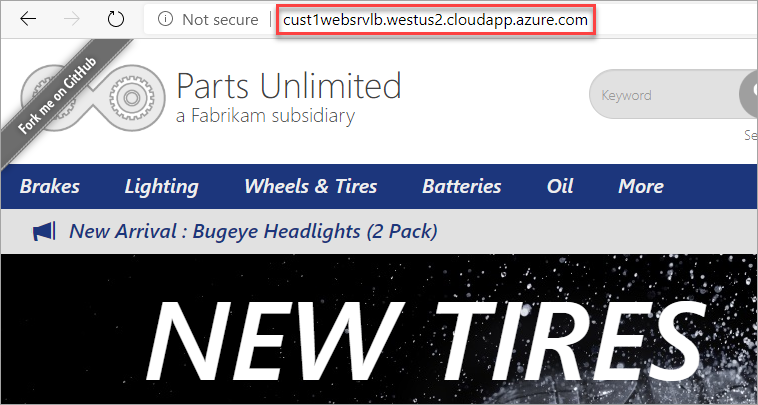

# Deploy to Azure VMs using Deployment Groups

[!INCLUDE [version-tfs-2018](../../includes/version-tfs-2018.md)]

::: moniker range="<= tfs-2018"
[!INCLUDE [temp](../../includes/concept-rename-note.md)]
::: moniker-end

In earlier versions of Azure Pipelines, applications that needed to be deployed to multiple servers required a significant amount of planning and maintenance. Windows PowerShell remoting had to be enabled manually, required ports opened, and deployment agents installed on each of the servers. The pipelines then had to be managed manually if a roll-out deployment was required.

All the above challenges have been evolved seamlessly with the introduction of the [Deployment Groups](/vsts/build-release/concepts/definitions/release/deployment-groups/).

A deployment group installs a deployment agent on each of the target servers in the configured group and instructs the release pipeline to gradually deploy the application to those servers. Multiple pipelines can be created for the roll-out deployments so that the latest version of an application can be delivered in a phased manner to multiple user groups for validation of newly introduced features.

In this tutorial, you learn about:

> [!div class="checklist"]
> * Provisioning VM infrastructure to Azure using a template
> * Creating an Azure Pipelines deployment group
> * Creating and running a CI/CD pipeline to deploy the solution with a deployment group 

## Prerequisites

1. A Microsoft Azure account.

1. An Azure DevOps account.

1. Use the [Azure DevOps Demo Generator](https://azuredevopsdemogenerator.azurewebsites.net/?TemplateId=77368&Name=deploymentgroups) to provision the tutorial project on your Azure DevOps organization.

## Setting up the Azure deployment environment

The following resources will be provisioned on the Azure using an ARM template:

- Six Virtual Machines (VM) web servers with IIS configured
- SQL server VM (DB server)
- Azure Network Load Balancer

1. Click the **Deploy to Azure** button below to initiate resource provisioning. Provide all the necessary information and select **Purchase**.

    

    

    > [!NOTE]
    > It takes approximately 10-15 minutes to complete the deployment.

1. Once the deployment completes, you can review all of the resources generated in the specified resource group using the Azure Portal. Select the DB server VM with **sqlSrv** in its name to view its details.

    

1. Make a note of the **DNS name**. This value will be required in a later step. You can use the copy button to copy it to the clipboard.

    

## Creating and configuring a deployment group

Azure Pipelines makes it easier to organize servers required for deploying applications. A deployment group is a collection of machines with deployment agents. Each of the machines interacts with Azure Pipelines to coordinate the deployment of the app.

Since there is no configuration change required for the build pipeline, the build will be triggered automatically after the project is provisioned. When you queue a release later on, this build will be used.

1. Navigate to the Azure DevOps project created by the demo generator.

1. From **Pipelines**, select **Deployment groups**.

1. Select **Add a deployment group**.

1. Enter the **Deployment group name** of **Release** and select **Create**. A registration script generated is displayed.

    The target servers are available in the deployment group for deploying the application. You can register the target servers using the script provided if working on your own. However, in this tutorial, the target servers are automatically registered as part of the release pipeline. The release definition uses stages to deploy the application to the target servers. A stage is a logical grouping of the tasks that defines the runtime target on which the tasks will execute. Each deployment group stage executes tasks on the machines defined in the deployment group.

1. Navigate to **Pipelines | Releases**. Select the release pipeline and select **Edit**.

1. Select the **Tasks** tab to view the deployment tasks in pipeline.

1. The tasks will be grouped under three stages called the **Agent phase**, **Deployment group phase**, and **IIS Deployment phase**.

1. Select the **Agent phase**. In this stage, the target servers will be associated to the deployment group using the Azure Resource Group Deployment task. Select the **Azure Pipelines** pool and **vs2017-win2016** specification.

    

1. Select the **Azure Resource Group Deployment** task. Configure a service connection to the Azure subscription used earlier to create infrastructure. After authorizing the connection, select the resource group created for this tutorial.

    

1. From the **User settings** dropdown, open **Personal access tokens** in a new tab. Most browsers allow this via right-click context menu or **Ctrl+Click**.

    

1. In the new tab, select **New Token**.

1. Enter a name and select the **Full access** scope. Select **Create** to create the token. Once created, copy the token and close the tab.

    

1. Under **Azure Pipelines service connection**, select **New**.

    

1. Enter the **Connection URL** to the current instance of Azure DevOps. This will be something like `https://dev.azure.com/[Your account]`. Paste in the **Personal Access Token** created earlier and specify a **Service connection name**. Select **Verify and save**.

    

1. Select the current **Team project** and the **Deployment group** created earlier.

    

1. Select the **Deployment group phase** stage. This stage executes tasks on the machines defined in the deployment group. This stage is linked to the **db** tag. Choose the **Deployment Group** from the drop down.

1. Select the **IIS Deployment phase** stage. This stage deploys the application to the web servers using the specified tasks. This stage is linked to **web** tag. Choose the **Deployment Group** from the drop down.

1. Select the **Disconnect Azure Network Load Balancer** task. As the target machines are connected to the NLB, this task will disconnect the machines from the NLB prior to the deployment and reconnect them back to the NLB after the deployment. Configure the task to use the Azure connection, resource group, and load balancer (there should only be one). 

1. Select the **IIS Web App Manage** task. This runs on the deployment target machines registered with the deployment group configured for the task/stage. It creates a web app and application pool locally with the name **PartsUnlimited** running under the port **80**

1. Select the **IIS Web App Deploy** task. This runs on the deployment target machines registered with the deployment group configured for the task/stage. It deploys the application to the IIS server using **Web Deploy**.

1. Select the **Connect Azure Network Load Balancer** task. Configure the task to use the Azure connection, resource group, and load balancer (there should only be one).

1. Select on the **Variables** tab and enter the variable values as below.

    | Variable Name | Variable Value  |
    |--|--|
    | DatabaseName | PartsUnlimited-Dev |
    | DBPassword | P2ssw0rd@123 |
    | DBUserName |sqladmin  |
    | DefaultConnectionString | Data Source=YOUR_DNS_NAME.cloudapp.azure.com;Initial Catalog=PartsUnlimited-Dev;User ID=sqladmin;Password=P2ssw0rd@123;MultipleActiveResultSets=False;Connection Timeout=30; |
    | ServerName | localhost |

    > [!IMPORTANT]
    > Make sure to replace your SQL server DNS name (which you noted from Azure Portal earlier) in **DefaultConnectionString** variable.

    It will look something like this.

    

    Your DefaultConnectionString will be like as below after replacing SQL DNS.

    `Data Source=dgsqlw4zktxlvx7ddu.centralindia.cloudapp.azure.com.cloudapp.azure.com;Initial Catalog=PartsUnlimited-Dev;User ID=sqladmin;Password=P2ssw0rd@123;MultipleActiveResultSets=False;Connection Timeout=30;`

## Queuing a release and reviewing the deployment 

1. Select **Save** and then **Create release** and confirm. Follow the release through to completion.

1. Once the release completes, the deployment will be ready for review.

1. In the Azure Portal, open one of the web VMs in your resource group. You can select any that have `websrv` in the name.

    

1. Open a new browser tab to the **DNS** of the VM.

    

    > [!IMPORTANT]
    > The [**Azure Load Balancer**](/azure/load-balancer/load-balancer-overview) will distribute incoming traffic among healthy instances of servers defined in a load-balanced set. Hence the **DNS** of all web server instances will be the same.

1. Review the deployed app.

    

## Summary

In this tutorial you deployed a web application to a set of Azure VMs using Azure Pipelines and Deployment Groups. While this scenario just covered a handful of machines, you can easily scale the process up to support hundreds, or even thousands, of machines in virtually any configuration.

## Clean up resources

This tutorial created an Azure DevOps project and some resources in Azure. If you're not going to continue to use these resources, delete them with the following steps:

1. Delete the Azure DevOps project created by the Azure DevOps Demo Generator.

1. All Azure resources created during this tutorial were assigned to the resource group specified during creation. Deleting that group will delete the resources they contain. This can be done via the CLI or portal.

## Next steps

> [!div class="nextstepaction"]
> [Provision agents for deployment groups](howto-provision-deployment-group-agents.md)

