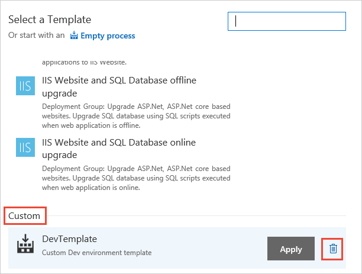

# Stage templates

**Azure Pipelines | Azure DevOps Server 2020 | Azure DevOps Server 2019 | TFS 2018 - TFS 2015**

Azure Pipelines provide a list of stage templates you can choose from when creating a new release pipeline or adding a stage to your existing one. The templates are pre-defined with the appropriate tasks and settings to help you save time and effort when creating your release pipeline.

Aside from the pre-defined templates, you can also create your own custom stage templates based on your specific needs.

When a stage is created from a template, the tasks in the template are copied over to the stage. Any further updates to the template have no impact on existing stages. If you are trying to add multiple stages to your release pipeline and update them all in one operation, you should use [task groups](../library/task-groups.md) instead.

> [!NOTE]
> Templates cannot be restrict to specific users or groups. All templates, pre-defined or custom, are available to all users who have the permission to create release pipelines.

## Save a template

You can save a stage template from within a classic release pipeline. 

1. Open and edit your release pipeline. 

1. Open the stage you want to export. 

1. Select the three dots and choose **Save as template**.

    :::image type="content" source="media/stage-templates/save-stage-template.png" alt-text="Select the three dots and save as template.":::

1. Name and save your template.
  
    :::image type="content" source="media/stage-templates/name-stage-template.png" alt-text="Add a name for your stage template.":::

## Use a template

1. From the release pipeline, select **Add** to add a stage. 

1. Choose **New stage**.

1. Scroll to the end of the **Select a template** window to see your custom templates. 

1. Select **Apply** to use your custom template.  

    :::image type="content" source="media/stage-templates/use-custom-stage-template.png" alt-text="Select a custom stage template to use. ":::

## FAQ

- **Can I export templates or share them with other subscriptions, enterprises, or projects?**

Custom templates that you create are scoped to the project that you created them in.
Templates cannot be exported or shared with another project, collection, server, or organization.
You can, however, export a release pipeline and import it into another project, collection, server, or subscription.
Then you can re-create the template for use in that location.

- **How do I delete a custom stage template?**

You can delete an existing custom template from the list of templates that is displayed when you add a new stage to our pipeline.

> [!div class="mx-imgBorder"]
> 

- **How do I update a custom stage template?**

To update a stage template, delete the existing template in a release pipeline and then save the stage as a template with the same name.

[!INCLUDE [rm-help-support-shared](../includes/rm-help-support-shared.md)]
