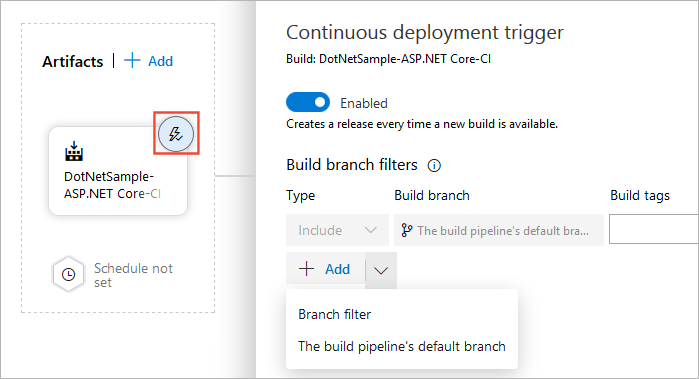
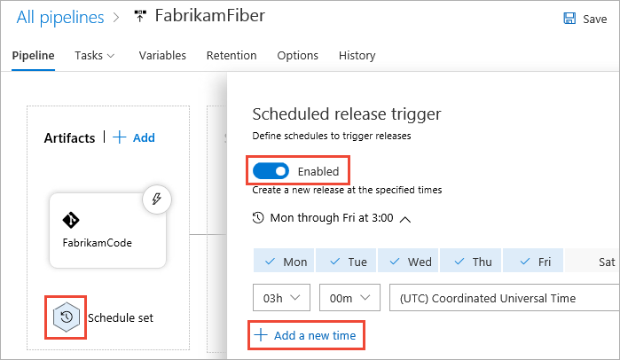
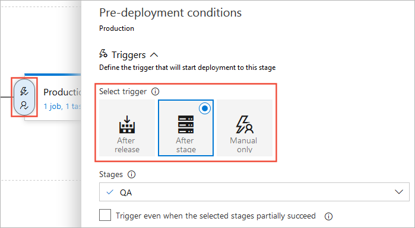
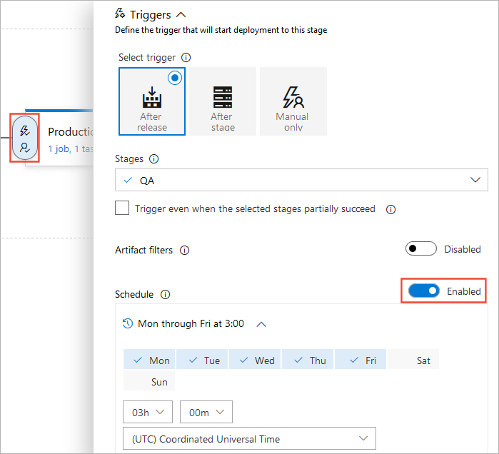
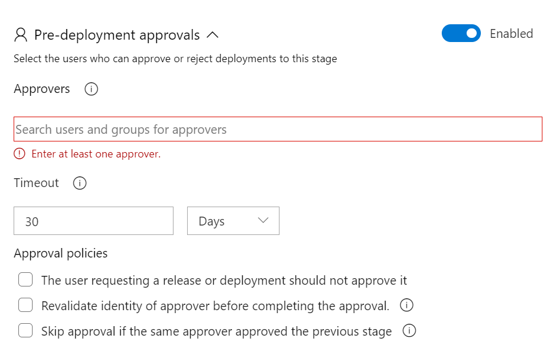

# Release triggers

[!INCLUDE [version-tfs-2015-rtm](../includes/version-tfs-2015-rtm.md)]

::: moniker range="<= tfs-2018"
[!INCLUDE [temp](../includes/concept-rename-note.md)]
::: moniker-end

::: moniker range="azure-devops"
> [!NOTE] 
> This topic covers classic release pipelines. To understand triggers in YAML pipelines, see [pipeline triggers](../build/triggers.md).
::: moniker-end

Release triggers are an automation tool to deploy your application. When the trigger conditions are met, the pipeline will deploy your artifacts to the environment/stages you already specified. 

## Continuous deployment triggers

Continuous deployment triggers allow you to create a release every time a new build artifact is available. This feature is currently available only to build from Azure DevOps, TFS and Git-based repositories.

> [!div class="mx-imgBorder"]
> 

Build branch filters allow you to trigger a release only for a build that is from one of the branches selected here.

You also have the option to specify branch tags. If you do so, a release will be triggered only if a new build tagged with the keywords specified here, is available.

> [!NOTE]
> Automatically creating a release does not mean it will be automatically deployed to a stage. You must set up stages triggers to deploy your app to the various stages.

## Scheduled release triggers

Scheduled release trigger allow you to create new releases at specific times.

Select the schedule icon under the **Artifacts** section. Toggle the Enabled/Disabled button and specify your release schedule. You can set up multiple schedules to trigger a release.

> [!div class="mx-imgBorder"]
> 

::: moniker range="> tfs-2018"

## Pull request triggers

If you chose to enable the pull-request triggers, a release will be created every time a selected artifact is available as part of a pull request workflow.

> [!div class="mx-imgBorder"]
> 

To use a pull request trigger, you must also enable it for specific stages. We will go through stage triggers in the next section. You may also want to set up a [branch policies](../../repos/git/pr-status-policy.md) for your branches.

::: moniker-end

## Stage triggers

Stage triggers allow you set up specific conditions to trigger deployment to a specific stage.

  > [!div class="mx-imgBorder"]
  > 

* **Select trigger**:
  Set the trigger that will start the deployment to this stage automatically. Select "Release" to deploy to the stage every time a new release is created. Use the "Stage" option to deploy after deployments to selected stages are successful. To allow only manual deployments, select "Manual".

* **Artifacts filter**:
  Select artifact condition(s) to trigger a new deployment. A release will be deployed to this stage only if all artifact conditions are met.

  > [!div class="mx-imgBorder"]
  > 

  

* **Schedule**:
  Trigger a new deployment to this stage at a specific time.

  > [!div class="mx-imgBorder"]
  > 

* **Pull-request deployment**:
  Enabling this will allow pull request based releases to be deployed to this stage. Keep it disabled if this is a critical or production stage.

  > [!div class="mx-imgBorder"]
  > 

* **Pre-deployment approvals**:
Select the users who can approve or reject deployments to this stage. By default, all users must approve the deployment. If a group is added, one user in the group must approve the deployment. You can also specify the timeout (the maximum time that an approval is allowed to be pending before it is automatically rejected) and approval policies.

  > [!div class="mx-imgBorder"]
  > 

You can combine the automated settings to have deployments created automatically either when a new build is available or according to a schedule.

::: moniker range="tfs-2015"

> [!NOTE]
> **TFS 2015**: The following features are not available in TFS 2015 - continuous deployment triggers for multiple artifact sources, multiple scheduled triggers combining scheduled and continuous deployment triggers in the same pipeline, continuous deployment based on the branch or tag of a build.

::: moniker-end

::: moniker range=">= tfs-2017"

### Parallel forked and joined deployments

The **Triggering stage** list lets you select more than one stage. This allows you to configure parallel (_forked_ and _joined_) deployment pipelines where the deployment to a stage occurs only when deployment to **all** the selected stages succeeds.

For example, the following schematic shows a pipeline where deployment occurs in parallel to the **QA** and **Pre-prod** stages after deployment to the **Dev** stage succeeds. However, deployment to the **Production** stage occurs only after successful deployment to both the **QA** and **Pre-prod** stages.

> [!div class="mx-imgBorder"]
> 

In combination with the ability to define [pre- and post-deployment approvals](approvals/approvals.md), this capability enables the configuration of complex and fully managed deployment pipelines to suit almost any release scenario.  

::: moniker-end

Note that you can always deploy a release directly to any of the stages in your release pipeline by selecting the **Deploy** action when you create a new release. In this case, the stage triggers you configure, such as a trigger on successful deployment to another stage, do not apply. The deployment occurs irrespective of these settings.
This gives you the ability to override the release pipeline. Performing such direct deployments requires the **Manage deployments** permission, which should
only be given to selected and approved users.

::: moniker range="tfs-2015"

> [!NOTE]
> **TFS 2015**: Parallel fork and joined deployments are not available in TFS 2015

::: moniker-end

[!INCLUDE [rm-help-support-shared](../includes/rm-help-support-shared.md)]
