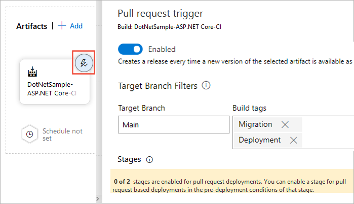

# Release triggers

[!INCLUDE [version-lt-eq-azure-devops](../../includes/version-lt-eq-azure-devops.md)]

::: moniker range="azure-devops"
> [!NOTE] 
> This topic covers classic release pipelines. To understand triggers in YAML pipelines, see [pipeline triggers](../build/triggers.md).
::: moniker-end

Release triggers are an automation tool to deploy your application. When the trigger conditions are met, the pipeline will deploy your artifacts to the environment/stages you already specified. 

## Continuous deployment triggers

Continuous deployment triggers allow you to create a release every time a new build artifact is available. Using the build branch filters you can trigger deployment for a specific target branch. A release will be triggered only if the Git push contains a commit on the specified branch. For example, selecting `main` will trigger a release for a Git push which contains one or more commits to the main branch. To trigger a release for any commit to branches under `features/`, enter `features/*`. To trigger a release for commits to all branches, enter `*`. Note that all specified filters will be OR'ed.

:::image type="content" source="media/trigger-01.png" alt-text="Configure continuous deployment triggers":::

> [!NOTE]
> Automatically creating a release does not mean it will be automatically deployed to a stage. You must set up triggers to deploy your app to the various stages.

## Scheduled release triggers

Scheduled release triggers allow you to create new releases at specific times.

Select the schedule icon under the **Artifacts** section. Toggle the Enabled/Disabled button and specify your release schedule. You can set up multiple schedules to trigger a release.

> [!div class="mx-imgBorder"]
> 

::: moniker range="<=azure-devops"

## Pull request triggers

If you chose to enable the pull-request triggers, a release will be created every time a selected artifact is available as part of a pull request workflow.

> [!div class="mx-imgBorder"]
> 

To use a pull request trigger, you must also enable it for specific stages. We will go through stage triggers in the next section. You may also want to set up a [branch policies](../../repos/git/pr-status-policy.md) for your branches.

You can also use **Build tags** to organize your workflow and tag specific runs. The following pull request trigger will create a release every time a new artifact version is available as part of a pull request to the *main* branch with the tags *Migration* and *Deployment*.

:::image type="content" source="media/build-tags-example.png" alt-text="Screenshot showing an example of how to set up a pull request trigger with build tags":::

::: moniker-end

## Stage triggers

Stage triggers allow you set up specific conditions to trigger deployment to a specific stage.

- **Select trigger**:
  Set the trigger that will start the deployment to your stage automatically. Use the **Stages** dropdown to trigger a release after a successful deployment to the selected stage. Select **Manual only** to only allow manual trigger.

    :::image type="content" source="media/trigger-02a.png" alt-text="A screenshot showing predeployment triggers.":::

- **Artifacts filter**:
  Enable the toggle button to trigger a new deployment based on specific artifacts. In this example, a release will be deployed when a new artifact is available from the specified branch.

    :::image type="content" source="media/trigger-02b.png" alt-text="A screenshot showing predeployment artifact filters.":::

- **Schedule**:
  Trigger a new deployment to your specified stage at a specific time.

    :::image type="content" source="media/trigger-02.png" alt-text="A screenshot showing predeployment schedule settings.":::    

- **Pull-request deployment**:
  Enable the toggle button to trigger a new release every time a new pull request is created. It's recommended to disable this feature for production environment.

    :::image type="content" source="media/trigger-02c.png" alt-text="A screenshot showing pull request deployment trigger.":::    

- **Pre-deployment approvals**:
Select the users who can approve or reject deployments to your selected stage. By default, when this feature is enabled, all project users must approve the deployment. If a group is added to the approvers list, at least one user in the group must approve the deployment. You can also specify the *Approval policies* and *Timeout* (the maximum time for an approval to remain in pending state before it is automatically rejected).

    :::image type="content" source="media/pre-deployment-approval.png" alt-text="A screenshot showing predeployment approvals."::: 

- **Gates**:
Enable the toggle button to set up specific gates to evaluate before trigger deployment.

    :::image type="content" source="media/gates.png" alt-text="A screenshot showing predeployment gates."::: 

- **Deployment queue settings**:

Configure specific actions when multiple releases are queued for deployment.

    :::image type="content" source="media/deploy-queue.png" alt-text="A screenshot displaying the deployment queue settings.":::

- **Number of parallel deployments**: options: *Specific* or *Unlimited*. Specify how many deployments can occur simultaneously within the same stage. If you set the number to '1', deployments will occur one after another in sequence.
  
- **Subsequent releases**: options: *Deploy all in sequence* or *Deploy latest and cancel the others* This option is activated if you select *Specific* under the *Number of parallel deployments*.
  
  - **Deploy all in sequence**: select this option if you need releases to deploy one after the other. This approach ensures that pre-deployment approval requests are processed in the correct order.
      
  - **Deploy latest and cancel the others**: select this option if you're producing builds faster than releases, and you only want to deploy the latest build. See [Specify queuing policies](../process/stages.md?tabs=classic#specify-queuing-policies) for more details.
