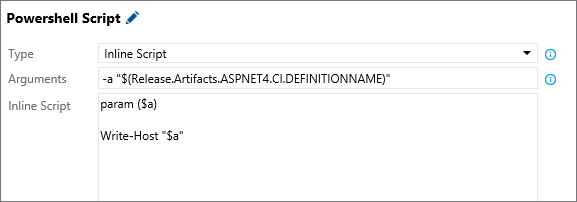
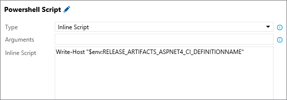
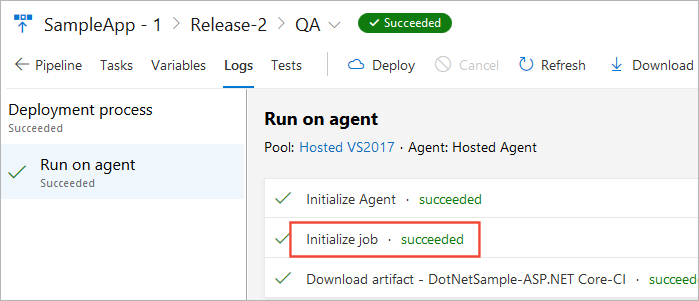
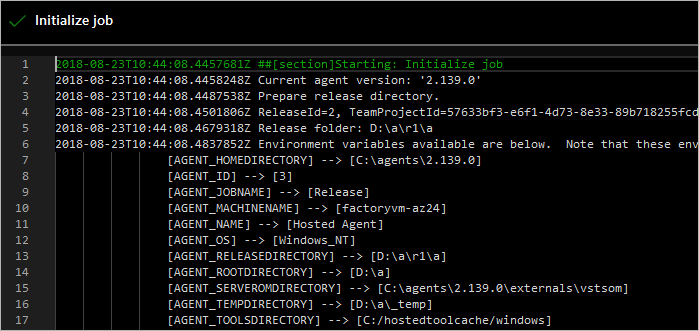

# Classic release and artifacts variables

[!INCLUDE [version-lt-eq-azure-devops](../../includes/version-lt-eq-azure-devops.md)]

::: moniker range="<= tfs-2018"
[!INCLUDE [temp](../includes/concept-rename-note.md)]
::: moniker-end

::: moniker range="azure-devops"

Classic release and artifacts variables are a convenient way to exchange and transport data throughout your pipeline. Each variable is stored as a string and its value can change between runs of your pipeline.

Variables are different from [Runtime parameters](../process/runtime-parameters.md) which are only available at template parsing time.

> [!NOTE] 
> This is a reference article that covers the classic release and artifacts variables. To understand variables in YAML pipelines, see [user-defined variables](../process/variables.md). When you migrate from a release pipeline to a YAML pipeline, the `Release.*` variables will not be populated.
::: moniker-end

As you compose the tasks for deploying your application into each stage in your DevOps CI/CD processes, variables will help you to:

* Define a more generic deployment pipeline once, and then
customize it easily for each stage. For example, a variable
can be used to represent the connection string for web deployment,
and the value of this variable can be changed from one stage
to another. These are **custom variables**.

* Use information about the context of the particular release,
[stage](../process/stages.md), [artifacts](artifacts.md), or
[agent](../agents/agents.md) in which the deployment pipeline is
being run. For example, your script may need access to the location
of the build to download it, or to the working directory on the
agent to create temporary files. These are **default variables**.

> [!TIP]
> You can view the [current values of all variables](#view-vars) for a release,
and use a default variable to [run a release in debug mode](#debug-mode).

## Default variables

Information about the execution context is made available to running tasks through default variables. Your tasks and scripts can use these variables to find information about the system, release, stage, or agent they are running in.
With the exception of **System.Debug**, these variables are read-only and their values are automatically set by the system.
Some of the most significant variables are described in the following tables.
To view the full list, see [View the current values of all variables](#view-vars).

## System

| Variable name | Description |
|---------------|-------------|
| System.TeamFoundationServerUri | The URL of the service connection in TFS or Azure Pipelines. Use this from your scripts or tasks to call Azure Pipelines REST APIs.  Example: `https://fabrikam.vsrm.visualstudio.com/` |
| System.TeamFoundationCollectionUri | The URL of the Team Foundation collection or Azure Pipelines. Use this from your scripts or tasks to call REST APIs on other services such as Build and Version control.  Example: `https://dev.azure.com/fabrikam/` |
| System.CollectionId | The ID of the collection to which this build or release belongs. Not available in TFS 2015.  Example: `6c6f3423-1c84-4625-995a-f7f143a1e43d` |
| System.DefinitionId | The ID of the release pipeline to which the current release belongs. Not available in TFS 2015.  Example: `1` |
| System.TeamProject | The name of the project to which this build or release belongs.  Example: `Fabrikam` |
| System.TeamProjectId | The ID of the project to which this build or release belongs. Not available in TFS 2015.  Example: `79f5c12e-3337-4151-be41-a268d2c73344` |
| System.ArtifactsDirectory | The directory to which artifacts are downloaded during deployment of a release. The directory is cleared before every deployment if it requires artifacts to be downloaded to the agent. Same as Agent.ReleaseDirectory and System.DefaultWorkingDirectory.  Example: `C:\agent\_work\r1\a`  |
| System.DefaultWorkingDirectory | The directory to which artifacts are downloaded during deployment of a release. The directory is cleared before every deployment if it requires artifacts to be downloaded to the agent. Same as Agent.ReleaseDirectory and System.ArtifactsDirectory.  Example: `C:\agent\_work\r1\a` |
| System.WorkFolder | The working directory for this agent, where subfolders are created for every build or release. Same as Agent.RootDirectory and Agent.WorkFolder.  Example: `C:\agent\_work`  |
| System.Debug | This is the only system variable that can be _set_ by the users. Set this to true to [run the release in debug mode](#debug-mode) to assist in fault-finding.  Example: `true` |

## Release

| Variable name | Description |
|---------------|-------------|
| Release.AttemptNumber | The number of times this release is deployed in this stage. Not available in TFS 2015.  Example: `1` |
| Release.DefinitionEnvironmentId | The ID of the stage in the corresponding release pipeline. Not available in TFS 2015.  Example: `1` |
| Release.DefinitionId | The ID of the release pipeline to which the current release belongs. Not available in TFS 2015.  Example: `1` |
| Release.DefinitionName | The name of the release pipeline to which the current release belongs.  Example: `fabrikam-cd` |
| Release.Deployment.RequestedFor | The display name of the identity that triggered (started) the deployment currently in progress. Not available in TFS 2015.  Example: `Mateo Escobedo` |
| Release.Deployment.RequestedForEmail | The email address of the identity that triggered (started) the deployment currently in progress. Not available in TFS 2015.  Example: `mateo@fabrikam.com` |
| Release.Deployment.RequestedForId | The ID of the identity that triggered (started) the deployment currently in progress. Not available in TFS 2015.  Example: `2f435d07-769f-4e46-849d-10d1ab9ba6ab` |
| Release.DeploymentID | The ID of the deployment. Unique per job.  Example: `254` |
| Release.DeployPhaseID | The ID of the phase where deployment is running.  Example: `127` |
| Release.EnvironmentId | The ID of the stage instance in a release to which the deployment is currently in progress.  Example: `276` |
| Release.EnvironmentName | The name of stage to which deployment is currently in progress.  Example: `Dev` |
| Release.EnvironmentUri | The URI of the stage instance in a release to which deployment is currently in progress.  Example: `vstfs://ReleaseManagement/Environment/276` |
| Release.Environments.{stage-name}.status | The deployment status of the stage.  Example: `InProgress` |
| Release.PrimaryArtifactSourceAlias | The alias of the primary artifact source  Example: `fabrikam\_web` |
| Release.Reason | The reason for the deployment. Supported values are: `ContinuousIntegration` - the release started in Continuous Deployment after a build completed. `Manual` - the release started manually. `None` - the deployment reason has not been specified. `Scheduled` - the release started from a schedule. | 
| Release.ReleaseDescription | The text description provided at the time of the release.  Example: `Critical security patch` |
| Release.ReleaseId | The identifier of the current release record.  Example: `118` |
| Release.ReleaseName | The name of the current release.  Example: `Release-47` |
| Release.ReleaseUri | The URI of current release.  Example: `vstfs://ReleaseManagement/Release/118` |
| Release.ReleaseWebURL | The URL for this release.  Example: `https://dev.azure.com/fabrikam/f3325c6c/_release?releaseId=392&_a=release-summary` |
| Release.RequestedFor | The display name of identity that triggered the release.  Example: `Mateo Escobedo` |
| Release.RequestedForEmail | The email address of identity that triggered the release.  Example: `mateo@fabrikam.com` |
| Release.RequestedForId | The ID of identity that triggered the release.  Example: `2f435d07-769f-4e46-849d-10d1ab9ba6ab` |
| Release.SkipArtifactsDownload | Boolean value that specifies whether or not to skip downloading of artifacts to the agent.  Example: `FALSE` |
| Release.TriggeringArtifact.Alias | The alias of the artifact which triggered the release. This is empty when the release was scheduled or triggered manually.  Example: `fabrikam\_app` |

## Release-stage

| Variable name | Description |
|---------------|-------------|
| Release.Environments.{stage name}.Status | The status of deployment of this release within a specified stage. Not available in TFS 2015.  Example: `NotStarted` |

## Agent

| Variable name | Description |
| ------------- | ----------- |
| Agent.Name | The name of the agent as registered with the [agent pool](../agents/pools-queues.md). This is likely to be different from the computer name.  Example: `fabrikam-agent` |
| Agent.MachineName | The name of the computer on which the agent is configured.  Example: `fabrikam-agent` |
| Agent.Version | The version of the agent software.  Example: `2.109.1` |
| Agent.JobName | The name of the job that is running, such as Release or Build.  Example: `Release` |
| Agent.HomeDirectory | The folder where the agent is installed. This folder contains the code and resources for the agent.  Example: `C:\agent` |
| Agent.ReleaseDirectory | The directory to which artifacts are downloaded during deployment of a release. The directory is cleared before every deployment if it requires artifacts to be downloaded to the agent. Same as System.ArtifactsDirectory and System.DefaultWorkingDirectory.  Example: `C:\agent\_work\r1\a` |
| Agent.RootDirectory | The working directory for this agent, where subfolders are created for every build or release. Same as Agent.WorkFolder and System.WorkFolder.  Example: `C:\agent\_work` |
| Agent.WorkFolder | The working directory for this agent, where subfolders are created for every build or release. Same as Agent.RootDirectory and System.WorkFolder.  Example: `C:\agent\_work` |
| Agent.DeploymentGroupId | The ID of the deployment group the agent is registered with. This is available only in deployment group jobs. Not available in TFS 2018 Update 1.  Example: `1` |

## General Artifact

For each artifact that is referenced in a release, you can use the following artifact variables.
Not all variables are meaningful for each artifact type. The table below lists the default artifact
variables and provides examples of the values that they have depending on the artifact type. If an example is empty,
it implies that the variable is not populated for that artifact type.

Replace the `{alias}` placeholder with the value you specified for the [artifact alias](artifacts.md#source-alias) or with the default value generated for the release pipeline.

| Variable name | Description |
|---------------|-------------|
| Release.Artifacts.{[alias](artifacts.md#source-alias)}.DefinitionId | The identifier of the build pipeline or repository.  Azure Pipelines example: `1` GitHub example: `fabrikam/asp` |
| Release.Artifacts.{[alias](artifacts.md#source-alias)}.DefinitionName | The name of the build pipeline or repository.  Azure Pipelines example: `fabrikam-ci` TFVC example: `$/fabrikam` Git example: `fabrikam` GitHub example: `fabrikam/asp (main)` |
| Release.Artifacts.{[alias](artifacts.md#source-alias)}.BuildNumber | The build number or the commit identifier.  Azure Pipelines example: `20170112.1` Jenkins/TeamCity example: `20170112.1` TFVC example: `Changeset 3` Git example: `38629c964` GitHub example: `38629c964` |
| Release.Artifacts.{[alias](artifacts.md#source-alias)}.BuildId | The build identifier.  Azure Pipelines example: `130` Jenkins/TeamCity example: `130` GitHub example: `38629c964d21fe405ef830b7d0220966b82c9e11` |
| Release.Artifacts.{[alias](artifacts.md#source-alias)}.BuildURI | The URL for the build.  Azure Pipelines example: `vstfs://build-release/Build/130` GitHub example: `https://github.com/fabrikam/asp` |
| Release.Artifacts.{[alias](artifacts.md#source-alias)}.SourceBranch | The full path and name of the branch from which the source was built.  Azure Pipelines example: `refs/heads/main` |
| Release.Artifacts.{[alias](artifacts.md#source-alias)}.SourceBranchName | The name only of the branch from which the source was built.  Azure Pipelines example: `main` |
| Release.Artifacts.{[alias](artifacts.md#source-alias)}.SourceVersion | The commit that was built.  Azure Pipelines example: `bc0044458ba1d9298cdc649cb5dcf013180706f7` |
| Release.Artifacts.{[alias](artifacts.md#source-alias)}.Repository.Provider | The type of repository from which the source was built.  Azure Pipelines example: `Git` |
| Release.Artifacts.{[alias](artifacts.md#source-alias)}.RequestedForID | The identifier of the account that triggered the build.  Azure Pipelines example: `2f435d07-769f-4e46-849d-10d1ab9ba6ab` |
| Release.Artifacts.{[alias](artifacts.md#source-alias)}.RequestedFor | The name of the account that requested the build.  Azure Pipelines example: `Mateo Escobedo` |
| Release.Artifacts.{[alias](artifacts.md#source-alias)}.Type | The type of artifact source, such as Build.  Azure Pipelines example: `Build` Jenkins example: `Jenkins` TeamCity example: `TeamCity` TFVC example: `TFVC` Git example: `Git` GitHub example: `GitHub` |
| Release.Artifacts.{[alias](artifacts.md#source-alias)}.PullRequest.TargetBranch | The full path and name of the branch that is the target of a pull request. This variable is initialized only if the release is triggered by a pull request flow.  Azure Pipelines example: `refs/heads/main` |
| Release.Artifacts.{[alias](artifacts.md#source-alias)}.PullRequest.TargetBranchName | The name only of the branch that is the target of a pull request. This variable is initialized only if the release is triggered by a pull request flow.  Azure Pipelines example: `main` |

See also [Artifact source alias](artifacts.md#source-alias)

## Primary Artifact

You designate one of the artifacts as a primary artifact in a release pipeline. For the designated primary artifact, Azure Pipelines populates the following variables.

| Variable name | Same as |
|---------------|---------|
| Build.DefinitionId | Release.Artifacts.{Primary artifact alias}.DefinitionId |
| Build.DefinitionName | Release.Artifacts.{Primary artifact alias}.DefinitionName |
| Build.BuildNumber | Release.Artifacts.{Primary artifact alias}.BuildNumber |
| Build.BuildId | Release.Artifacts.{Primary artifact alias}.BuildId |
| Build.BuildURI | Release.Artifacts.{Primary artifact alias}.BuildURI |
| Build.SourceBranch | Release.Artifacts.{Primary artifact alias}.SourceBranch |
| Build.SourceBranchName | Release.Artifacts.{Primary artifact alias}.SourceBranchName |
| Build.SourceVersion | Release.Artifacts.{Primary artifact alias}.SourceVersion |
| Build.Repository.Provider | Release.Artifacts.{Primary artifact alias}.Repository.Provider |
| Build.RequestedForID | Release.Artifacts.{Primary artifact alias}.RequestedForID |
| Build.RequestedFor | Release.Artifacts.{Primary artifact alias}.RequestedFor |
| Build.Type | Release.Artifacts.{Primary artifact alias}.Type |
| Build.PullRequest.TargetBranch | Release.Artifacts.{Primary artifact alias}.PullRequest.TargetBranch |
| Build.PullRequest.TargetBranchName | Release.Artifacts.{Primary artifact alias}.PullRequest.TargetBranchName |

## Use default variables

You can use the default variables in two ways - as parameters to tasks in a release pipeline or in your scripts.

You can directly use a default variable as an input to a task.
For example, to pass `Release.Artifacts.{Artifact alias}.DefinitionName` for the artifact source whose alias is **ASPNET4.CI** to a task,
you would use `$(Release.Artifacts.ASPNET4.CI.DefinitionName)`.

To use a default variable in your script, you must first replace the `.` in the default variable names with `_`.
For example, to print the value of artifact variable `Release.Artifacts.{Artifact alias}.DefinitionName` for the artifact source whose alias is **ASPNET4.CI** in a PowerShell script,
you would use `$env:RELEASE_ARTIFACTS_ASPNET4_CI_DEFINITIONNAME`.

Note that the original name of the artifact source alias, `ASPNET4.CI`, is replaced by `ASPNET4_CI`.

### View the current values of all variables

1. Open the pipelines view of the summary for the release, and choose the stage you are interested in.
   In the list of steps, choose **Initialize job**.

   

1. This opens the log for this step. Scroll down to see the values used by the agent for this job.   

   

### Run a release in debug mode

Show additional information as a release executes and in the log files
by running the entire release, or just the tasks in an individual
release stage, in debug mode. This can help you resolve issues and failures.

* To initiate debug mode for an entire release, add a variable
  named `System.Debug` with the value `true` to the **Variables**
  tab of a release pipeline.

* To initiate debug mode for a single stage, open the
  **Configure stage** dialog from the shortcut menu
  of the stage and add a variable named `System.Debug`
  with the value `true` to the **Variables** tab.

* Alternatively, create a [variable group](../library/variable-groups.md)
  containing a variable named `System.Debug` with the value `true`
  and link this variable group to a release pipeline.

> [!TIP]
> If you get an error related to an Azure RM service connection,
see [How to: Troubleshoot Azure Resource Manager service connections](azure-rm-endpoint.md).

## Custom variables

Custom variables can be defined at various scopes.

* Share values across all of the definitions
  in a project by using [variable groups](../library/variable-groups.md). Choose a variable
  group when you need to use the same values across all
  the definitions, stages,   and tasks in a project, and you want to be able to change
  the values in a single place. You define and manage variable groups in the **Library** tab.

* Share values across all of the stages by using
  **release pipeline variables**. Choose a release pipeline
  variable when you need to use the same value across all
  the stages and tasks in the release pipeline, and you
  want to be able to change the value in a single place.
  You define and manage these variables in the **Variables** tab in a release pipeline.
  In the Pipeline Variables page, open the Scope drop-down list and select "Release".
  By default, when you add a variable, it is set to Release scope.  

* Share values across all of the tasks within one specific stage by using **stage variables**.
  Use a stage-level variable for values that vary from stage to stage (and are the same for
  all the tasks in an stage). You define and manage these variables in the **Variables** tab of a release pipeline.
  In the Pipeline Variables page, open the Scope drop-down list and select the required stage.
  When you add a variable, set the Scope to the appropriate environment.
  
Using custom variables at project, release pipeline, and stage scope helps you to:

* Avoid duplication of values, making it easier to update
  all occurrences as one operation.

* Store sensitive values in a way that they cannot be seen
  or changed by users of the release pipelines. Designate a  configuration property to be a secure (secret) variable by selecting the  (padlock) icon next to the variable.

  > [!IMPORTANT]
  > The values of the hidden (secret) variables are securely stored on
  the server and cannot be viewed by users after they are saved.
  During a deployment, the Azure Pipelines release service
  decrypts these values when referenced by the tasks and passes them
  to the agent over a secure HTTPS channel.

> [!NOTE]
> Creating custom variables can overwrite standard variables. For example, the PowerShell **Path** environment variable. If you create a custom `Path` variable on a Windows agent, it will overwrite the `$env:Path` variable and PowerShell won't be able to run.

## Use custom variables

To use custom variables in your build and release tasks, simply enclose the 
variable name in parentheses and precede it with a **$** character. For example,
if you have a variable named **adminUserName**, you can insert the current
value of that variable into a parameter of a task as `$(adminUserName)`.

[!INCLUDE [variable-collision](../includes/variable-collision.md)]
 
[!INCLUDE [set-variables-in-scripts](../includes/set-variables-in-scripts.md)]
