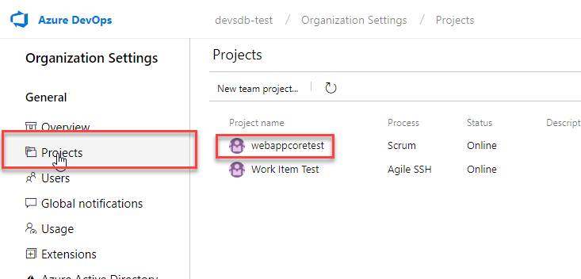
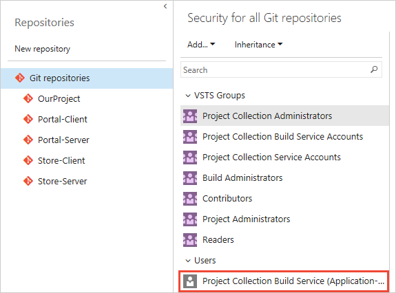

# Run Git commands in a script

[!INCLUDE [version-lt-eq-azure-devops](../../includes/version-lt-eq-azure-devops.md)]

::: moniker range="tfs-2018"
[!INCLUDE [temp](../includes/concept-rename-note.md)]
::: moniker-end

For some workflows, you need your build pipeline to run Git commands. For example, after a CI build on a feature branch is done, the team might want to merge the branch to main.

Git is available on [Microsoft-hosted agents](../agents/hosted.md) and on [on-premises agents](../agents/agents.md).


<a name="enable"></a>

## Enable scripts to run Git commands

> [!NOTE]
> Before you begin, be sure your account's default identity is set with:
> ```
> git config --global user.email "you@example.com"
> git config --global user.name "Your Name"
> ```

<a name="version-control"></a>

### Grant version control permissions to the build service

::: moniker range=">= azure-devops-2020"

1. Go to the project settings page for your organization at **Organization Settings** > **General** > **Projects**.

    :::image type="content" source="media/organization-project-settings.png" alt-text="Select your organization settings. ":::

1. Select the project you want to edit. 

    :::image type="content" source="media/select-project.png" alt-text="Select your project. ":::

1. Within **Project Settings**, select **Repositories**. Select the repository you want to run Git commands on.

1. Select **Security** to edit your repository security. 

    :::image type="content" source="media/modify-repo-security.png" alt-text="Choose Security to edit your repository security. ":::

1. Search for **Project Collection Build Service**. Choose the identity **Project Collection Build Service ({your organization})** (not the group **Project Collection Build Service Accounts ({your organization})**). By default, this identity can read from the repo but can’t push any changes back to it. Grant permissions needed for the Git commands you want to run. Typically you'll want to grant:

      * **Create branch:**  Allow
      * **Contribute:**  Allow
      * **Read:**  Allow
      * **Create tag:**  Allow


::: moniker-end

::: moniker range="<= azure-devops-2019"

Go to the Version Control control panel tab

<ul>
<li>Azure Repos: <code>https:&#x2F;&#x2F;dev.azure.com/{your-organization}/{your-project}/_admin/_versioncontrol</code></li>

<li>On-premises: <code>https:&#x2F;&#x2F;{your-server}:8080/tfs/DefaultCollection/{your-project}/_admin/_versioncontrol</code></li>
</ul>

<p>


</p>

<p>If you see this page, select the repo, and then select the link:</p>

<p>



</p>

<p>


</p>

On the **Version Control** tab, select the repository in which you want to run Git commands, and then select **Project Collection Build Service**. By default, this identity can read from the repo but can’t push any changes back to it.



Grant permissions needed for the Git commands you want to run. Typically you'll want to grant:

* **Create branch:**  Allow
* **Contribute:**  Allow
* **Read:**  Allow
* **Create tag:**  Allow

When you're done granting the permissions, make sure to select **Save changes**.

::: moniker-end


### Allow scripts to access the system token

::: moniker range=">=azure-devops-2020"

# [YAML](#tab/yaml)

Add a `checkout` section with `persistCredentials` set to `true`.

```yaml
steps:
- checkout: self
  persistCredentials: true
```

Learn more about [`checkout`](/azure/devops/pipelines/yaml-schema/steps-checkout).

# [Classic](#tab/classic)

On the [options tab](../build/options.md), select **Allow scripts to access OAuth token**.

---

::: moniker-end

::: moniker range="< azure-devops-2020"

On the [options tab](../build/options.md), select **Allow scripts to access OAuth token**.

::: moniker-end

## Make sure to clean up the local repo

Certain kinds of changes to the local repository aren't automatically cleaned up by the build pipeline. So make sure to:

* Delete local branches you create.
* Undo git config changes.

If you run into problems using an on-premises agent, make sure the repo is clean:

::: moniker range=">=azure-devops-2020"

# [YAML](#tab/yaml)

Make sure `checkout` has `clean` set to `true`.

```yaml
steps:
- checkout: self
  clean: true
```

# [Classic](#tab/classic)

* On the [repository tab](../repos/pipeline-options-for-git.md#clean-the-local-repo-on-the-agent) set **Clean** to true.

---

::: moniker-end

::: moniker range="< azure-devops"

* On the [repository tab](../repos/pipeline-options-for-git.md#clean-the-local-repo-on-the-agent), set **Clean** to true.

* On the [variables tab](../build/variables.md), create or modify the ```Build.Clean``` variable and set it to ```source```

::: moniker-end

## Examples


### List the files in your repo

On the [build tab](../tasks/index.md) add this task:

| Task | Arguments |
| ---- | --------- |
|  :::image type="icon" source="../tasks/utility/media/command-line.png"::: <br/>[Utility: Command Line](../tasks/utility/command-line.md)<br />List the files in the Git repo. | **Tool**: `git`<br /><br />**Arguments**: `ls-files` |

### Merge a feature branch to main

You want a CI build to merge to main if the build succeeds.

On the [Triggers tab](../build/triggers.md), select **Continuous integration (CI)** and include the branches you want to build.

Create ```merge.bat``` at the root of your repo:

```bat
@echo off
ECHO SOURCE BRANCH IS %BUILD_SOURCEBRANCH%
IF %BUILD_SOURCEBRANCH% == refs/heads/main (
   ECHO Building main branch so no merge is needed.
   EXIT
)
SET sourceBranch=origin/%BUILD_SOURCEBRANCH:refs/heads/=%
ECHO GIT CHECKOUT MAIN
git checkout main
ECHO GIT STATUS
git status
ECHO GIT MERGE
git merge %sourceBranch% -m "Merge to main"
ECHO GIT STATUS
git status
ECHO GIT PUSH
git push origin
ECHO GIT STATUS
git status
```

On the [build tab](../tasks/index.md) add this as the last task:

| Task | Arguments |
| ---- | --------- |
| :::image type="icon" source="../tasks/utility/media/batch-script.png"::: <br/>[Utility: Batch Script](../tasks/utility/batch-script.md)<br />Run merge.bat. | **Path**: `merge.bat` |

## FAQ

<!-- BEGINSECTION class="md-qanda" -->

### Can I run Git commands if my remote repo is in GitHub or another Git service such as Bitbucket Cloud?

Yes

### Which tasks can I use to run Git commands?

[Batch Script](../tasks/utility/batch-script.md)

[Command Line](../tasks/utility/command-line.md)

[PowerShell](../tasks/utility/powershell.md)

[Shell Script](../tasks/utility/shell-script.md)


### How do I avoid triggering a CI build when the script pushes?

::: moniker range="<= azure-devops-2019"

Add ```***NO_CI***``` to your commit message. Here are examples:
* ```git commit -m "This is a commit message ***NO_CI***"```
* ```git merge origin/features/hello-world -m "Merge to main ***NO_CI***"```

::: moniker-end

::: moniker range="> azure-devops-2019"

Add `[skip ci]` to your commit message or description. Here are examples:
* ```git commit -m "This is a commit message [skip ci]"```
* ```git merge origin/features/hello-world -m "Merge to main [skip ci]"```

You can also use any of the variations below. This is supported for commits to Azure Repos Git, Bitbucket Cloud, GitHub, and GitHub Enterprise Server.

- `[skip ci]` or `[ci skip]`
- `skip-checks: true` or `skip-checks:true`
- `[skip azurepipelines]` or `[azurepipelines skip]`
- `[skip azpipelines]` or `[azpipelines skip]`
- `[skip azp]` or `[azp skip]`
- `***NO_CI***`

::: moniker-end

[!INCLUDE [temp](../includes/qa-agents.md)]

::: moniker range="< azure-devops"
[!INCLUDE [temp](../includes/qa-versions.md)]
::: moniker-end

<!-- ENDSECTION -->
