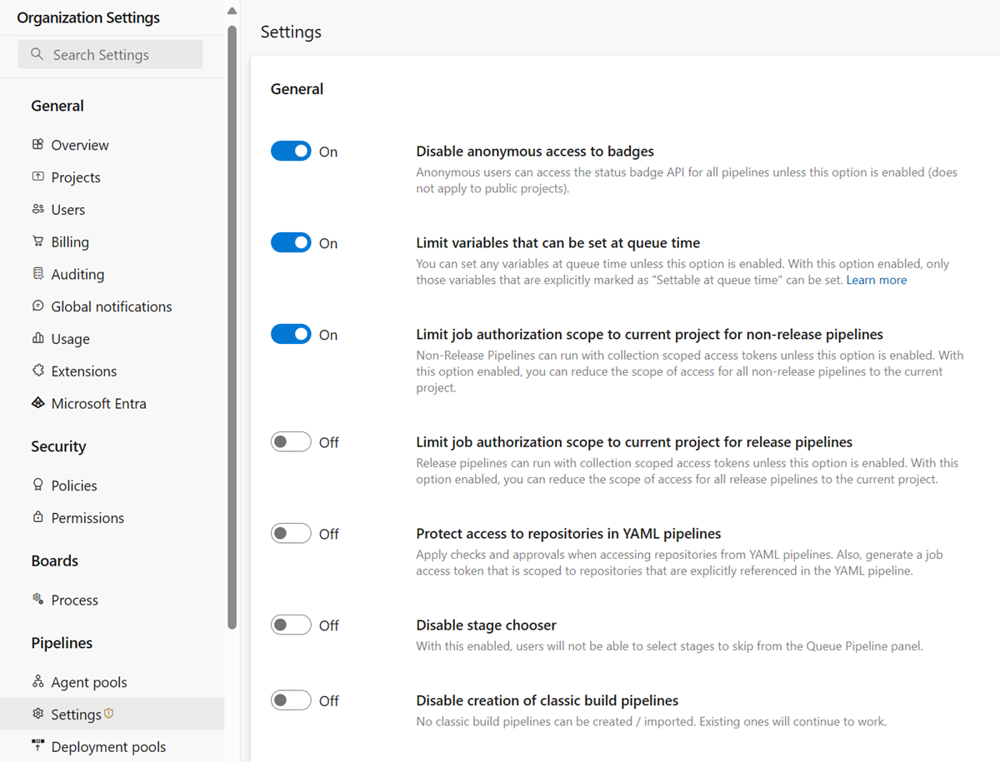

# Project structure

Zooming out above the level of individual resources, you should also consider groups of resources.
Resources are grouped by team projects in Azure DevOps.
It's important to understand what resources your pipeline can access based on project settings and containment.

Every job in your pipeline receives an access token, which has permissions to read open resources.
In some cases, pipelines may also update those resources.
In other words, while your user account may not have access a certain resource, scripts and tasks running in your pipeline do.
The security model in Azure DevOps also allows access to these resources from other projects in the organization.
If you choose to shut off pipeline access to some of these resources, this decision applies to all pipelines in a project.
You can't grant access for an open resource to a specific pipeline.

Given the nature of open resources, you should consider managing each product and team in a separate project.
This practice ensures that a pipeline from one product cannot access open resources from another product, thereby preventing lateral exposure.
When multiple teams or products share a project, their resources cannot be granularly isolated from one another.

If your Azure DevOps organization was created prior to August 2019, runs may be able to access open resources in all projects of your organization.
Your organization administrator must review a key security setting in Azure Pipelines that enables project isolation for pipelines.
This setting can be found in **Azure DevOps** / **Organization settings** / **Pipelines** / **Settings** or by visiting `https://dev.azure.com/ORG-NAME/_settings/pipelinessettings`.

Once you have the right project structure in place, enhance runtime security using [templates](templates.md).
