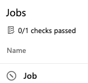
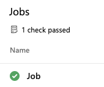

# Use templates for security

[!INCLUDE [version-gt-eq-2020](../../includes/version-gt-eq-2020.md)]

[Checks on protected resources](resources.md) form the fundamental security framework for Azure Pipelines.
These checks apply regardless of your pipeline’s structure, including stages and jobs. If multiple pipelines within your team or organization share the same structure, consider streamlining security using [templates](../process/templates.md).

Azure Pipelines provides two types of templates: **includes** and **extends**.
Included templates function similarly to `#include` in C++. It's as if you're pasting the template's code directly into the outer file that references it. In the following example, an includes template, `include-npm-steps.yml`, is inserted into the `steps` section. 

```yaml
  steps:
  - template: templates/include-npm-steps.yml 
```

In the context of C++, `extends` templates resemble inheritance. They define the outer structure of the pipeline and offer specific points where the template consumer can make targeted customizations.

## Use `extends` templates

For the most secure pipelines, we recommend starting with `extends` templates. These templates define the outer structure of your pipeline and prevent malicious code from infiltrating it. While using `extends`, you can still employ `includes` in both the template and the final pipeline to factor out common configuration pieces. The following example shows how your pipeline might look when using an `extends` template.

```yaml
# template.yml
parameters:
- name: usersteps
  type: stepList
  default: []
steps:
- ${{ each step in parameters.usersteps }}:
  - ${{ step }}
```

```yaml
# azure-pipelines.yml
resources:
  repositories:
  - repository: templates
    type: git
    name: MyProject/MyTemplates
    ref: refs/tags/v1

extends:
  template: template.yml@templates
  parameters:
    usersteps:
    - script: echo This is my first step
    - script: echo This is my second step
```

When you set up `extends` templates, consider anchoring them to a particular Git branch or tag.
This way, if you need to make breaking changes, existing pipelines aren't affected. The previous examples use this feature. 

## Security features enforced through YAML

The YAML syntax includes several built-in protections, and an `extends` template can enforce the use of any or all of them.

### Step targets

To enhance security, restrict certain steps to run within a container rather than on the host. By doing so, user steps don’t have access to the agent’s host, preventing them from modifying agent configuration or leaving malicious code for later execution. We recommend executing code on the host first before running it in the container. For example, consider limiting network access. Without open network access, user steps can't retrieve packages from unauthorized sources or upload code and secrets to external network locations.

```yaml
resources:
  containers:
  - container: builder
    image: mysecurebuildcontainer:latest
steps:
- script: echo This step runs on the agent host, and it could use docker commands to tear down or limit the container's network
- script: echo This step runs inside the builder container
  target: builder
```

::: moniker range=">=azure-devops-2022"

### Agent logging command restrictions

To enhance security, restrict the services provided by the Azure Pipelines agent to user steps. These steps request services using "logging commands," which are specially formatted strings printed to stdout. In restricted mode, most of the agent’s services—such as uploading artifacts and attaching test results—are unavailable.

```yaml
# this task will fail because its `target` property instructs the agent not to allow publishing artifacts
- task: PublishBuildArtifacts@1
  inputs:
    artifactName: myartifacts
  target:
    commands: restricted
```

In restricted mode, the `setvariable` command remains permissible. However, caution is necessary because pipeline variables are exported as environment variables to subsequent tasks. If tasks output user-provided data, such as contents from open issues retrieved via a REST API, they might be vulnerable to injection attacks. Malicious user content can set environment variables that might be exploited to compromise the agent host. To mitigate this risk, pipeline authors can explicitly declare which variables are settable using the `setvariable` logging command. When you specify an empty list, all variable setting is disallowed. 

```yaml
# this task will fail because the task is only allowed to set the 'expectedVar' variable, or a variable prefixed with "ok"
- task: PowerShell@2
  target:
    commands: restricted
    settableVariables:
    - expectedVar
    - ok*
  inputs:
    targetType: 'inline'
    script: |
      Write-Host "##vso[task.setvariable variable=BadVar]myValue"
```

### Conditional insertion of stages or jobs

Restrict stages and jobs to run under specific conditions.
Conditions can help, for example, to ensure that you're only building certain branches.

```yaml
jobs:
- job: buildNormal
  steps:
  - script: echo Building the normal, unsensitive part
- ${{ if eq(variables['Build.SourceBranchName'], 'refs/heads/main') }}:
  - job: buildMainOnly
    steps:
    - script: echo Building the restricted part that only builds for main branch
```

### Require certain syntax with extends templates

Templates in Azure Pipelines have the flexibility to iterate over and modify YAML syntax. By using iteration, you can enforce specific YAML features, including the previously mentioned features.

Additionally, a template can rewrite user steps, allowing only approved tasks to run. For instance, you can prevent inline script execution.

> [!WARNING]
> In the following example, the step types `bash`, `powershell`, `pwsh` and `script` are prevented > from executing. For complete lockdown of ad-hoc scripts, consider blocking `BatchScript` and `ShellScript`.

```yaml
# template.yml
parameters:
- name: usersteps
  type: stepList
  default: []
steps:
- ${{ each step in parameters.usersteps }}:
  - ${{ if not(or(startsWith(step.task, 'Bash'),startsWith(step.task, 'CmdLine'),startsWith(step.task, 'PowerShell'))) }}:  
    - ${{ step }}
  # The lines below will replace tasks like Bash@3, CmdLine@2, PowerShell@2
  - ${{ else }}:  
    - ${{ each pair in step }}:
        ${{ if eq(pair.key, 'inputs') }}:
          inputs:
            ${{ each attribute in pair.value }}:
              ${{ if eq(attribute.key, 'script') }}:
                script: echo "Script removed by template"
              ${{ else }}:
                ${{ attribute.key }}: ${{ attribute.value }}
        ${{ elseif ne(pair.key, 'displayName') }}:
          ${{ pair.key }}: ${{ pair.value }}

          displayName: 'Disabled by template: ${{ step.displayName }}'
```

```yaml
# azure-pipelines.yml
extends:
  template: template.yml
  parameters:
    usersteps:
    - task: MyTask@1
    - script: echo This step will be stripped out and not run!
    - bash: echo This step will be stripped out and not run!
    - powershell: echo "This step will be stripped out and not run!"
    - pwsh: echo "This step will be stripped out and not run!"
    - script: echo This step will be stripped out and not run!
    - task: CmdLine@2
      displayName: Test - Will be stripped out
      inputs:
        script: echo This step will be stripped out and not run!
    - task: MyOtherTask@2
```

:::moniker-end

### Type-safe parameters

Before a pipeline runs, templates and their parameters get transformed into constants. [Template parameters](../process/template-parameters.md) enhance type safety for input parameters. For example, they can restrict the pool options available in a pipeline by providing an enumeration of specific choices instead of allowing freeform strings.

```yaml
# template.yml
parameters:
- name: userpool
  type: string
  default: Azure Pipelines
  values:
  - Azure Pipelines
  - private-pool-1
  - private-pool-2

pool: ${{ parameters.userpool }}
steps:
- script: # ... removed for clarity
```

```yaml
# azure-pipelines.yml
extends:
  template: template.yml
  parameters:
    userpool: private-pool-1
```

### Set required templates

To enforce the use of a specific template, configure the [required template check](../process/approvals.md#required-template) for a resource or environment. This check applies when extending from a template. 

When you view a pipeline job, you can monitor the check's status. If a pipeline doesn't extend from the required template, the check fails, and the run stops. You're notified of the failed check. 

  > [!div class="mx-imgBorder"]
  > 

When you use the required template, the check passes.

  > [!div class="mx-imgBorder"]
  > 

In the following example, the `params.yml` template is required with an approval on the resource. To trigger a pipeline failure, comment out the reference to `params.yml`. 

```yaml
# params.yml
parameters:
- name: yesNo 
  type: boolean
  default: false
- name: image
  displayName: Pool Image
  type: string
  default: ubuntu-latest
  values:
  - windows-latest
  - ubuntu-latest
  - macOS-latest

steps:
- script: echo ${{ parameters.yesNo }}
- script: echo ${{ parameters.image }}
```

```yaml
# azure-pipeline.yml

resources:
 containers:
     - container: my-container
       endpoint: my-service-connection
       image: mycontainerimages

extends:
    template: params.yml
    parameters:
        yesNo: true
        image: 'windows-latest'

```
::: moniker range=">=azure-devops"

### Other steps

A template can automatically include steps without requiring the pipeline author to explicitly add them. These steps can be utilized for tasks such as credential scanning or static code checks.

```yaml
# template to insert a step before and after user steps in every job
parameters:
  jobs: []

jobs:
- ${{ each job in parameters.jobs }}: # Each job
  - ${{ each pair in job }}:  # Insert all properties other than "steps"
      ${{ if ne(pair.key, 'steps') }}:
        ${{ pair.key }}: ${{ pair.value }}
    steps:                            # Wrap the steps
    - task: CredScan@1                # Pre steps
    - ${{ job.steps }}                # Users steps
    - task: PublishMyTelemetry@1      # Post steps
      condition: always()
```
::: moniker-end


## Template enforcement

To enhance security, templates serve as a valuable mechanism, but their effectiveness relies on enforcement. The key control point for enforcing template usage is a [protected resource](resources.md). You can configure approvals and checks for your agent pool or other protected resources, such as repositories. For an illustrative example, see [Add a repository resource check](../process/repository-resource.md#add-a-repository-resource-check).

## Next steps

> [!div class="nextstepaction"]
> [Safely handle inputs using variables and parameters](inputs.md)
