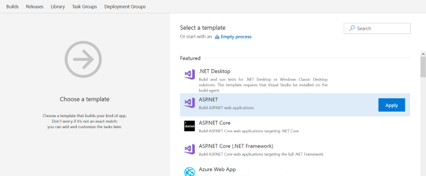
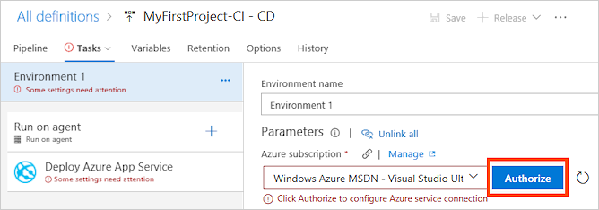

# How-To:  CI/CD with App Service and Azure Cosmos DB

Create a continuous integration (CI) and continuous delivery (CD) pipeline for Azure Comsos DB backed Azure App Service Web App.  Azure Cosmos DB is Microsoft's globally distributed, multi-model database. Cosmos DB enables you to elastically and independently scale throughput and storage across any number of Azure's geographic regions.

You will:

> [!div class="checklist"]
> * Clone a sample Cosmos DB and Azure Web App to your repository
> * Create a Cosmos DB collection and database
> * Set up CI for your app
> * Set up CD to Azure for your app
> * Review the CI/CD pipeline

## Prerequisites

* An Azure subscription. You can get one free through [Visual Studio Dev Essentials](https://visualstudio.microsoft.com/dev-essentials/).
* An Azure DevOps organization. If you don't have one, you can [create one for free](https://go.microsoft.com/fwlink/?LinkId=307137). If your team already has one, then make sure you are an administrator of the project you want to use.
* A SQL API based Cosmos DB instance.  If you don't have one, you can follow the initial steps in [this tutorial](https://docs.microsoft.com/azure/cosmos-db/create-sql-api-dotnet) to create a Cosmos DB instance and collection.

## Clone a sample Cosmos DB and Azure Web App to your repository

This sample shows you how to use the Microsoft Azure Cosmos DB service to store and access data from an ASP.NET MVC application hosted on Azure App Service.  The application is a simple TODO application.  You can learn more about the sample application [here](https://github.com/Azure-Samples/documentdb-dotnet-todo-app).

To import the sample app into a Git repo in Azure Repos:

 1. Sign into your Azure DevOps organization.

 1. On the **Code** hub for your project in Azure Repos, select the drop-down and choose the option to **Import repository**.

 1. On the **Import a Git repository** dialog box, paste https://github.com/Azure-Samples/documentdb-dotnet-todo-app.git into the **Clone URL** text box.

 1. Click **Import** to copy the sample code into your Git repo.

## Set up CI for your App

Set up CI for your ASP.NET application and Cosmos DB to build and create deployable artifacts.

1. On the **Pipelines** hub for your project in Azure Pipelines, select **builds**.

1. On the right-side of the screen, select **+ NEW** to create a new build.

1. Choose the **repository** for the sample application you imported earlier in this tutorial, and then cnoose **continue**.

1. Search for the **ASP.NET Application** build template, and then select **Apply**.

  

1. Select the **triggers**, and then select the checkbox for ""Enable continuous integration**.  This setting ensures every commit to the repository excecutes a build.

1. Select **Save & Queue**, and then choose **Save and Queue** to execute a new build.

1. Select the build **hyperlink** to examine the running build.  In a few minutes the build completes.  The build produces artifacts which can be used to deploy to Azure.

## Set up CD to Azure for your App

The CI for the sample app produces the artifacts needed for deployment to Azure.  Follow the steps below to create a release pipeline which uses the CI artifacts for deploying a Cosmos DB instance.

1. Select **Release** to create a release pipeline linked to the build artifacts from the CI pipeline you created with the previous steps.

1. Choose the **Azure App Service deployment** template, and then choose **Apply**.

1. On the **Environments** section, select the **job and task** link.

1. Select the **Azure Subscription**, and then select **Authorize**.

  

1. Choose an **App Service name**.

1. Select the **Deploy Azure App Service** task, and then select the **File Transforms & Variable Substitution Options** setting.  

1. Enable the checkbox for **XML Variable substitution**.

1. At the top of the menu, select **Variables**.

1. Retrieve your **endpoint** (URL) and **authKey** (primary or secondary key) for your Azure Cosmos DB account.  This information can be found on the Azure portal.

  

1. Select **+ Add** to create a new variable named **endpoint**.  Select **+ Add** to create a second variable named **authKey**.

1. Select the **padlock** icon to make the authKey variable secret.

1. Select the **Pipeline** menu.

1. Under the **Artifacts** ideas, choose the **Continuous deployment trigger** icon.  On the right side of the screen, ensure **Enabled** is on.

1. Select **Save** to save changes for the release defintion.

## Review the CI/CD pipeline

Follow the steps below to test and review the CI/CD pipeline.

1. On the **Code** hub select the **ellipsis** (...) icon next to the **web.config** file in the **src** directory, and then select **Edit**.

1. Replace the existing **value** (ToDoList) for the **database** key in the **appSettings** section of the web.config with a new value such as **NewToDoList**.  You will commit this change to demonstrate creating a new Cosmos DB database as part of the CI/CD pipeline.  This is a simple change to demonstrate CI/CD capabilities of Cosmos DB with Azure Pipelines.  However, more [complicated code changes](/azure/cosmos-db/sql-api-dotnet-samples) can also be deployed with the same CI/CD pipeline.

1. Select **Commit**, and then choose **Commit** to save the changes directly to the repostiory.

1. On the **Build** hub select **Builds** and you will see your CI build executing.  You can follow the build execution with the interactive logging.  Once the build completes, you can also monitor the release.

1. Once the release finishes, navigate to your Cosmos DB service to see your new database.

The continuous integration trigger you enabled earlier ensures a build executes for every commit that is pushed to the master branch. The build will complete and start a deployment to Azure. Navigate to Cosmos DB in the Azure portal, and you will see the CD pipeline created a new database.

## Clean up resources

 > [!NOTE]
 > Ensure you delete any unneeded resources in Azure such as the Cosmos DB instance to avoid incurring charges.

## Next steps

You can optionally modify these build and release definitions to meet the needs of your team. You can also use this CI/CD pattern as a template for your other projects.  You learned how to:

> [!div class="checklist"]
> * Clone a sample Cosmos DB and Azure Web App to your repository
> * Create a Cosmos DB collection and database
> * Set up CI for your app
> * Set up CD to Azure for your app
> * Review the CI/CD pipeline

To learn more about Azure Pipelines, see this tutorial:

> [!div class="nextstepaction"]
> [ASP.NET MVC and Cosmos DB](/azure/cosmos-db/sql-api-dotnet-application)
