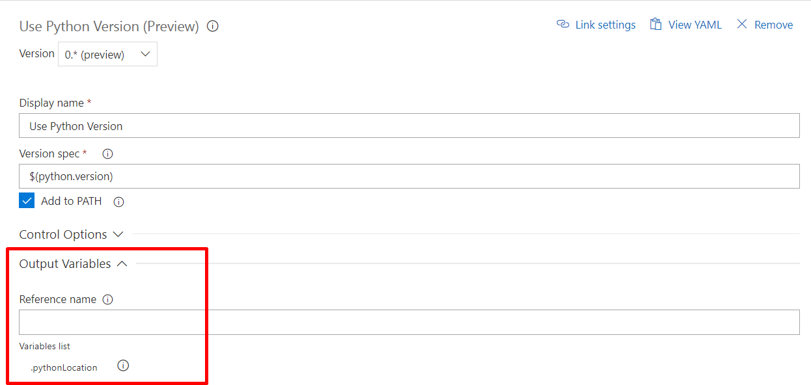

# Use Python Version task

**Azure Pipelines**

Use this task in a build or release pipeline to select a version of Python to run on an agent, and optionally add it to PATH.

## Demands

None

## Prerequisites

* A [Microsoft-hosted agent](../../agents/hosted.md#software) with side-by-side versions of Python installed, or a self-hosted agent with Agent.ToolsDirectory configured (see [Q&A](#how-can-i-configure-a-self-hosted-agent-to-use-this-task)).

This task will fail if no Python versions are found in Agent.ToolsDirectory. Available Python versions on Microsoft-hosted agents can be found [here](../../agents/hosted.md#software).

> [!Note]
> x86 and x64 versions of Python are available on Microsoft-hosted Windows agents, but not on Linux or macOS agents.

::: moniker range="> tfs-2018"
## YAML snippet
[!INCLUDE [temp](../_shared/yaml/UsePythonVersionV0.md)]
::: moniker-end

## Arguments

| Argument | Description | Default |
|----------|-------------|---------|
| Version spec | Version range or exact version of a Python version to use. | 3.x |
| Add to PATH | Whether to prepend the retrieved Python version to the PATH environment variable to make it available in subsequent tasks or scripts without using the output variable. | true |
| Advanced - Architecture | The target architecture (x86, x64) of the Python interpreter. | x64 |

::: moniker range="> azure-devops-2019"

As of version 0.150 of the task, version spec will also accept `pypy2` or `pypy3`.

::: moniker-end

If the task completes successfully, the task's output variable will contain the directory of the Python installation:

## Open source

This task is open source [on GitHub](https://github.com/Microsoft/azure-pipelines-tasks). Feedback and contributions are welcome.

## Q & A
<!-- BEGINSECTION class="md-qanda" -->

### Where can I learn more about tool installers?

For an explanation of tool installers and examples, see [Tool installers](../../process/tasks.md#tool-installers).

[!INCLUDE [temp](../../_shared/qa-agents.md)]

### How can I configure a self-hosted agent to use this task?

You can run this task on a self-hosted agent with your own Python versions.
To run this task on a self-hosted agent, set up Agent.ToolsDirectory by following the instructions [here](https://github.com/Microsoft/vsts-task-tool-lib/blob/master/docs/overview.md#tool-cache).
The tool name to use is "Python."

<!-- ENDSECTION -->
