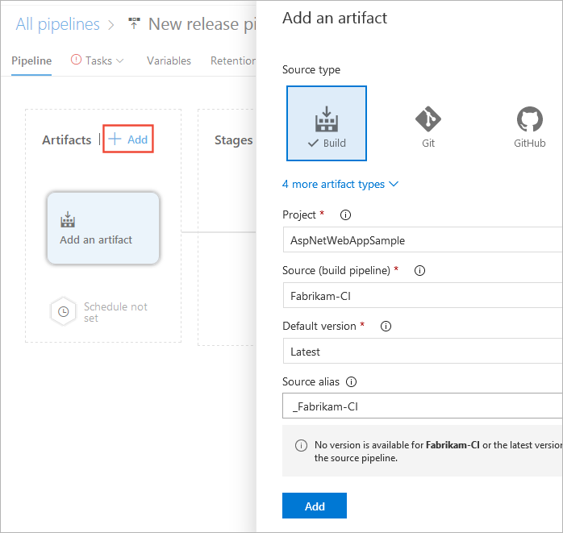
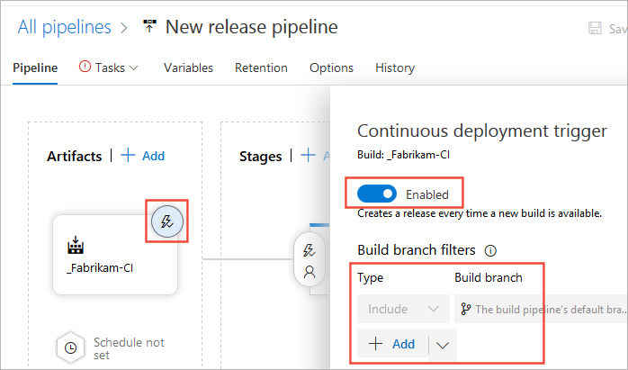
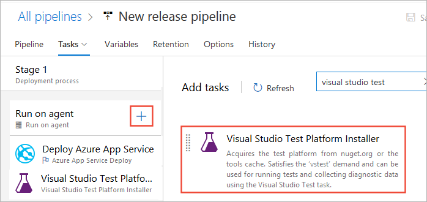
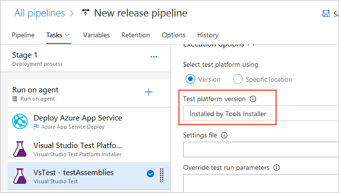

# Get started with Selenium testing in a CD pipeline

[!INCLUDE [version-header-vs-vsts-tfs](_shared/version-header-vs-vsts-tfs.md)]

::: moniker range="<= tfs-2018"
[!INCLUDE [temp](../_shared/concept-rename-note.md)]
::: moniker-end

Performing user interface (UI) testing as part of the
release pipeline is a great way of detecting
unexpected changes, and need not be difficult. This
topic describes using Selenium to test your website
during a continuous deployment release and test automation.

> Typically you will run unit tests in your build workflow,
and functional (UI) tests in your release workflow after your
app is deployed (usually to a QA environment).

For more information about Selenium browser automation, see:

* [Selenium HQ](http://docs.seleniumhq.org/)
* [Selenium documentation](http://www.seleniumhq.org/docs/01_introducing_selenium.jsp)

<a name="create-project"></a>
## Create your test project

As there is no template for Selenium testing, the
easiest way to get started is to use the Unit Test
template. This automatically adds the test framework
references and enables you run and view the results
from Visual Studio Test Explorer.

1. In Visual Studio, open the **File** menu and choose **New Project**,
   then choose **Test** and select **Unit Test Project**. Alternatively,
   open the shortcut menu for the solution and choose
   **Add** then **New Project** and then
   **Unit Test Project**.

2. After the project is created, add the Selenium and
   browser driver references used by the browser to
   execute the tests. Open the shortcut menu for the
   Unit Test project and choose **Manage NuGet
   Packages**. Add the following packages to your project:

   * Selenium.WebDriver
   * Selenium.Firefox.WebDriver
   * Selenium.WebDriver.ChromeDriver
   * Selenium.WebDriver.IEDriver<p />

   

3. Create your tests. For example, the following code creates a default class named **MySeleniumTests**
   that performs a simple test on the Bing.com website. Replace the contents of the **TheBingSearchTest** function
   with the [Selenium code](http://www.seleniumhq.org/docs/01_introducing_selenium.jsp)
   required to test your web app or website. Change the **browser** assignment in the **SetupTest**
   function to the browser you want to use for the test.

   ```csharp
   using System;
   using System.Text;
   using Microsoft.VisualStudio.TestTools.UnitTesting;
   using OpenQA.Selenium;			
   using OpenQA.Selenium.Firefox;	
   using OpenQA.Selenium.Chrome;	
   using OpenQA.Selenium.IE;

   namespace SeleniumBingTests
   {
     /// <summary>
     /// Summary description for MySeleniumTests
     /// </summary>
     [TestClass]
     public class MySeleniumTests
     {
       private TestContext testContextInstance;
       private IWebDriver driver;
       private string appURL;
 
       public MySeleniumTests()
       {
       }
 
       [TestMethod]
       [TestCategory("Chrome")]
       public void TheBingSearchTest()
       {
         driver.Navigate().GoToUrl(appURL + "/");
         driver.FindElement(By.Id("sb_form_q")).SendKeys("Azure Pipelines");
         driver.FindElement(By.Id("sb_form_go")).Click();
         driver.FindElement(By.XPath("//ol[@id='b_results']/li/h2/a/strong[3]")).Click();
         Assert.IsTrue(driver.Title.Contains("Azure Pipelines"), "Verified title of the page");
       }
 
       /// <summary>
       ///Gets or sets the test context which provides
       ///information about and functionality for the current test run.
       ///</summary>
       public TestContext TestContext
       {
         get
         {
           return testContextInstance;
         }
         set
         {
           testContextInstance = value;
         }
       }
 
       [TestInitialize()]
       public void SetupTest()
       {
         appURL = "http://www.bing.com/";
 
         string browser = "Chrome";
         switch(browser)
         {
           case "Chrome":
             driver = new ChromeDriver();
             break;
           case "Firefox":
             driver = new FirefoxDriver();
             break;
           case "IE":
             driver = new InternetExplorerDriver();
             break;
           default:
             driver = new ChromeDriver();
             break;
         }
         
       }

       [TestCleanup()]
       public void MyTestCleanup()
       {
         driver.Quit();
       }
     }
   }
   ```
   
4. Run the Selenium test locally using Test Explorer and check that it works.

## Define your CI build pipeline

You'll need a continuous integration (CI) build pipeline that builds your Selenium tests.
For more details, see [Build your .NET desktop app for Windows](../apps/windows/dot-net.md).

## Create your web app

You'll need a web app to test. You can use an existing app, or deploy one in your CD release pipeline.
The example code above runs tests against Bing.com. For details of how to set up your own release pipeline
to deploy a web app, see [Deploy to Azure web apps](../targets/webapp.md).

## Decide how you will deploy and test your app

You can deploy and test your app using either the Microsoft-hosted agent in Azure, or a self-hosted agent that you install on the target servers.

* When using the **Microsoft-hosted agent**, you should use the Selenium web drivers that are
  pre-installed on the Microsoft-hosted agents because they are compatible with the browser versions installed on the Microsoft-hosted agent images.
  The file paths to these drivers can be obtained from the environment variables named `IEWebDriver` (Internet Explorer),
  `ChromeWebDriver` (Google Chrome), and `GeckoWebDriver` (Firefox). For example,  

  ```csharp
  driver = new ChromeDriver(Environment.GetEnvironmentVariable("ChromeWebDriver")); 
  ```
  <p />
  
* When using a **self-hosted agent** that you deploy on your target servers, agents must be configured to run interactively with auto-logon enabled.
  See [Build and release agents](../agents/agents.md#account).

<a name="include-test"></a>
## Include the test in a CD release

::: moniker range="<= tfs-2017"

**NOTE:** This example uses the **Visual Studio Test Platform Installer** task and the latest
version of the **Visual Studio Test** task. These tasks are not available in TFS 2015 or TFS 2017.
To run Selenium tests in these versions of TFS, you must use the 
[Visual Studio Test Agent Deployment](../tasks/test/visual-studio-test-agent-deployment.md)
and [Run Functional Tests](../tasks/test/run-functional-tests.md) tasks instead.

::: moniker-end

1. If you don't have an existing release pipeline that deploys your web app:

   * Open the **Releases** page in the **Pipelines** hub and choose the **+** icon, then choose
     **Create release pipeline**.
     
     
 
   * Select the **Azure App Service Deployment** template and choose **Apply**.
   
   * In the **Artifacts** section of the **Pipeline** tab, choose **+ Add**. Select your build artifacts
     and choose **Add**.
 
     

   * Choose the **Continuous deployment trigger** icon in the **Artifacts** section of the **Pipeline** tab.
     In the Continuous deployment trigger pane, enable the trigger so that a new release is created from every build.   

     

   * Open the **Tasks** tab, select the **Stage 1** section, and enter your subscription
     information and the name of the web app where you want to deploy the app and tests.
     These settings are applied to the **Deploy Azure App Service** task.

1. If you are deploying your app and tests to environments where the target machines that host the agents do not have Visual Studio installed:

   * In the **Tasks** tab of the release pipeline, choose the **+** icon in the **Run on agent** section.
     Select the **Visual Studio Test Platform Installer** task and choose **Add**. Leave all the settings
     at the default values.<p />

     
  
     You can find a task more easily by using the search textbox.

1. In the **Tasks** tab of the release pipeline, choose the **+** icon in the **Run on agent** section.
   Select the **Visual Studio Test** task and choose **Add**.

1. If you added the **Visual Studio Test Platform Installer** task to your pipeline, change the
   **Test platform version** setting in the **Execution options** section of the **Visual Studio Test**
   task to **Installed by Tools Installer**.
 
   

   [How do I pass parameters to my test code from a release pipeline?](reference-qa.md#pass-params)

1. Save the release pipeline and start a new release. You can do this by queuing a new CI build, or by 
   choosing **Create release** from the **Release** drop-down list in the release pipeline.

   

<a name="view-results"></a>
## View the test results

1. To view the test results, open the release summary from the **Releases** tab.

   

1. In the release summary page choose the **Tests** link to show a page
   that highlights the changes including errors, stack traces, and the ability
   to easily create a bug that contains this information.

## Next steps

> [!div class="nextstepaction"]
> [Review your test results](review-continuous-test-results-after-build.md) 
