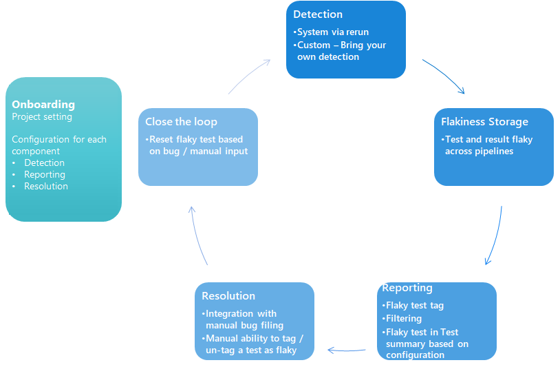

# Flaky test management

[!INCLUDE [version-team-services](../_shared/version-team-services.md)]

Productivity for developers relies on the ability of the tests to find real problems with the code being changed or developed in a timely and reliable fashion. Flaky test is a barrier to that. It affects developer productivity, since those failures often may not be related to the changes under test. It also impacts the quality of shipped code. 

A flaky test is a test that exhibits different outcomes (pass or fail) even when there are no changes in source code or execution environment. 
The goal of bringing flaky test managment in-product is to reduce developer pain due to flaky tests and cater to the whole workflow. Details below:

* **Detection** - Auto detection of flaky test with rerun or extensibility to plug in your own custom detection method)

* **Management of flakiness** - Once a test is marked as flaky, the data is available for all pipelines for that branch 

* **Report on flaky tests** - Ability to choose if you want to prevent build failures due to flaky tests or use the flaky tag only for troubleshooting 

* **Resolution** - manual bug-creation or manual marking and unmarking test as flaky based on your analysis

* **Close the loop** - reset flaky test as a result of bug resolution / manual input

## Enable flaky test management
Browse to the Test section in Pipeline, Project setting to configure flaky management for your project. By default its switched on for all projects with tests marked as flaky for troubleshooting. 

### Detection of Flaky tests

Flaky management system supports system and custom detection 

* System detection i.e. the in-product flaky detection uses test rerun data. The detection is via VSTest task reruning of failed tests capability or retry of stage in the pipeline. You can select specific pipelines in the project for which you would like to detect flaky tests. 
Note: Once a test is marked as flaky, the data is available for all pipelines for that branch aiding troublehsooting in every pipeline. 

* Custom detection - You can integrate your own flaky detection mechanism with Azure Pipelines and utilise the reporting capability. <!---API details are available -->

### Flaky test options
Settings here allow you to configure how flaky tests should be available in test reporting as well resolution capabilities. More details below. 

## Flaky test managment and reporting
Flaky test data for both passed and failed test is available in . Flaky tag helps you identify flaky tests.  
By default, flaky tests are be included in Test Summary. However if you want to ensure flaky test failuers don't fail your pipeline you can choose to not include it in your test summary and suprress the test failure. This will ensure flaky test (both passed and failed) are removed from pass percentage and shown in ‘Tests not reported’ like the screenshot below. 
This setting is availble in Project setting under *Flaky test options*. 
Note: Test summary will be updated only for  and . You might need to add a custom script to supress flaky test failure for other scenarios. 

## Resolution

### Manual mark and unmark test as flaky
You can mark or unmark a test as flaky based on analysis or context. When a test is marked flaky in a pipeline no changes are done in the current pipeline. Only future executions of that test will be marked as flaky. 
You will see *Marked flaky* tag in the UI to know which test was marked. Similarly unmarking a test doesn't impact the current pipeline. The manual inputs are considered for next execution of the test. 

<!---### Integration with manual bug creation
You can create bugs to manage flaky test debt. If you create or add to bug for a flaky test, *flaky* tag is added and then on resolution of the bug the test is unmarked as flaky. 

-->

[!INCLUDE [help-and-support-footer](_shared/help-and-support-footer.md)] 

