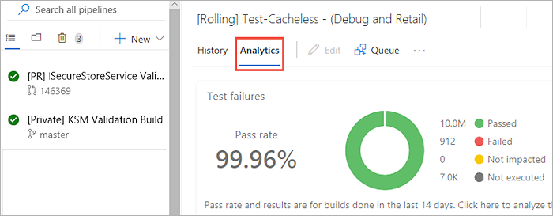
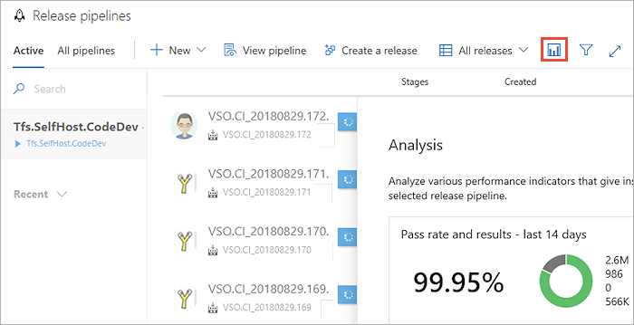
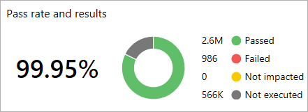
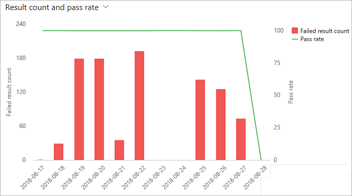
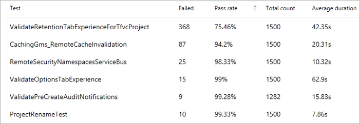
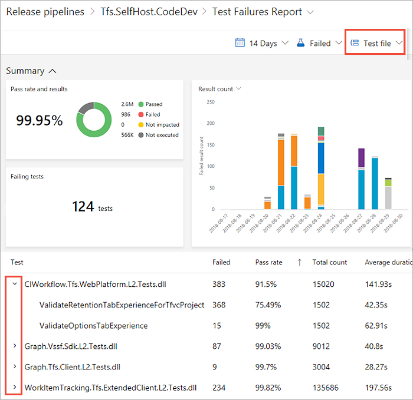
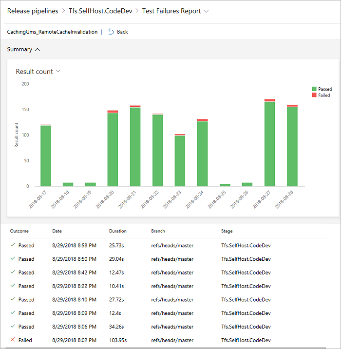
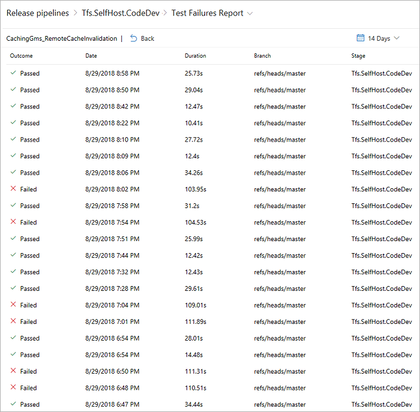
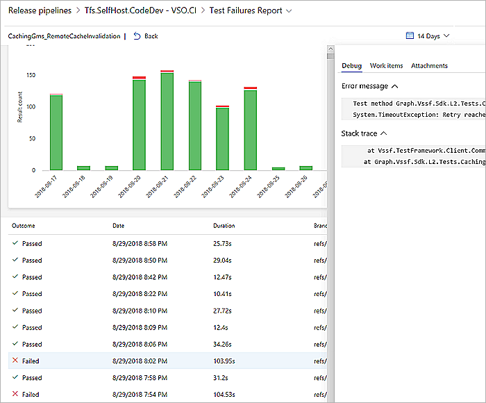
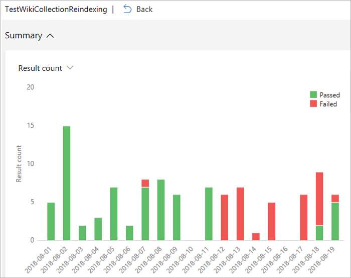

# Analyze test results

[!INCLUDE [version-header-ap](_shared/version-header-ap.md)]

Tracking test quality over time and improving test collateral is key to maintaining a healthy DevOps pipeline.
Test analytics provides near real-time visibility into your test data for builds and releases.
It helps improve the efficiency of your pipeline by identifying repetitive, high impact quality issues.

> [!NOTE]
> Test analytics is currently available only with Azure Pipelines.

Read the [glossary](./test-glossary.md) to understand test reports terminology.

::: moniker range="<= tfs-2018"

[!INCLUDE [temp](../_shared/concept-rename-note.md)]

::: moniker-end

## Install the Analytics extension

1. Go to the [Analytics extension](https://marketplace.visualstudio.com/items?itemName=ms.vss-analytics) in Marketplace.
1. Choose to install the Analytics extension. You might need to sign in with your Azure DevOps Services organization credentials.
2. Select the organization where you would like to install this extension and confirm. [Learn more about installing extensions](../../marketplace/overview.md).

## View test analytics for builds

To help teams find and fix tests that fail frequently or intermittently, use the **top failing tests** report.
The build summary includes the **Analytics** page that hosts this report.
The top-level view provides a summary of the test pass rate and results for the selected build pipeline, for the specified period.
The default range is 14 days. 

## View test analytics for releases

For tests executing as part of release, access test analytics from the **Analytics** link at the top right corner.
As with build, the summary provides an aggregated view of the test pass rate and results for the specified period.

## Test Failures

Open a build or release summary to view the top failing tests report.
This report provides a granular view of the top failing tests in the pipeline, along with the failure details. 

The detailed view contains two sections:

* **Summary**: Provides key quantitative metrics for the tests executed in build or release over the specified period. The default view shows data for 14 days.  

  - Pass rate and results: Shows the [pass percentage](test-glossary.md), along with the distribution of tests across various outcomes. 

    

  - Failing tests: Provides a distinct count of tests that failed during the specified period. In the example above, 986 test failures originated from 124 tests. 

    

  - Chart view: A trend of the total test failures and average pass rate on each day of the specified period. 

    

* **Results**: List of top failed tests based on the total number of failures.  Helps to identify problematic tests and lets you drill into a detailed summary of results.

  

### Group test failures

The report view can be organized in several different ways using the **group by** option.
Grouping test results can provide deep insights into various aspects of the top failing tests.
In the example below, the test results are grouped based on the [test files](test-glossary.md) they belong to.
It shows the test files and their respective contribution towards the total of test failures, during the
specified period to help you easily identify and prioritize your next steps. 
Additionally, for each test file, it shows the tests that contribute to these failures.

### Drill down to individual tests

After you have identified one or more tests in the **Details** section, select the individual test you want to analyze.
This provides a drill-down view of the selected test with a stacked chart of various outcomes such as passed or
failed instances of the test, for each day in the specified period. 
This view helps you infer hidden patterns and take actions accordingly. 

The corresponding grid view lists all instances of execution of the selected test during that period. 

### Failure analysis

To perform failure analysis for root causes, choose one or more instances of test execution in the drill-down view
to see failure details in context.

### Infer hidden patterns

When looking at the test failures for a single instance of execution, it is often difficult to infer any pattern.
In the example below, the test failures occurred during a specific period, and knowing this can help narrow down the scope of investigation. 

Another example is tests that exhibit non-deterministic behavior (often referred to as [flaky tests](test-glossary.md)).
Looking at an individual instance of test execution may not provide any meaningful insights into the behavior.
However, observing test execution trends for a period can help infer hidden patterns, and help you resolve the failures.

## Report information source

The source of information for test analytics is the set of [published test results](../tasks/test/publish-test-results.md) for
the build or release pipeline.
These result are accrued over a period of time, and form the basis of the rich insights that test analytics provides. 

[!INCLUDE [help-and-support-footer](_shared/help-and-support-footer.md)] 
