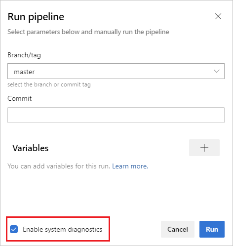
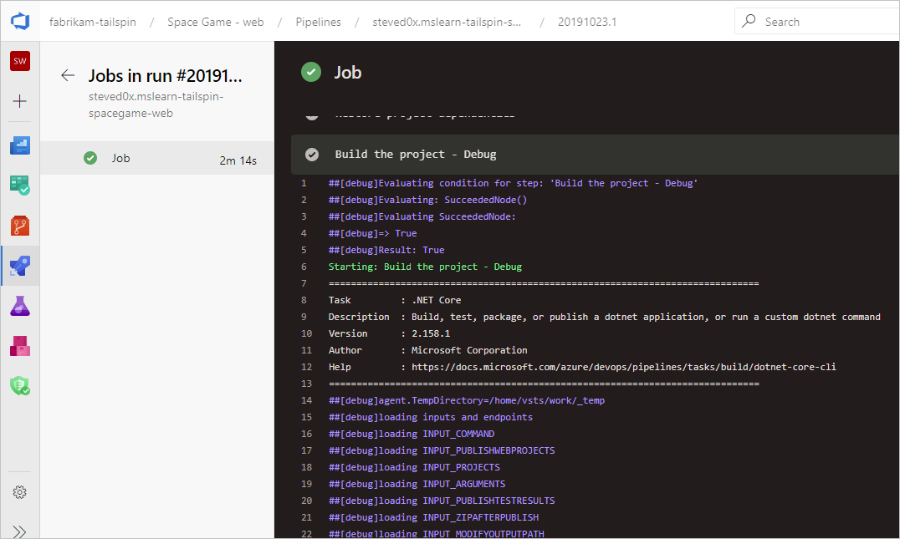
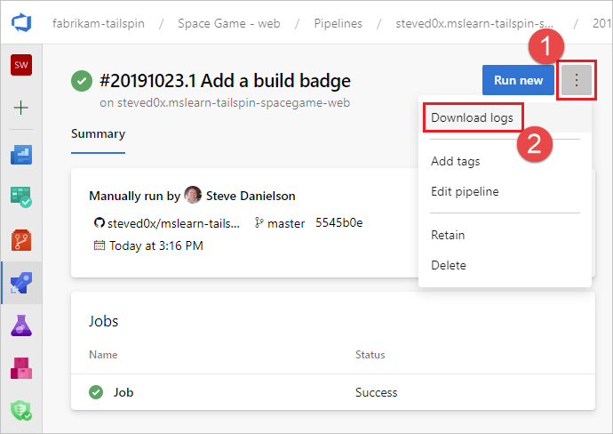

# Review logs to diagnose pipeline issues

[!INCLUDE [version-lt-eq-azure-devops](../../includes/version-lt-eq-azure-devops.md)]

Pipeline logs provide a powerful tool for determining the cause of pipeline failures.

A typical starting point is to review the logs in your completed build or release. You can view logs by navigating to the pipeline run summary and selecting the job and task. If a certain task is failing, check the logs for that task.

In addition to viewing logs in the pipeline build summary, you can download complete logs which include additional diagnostic information, and you can configure more verbose logs to assist with your troubleshooting.

## Configure verbose logs

 To assist with troubleshooting, you can configure your logs to be more verbose.

::: moniker range="> azure-devops-2019"

* To configure verbose logs for a single run, you can start a new build by choosing **Run pipeline** and selecting **Enable system diagnostics**, **Run**.

  

* To configure verbose logs for all runs, you can add a variable named `system.debug` and set its value to `true`. 

::: moniker-end

::: moniker range="<= azure-devops-2019"

* To configure verbose logs for a single run, you can start a new build by choosing **Queue build**, and setting the value for the `system.debug` variable to `true`.
* To configure verbose logs for all runs, edit the build, navigate to the **Variables** tab, and add a variable named `system.debug`, set its value to `true`, and select to **Allow at Queue Time**.
* To configure verbose logs for a YAML pipeline, add the `system.debug` variable in the `variables` section:

  ```YAML
  variables:
    system.debug: true
  ```
  
::: moniker-end


## View and download logs

::: moniker range="azure-devops"

To view individual logs for each step, navigate to the build results for the run, and select the job and step. 



To download all logs, navigate to the build results for the run, select **...**, and choose **Download logs**.



::: moniker-end

::: moniker range="<= azure-devops-2019"

To download all logs, navigate to the build results for the run, choose **Download all logs as zip**.

::: moniker-end

In addition to the pipeline diagnostic logs, the following specialized log types are available, and may contain information to help you troubleshoot.

* [Worker diagnostic logs](#worker-diagnostic-logs)
* [Agent diagnostic logs](#agent-diagnostic-logs)
* [Other logs](#other-logs)

## Worker diagnostic logs

You can get the diagnostic log of the completed build that was generated by the worker process on the build agent. Look for the `worker` log file that has the date and time stamp of your completed build. For example, `worker_20160623-192022-utc_6172.log`.

## Agent diagnostic logs

Agent diagnostic logs provide a record of how the agent was configured and what happened when it ran. Look for the `agent` log files. For example, `agent_20160624-144630-utc.log`. There are two kinds of agent log files:

* The log file generated when you ran `config.cmd`. This log:

  * Includes this line near the top: `Adding Command: configure`

  * Shows the configuration choices made.

* The log file generated when you ran `run.cmd`. This log:

  * Cannot be opened until the process is terminated.

  * Attempts to connect to your Azure DevOps organization or Team Foundation Server.

  * Shows when each job was run, and how it completed

Both logs show how the agent capabilities were detected and set.

:::moniker range=">azure-devops-2022"

## Network diagnostics for self-hosted agents

Set the value of `Agent.Diagnostic` to `true` to collect the following additional logs that can be used for troubleshooting network issues for self-hosted agents.

| File | Information | Applies to |
|------|-------------|------------|
| `cloudinit.*` | Cloud-init completed successfully (if used) | Linux |
| `BrokenPackages.*` | Packages are in a consistent state | Linux |
| `Agent.*` | Environment variables | Linux, Windows |
| `waagentConf.txt` | Azure VM agent (waagent.conf) | Azure: Linux, Windows |
| `environment.txt` / `agent.*` | Account group membership list | Windows |

> [!NOTE]
> The `Agent.Diagnostic` variable and logs described in this section are available with [Agent v2.200.0](https://github.com/microsoft/azure-pipelines-agent/releases/tag/v2.200.0) and higher.

:::moniker-end


## Other logs

Inside the diagnostic logs you will find `environment.txt` and `capabilities.txt`.

The `environment.txt` file has various information about the environment within which your build ran. This includes information like what tasks are run, whether or not the firewall is enabled, PowerShell version info, and some other items. We continually add to this data to make it more useful.

The `capabilities.txt` file provides a clean way to see all capabilities installed on the build machine
that ran your build.

## HTTP trace logs

- [Use built-in HTTP tracing](#use-built-in-http-tracing)
- [Use full HTTP tracing - Windows](#use-full-http-tracing---windows)
- [Use full HTTP tracing - macOS and Linux](#use-full-http-tracing---macos-and-linux)

> [!IMPORTANT]
> HTTP traces and trace files can contain passwords and other secrets. Do **not** post them on a public sites.

### Use built-in HTTP tracing

If your agent is version 2.114.0 or newer, you can trace the HTTP traffic headers and write them into the diagnostic log. Set the `VSTS_AGENT_HTTPTRACE` environment variable before you launch the agent.listener.

```bash
Windows:
    set VSTS_AGENT_HTTPTRACE=true

macOS/Linux:
    export VSTS_AGENT_HTTPTRACE=true
```

### Use full HTTP tracing - Windows

1. Start [Fiddler](https://www.telerik.com/fiddler).

2. We recommend you listen only to agent traffic. File > Capture Traffic off (F12)  

3. Enable decrypting HTTPS traffic. Tools > Fiddler Options > HTTPS tab. Decrypt HTTPS traffic

4. Let the agent know to use the proxy:

   ```cmd
   set VSTS_HTTP_PROXY=http://127.0.0.1:8888
   ```

5. Run the agent interactively. If you're running as a service, you can set as the environment variable in control panel for the account the service is running as.

6. Restart the agent.


### Use full HTTP tracing - macOS and Linux

Use Charles Proxy (similar to Fiddler on Windows) to capture the HTTP trace of the agent.

1. Start Charles Proxy.

2. Charles: Proxy > Proxy Settings > SSL Tab. Enable. Add URL.

3. Charles: Proxy > Mac OSX Proxy. Recommend disabling to only see agent traffic.

   ```bash
   export VSTS_HTTP_PROXY=http://127.0.0.1:8888
   ```

4. Run the agent interactively. If it's running as a service, you can set in the .env file. See [nix service](https://github.com/Microsoft/azure-pipelines-agent/blob/master/docs/start/nixsvc.md)

5. Restart the agent.
