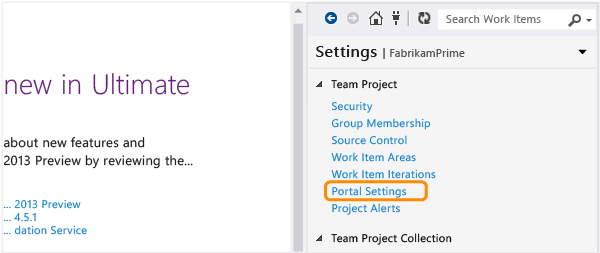
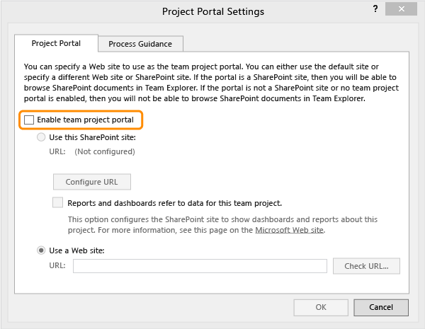
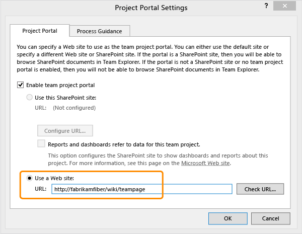
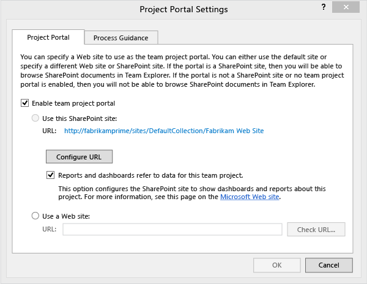
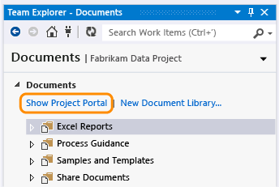

# Configure or add a project portal

[!INCLUDE [temp](../includes/version-vsts-tfs-all-versions.md)]

The project portal is a site associated with a team project for the purposes of sharing information. Project portals that are created when the team project is created are associated with a SharePoint site. These [portals](../report/sharepoint-dashboards/share-information-using-the-project-portal.md) provide access to shared documents, dashboards, and support files that contain redirect links to MSDN process guidance topics.  
  
 If your team project was created using the Basic configuration or is hosted on Azure DevOps, you won't have access to a project portal. If you want to configure a portal, you can. Also, you can configure the portal and [process guidance](configure-or-redirect-process-guidance.md) independently of each other.  
  
 Choose one of the following options based on your deployment configuration and team requirements:  
  
-   [Determine if your team project portal is enabled](#portal_enabled).  
  
     Choose this option if you're not sure if your team project is already configured.  
  
-   [Configure a Web site for your portal](#simple).  
  
     Choose this option if you want to use a website that doesn't require SharePoint integration or if your team project is hosted on Azure DevOps Services.  
  
-   [Configure a prepared SharePoint site for your portal](#validtfs).  
  
     Choose this option if you have already configured TFS to integrate with a SharePoint Web application.  
  
-   [Add a SharePoint server and upload portal contents from the process template](#addsp)  
  
     Choose this option to prepare a SharePoint Web application, and add all portal artifacts and process guidance for a team project that was created using the Basic configuration.  

 <a name="portal_enabled"></a> 


## Determine if your team project portal is enabled  

 If you cannot access Excel reports or dashboards, you might want to verify whether a portal has been enabled for your team project.  
  
1.  From Visual Studio>Team Explorer, [connect to your team project](../organizations/projects/connect-to-projects.md).  
  
2.  Open Portal Settings.  
  
       
  
     If the **Enable team project portal** check box is not selected, your team project portal is not enabled.  
  
       

<a name="simple"></a> 


##  Configure a Web site for your portal  

 Configure this option when you aren't using SharePoint Products or when your team project is hosted on Azure DevOps Services.  
  
1.  If you aren't a member of the Team Project Administrators group, [get added now](/azure/devops/organizations/security/set-project-collection-level-permissions).  
  
2.  Open Portal Settings.  
  
3.  Select the **Enable team project portal** check box and then enter the URL for the Web site you've prepared for your team project portal.  
  
       
  
<a name="validtfs"></a> 

## Configure a prepared SharePoint site for your portal  

 Choose this option when you have a SharePoint Web application that has been integrated to work with TFS. To learn how to do this, see [SharePoint Products requirements for Team Foundation Server](/azure/devops/server/requirements#sharepoint).  
  
1.  If you aren't a member of the Team Project Administrators group, [get added now](/azure/devops/organizations/security/set-project-collection-level-permissions).  
  
2.  Open Portal Settings from the Settings page in Team Explorer.  
  
3.  Select the **Enable team project portal** check box and then choose **Configure the URL**.  
  
4.  Enter the URL for the SharePoint site you've prepared for your team project portal.  
  
       

<a name="addsp"></a> 

## Add SharePoint site integration and upload portal contents from a process template  
 Choose this option to gain access to Excel reports, dashboards, and process guidance support.  To add the portal to the team project, use the **tfpt** command line tool that TFS Power Tools provides.  

1. [Add SharePoint products to your deployment](/azure/devops/server/admin/add-sharepoint-to-tfs).  
  
2. Verify that you have the following tools, configurations, and permissions.  
  
   1. If you haven't installed TFS power tools, install them now to your Visual Studio client:
   2. **TFS 2015:** [Microsoft Visual Studio Team Foundation Server 2015 Power Tools](https://marketplace.visualstudio.com/items?itemName=TFSPowerToolsTeam.MicrosoftVisualStudioTeamFoundationServer2015Power) 
   3. **TFS 2013:** [Microsoft Visual Studio Team Foundation Server 2013 Power Tools](https://marketplace.visualstudio.com/items?itemName=TFSPowerToolsTeam.MicrosoftVisualStudioTeamFoundationServer2013Power)   
  
   4. If you haven't installed a version of Visual Studio, [install one of them now](https://visualstudio.microsoft.com/downloads/download-visual-studio-vs). You can download Team Explorer for free. Team Explorer must be installed on the same machine where you run the **tfpt** command line tool.  
  
   5. If you aren't an administrator for the team project, [get added now](../organizations/security/set-project-collection-level-permissions.md).  
  
   6. If you haven't been granted Full Control for the SharePoint site, [get that permission now](../organizations/security/set-sharepoint-permissions.md).  
  
3. Open a Command Prompt in administrative mode and change to the directory where you installed the power tools.  
  
   ```  
   cd %programfiles%\TFS 2013 Power Tools  
   ```  
  
    On a 64-bit edition of Windows, replace `%programfiles%` with %`programfiles(x86)%`.  
  
4. Add the portal. The process template you specify must be compatible with the template used to create the team project. And, it must have been uploaded to the team project collection that hosts your team project.  
  
   ```  
   tfpt addprojectportal /collection:"http://MyServer:8080/tfs/DefaultCollection" /teamproject:MyProject /processtemplate:"TemplateName"   
   ```  
  
    These are the names of the process templates available with TFS 2013:  
  
   -   Microsoft Visual Studio Scrum 2013    
   -   MSF for Agile Software Development 2013   
   -   MSF for CMMI Process Improvement 2013  
  
5. Open Portal Settings and verify that the SharePoint site is configured as expected.  
  
6. From the Home page, open the Documents page.  
  
   <table>
   <tbody valign="top">
   <tr>
   <td><strong>Git</strong></td>
   <td><strong>TFVC</strong></td>
   </tr>
   <tr>
   <td></td>
   <td></td>
   </tr>
   </tbody>
   </table>  
  
7. Open the project portal.  
  
      
  
8. From your project portal, [add team member accounts to the Contributors group](/azure/devops/organizations/security/set-sharepoint-permissions) for the SharePoint site.  
  
## Related notes 

The artifacts you'll have access to depend on the process template created with your team project. For an overview of the artifacts available with the default process templates, see [Choose a process](../boards/work-items/guidance/choose-process.md).  


